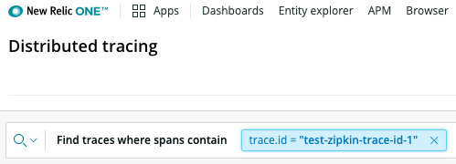

If you want to create your own tracing implementation, you can use our [Trace API](/docs/understand-dependencies/distributed-tracing/trace-api/introduction-trace-api). This doc explains how to send Zipkin-format trace data to our Trace API. (For our general data format, see [New Relic format](/docs/understand-dependencies/distributed-tracing/trace-api/report-new-relic-format-traces-trace-api).)

## Zipkin version requirements [#zipkin-requirements]

The Trace API supports data from [Zipkin](https://zipkin.io/) JSON v2 (or higher) without any modification. For details on this version, see [Zipkin v2 release details](https://github.com/openzipkin/zipkin/releases/tag/2.0.0) and the [Zipkin v2 schema](https://zipkin.io/zipkin-api/#/default/post_spans).

## Overview of using the Trace API [#send-data-overview]

Using our Trace API is as simple as:

* Sending trace data in the expected format (in this case, `zipkin` format).
* Sending that data to the appropriate [endpoint](/docs/understand-dependencies/distributed-tracing/trace-api/trace-api-general-requirements-limits#requirements)

Our send-data instructions have options for enabling Infinite Tracing. To learn more about this, see [Intro to Infinite Tracing](/docs/understand-dependencies/distributed-tracing/infinite-tracing/introduction-infinite-tracing) and [Sampling considerations](/docs/understand-dependencies/distributed-tracing/trace-api/introduction-trace-api#sampling).

To get started using the Trace API, choose an option:

* [Send a sample trace](#quick-start): This shows a curl example of sending a trace to New Relic. This is useful for understanding how the Trace API works, and to verify you're seeing data in New Relic.
* [Report data from existing Zipkin instrumentation](#existing-zipkin): if you have an existing Zipkin implementation, you can simply change the endpoint of where your data gets sent.

## Send sample Zipkin trace payload [#quick-start]

This section describes how to send a simple Zipkin-format trace to our Trace API via curl request. You might choose to do this in order to learn how our API works and to verify that data is showing up in New Relic before doing in-depth instrumentation.

To get started sending a sample payload:

1. (Optional, to enable Infinite Tracing) First, you must [set up a trace observer](/docs/understand-dependencies/distributed-tracing/infinite-tracing/set-trace-observer#set-up). That procedure includes instructions for sending a sample trace using our general `new-relic` format. When you get to that step, return here to instead learn how to send a Zipkin-format trace.
2. Send a Zipkin-format payload following the instructions below.

### Send Zipkin-format payload [#send-zipkin-curl]

To send a sample Zipkin-format trace:

Get the [license key](/docs/apis/intro-apis/new-relic-api-keys/#ingest-license-key) for the account you want to report data to. 

You'll be executing a curl request, below. Notes on this:

  * Replace the license key placeholder with your license key.
  * If you're using Infinite Tracing, use the [<var>YOUR_TRACE_OBSERVER_URL</var>](/docs/understand-dependencies/distributed-tracing/infinite-tracing/set-trace-observer#ui-endpoints) value in place of the standard endpoint.
  * If you want to send more than one post, change the trace ID to a different value. Sending the same payload or span `id` multiple times for the same `traceId` may result in fragmented traces in the UI.

```
curl -i -H 'Content-Type: application/json' \
 -H 'Api-Key: <var>$NEW_RELIC_LICENSE_KEY</var>' \
 -H 'Data-Format: zipkin' \
 -H 'Data-Format-Version: 2' \
 -X POST \
 -d '[
        {
           "traceId": "test-zipkin-trace-id-1",
           "id": "3e0f5885710776cd",
           "kind": "CLIENT",
           "name": "post",
           "duration": 508068,
           "localEndpoint": {
               "serviceName": "service-1",
               "ipv4": "127.0.0.1",
               "port": 8080
           },
           "tags": {
           }
       },
       {
           "traceId": "test-zipkin-trace-id-1",
           "parentId": "3e0f5885710776cd",
           "id": "asdf9asdn123lkasdf",
           "kind": "CLIENT",
           "name": "service 2 span",
           "duration": 2019,
           "localEndpoint": {
               "serviceName": "service-2",
               "ipv4": "127.0.0.1",
               "port": 8080
           },
           "tags": {
"error.message": "Invalid credentials"
           }
       }
   ]' '<var>https://trace-api.newrelic.com/trace/v1</var>'
```

Within a minute, the trace should be available in [our distributed tracing UI](https://one.newrelic.com/launcher/distributed-tracing-nerdlets.distributed-tracing). To find it, run a query for the `trace.id`. In this example, it was `test-zipkin-trace-id-1`. Note that you search by the [transformed attribute](zipkin-transform) of `trace.id` (not `traceId`).



To learn more:

* [Learn where Trace API data shows up in the UI](/docs/understand-dependencies/distributed-tracing/ui-data/additional-distributed-tracing-features-new-relic-one#find-data).
* [Send data from an existing Zipkin instrumentation](#existing-zipkin).
* [Learn how to decorate spans](/docs/apm/distributed-tracing/trace-api/trace-api-decorate-spans-attributes) by adding tags. This helps you customize how traces are displayed in our UI for a richer, more helpful experience.
* Learn about general [endpoint information (data limits, required metadata, and response validation](/docs/apm/distributed-tracing/trace-api/trace-api-endpoint-requirements-limits)).
* Learn about how [Zipkin data is transformed and stored in our format](#zipkin-transform).
* If you don't see your trace data, see [Troubleshooting](/docs/apm/distributed-tracing/trace-api/troubleshooting-missing-trace-api-data).

## Send data from existing Zipkin instrumentation [#existing-zipkin]

Preliminary notes:

* If you want to enable [Infinite Tracing](/docs/understand-dependencies/distributed-tracing/infinite-tracing/introduction-infinite-tracing), you first must [set up a trace observer](/docs/understand-dependencies/distributed-tracing/infinite-tracing/set-trace-observer#set-up).
* It can be helpful to first [send a sample payload](#quick-start) to verify things are working properly.

To report data from an existing Zipkin instrumentation, you'll point the Zipkin tracer at the [appropriate Trace API endpoint](/docs/understand-dependencies/distributed-tracing/trace-api/trace-api-general-requirements-limits#requirements) with some required request metadata. You can send the required metadata as headers or query parameters (some Zipkin tracer versions don't allow specifying HTTP headers).

Here's an example of what it might look like to create a Zipkin `OkHttpSender` in Java configured for the Trace API:

```
OkHttpSender.create("https://trace-api.newrelic.com/trace/v1?Api-Key=<var>NEW_RELIC_LICENSE_KEY</var>&Data-Format=zipkin&Data-Format-Version=2");
```

Note that if you were using Infinite Tracing, or had an EU-region New Relic account, the [endpoint](/docs/understand-dependencies/distributed-tracing/trace-api/trace-api-general-requirements-limits#requirements) would be different.

For an explanation of `Api-Key` and the other metadata, see [Request metadata](/docs/apm/distributed-tracing/trace-api/trace-api-endpoint-requirements-limits#headers-query-parameters).

## Transformation of Zipkin data [#zipkin-transform]

To create a consistent search/query experience, some Zipkin data will be transformed to match New Relic [attribute](/docs/using-new-relic/welcome-new-relic/get-started/glossary#attribute) naming. For more on how we store and structure trace data, see [How distributed tracing works](/docs/understand-dependencies/distributed-tracing/get-started/how-new-relic-distributed-tracing-works).

<table>
  <thead>
    <tr>
      <th>
        Zipkin tag
      </th>

      <th>
        Stored in New Relic as...
      </th>

      <th>
        Details
      </th>
    </tr>
  </thead>

  <tbody>
    <tr>
      <td>
        traceId
      </td>

      <td>
        trace.id
      </td>

      <td>
        Unique identifier for a trace.
      </td>
    </tr>

    <tr>
      <td>
        `id`
      </td>

      <td>
        `id`
      </td>

      <td>
        Unique identifier for a span.
      </td>
    </tr>

    <tr>
      <td>
        parentId
      </td>

      <td>
        parent.id
      </td>

      <td>
        Identifier of the upstream span that called the service.
      </td>
    </tr>

    <tr>
      <td>
        `kind`
      </td>

      <td>
        `kind`
      </td>

      <td>
        Either `Client` or `Server`.
      </td>
    </tr>

    <tr>
      <td>
        `name`
      </td>

      <td>
        `name`
      </td>

      <td>
        Name of span.
      </td>
    </tr>

    <tr>
      <td>
        `duration`
      </td>

      <td>
        `duration.ms`
      </td>

      <td>
        Zipkin v2 spans must have durations specified in microseconds, and will be converted to milliseconds.
      </td>
    </tr>

    <tr>
      <td>
        localEndpoint: `serviceName`
      </td>

      <td>
        `service.name`
      </td>

      <td>
        We use the Zipkin v2 service name to identify the entity that created this span.
      </td>
    </tr>

    <tr>
      <td>
        localEndpoint: `port`
      </td>

      <td>
        `localEndpoint.port`
      </td>

      <td>
        All values in the `localEndpoint` object will be flattened to a span attribute called `localEndpoint.key`
      </td>
    </tr>

    <tr>
      <td>
        `tags`
      </td>

      <td>
        reported as [attributes](/docs/using-new-relic/welcome-new-relic/get-started/glossary#attribute)
      </td>

      <td>
        Key:value pairs in the `tags` object in Zipkin v2 will be written as span attributes.
      </td>
    </tr>

    <tr>
      <td>
        annotations
      </td>

      <td>
        not supported
      </td>

      <td>
        We do not currently support annotations in the Trace API. Spans will not be rejected if they contain annotations, but the annotations data will not be written.
      </td>
    </tr>
  </tbody>
</table>

## Add other tags/attributes [#other-tags]

You can add any tags you want to the `tags` block, with the exception of the [restricted tags](/docs/apm/distributed-tracing/trace-api/trace-api-endpoint-requirements-limits#restricted-attributes). For example, you might want to add attributes like `customer.id` or `user.id` to help you analyze your trace data. Tags will be converted to New Relic [attributes](/docs/using-new-relic/welcome-new-relic/get-started/glossary#attribute).

To learn how to control how spans appear in New Relic (for example, adding errors or setting a span as a datastore span), see [Decorate spans](/docs/apm/distributed-tracing/trace-api/trace-api-decorate-spans-attributes).
