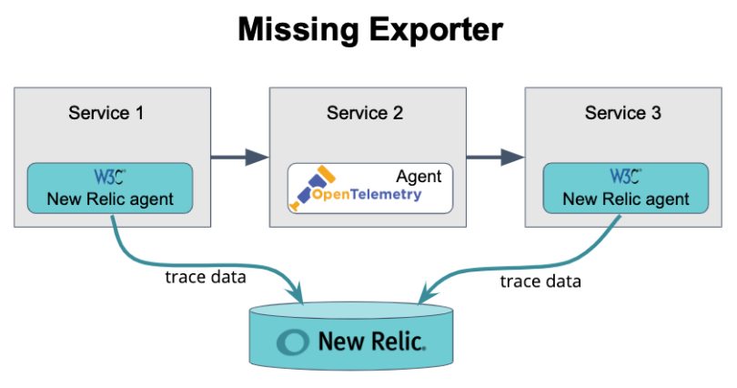
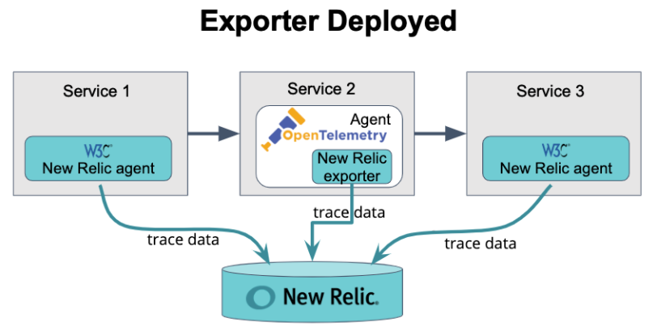
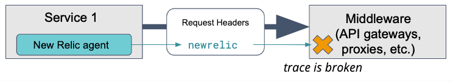
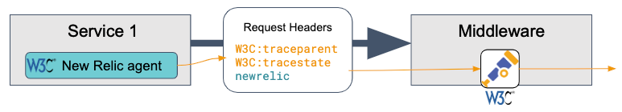

## Problem

You have enabled [distributed tracing](/docs/apm/distributed-tracing/getting-started/introduction-distributed-tracing) but data you expected to see does not appear in New Relic's distributed tracing UI.

## Solution

<Callout variant="important">
  Before performing troubleshooting, we recommend reading [How distributed tracing works](/docs/apm/distributed-tracing/getting-started/how-new-relic-distributed-tracing-works).
</Callout>

Here are some causes and solutions when you have problems finding expected data in the distributed tracing UI:

### Problems with enabling or instrumenting [#enable]

<CollapserGroup>
  <Collapser
    id="not-enabled"
    title="Missing spans due to service not having distributed tracing enabled"
  >
    In order for distributed tracing to report details for all nodes in a trace, each application must be monitored by a New Relic agent that has had [distributed tracing enabled](/docs/apm/distributed-tracing/enable-configure/enable-distributed-tracing).

    If an application's New Relic account has not had distributed tracing enabled, it will have these issues:

    * Its distributed tracing UI page won't have data.
    * It won't report data to other accounts' distributed traces.
  </Collapser>

  <Collapser
    id="manual-instrumentation"
    title="Missing apps/services may require manual instrumentation"
  >
    When you enable distributed tracing for applications and services that New Relic automatically instruments, you'll usually see complete and detailed data for those nodes in the distributed tracing UI.

    However, you may notice that some services or applications are missing from traces, or that there are some internal spans you expect to see that are missing. If that's the case, you may want to implement [custom instrumentation](/docs/apm/distributed-tracing/enable-configure/enable-distributed-tracing#agent-apis) of applications or specific transactions to see more detail in traces. Some examples of when you may need to do this:

    * **Transactions not automatically instrumented**. To ensure your application is automatically instrumented, read the [compatibility and requirements documentation](/docs/agents) for the New Relic agent you're using. If an application isn't automatically instrumented, or if you'd like to add instrumentation of specific activity, see [Custom instrumentation](/docs/agents/manage-apm-agents/agent-data/custom-instrumentation#implementing).
    * **All Go applications**. The Go agent, unlike other agents, requires manual instrumentation of your code. For instructions, see [Instrument a Go application](/docs/agents/go-agent/instrumentation/instrument-go-transactions).
    * **A service doesn't use HTTP**. If a service doesn't communicate via HTTP, the New Relic agent won't send distributed tracing headers. This may be the case for some non-web applications or message queues. To remedy this, use the [distributed tracing APIs](/docs/apm/distributed-tracing/enable-configure/enable-distributed-tracing#agent-apis) to instrument either the calling or called application.
  </Collapser>
</CollapserGroup>

### Problems with spans [#spans]

<CollapserGroup>
  <Collapser
    id="advanced-infinite"
    title="Infinite Tracing: missing spans"
  >
    If your APM agent can’t write data fast enough to the trace observer, `queue_size` is an additional APM agent configuration to limit the number of spans the agent will hold. See the following examples for your agent:

    <table>
      <thead>
        <tr>
          <th>
            .NET configuration method
          </th>

          <th>
            Example
          </th>
        </tr>
      </thead>

      <tbody>
        <tr>
          <td>
            Configuration file
          </td>

          <td>
            ```
            <configuration . . . >
               <infiniteTracing>
                  <trace_observer>
                     <span_events queue_size="100000" />
                  </trace_observer>
               </infiniteTracing>
            </configuration>
            ```
          </td>
        </tr>

        <tr>
          <td>
            Environment variable
          </td>

          <td>
            ```
            NEW_RELIC_INFINITE_TRACING_SPAN_EVENTS_QUEUE_SIZE=100000
            ```
          </td>
        </tr>
      </tbody>
    </table>

    <table>
      <thead>
        <tr>
          <th>
            Python configuration method
          </th>

          <th>
            Example
          </th>
        </tr>
      </thead>

      <tbody>
        <tr>
          <td>
            Configuration file
          </td>

          <td>
            infinite_tracing.span_queue_size = 100000
          </td>
        </tr>

        <tr>
          <td>
            Environment Variable
          </td>

          <td>
            NEW_RELIC_INFINITE_TRACING_SPAN_QUEUE_SIZE = 100000
          </td>
        </tr>
      </tbody>
    </table>
  </Collapser>

  <Collapser
    id="export"
    title="Missing span not getting exported"
  >
    Sometimes header propagation is successful, but the span information isn't getting sent to New Relic. For example, if OpenTelemetry is not instrumented with a New Relic exporter, the span details never make it to New Relic.

    In this diagram, notice that the header propagation is successful, but no exporter is set up in Service 2 to send the span to New Relic:

    

    The following diagram also shows successful header propagation, but it includes an exporter in Service 2 that sends the span details to New Relic (see [Trace API](/docs/understand-dependencies/distributed-tracing/trace-api/introduction-trace-api)):

    
  </Collapser>

  <Collapser
    id="sampling"
    title="Missing spans due to sampling process"
  >
    Standard distributed tracing for APM uses [adaptive sampling](/docs/apm/distributed-tracing/getting-started/how-new-relic-distributed-tracing-works#sampling). This means that a percentage of calls to a service will be reported as part of a distributed trace. Specific calls to your service might not have been selected to be sampled.
  </Collapser>

  <Collapser
    id="agent-limits"
    title="Missing spans due to span limits maxed out"
  >
    There are [limits on the number of spans that can be collected and displayed](/docs/apm/distributed-tracing/ui-data/understand-use-distributed-tracing-data#1k-limit). If an application generates a very large number of spans for a single call, it might exceed the APM agent's span-collection limit for that harvest cycle. This could result in missing spans and significantly limit the number of traces the agent can completely sample and report.

    We currently only show 10,000 spans at a time.
  </Collapser>

  <Collapser
    id="late-spans"
    title="Missing spans due to spans being sent late"
  >
    Spans must be sent within the last twenty minutes to be captured in a trace index. If you send any spans older than twenty minutes but newer than a day, the span data will still be written. However, it won't be rolled into the trace index, which controls the trace list in the distributed tracing UI.

    If a span has a timestamp older than a day, it will be dropped. This often occurs when there is clock skew (timing differences) between systems or long running background jobs.
  </Collapser>
</CollapserGroup>

### Problems with trace details

<CollapserGroup>
  <Collapser
    id="middleware-failure"
    title="Middleware doesn't recognize proprietary New Relic header"
  >
    If your transactions are only sending the proprietary New Relic header, some middleware might not recognize the format and then drop the information as shown in this diagram:

  

    One solution is to upgrade your New Relic agent to a version that supports W3C trace context. In the diagram below, the W3C-compliant New Relic agent passes the prior header along with two standardized headers:

  
  </Collapser>

  <Collapser
    id="proxy"
    title="An intermediary is missing or isn't passing trace context"
  >
    Some potential problems with proxies and other intermediaries:

    * **Incomplete trace.** Some intermediaries won't automatically propagate the [distributed tracing header](/docs/apm/distributed-tracing/getting-started/how-new-relic-distributed-tracing-works#headers). In that case, you must configure that component to allow the header to be passed from source to destination. For instructions, consult the documentation for that intermediary component.
    * **Missing intermediary in trace.** If the intermediary is New Relic-monitored, ensure that it propagates the `newrelic` header that is generated or updated by the New Relic agent running on that intermediary. This may manifest when an intermediary was previously visible in traces, but disappeared after distributed tracing was enabled for an upstream entity (for example, a browser-monitored application).

    <Callout variant="tip">
      If some entities report trace data to another tracing system, you can use the trace ID from the New Relic UI to search other tracing systems for missing spans.
    </Callout>
  </Collapser>

  <Collapser
    id="mixed-sourcees"
    title="Stitching together spans from mixed sources"
  >
    If each agent in a chain supports W3C Trace Context, then we can stitch the spans together into a complete trace. If part of the chain is from an agent, such as Zipkin, which doesn't support W3C Trace Context, then spans coming from that agent may not be included in the trace.
  </Collapser>

  <Collapser
    id="account-access"
    title="Trace details are obfuscated"
  >
    If a trace contains data from applications monitored by multiple New Relic accounts, and your user permissions don't allow you to access those accounts, some of the span and service details will be [obfuscated in the UI](/docs/apm/distributed-tracing/ui-data/understand-use-distributed-tracing-data#account-access).

    For example, you may see a series of asterisks (\*\*\*\*\*) instead of the service name in your distributed tracing list if you don't have access to the account linked with the service.
  </Collapser>

  <Collapser
    id="mismatched-trace-details"
    title="Trace list information and trace details don't match"
  >
    The trace list is generated by trace indexes, which are captured in a twenty minute window from when the first spans are received.

    Usually, this is due to [late spans](#late-spans).
  </Collapser>

  <Collapser
    id="long-traces-short-backend"
    title="Long traces with short backend times"
  >
    If you're seeing unusually short backend times for long traces, this is likely an issue with the timestamps being sent.

    For example, the root span might be reposting microseconds as milliseconds. This can also happen if the root span is a browser application. When using an external client like a web browser, you may experience clock skew (timing differences) more often.
  </Collapser>
</CollapserGroup>

### Problems with browser applications [#browser]

<CollapserGroup>
  <Collapser
    id="spans-browser"
    title="Missing spans and transactions after enabling for a browser application"
  >
    Older versions of some APM agents are incompatible with distributed tracing for browser applications. If the browser application makes an AJAX request to an APM application running an incompatible agent, then the APM agent may not record transaction and span data for that request.

    If distributed tracing is enabled for a browser application and you are not seeing transaction or span data for downstream APM requests, review the [browser data in distributed tracing requirements](/docs/browser/new-relic-browser/browser-pro-features/browser-data-distributed-tracing#requirements), and confirm that all applications are running supported versions of the APM agent.
  </Collapser>

  <Collapser
    id="browser-spans-missing"
    title="Not seeing browser app end-user spans"
  >
    If traces seem to be missing end-user spans, be sure you've read and understand the browser distributed tracing [requirements](/docs/browser/new-relic-browser/browser-pro-features/browser-data-distributed-tracing#requirements) and [enable procedures](/docs/browser/new-relic-browser/browser-pro-features/browser-data-distributed-tracing#enable).

    On the [**AJAX** UI page](/docs/browser/new-relic-browser/browser-pro-features/ajax-page-identifying-time-consuming-calls), there are links to the distributed tracing UI regardless of whether there are end-user spans present in that trace. For details about what data generates spans, see [Requirements](/docs/browser/new-relic-browser/browser-pro-features/browser-data-distributed-tracing#requirements).
  </Collapser>

  <Collapser
    id="orphan-browser-spans"
    title="Browser spans are not connected to other spans"
  >
    Older versions of some APM agents are incompatible with distributed tracing for browser applications. If APM spans are missing consistently from traces that include browser applications, please refer to the [browser data in distributed tracing requirements](/docs/browser/new-relic-browser/browser-pro-features/browser-data-distributed-tracing#requirements) and confirm that all applications are running supported versions of the APM agent.

    For other causes of orphaned browser spans, see [Browser span reporting](/docs/understand-dependencies/distributed-tracing/get-started/how-new-relic-distributed-tracing-works#browser-spans).
  </Collapser>
</CollapserGroup>

### Other problems [#other]

<CollapserGroup>
  <Collapser
    id="multiple-app-names"
    title="Search by entity.name not finding associated app names"
  >
    Potential cause: For applications that have [multiple app names](/docs/agents/manage-apm-agents/app-naming/use-multiple-names-app), the `entity.name` attribute will be associated only with the primary app name. To search by other app names, search using the `appName` attribute.
  </Collapser>

  <Collapser
    id="supporting-open-telemetry"
    title="Supporting OpenTelemetry"
  >
    Questions about integrating with OpenTelemetry should be taken to the [Explorers Hub](https://discuss.newrelic.com).
  </Collapser>
</CollapserGroup>

## Other factors affecting access [#more-info]

For more on factors that can affect your ability to access New Relic features, see [Factors affecting access](/docs/accounts/accounts-billing/general-account-settings/factors-affecting-access-features-data).
