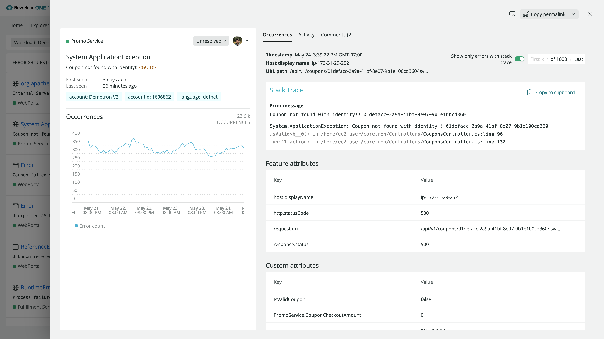

New Relic errors inbox is a single place to proactively detect, triage, and take action on all the errors before they impact customers. Receive alerts whenever a critical, customer-impacting error arises via your preferred communication channel, like Slack

Resolve errors faster with errors from across your stack, including all APM, browser(RUM), mobile, and serverless (AWS Lambda) data, displayed on one screen. Errors are grouped to cut down on noise and collaborating across teams is easy with shared visibility to the same error data. 

<Callout variant="important">
Errors inbox is not available in the EU region.
</Callout>

## Why it matters [#matters]

Errors inbox provides a unified error tracking experience to detect and triage errors:

- View and triage issues across applications and services that your team cares about.
- Proactive notifications with detailed error information in Slack
- Error profiles to show similarities between error events and surface the root cause.
- Analyze errors in context of the full stack and resolve errors with precision.
- Triage and tackle errors, including APM, browser, mobile, and AWS Lambda Functions.

## Set up Errors Inbox [#get-started]

To enable errors inbox, follow these steps below. Afterwards, errors groups should start to appear in your inbox.

1. From [one.newrelic.com](one.newrelic.com) select **More** in the top right and click **Errors Inbox** from the dropdown.
2. If this is your first time accessing errors inbox, you will be prompted to select a [workload](/docs/new-relic-one/use-new-relic-one/workloads/workloads-isolate-resolve-incidents-faster/) in the top left. 

Once you select your workload, your inbox should populate with error groups. If you have no workloads set up, you will [need to create one](/docs/new-relic-one/use-new-relic-one/workloads/use-workloads/) before you can use errors inbox.

## Proactively monitor your errors [#monitor]

<figcaption>[one.newrelic.com](one.newrelic.com) > **More** > ** Errors inbox**</figcaption>

### Errors groups

Error groups are sets of events that make up a unique error.  Error groups are stored long term and contain metrics, activity log, discussions, and basic information about the unique error. Error groups are tied to the [entity](/docs/new-relic-one/use-new-relic-one/core-concepts/what-entity-new-relic/), making a change to the state of an error group in one errors inbox will impact all other inboxes that contain that entity.

**How error groups work**

Error events get grouped into an error group when they share the same fingerprint.  As events are ingested by New Relic, we run the events through a set of managed rules that output a fingerprint.  Every unique fingerprint has a single error group associated with it.  

The New Relic managed rules normalize the error data, identifying and ignoring unique values such as UUIDs, hex values, email addresses, etc. that would cause grouping “like” errors into unique groups.  NR account ID, Entity ID, Error Class, message, and stack traces and exceptions are data that can impact a fingerprint.

<CollapserGroup>
  <Collapser
    className="freq-link"
    id="similar-events"
    title="Troubleshooting: similar looking events do not group together"
  >

If you see “like” error events grouped into different error groups incorrectly, try removing the unique identifier from the error class or message and store those as attributes instead.  This will allow you to more easily facet on the attribute values and reduce the number of error groups. 

If you have a single application reporting as multiple entities in New Relic (i.e. running in different clusters, cells, etc), you might see duplicate error groups, since our grouping logic looks at account and entity IDs as part of the fingerprinting process.  You can consider [rolling up the multiple entities into a single entity](/docs/agents/manage-apm-agents/app-naming/use-multiple-names-app/) and including only that rolled up entity as part of your errors inbox. 

You can also use the feedback tool in NR1 to share error groups that could use improved grouping.  We’re continually updating our rules to improve the quality of error groups.

  </Collapser>
</CollapserGroup>

### Triaging errors

**Statuses**

Errors inbox enables you to triage error groups right from the main screen or from the error details page.  Triaging helps remove the noise from your Errors Inbox, and let’s you focus on the high impact errors that need attention.

You can set one of three statuses, and filter your inbox by status.
- Unresolved: This is the default status of error groups.
- Resolved: Setting an error as resolved will hide it from the default Inbox view unless filters are updated to include resolved errors.  If events matching the error group fingerprint occur after marking an error group as resolved, it will automatically unresolve.  This can be useful for identifying regressions.
- Ignored: Ignored will hide the error group from the inbox view unless filters are updated to include ignored errors, or until you stop ignoring the error group. 

### Assigning errors

You can assign an error group to anyone.  Simply select the user from the assign dropdown menu.  You may also assign an error to any email address, even if they aren’t a New Relic user.

You can update the filter in errors inbox to show only errors assigned to yourself, or a teammate.  

Currently assigning an error group to a user does not send a notification. Notifications of assignment and changes to error groups will be coming soon.

### Monitor your errors
Once you've set up your errors inbox, you can begin proactively monitoring all errors in your stack:

1. **Error groups**: Your errors inbox automatically groups your errors so you can easily review all the unique errors within your system.
2. **Occurrences**: Your errors inbox displays the total number of occurrences of each errors within the selected timeframe. The corresponding sparkline chart displays the total number of occurrences per day over the selected timeframe.
3. **Status**: You can set the status of an error by selecting the dropdown and choosing either **Unresolved**, **Resolve**, or **Ignore**. You can ignore errors to reduce noise, leave it unresolved, or proactively resolve the error.
4. **Assign errors**: Assign errors directly to individuals. 
5. **Sort by**: You can sort the list of grouped errors by number of occurrences or by the error that was last seen (latest first).

## Dive deeper with error details [#error-details]

Clicking on a specific error group takes you to the error details page, where you will find full context of the issue. This context can assist in triaging the error and assigning it to the correct team or individual. 

<CollapserGroup>
  <Collapser
    className="freq-link"
    id="occurrences"
    title="Occurrences"
  >
The occurrences page includes details like:
- Related account
- Stack trace
- Logs in context
- Error attributes
- Number and frequency of occurrences

The detailed view also allows you to view specific errors. In the top right, you can navigate between the first instance of the error, the last, and any instance in-between.
  </Collapser>
  <Collapser
    className="freq-link"
    id="attributes"
    title="Attributes"
  >
The Attributes tab enables you to quickly find commonalities between the related errors for faster resolution. 

Click on a specific attribute to open a sidebar with specific details.
  </Collapser>
  <Collapser
    className="freq-link"
    id="activity"
    title="Activity"
  >
Displays a log of the status changes and user assignments of an error group.
  </Collapser>  
  <Collapser
    className="freq-link"
    id="discussions"
    title="Discussions"
  >
The discussions provides room for detailed and organized collaboration. This is key to looping in collaborators and ensuring the entire team has the same context regardless of where they sit. Discussions includes:

1. **Threaded conversations**: Reply directly to top level comments to tie replies to specific posts.
2. **Comment deletion**: Delete comments. The content of the post will be removed, but the box will remain with the message “comment deleted.”
3. **Markdown support**: Add styling and links to your comments in Markdown. 

  </Collapser>  
</CollapserGroup>

## Connect an inbox to Slack [#slack]

Each inbox can be connected to a specific workspace and channel in Slack. To set this up, follow the steps below.

1. If your Slack workspace does not have the [New Relic app](https://newrelic.slack.com/apps/AP92KQJS3-new-relic?tab=more_info) installed, do that first.
2. From an inbox, select the **Inbox Settings** icon (looks like a gear) in the top right corner.
3. Toggle the Slack button to "on" if it is "off".
4. If no workspaces are available, click the "+" button to enable Slack with a one click Slack authentication.
5. Once authenticated, you will be able to select a Workspace and specific Channel to send notifications to.
6. Click "Test" to ensure messages are being sent to the right channel.

## Connect Errors Inbox to CodeStream

To use CodeStream's Open in IDE with your APM stack trace errors, use environment variables to configure your APM agent with your application's [commit sha](https://git-scm.com/book/en/v2/Git-Tools-Revision-Selection) and/or your [release tag](https://git-scm.com/book/en/v2/Git-Basics-Tagging) associated with the running version of your software.

Once set up, you can jump from an error group directly to the offending code in your IDE by clicking the **</> Open in IDE** button.

Learn more [here](docs/codestream/start-here/codestream-new-relic/#apm).
