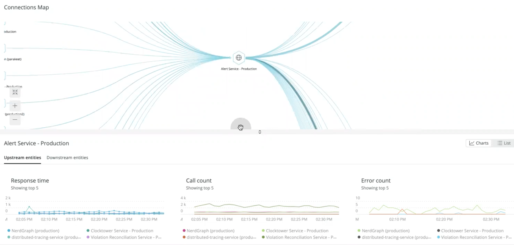

The UI for new external services is a great place to analyze a single service along with its upstream and downstream services. The UI starts you off with a map of your selected service, along with related graphs showing the top five results for response time, call count, and error count.

## How to find the new external services feature [#where-externals]

The new external services is available from the left navigation pane once you select a service in Explorer. Do one of the following:

   * New Relic Explorer: Go to **[one.newrelic.com](https://one.newrelic.com) > Explorer > (select an app) > Monitor > External services**.
   * APM: Go to **[one.newrelic.com](https://one.newrelic.com) > APM > (select an app) > Monitor > External services**.

## How to use the new external services map [#use-the-map]

[WE NEED TO EXPLAIN HOW THE VERTICES VARY: THEY CAN BE SERVICES OR ENDPOINTS DEPENDING ON WHETHER YOU ARE IN A DRILLDOWN VIEW?]

The opening map shows two vertical rectangles: one representing your selected service and another showing either the upstream or downstream service. The default is the downstream service. Each of the service rectangles contains vertices (hexagonal shapes) that represent the service’s endpoints. The vertices are connected across services by edges (lines). 

The map shows the performance of the calls between your service and the upstream and downstream entities. The thickness of the lines represents the throughput for the service, and the darkness of the line is time consumed (throughput times duration).

In the map legend, you have the option to select two types of services:

  * **Services**: These are services you own and have instrumented
  * **Uninstrumented externals**: These are uninstrumented services that you may or may not own

Here is a typical map workflow you might follow:

1. Look for the thickest and darkest line on the map and follow it to its upstream or downstream service.
2. Click on the upstream or downstream vertex for that service to view a breakdown of transactions between the two services.
[QUESTION: HOW CAN I GET A SCREENSHOT OF A SINGLE TRANSACTION?]
3. If you decide that a particular transaction is taking the most time, you can click on that transaction to focus specifically on its dependencies.
[QUESTION: WHERE CAN I GET A SCREENSHOT OF THIS?]
4. From any point in this flow, you can view a table view which shows you how performance has changed over time and allows you to drill into distributed traces. 

All views for OpenTelemetry services, and all views except the top-level view for APM services are driven by sampled data. So, since all the externals pages, except the initial page for APM services, display sampled data, here’s how to understand the numbers:

  * **Call count** represents the number of sampled calls we have for a given path between two services or transactions. This is lower than the total throughput, unless you are sampling 100% of your requests.
  * **Response time** is the average duration of sampled calls between two services or transactions. How representative this is of actual system performance depends on the effective sample rate.
  * **Error count** is the number of sampled calls between two services or transactions that had errors.

