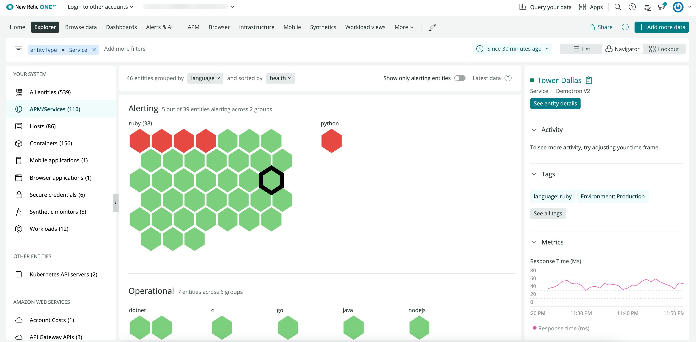

---
title: Full-Stack Observability
type: landingPage
tags:
  - Full-Stack Observability
redirects:
 ---

<LandingPageHero>
  <HeroContent>
    Full-Stack Observability is the power of knowing what’s happening in your digital system, and why, at any time. Our solutions give you the whole picture of the hundreds of applications and services you run simultaneously, and allow you to give context to the performance of your system. 

    Use our tools to visualize, analyze, and troubleshoot your entire software stack in one connected experience with rich analytics and a curated user experience.

  </HeroContent>

  

  <figcaption>
    **[one.newrelic.com](https://one.newrelic.com) > New Relic Explorer: your full stack, at a glance.**
  </figcaption>
</LandingPageHero>

<LandingPageTileGrid>
  <LandingPageTile
    title="Observe your stack with New Relic."
    href="/docs//full-stack-observability/observe-everything/get-started-new-relic-observability/get-started-full-stack-observability"
    icon="fe-zap"
  >
    Use our Full-Stack Observability platform to access your entire software stack in one unified platform.
  </LandingPageTile>

  <LandingPageTile
    title="Explore your entities."
    href="/docs/new-relic-one/use-new-relic-one/core-concepts/entity-explorer-view-performance-across-apps-services-hosts"
    icon="fe-move-horizontal"
  >
     Browse and filter your system’s entities to quickly grasp your system’s issues.
  </LandingPageTile>

  <LandingPageTile
    title="Monitor your infrastructure."
    href="/docs/infrastructure"
    icon="fe-sliders"
  >
     Observe your entire infrastructure, from services in the cloud to services on dedicated hosts to containers in orchestrated environments.
  </LandingPageTile>

  <LandingPageTile
    title="Track requests with Distributed Tracing."
    href="/docs/understand-dependencies/distributed-tracing/get-started/introduction-distributed-tracing
"
    icon="fe-message-circle"
  >
    See and follow your requests’ entire journey from start to finish as they travel through distributed systems.
  </LandingPageTile>

  <LandingPageTile
    title="Access all yourt logs."
    href="/docs/logs/log-management/get-started/get-started-log-management"
    icon="fe-alert-triangle"
  >
    Use our log management platform to connect your logs with the rest of your telemetry and infrastructure data.
  </LandingPageTile>

  <LandingPageTile
    title="Simulate traffic with Synthetics."
    href="/docs/synthetics"
    icon="fe-tool"
  >
     Imitate user traffic around the world so you can detect and resolve performance issues before your customers notice.
  </LandingPageTile>
</LandingPageTileGrid>

<ButtonLink
  role="button"
  to="/docs/full-stack-obervability/table-of-contents"
  variant="primary"
>
  View all Full-Stack Observability docs
</ButtonLink>
