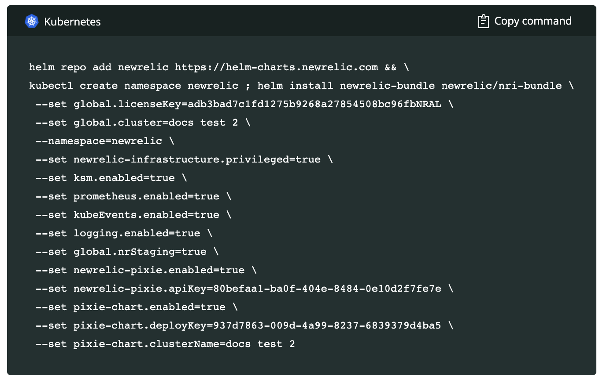

<Callout variant="important">
Auto-telemetry with Pixie is a beta release. As such, it is not supported. See our [technical support guidelines](/docs/licenses/license-information/general-usage-licenses/global-technical-support-offerings/#support-does-not-include) for more information.
</Callout>
 
When we say auto-telemetry, we’re not talking about cars -- we’re talking about automatically collecting telemetry data for your Kubernetes clusters. With our [Pixie](https://pixielabs.ai/) integration, you don’t have to manually instrument the services on your clusters, change code, or configure GUIs. With one install command, you get observability into Kubernetes services. No agent required. 

Pixie collects telemetry data using [eBPF](https://ebpf.io/), a virtual machine-like construct in the Linux kernel. eBPF makes it easy to collect baseline data about your clusters as with traditional New Relic agents, but without all the extra configuration.

IMAGE here

## Why it matters 

Auto-telemetry with Pixie offers the quickest option for getting observability into your Kubernetes services. Did we mention no agent is required?  

With this integration, you get the observability opportunities, data retention, and alerting offered by New Relic, and the debugging capabilities of Pixie. You’ll get visibility into HTTP services using [golden metrics](/docs/apis/nerdgraph/examples/golden-metrics-entities-nerdgraph-api-tutorial/), HTTP transactions, database transactions, distributed tracing, and JVM metrics. You can operate, debug, and scale your Kubernetes clusters based on the information you learn about how your clusters and services are running. Using the New Relic [Explorer](/docs/new-relic-one/use-new-relic-one/core-concepts/new-relic-explorer-view-performance-across-apps-services-hosts/), you can see key metrics and events at every level, starting with the cluster, and diving down into namespaces, deployments, and pods. You can quickly spot anomalous behavior, and where it’s happening. If you need further insight, you can easily link over to Pixie where you can debug further, by querying request headers and content with PXL scripts. 

## Install Auto-telemetry with Pixie and start instrumenting your Kubernetes clusters

Use our [Guided installation](/docs/full-stack-observability/observe-everything/get-started/new-relic-guided-install-overview/) process to install Auto-telemetry with Pixie. This process installs Pixie on the cluster together with our Kubernetes integration. You don't need to do any further configuration or installation to start using Pixie.

If you want to install Auto-telemetry with Pixie on multiple clusters, you have to run through the Guided install steps for each individual cluster.

**Before you begin**

The guided install requires the following. You can get these set up before you begin, or during the install steps:

- a [Pixie account](https://work.withpixie.ai/admin/api-keys)
  You need a Google account to sign up for Pixie.
- a Pixie API key 
- Sufficient memory: Pixie requires 2Gb of memory per node.

### Start the guided installation

1. From [New Relic One](https://one.newrelic.com), click **Add more data**.
2. Click the **Guided install** button. 
3. Select the account you want to use for the guided install, and click **Continue**.
4. Select **Kubernetes.**
5. Type in a name for your cluster, and select the check box to **Gather telemetry automatically with Pixie beta**.

<Callout variant="important">
As noted in the Guided install UI, you'll get the best performance if you keep your clusters below 100 nodes. Getting up above 100 nodes can lead to excessive memory usage and scripts failing to run. And, this is a friendly reminder that autoscaling can quickly drive up your node numbers.
</Callout>

    If Pixie is already running on your cluster, expand the **Advanced options** section and select the appropriate check boxes, such as **Pixie is already running on this cluster** and **Enable Pixie auto update**.

    Click **Continue**.

6. Provide your Pixie API key. If you already have a key, simply paste it in the **API key** box, and click **Continue**. 

If you don't have an account and existing API key, click the link to [create a Pixie account](https://work.withpixie.ai/admin/api-keys) and then on the [API key page](https://work.withpixie.ai/admin/api-keys), click **New key** to add a new key. In the **Actions** column, click the ellipsis, and then click **Copy value**. Switch back to the New Relic installation UI, paste the value in the **API key** box, and click **Continue**.

When you click **Continue**, the API key is added to your New Relic account, and a deploy key is created for Pixie as well. Your Pixie account information is now stored on your New Relic account; if you follow the install steps again, you won't be asked for this information. 

7. On the **Choose install method** page, copy the Helm command that's provided, and then run it on your command line. Helm installs the bundle containing the New Relic infrastructure agent, enables prometheus and Kubernetes events, and installs the Pixie integration. This takes a few minutes to complete. 

You can run `kubectl get pods -n newrelic` to see the status of the install to the cluster. 

8. Back in the New Relic install UI, click **Continue** to open the **Listening for data** page. The install will see that data is reported to New Relic. 
9. When you get the message, **See your data**, click **Kubernetes Cluster Explorer** to see your cluster. 

## Explore your cluster

In the explorer, you can get a quick overview of the nodes in your cluster. You can find information about each pod in the node, including CPU and memory usage. You can also find out what service is running in the pod, what the latency looks like for that service, as well as throughput and error rate. For more information about using the cluster explorer, see [Navigate the Kubernetes cluster explorer](https://docs.newrelic.com/docs/integrations/kubernetes-integration/understand-use-data/kubernetes-cluster-explorer/).

You might spot and solve issues through the data captured in New Relic, or you might want to switch over to Pixie, to dive deeper into problem areas. Auto-telemetry with Pixie captures metrics and spans to provide a performance overview for your service. From Pixie, you can drill down further into the actual header and content requests. These can contain personal information that stays in your Kubernetes cluster and is not sent to New Relic, but that you can query from the Pixie UI through PXL scripts. 

Click **Explore service in Pixie** to see more information about your service in the Pixie UI. 
Learn more about [writing PXL scripts in the Pixie docs](https://docs.pixielabs.ai/tutorials/pxl-scripts/).

