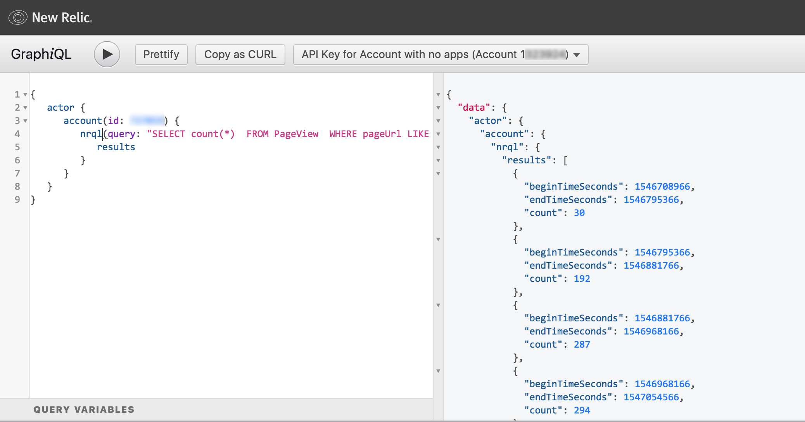
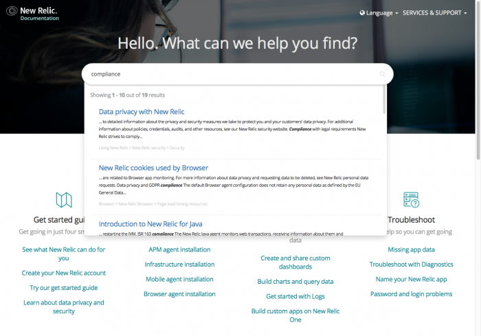

import { Link } from 'gatsby'

New Relic offers a variety of APIs and SDKs you can use to:

* Retrieve data from the New Relic platform.
* Insert data into New Relic.
* Adjust configuration settings.

Different New Relic products have their own APIs, so before you start using a specific API, it's a good idea to understand what the various APIs can do. Recommended reading:

* [Introduction to New Relic APIs](/docs/apis/getting-started/intro-apis/introduction-new-relic-apis)
* [A developer-centric look at our APIs](https://developer.newrelic.com/)

**[api.newrelic.com/graphiql](https://api.newrelic.com/graphiql):** Our NerdGraph GraphiQL explorer is one of the ways you can query and retrieve New Relic data.

<i
  aria-hidden="true"
  className="fa fa-map-o fa-3x text-muted"
>
  \[map icon]
</i>

**[Introduction to APIs.](/docs/apis/getting-started/intro-apis/introduction-new-relic-apis)** See an overview of all APIs, including account admin and subscription usage data APIs.

<Icon
  name="terminal"
  size="3em"
/>

**[New Relic's developer site.](https://developer.newrelic.com/)** Learn developer options for extending and customizing New Relic.

<i
  aria-hidden="true"
  className="fa fa-book fa-3x text-muted"
>
  \[book icon]
</i>

**[NerdGraph GraphiQL explorer.](/docs/apis/graphql-api/getting-started/introduction-new-relic-graphql-api)** Retrieve specified data with a single request, instead of making multiple calls.

<i
  aria-hidden="true"
  className="fa fa-area-chart fa-3x text-muted"
>
  \[area chart icon]
</i>

**[APM agent APIs.](/docs/apis/getting-started/intro-apis/introduction-new-relic-apis#apm-api)** Use our language agent APIs to report custom transactions and make other customizations.

<Icon
  name="alert-triangle"
  size="3em"
/>

[**Alerts API.**](/docs/alerts/rest-api-alerts/new-relic-alerts-rest-api/rest-api-calls-new-relic-alerts) Use the Alerts API to set up alerting solutions and to get data about your Alerts settings.

<i
  aria-hidden="true"
  className="fa fa-code fa-3x text-muted"
>
  \[code icon]
</i>

**[Synthetics APIs.](/docs/apis/synthetics-rest-api)** Manage Synthetics monitors and return monitor data.

<Button
  role="button"
  as={Link}
  to="/docs/apis?toc=true"
  variant="primary"
>
  View all APIs docs
</Button>
den="true"
  className="fa fa-check fa-2x"
>
  \[check icon]
</i>

**Security: What you can do.** To enhance your own security measures, you can use our [SAML single sign-on (SSO) providers](/docs/accounts/accounts/saml-single-sign/saml-service-providers), adjust [high security mode](/docs/agents/manage-apm-agents/configuration/high-security-mode) settings, review [audit logs](/docs/insights/use-insights-ui/manage-account-data/query-account-audit-logs-nrauditevent), and use other [product security options](/docs/using-new-relic/new-relic-security/security/data-privacy-new-relic#product-security).

<i
  aria-hidden="true"
  className="fa fa-info-circle fa-2x"
>
  \[info icon]
</i>

**Compliance: What we do.** Our [Tier III, SOC2 certified data centers](https://newrelic.com/security) in the US and EU [ensure compliance](/docs/using-new-relic/new-relic-security/security/data-privacy-new-relic#legal) with processing and storing data for specific [retention periods](/docs/using-new-relic/welcome-new-relic/getting-started/data-retention-components). We are [FedRAMP Authorized Moderate](https://docs.newrelic.com/docs/security/new-relic-security/compliance/data-encryption) for accounts that meet specific criteria.

<i
  aria-hidden="true"
  className="fa fa-commenting fa-2x"
>
  \[commenting icon]
</i>

**Compliance: What you can do.** If you receive a request related to the General Data Protection Regulation (GDPR) or California Consumer Protection Act (CCPA), follow [standard procedures to query or delete personal data](/docs/using-new-relic/new-relic-security/security/new-relic-personal-data-requests).

**[docs.newrelic.com](https://docs.newrelic.com)**: You can find documentation about data privacy, security, compliance, and other topics on New Relic's Docs site.

<Button
  as={Link}
  to="/docs/security?toc=true"
  variant="primary"
>
  View all security and privacy docs
</Button>
