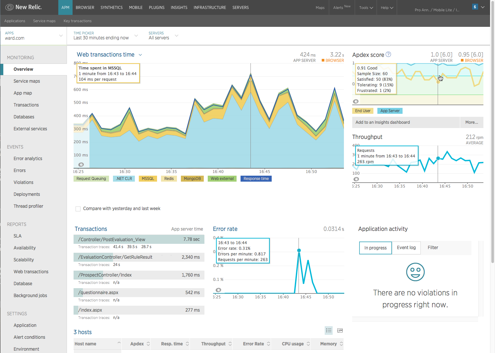

import { Link } from 'gatsby'

**Welcome to New Relic!** You just joined thousands of others who are managing applications in increasingly complicated environments. We're your partner. Together, we can help you see what's happening in your application, understand where the problems are, and make sure you never miss an issue that needs attention.

**Let's get started together.** We're going to take you through the basics to manage your application and services. Follow these steps and you'll be set up for success:

1. Get data reporting.
2. Improve your application's performance.
3. Organize your applications with labels.
4. Get notified if something goes wrong (alerts).

[**rpm.newrelic.com:**](https://rpm.newrelic.com) Starting from the **APM Overview** page, dive into the wealth of tables, charts, and other dashboards showing current and historical trends about your app's performance.

[<Icon name="list" size="3em"/>](/docs/using-new-relic/welcome-new-relic/getting-started/get-started-data-reporting)

**Get data reporting.** In order to see what's happening in your application, you need to install our agent in your environment. This connection allows your application to send data about its performance. [Learn how.](/docs/using-new-relic/welcome-new-relic/getting-started/get-started-data-reporting)

[<i aria-hidden="true" className="fa fa-area-chart fa-3x color_apm">\[search icon\]
</i>](/docs/using-new-relic/welcome-new-relic/getting-started/get-started-improving-app-performance)

**Improve app performance.** Now that you can see data from your application, it's time to put that data to work and analyze how you can improve its performance. [Learn how.](/docs/using-new-relic/welcome-new-relic/getting-started/get-started-improving-app-performance)

[<Icon name="tag" size="3em"/>](/docs/using-new-relic/welcome-new-relic/getting-started/get-started-organizing-your-apps)

**Organize your applications.** Use labels to make it easier to find, view, and compare only the entities that are meaningful to you. [Learn how.](/docs/using-new-relic/welcome-new-relic/getting-started/get-started-organizing-your-apps)

[<Icon name="alert-triangle" size="3em"/>](/docs/using-new-relic/welcome-new-relic/getting-started/get-started-alerts)

**Get notified if something goes wrong.** Diagnosing the problem after the fact is important, but it's more important to know that you have a problem, or are about to have one. [Learn how.](/docs/using-new-relic/welcome-new-relic/getting-started/get-started-alerts)

<Button
  role="button"
  as={Link}
  to="/docs/using-new-relic?toc=true"
  variant="primary"
>
  View all Using New Relic docs
</Button>

\-- NORMAL --
