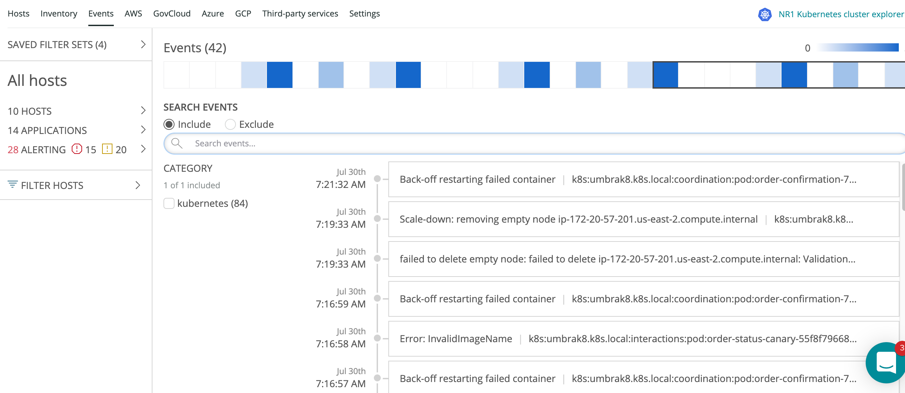

In New Relic's infastructure monitoring, the **Events** UI page is a live feed of important system and host activity, including inventory change events, configuration changes, and log analytics events. The event feed helps you understand correlations between these events and system performance. Search and filter through your events to decrease the mean time to detect and repair infrastructure issues.

<Callout variant="tip">
Note that this use of "event" is specific to infrastructure monitoring and a separate concept from our more general [event data type](/docs/data-apis/understand-data/new-relic-data-types/#event-data).
</Callout>

You can access the **Events** page by going to **[one.newrelic.com](http://one.newrelic.com) > Infrastructure > Events**.

## Event types [#types]

New Relic collects a variety of change events so you can understand each change in your environment:

<table>
  <thead>
    <tr>
      <th style={{ width: "200px" }}>
        **Events**
      </th>

      <th>
        **Comments**
      </th>
    </tr>
  </thead>

  <tbody>
    <tr>
      <td>
        Alert incidents
      </td>

      <td>
        When a [violation](/docs/alerts/new-relic-alerts/getting-started/alerts-glossary#alert-violation) is opened or closed, New Relic generates an event indicating the host and associated [alert condition](/docs/infrastructure/new-relic-infrastructure/configuration/infrastructure-alerts-add-edit-or-view-host-alert-information).
      </td>
    </tr>

    <tr>
      <td>
        Agent connection
      </td>

      <td>
        When an infrastructure [agent](/docs/accounts-partnerships/education/getting-started-new-relic/glossary#agent) connects to New Relic, our platform generates an **Agent connected** event. If New Relic doesn't receive data from an agent for three minutes, the platform generates an **Agent disconnected** event.
      </td>
    </tr>

    <tr>
      <td>
        Inventory changes
      </td>

      <td>
        These events are generated when [inventory](/docs/infrastructure-inventory-page) data is added, removed, or modified. Select the source <Icon name="fe-filter"/>
        icon to to understand which category corresponds to the altered inventory path. For additional details, select an inventory event to see a side-by-side comparison of the old and new state.

        Inventory events can include:

        * **Kernel** (includes modules and configuration): Can be added, modified, or deleted.
        * **Metadata** (includes various additional information about hosts): Can be added, modified, or deleted.
        * **Packages**: Can be installed, removed, or modified.
        * **Services**: Can be started, stopped, or restarted.
        * **Sessions** (includes users): Can be connected or disconnected.
      </td>
    </tr>
  </tbody>
</table>

## Events page features [#search]

To view the live event feed: Go to **[one.newrelic.com](http://one.newrelic.com) > Infrastructure > Events**. The **Events** page includes a [heatmap](/docs/infrastructure/new-relic-infrastructure/infrastructure-ui-pages/events-heatmap-examine-patterns-time-range), which provides a snapshot of the events occurring within the selected time range.

<figcaption>
  **[one.newrelic.com](http://one.newrelic.com) > Infrastructure >** **Events**: Use the **Events** to view important, real-time activity in your infrastructure.
</figcaption>

With the **Events** page, you can easily search through your event log to quickly find vulnerable packages.

<table>
  <thead>
    <tr>
      <th style={{ width: "230px" }}>
        **If you want to...**
      </th>

      <th>
        **Do this...**
      </th>
    </tr>
  </thead>

  <tbody>
    <tr>
      <td>
        Focus on specific events
      </td>

      <td>
        Use the **<Icon name="fe-search"/>
        Search events** field to look for specific events, config changes or agent installations. To focus on a specific set of events, select or change the [filter set](/docs/scopes-organize-your-infrastructure).
      </td>
    </tr>

    <tr>
      <td>
        Search within a particular time range
      </td>

      <td>
        Enter a time range to the right of the search bar to investigate events within a specific time range. For example, if you encountered a CPU spike around 11am on the previous day, search **Yesterday at 11 am** to investigate the possible cause.
      </td>
    </tr>

    <tr>
      <td>
        Compare events with host load, memory, CPU, and more
      </td>

      <td>
        View the [events feed](/docs/infrastructure/new-relic-infrastructure/infrastructure-ui-pages/infrastructure-events-page-live-feed-every-config-change#search) on the [Hosts page](/docs/infrastructure-metrics-page#events). To compare infrastructure events and performance for a specific time, select a range via the time picker or drag and select a range on a chart.
      </td>
    </tr>

    <tr>
      <td>
        View events specifically related to agents, config, metadata, services, or sessions
      </td>

      <td>
        Group or sort events by selecting the filter <Icon name="fe-filter"/>
        icon be the search bar.
      </td>
    </tr>

    <tr>
      <td>
        Drill down into additional details
      </td>

      <td>
        Select an event to view additional details, such as attributes and values. To drill down further, select **View in Inventory** to see additional details in the [Inventory](/docs/infrastructure-inventory-page) page.
      </td>
    </tr>

    <tr id="view-alert">
      <td>
        View host's [alert threshold violation](/docs/alerts/new-relic-alerts/getting-started/alerts-glossary#alert-threshold)
      </td>

      <td>
        Select the host's **Critical** <Icon name="fe-x-circle"/>
        icon or **Warning** <Icon name="fe-alert-triangle"/>
        icon.
      </td>
    </tr>
  </tbody>
</table>

## Chart data attributes [#attributes]

For an explanation of the [attributes](/docs/accounts-partnerships/education/getting-started-new-relic/glossary#attribute) used to populate the **Events** page, see [InfrastructureEvent attributes](https://docs.newrelic.com/attribute-dictionary/?event=InfrastructureEvent).
