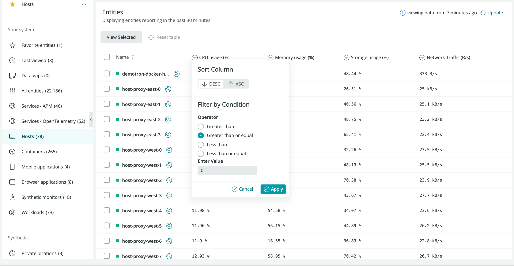
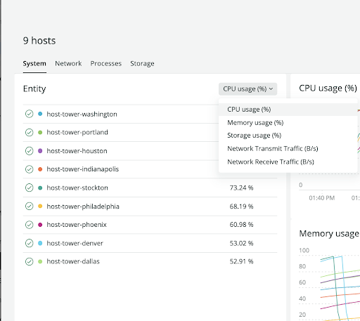

Our 2022 relaunch of the infrastructure monitoring tools adds consistency to the way our users interact with the [New Relic One platform](/docs/new-relic-one/use-new-relic-one/get-started/introduction-new-relic-one/). 

Previously, when clicking on the infrastructure item in the top navigation bar, you were redirected outside the [Explorer](/docs/new-relic-one/use-new-relic-one/core-concepts/new-relic-explorer-view-performance-across-apps-services-hosts/), missing capabilities like the Navigator and Lookout. Now, by clicking on infrastructure or hosts, you are directed to the list of all of our host [entities](/docs/new-relic-one/use-new-relic-one/core-concepts/what-entity-new-relic/) in the **list view of Explorer**, and **infrastructure events are displayed in the activity stream**. Our inventory experience has not changed as part of this release.

<Callout variant="tip">
  Use the toggle in the UI to access the legacy interface.
  
  While we have worked to update the flow and visualizations around your key infrastructure data, we have not removed any of the previous functionality in order to give you time to adjust to the new tools. You can still access the hosts legacy view from the top infrastructure nav drop down.   
</Callout>

Ready to get started? Make sure you have a [New Relic account](https://newrelic.com/signup). It's free, forever!

## Access the new infrastructure UI [#access-new-ui]

Check out the new infrastructure monitoring: Go to [one.newrelic.com](https://one.newrelic.com), click on **Infrastructure** on the top nav bar, then select **Hosts (New)**. Or go to the **Explorer** and select **Hosts**.

The infrastructure Explorer list view is organized in these panels:

* **Your system's entities** on the left.
* **Estate View** panel in the middle. 
  * It provides the ability to select up to 25 entities at a time to analyze together: Select the hosts you want to observe, and hit the **View Selected** button to navigate to the new [analysis nerdlet](#infra-analysis-nerdlet). 
  * From the list view you can still jump directly to an individual entity summary by clicking on the entity name in the list. 
* **Activity stream** on the right.

### Entities are displayed based on golden metrics [#infra-entity-golden-metrics]

The new entity list is powered by [golden metrics](/docs/apis/nerdgraph/examples/golden-metrics-entities-nerdgraph-api-tutorial/), which you are starting to see throughout New Relic. You will see the same set of metrics if you select to view Lookout for these infrastructure entity types. These new metrics replace the previous summary metrics in the old UI. 

### Views with improved sorting and filtering [#infra-entity-filter]

We have removed the limitation of fewer than 2,000 entities to sort column values. Note that performance may be slightly impacted if there are more than 10,000 entities.   

On top of sorting, you can also filter the entities' metric values to hone in on exactly the entities that need your attention. For example, you can now filter only to entities that have a CPU over 80% so you can quickly identify if there are problems in their estate. Filtering is limited to one column for the moment, but it will be extended to multiple columns in future releases.

## Dive deep into your hosts with the new analysis nerdlet [#infra-analysis-nerdlet]

Once you've selected the desired entities in the entity list view, upon clicking **View Selected**, a slide out analysis panel appears regarding that set of entities. 

You'll have four tabs to explore your data:

 * [System](#nerdlet-system)
 * [Network](#nerdlet-network)
 * [Processes](#nerdlet-processes)
 * [Storage](#nerdlet-storage)

### System tab [#nerdlet-system]

The system tab has three panels.

**Left panel: Selected entities list**

Toggle between these entities' key metrics on the top drop down.

Hover over any entity row to view more details on the entity. 

<ImageSizing width="32px" height="32px" verticalAlign="middle"></ImageSizing>

* Click **View Logs** to open a new tab with their logs in context information. To enable logs, see [our docs on log management](/docs/logs/forward-logs/enable-log-management-new-relic/). You can jump back to the tab with your hosts analysis panel still in place. 

* For hosts only, use the **map** icon to launch the auto-map feature for a particular host entity. This view gives you a visual representation of your host's relationships to other entities in the stack.

* Select the **magnifying glass** icon labeled **View summary** to be redirected to the summary page for that individual entity. 
* If you select an entity in the left panel, the line for that entity will also be highlighted on each chart. 
* Hide the entity from the list clicking on the **eye** icon. If you chose to hide entities in the left panel, those will be removed from the charts in the middle panel.   

**Middle panel: Golden metrics comparison charts**

The golden metrics comparison charts represent the [golden metrics signals](https://github.com/newrelic/entity-definitions) for the selected entities.

* If you chose to hide entities in the left panel, they will be removed from the charts.  
* If an entity is highlighted in the left panel, the line for that entity will also be highlighted on each chart. Or, if you highlight a line, the entity is also highlighted on the left.
* Check details for data points on each chart hovering over the tooltip.

**Right panel: Related entities**

Understanding relationships in New Relic can be complicated, but very powerful when trying to solve problems. Imagine a host is misbehaving and you'd like to know, without a lot of clicking, what else it might be affecting. The [related entities](/docs/new-relic-one/use-new-relic-one/core-concepts/what-entity-new-relic/#related-entities) panel seeks to show you those entities that are related to your selection on the left panel so you can see common golden signals on those entities. See at a glance if your connected APM service is experiencing a slow response time, decreased throughput or an elevated error rate!

* When you first enter the new view, you will see the related entities panel sorted by the alert status of those entities. If there's a service with a critical violation, it will be right at the top!
* If you hover on an entity in the left panel, the related entities associated with the item will be highlighted on the right. Additionally, if you click on the item in the left side, the right panel will re-sort to bump the associated related entities to the top of the column on the right.

### Network tab [#nerdlet-network]

The **Network** tab displays

### Processes tab [#nerdlet-processes]

The **Processes** tab shows

### Storage tab [#nerdlet-storage]

At the **Storage** tab you'll find