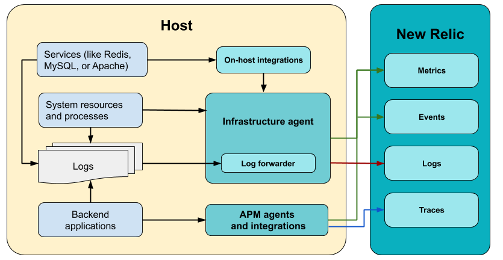

import amazonlinux from './images/amazonlinux.png'

import centos from './images/centos.png'

import dockerLogoCrop from './images/docker-logo-crop.png'

import debian from './images/debian.png'

import redHatNew2 from './images/red-hat-new2.png'

import suse from './images/suse.png'

import ubuntu from './images/ubuntu.png'

import otherlinux from './images/otherlinux.png'

import windows from './images/windows.png'

New Relic's infrastructure monitoring agent is a [lightweight](/docs/infrastructure/new-relic-infrastructure/getting-started/infrastructure-agent-performance-overhead) executable file that collects [data about your hosts](/docs/infrastructure/manage-your-data/data-instrumentation/default-infrastructure-events). It also forwards data from [infrastructure integrations](/docs/integrations/infrastructure-integrations/get-started/introduction-infrastructure-integrations) to New Relic, as well as [log data](/docs/logs/enable-log-monitoring-new-relic/enable-log-monitoring-new-relic/forward-your-logs-using-infrastructure-agent) for log analytics.

There are multiple ways to install and deploy the infrastructure monitoring agent, depending on your setup and needs. This document describes how the infrastructure monitoring agent works and how to install it.

## Quick start: Use our guided install [#quick]

The quickest way to get started with our infrastructure monitoring agent is through our guided install.

Ready to get started? Click one of these button to try it out.

<ButtonGroup>
<ButtonLink
  role="button"
  to="https://one.newrelic.com/launcher/nr1-core.home?pane=eyJuZXJkbGV0SWQiOiJucjEtY29yZS5ob21lLXNjcmVlbiJ9&cards%5B0%5D=eyJuZXJkbGV0SWQiOiJucjEtaW5zdGFsbC1uZXdyZWxpYy5ucjEtaW5zdGFsbC1uZXdyZWxpYyIsImFjdGlvbkluZGV4IjoxfQ=="
  variant="primary"
>
  Guided install
</ButtonLink>

<ButtonLink
  role="button"
  to="https://one.eu.newrelic.com/launcher/nr1-core.home?pane=eyJuZXJkbGV0SWQiOiJucjEtY29yZS5ob21lLXNjcmVlbiJ9&cards%5B0%5D=eyJuZXJkbGV0SWQiOiJucjEtaW5zdGFsbC1uZXdyZWxpYy5ucjEtaW5zdGFsbC1uZXdyZWxpYyIsImFjdGlvbkluZGV4IjoxfQ=="
  variant="primary"
>
  EU Guided install
</ButtonLink>
</ButtonGroup>

Our guided install not only installs the infrastructure agent, but also discovers the applications and log sources running in your environment. It recommends which ones you should instrument.

The guided install works with most setups. But if it doesn't suit your needs, you can find other methods below to get started monitoring your infrastructure.

<Callout variant="important">
  If you install the agent using the [New Relic One UI](https://one.newrelic.com), the [Infrastructure status API](https://github.com/newrelic/infrastructure-agent/blob/master/docs/status_api.md) is enabled by default. 
</Callout>

## One agent, many capabilities [#overview]

Our infrastructure monitoring agent collects performance and health data about the system resources and processes of the host where it's enabled (on-premises or virtualized). At the same time, it acts as a forwarder for two types of data: core services metrics, which are collected by [on-host integrations](/docs/integrations/host-integrations/getting-started/introduction-host-integrations), and [logs](/docs/logs/enable-log-monitoring-new-relic/enable-log-monitoring-new-relic/forward-your-logs-using-infrastructure-agent).

If you want to collect data about core services running on your host, you need to [install the infrastructure monitoring agent](#install) first, and then [install or enable on-host integrations](/docs/integrations/host-integrations/installation/install-infrastructure-host-integrations).

<figcaption>
  Our infrastructure monitoring agent and its integrations collect data from the system and core services. It can also [forward logs](/docs/logs/enable-log-monitoring-new-relic/enable-log-monitoring-new-relic/forward-your-logs-using-infrastructure-agent) to New Relic. Backend application metrics (APM) are collected by separate [language agents](/docs/agents). Notice how each integration and forwarder feed [different data types](/docs/using-new-relic/data/understand-data/new-relic-data-types) in the New Relic database (NRDB).
</figcaption>

## Install the infrastructure monitoring agent [#install]

If our guided install doesn't work for your setup, follow the instructions for your Linux, Windows, or other setup.

The infrastructure monitoring agent can currently run on many Linux distributions, as well as Windows Server. For more information on where you can run the agent, check the [compatibility and requirements](/docs/infrastructure/infrastructure-monitoring/get-started/compatibility-requirements-infrastructure-agent) page.

### Linux [#Linux]

The preferred way to install the Linux agent is through the [package manager](/docs/infrastructure/install-infrastructure-agent/linux-installation/install-infrastructure-agent-linux-using-package-manager) of your distribution. Select your distribution from the list for step-by-step instructions.

<TechTileGrid>
  <TechTile
    name="Amazon Linux"
    to="https://one.newrelic.com/launcher/nr1-core.settings?pane=eyJuZXJkbGV0SWQiOiJzZXR1cC1uZXJkbGV0LnNldHVwLW9zIiwiZGF0YVNvdXJjZSI6IkFNQVpPTl9MSU5VWCJ9"
    icon={}
  />

  <TechTile
    name="CentOS"
    to="https://one.newrelic.com/launcher/nr1-core.settings?pane=eyJuZXJkbGV0SWQiOiJzZXR1cC1uZXJkbGV0LnNldHVwLW9zIiwiZGF0YVNvdXJjZSI6IkNFTlRPUyJ9"
    icon={}
  />

  <TechTile
    name="Container (Docker)"
    to="/docs/infrastructure/new-relic-infrastructure/data-instrumentation/monitor-containers-underlying-hosts-coreos"
    icon={}
  />

  <TechTile
    name="Debian"
    to="https://one.newrelic.com/launcher/nr1-core.settings?pane=eyJuZXJkbGV0SWQiOiJzZXR1cC1uZXJkbGV0LnNldHVwLW9zIiwiZGF0YVNvdXJjZSI6IkRFQklBTiJ9"
    icon={}
  />

  <TechTile
    name="RHEL"
    to="https://one.newrelic.com/launcher/nr1-core.settings?pane=eyJuZXJkbGV0SWQiOiJzZXR1cC1uZXJkbGV0LnNldHVwLW9zIiwiZGF0YVNvdXJjZSI6IlJIRUwifQ=="
    icon={}
  />

  <TechTile
    name="SLES"
    to="https://one.newrelic.com/launcher/nr1-core.settings?pane=eyJuZXJkbGV0SWQiOiJzZXR1cC1uZXJkbGV0LnNldHVwLW9zIiwiZGF0YVNvdXJjZSI6IlNMRVMifQ=="
    icon={}
  />

  <TechTile
    name="Ubuntu"
    to="https://one.newrelic.com/launcher/nr1-core.settings?pane=eyJuZXJkbGV0SWQiOiJzZXR1cC1uZXJkbGV0LnNldHVwLW9zIiwiZGF0YVNvdXJjZSI6IlVCVU5UVSJ9"
    icon={}
  />

  <TechTile
    name="Other Linux distros"
    to="/docs/infrastructure/install-configure-manage-infrastructure/linux-installation/tarball-assisted-install-infrastructure-linux"
    icon={}
  />
</TechTileGrid>

To use these installation links, you must be logged to your New Relic account.

If you don't have a New Relic account yet, or if you prefer to follow the procedure manually, [see our tutorial](/docs/infrastructure/install-infrastructure-agent/linux-installation/install-infrastructure-agent-linux-using-package-manager). For advanced install needs, you can deploy the agent using our tarball files in [assisted](/docs/infrastructure/install-infrastructure-agent/linux-installation/tarball-assisted-install-infrastructure-agent-linux) or [manual](/docs/infrastructure/install-infrastructure-agent/linux-installation/tarball-manual-install-infrastructure-agent-linux) mode.

### Windows Server and 10 [#Windows]

To deploy the agent on a Windows Server host, [install it using our MSI installer](/docs/infrastructure/install-configure-manage-infrastructure/windows-installation/install-infrastructure-windows-server-using-msi-installer). For a guided procedure, click the button below and follow the step-by-step instructions:

<TechTileGrid>
  <TechTile
    name="Windows"
    to="https://one.newrelic.com/launcher/nr1-core.settings?pane=eyJuZXJkbGV0SWQiOiJzZXR1cC1uZXJkbGV0LnNldHVwLW9zIiwiZGF0YVNvdXJjZSI6IldJTkRPV1MifQ=="
    icon={}
  />
</TechTileGrid>

If you don't have a New Relic account yet, or prefer to follow the procedure manually, [see our tutorial](/docs/infrastructure/install-configure-manage-infrastructure/windows-installation/install-infrastructure-windows-server-using-msi-installer). For advanced installation needs, you can deploy the agent using our zip files in [assisted](https://docs.newrelic.com/docs/infrastructure/install-configure-infrastructure/windows-installation/assisted-install-infrastructure-windows) or [manual](https://docs.newrelic.com/docs/infrastructure/install-configure-infrastructure/windows-installation/manual-install-infrastructure-windows) mode.

### Other installation scenarios [#others]

The infrastructure monitoring agent can be deployed programmatically using several config management and deploy tools:

* <ImageSizing width="32px" height="32px" verticalAlign="middle"></ImageSizing> [Ansible](/docs/infrastructure/new-relic-infrastructure/config-management-tools/configure-new-relic-infrastructure-using-ansible)
* <ImageSizing width="32px" height="32px" verticalAlign="middle"></ImageSizing> [Chef](/docs/infrastructure/new-relic-infrastructure/config-management-tools/configure-new-relic-infrastructure-using-chef)
* <ImageSizing width="32px" height="28px" verticalAlign="middle"></ImageSizing> [Docker](/docs/infrastructure/install-infrastructure-agent/linux-installation/docker-container-infrastructure-monitoring) (install as container)
* <ImageSizing width="32px" height="32px" verticalAlign="middle"></ImageSizing>[Elastic Beanstalk](/docs/infrastructure/install-infrastructure-agent/config-management-tools/install-infrastructure-agent-aws-elastic-beanstalk)
* <ImageSizing width="32px" height="32px" verticalAlign="middle"></ImageSizing> [Puppet](/docs/infrastructure/new-relic-infrastructure/config-management-tools/configure-new-relic-infrastructure-puppet)

## Check the source code [#source-code]

The infrastructure monitoring agent is open source software. That means you can [browse its source code](https://github.com/newrelic/infrastructure-agent) and [send improvements](https://github.com/newrelic/infrastructure-agent/blob/master/CONTRIBUTING.md), or create your own fork and build it. For more information, see the [README](https://github.com/newrelic/infrastructure-agent/blob/master/README.md).

## What's next

After you've installed the infrastructure monitoring agent:

* Learn how to [configure the agent](/docs/infrastructure/install-configure-infrastructure/configuration/configure-infrastructure-agent) or edit the [config template](https://github.com/newrelic/infrastructure-agent/blob/master/assets/examples/infrastructure/newrelic-infra-template.yml.example).
* Install [on-host integrations](/docs/integrations/host-integrations/getting-started/introduction-host-integrations) (for example, for Apache or MySQL).
* [Enable log forwarding using the infrastructure agent](/docs/logs/enable-new-relic-logs/1-enable-logs/forward-your-logs-using-new-relic-infrastructure).
* Learn how to [manage the agent](/docs/infrastructure/install-infrastructure-agent/manage-your-agent).