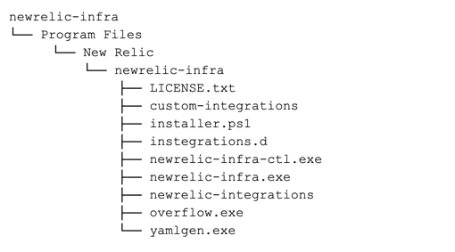

With the assisted install of the infrastructure agent for Windows, you can make the changes you need to the installation script we provide so you can adapt it to your environment. Before installation, make sure to check the [compatibility and requirements](/docs/infrastructure/new-relic-infrastructure/getting-started/compatibility-requirements-new-relic-infrastructure).

## Install the agent [#install]

<Callout variant="important">
  As of [version 1.4.0](/docs/release-notes/infrastructure-release-notes/infrastructure-agent-release-notes/new-relic-infrastructure-agent-140), the infrastructure agent package includes the additional `newrelic-infra-ctl` binary, which is used to help troubleshoot a running agent. Although this binary is not required to execute the agent, we recommend to add it in your path. [See our docs](/docs/infrastructure/install-configure-manage-infrastructure/manage-your-agent/troubleshoot-running-agent) for more information.
</Callout>

To install the agent:

1. Download the [packaged agent file](https://download.newrelic.com/infrastructure_agent/binaries/windows/).
2. Unpack the file.
3. Make sure the file unpacks with the following structure:

   
4. Once it's unpacked, access and edit the installation PowerShell script `installer.ps1`.
5. Update your license key.
6. Optional: Update any other [parameters](#parameters).
7. Execute `installer.ps1` with admin rights.

## Configure your installation [#parameters]

<Callout variant="important">
  Make sure any custom folder defined in the installation settings has permissions limitations properly defined. The infrastructure agent might execute any integration defined in the `NRIA_PLUGIN_DIR` directory with Administrator permissions.
</Callout>

You can configure the following parameters during the assisted install for Windows:

<table>
  <thead>
    <tr>
      <th style={{ width: "250px" }}>
        Variable
      </th>

      <th>
        Description
      </th>
    </tr>
  </thead>

  <tbody>
    <tr>
      <td>
        `NRIA_AGENT_DIR`

        Required at agent startup.
      </td>

      <td>
        The agent home directory.

        Default:

        ```
        C:\Program Files\New Relic\newrelic-infra
        ```
      </td>
    </tr>

    <tr>
      <td>
        `NRIA_APP_DATA_DIR`
      </td>

      <td>
        This configures the data directory to store inventory and other agent files.

        Default:

        ```
        C:\%ProgramData%\New Relic\newrelic-infra
        ```
      </td>
    </tr>

    <tr>
      <td>
        `NRIA_CONFIG_FILE`

        Required at installation.
      </td>

      <td>
        The agent configuration file's location.

        Default:

        ```
        C:\Program Files\New Relic\newrelic-infra\newrelic-infra.yml
        ```
      </td>
    </tr>

    <tr>
      <td>
        `NRIA_LICENSE_KEY`

        Only configuration option required at startup.
      </td>

      <td>
        The New Relic license key.
      </td>
    </tr>

    <tr>
      <td>
        `NRIA_LOG_FILE`

        Required at agent startup.
      </td>

      <td>
        The location where the agent will log.

        Default:

        ```
        C:\Program Files\New Relic\newrelic-infra\newrelic-infra.log
        ```
      </td>
    </tr>

    <tr>
      <td>
        `NRIA_OVERWRITE`
      </td>

      <td>
        By default and for security reasons, Windows does not install a service if there's another service with the same name already installed. To bypass this check, make sure this setting `NRIA_OVERWRITE` is `TRUE`.

        Default:

        ```
        TRUE
        ```
      </td>
    </tr>

    <tr>
      <td>
        `NRIA_PLUGIN_DIR`

        Required at agent startup.
      </td>

      <td>
        The directory containing the configuration files of the integrations.

        Default:

        ```
        C:\Program Files\NewRelic\newrelic-infra\inregrations.d
        ```
      </td>
    </tr>

    <tr>
      <td>
        `NRIA_SERVICE_NAME`
      </td>

      <td>
        This provides the name for the Windows service.
      </td>
    </tr>
  </tbody>
</table>

## What's next? [#what-next]

You may also want to:

* [Add custom attributes](/docs/Infrastructure-configure-your-agent#conf-custom_attributes) to annotate your infrastructure data.
* [Connect your AWS account](/docs/infrastructure-amazon-aws-ec2-integration#connect) if your servers are hosted on Amazon EC2.
* Add other [New Relic infrastructure integrations](/docs/infrastructure/integrations-getting-started/getting-started/introduction-infrastructure-integrations) to collect data from external services.
* Manually [start, stop, restart, or check the agent status](/docs/infrastructure-start-stop-restart-check-agent-status#linux).
