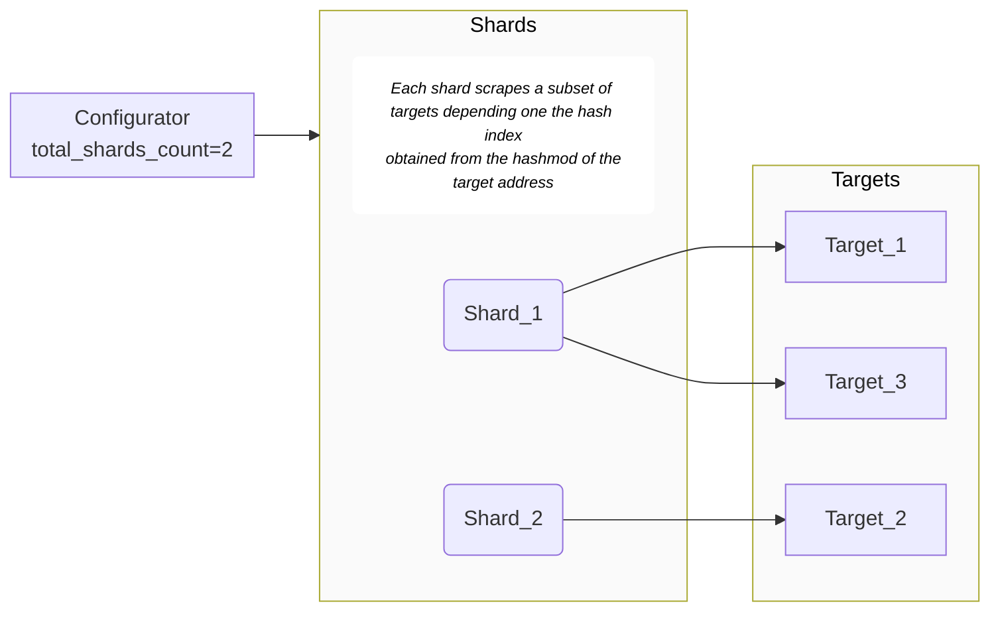

When clusters grow in size, there will be more data gathered by Prometheus, and at some point it will reach the limits of how much data the Prometheus agent can process. The most common failure mode is running out of memory due to the increased cardinality of the time series.
In this situation you can observe that your Prometheus instances start dying because they need more memory. This is an irrefutable sign that you need to face scaling.


<Callout variant="tip">
  The examples below goes in the `config` section for the agent. Refer to the [installation method](/docs/infrastructure/prometheus-integrations/install-configure-prometheus-agent/install-prometheus-agent) you used to known where you should place it.
</Callout>

In order to analyze the solution in detail, we provide a dashboard with different charts that will help us know when we have to scale our Prometheus solution.

There are two different scaling approaches for New Relic's Prometheus Agent:

- Vertical Scaling

- Horizontal Scaling

## Vertical Scaling

This kind of scaling comes without any complexity. It's as simple as updating the memory and/or the cpu for the corresponding machine where cluster the node is living.

However, this approach may not be scalable for huge clusters, or simply we just don't want to have a single pod that consumes so many GBs of memory in our node. If so, you may need to take at <b>Horizontal Scaling</b>.

## Horizontal Scaling (Sharding)

Horizontal Scaling is supported by setting up a configuration parameter which allows running several prometheus servers in agent mode to gather your data. This is known as Sharding.

If you define `sharding.total_shards_count` value, the deployed StatefulSet will include as many replicas as you defined there. When it is used, the _configurator_ component will automatically include some additional relabel rules so each target will only be scraped by one prometheus server. Those
rules rely on the target's address [hash-mod](https://prometheus.io/docs/prometheus/latest/configuration/configuration/#relabel_config).

Briefly, what the configurator does to set those relabel rules for each target is calculating a hash for the given target `__address__` and then it applies the `modulus` to the hash, being the modulus the total number of shards. Thus, it obtains into what shard the scrapped target should be included.

For example, if `custom-values.yaml` includes:

```yaml
# (...)
sharding:
  total_shards_count: 2
# (...)
```

And then, the release is upgraded:

```shell
helm upgrade my-prometheus-release newrelic-prometheus-configurator/newrelic-prometheus-agent -f custom-values.yaml
```

Then two prometheus servers will be executed and each target will only be scraped by only one of them.

An example diagram would be the following:



### Target scraper identification
The shard identification (name of the StatefulSet Pod) is added as a `prometheus_server` label to all metrics and could be used to understand which is the Prometheus instance that is scraping that target.
To uniquely identify a Prometheus server instance within an account a combination of `cluster_name` and `prometheus_server` labels should be used.

### Self metrics

Usually, prometheus server self-metrics should be gathered from all prometheus servers, so the additional rules when sharding is configured should not apply to the job gathering the prometheus self-metrics. This is possible because the _configurator_ accepts the flag `skip_sharding` in the static_target jobs. This parameter is already set up in the default self-metrics job.


### Limitations

If additional scrape jobs are included in configuration as `extra_scrape_configs`, as that field will hold the raw definition of prometheus jobs, the _configurator_ will not include the rules corresponding to sharding configuration and, as a result, the corresponding targets will be scrapped by all
prometheus servers.

Currently, auto-scaling is not supported. To increase or decrease the number of shards, you will need to an update of the chart settings. This will restart the prometheus pods.
