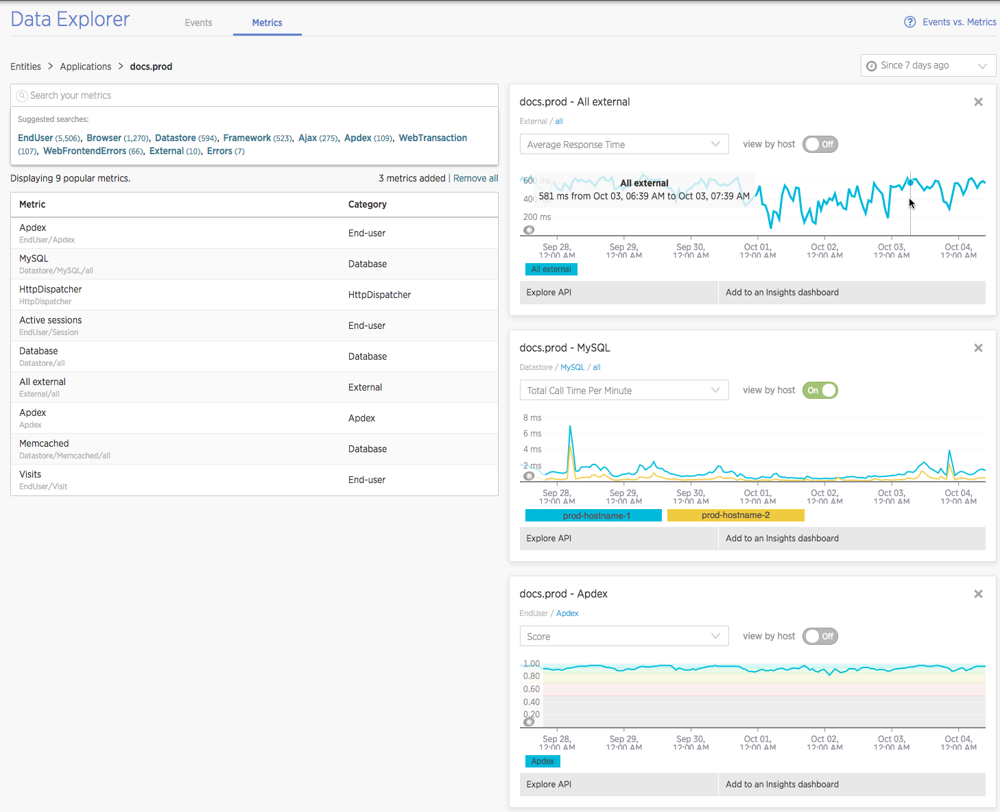

In [New Relic Insights](https://docs.newrelic.com/docs/insights/use-insights-ui/getting-started/introduction-new-relic-insights), the **Data explorer** UI page lets you explore the data available to you in Insights. There are two tabs available:

* Events
* Metrics

This document will explain details about using the **Metrics** tab. For information on the **Events** tab, see [Events data explorer](/docs/insights/use-insights-ui/explore-data/event-explorer-query-chart-your-event-data).

## Features

Use the Insights **Data explorer** for metrics to:

* Search and chart [metric timeslice data](/docs/using-new-relic/data/understand-data/new-relic-data-types#timeslice-data) reported by New Relic APM, Browser, and Mobile (including [custom metrics](/docs/agents/manage-apm-agents/agent-metrics/custom-metrics)).
* [Add metric charts](/docs/insights/new-relic-insights/managing-dashboards-data/add-edit-agent-metric-widgets) to Insights dashboards to monitor the data most interesting to you or another team in a centralized place, alongside any [NRQL](/docs/insights/new-relic-insights/using-new-relic-query-language/using-nrql)-based event charts.

<Callout variant="important">
  You can also [query metric timeslice using NRQL](/docs/query-data/nrql-new-relic-query-language/nrql-query-tutorials/query-metric-timeslice-data-nrql), which gives you more power and flexibility when querying this data.
</Callout>

**[insights.newrelic.com](https://insights.newrelic.com) > Data explorer > Metrics**: This shows using the data explorer to chart browser-side Apdex, MySQL call time per minute, and external service average response time.

Here are some examples of how to get the most out of the metric explorer:

<CollapserGroup>
  <Collapser
    id="add-to-db"
    title="Add to an Insights dashboard"
  >
    As you search for agent metrics and create charts in the metric explorer, add them to Insights dashboards to collect, organize, share, and see them alongside other Insights charts.

    This option is a [standard page function](/docs/data-analysis/user-interface-functions/view-your-data/standard-page-functions#add-to-dashboard) available for most metric charts in the New Relic UI.
  </Collapser>

  <Collapser
    id="explore-api"
    title="Explore API"
  >
    If you use the [New Relic REST API](/docs/apis/rest-api-v2), use the metric explorer to:

    1. Browse through your metric data.
    2. Search and find the exact metric and metric values you need.
    3. Review or sample the charted data.
    4. Load the [REST API Explorer](/docs/apis/rest-api-v2/api-explorer-v2/using-api-explorer) preset to the selected metric and time range by selecting **View in API Explorer**.
  </Collapser>

  <Collapser
    id="metric-widgets"
    title="Metric charts"
  >
    The metric explorer enables you to search and create customizable charts for any of your [New Relic metric data](/docs/insights/new-relic-insights/explore/metric-data-explorer-search-chart-metrics-sent-new-relic-agents). You can only chart one metric namespace per chart.

    [Customize](/docs/insights/new-relic-insights/managing-dashboards-data/add-customize-metric-widgets) your metric chart in the metric explorer for more precise views of your data.
  </Collapser>

  <Collapser
    id="search-metrics"
    title="Search metrics"
  >
    Find any metric quickly by selecting the relevant entities first, then search or browse the metric namespaces for the metric.

    Search results are ordered by relevance. The metric explorer also suggests entities and metrics that are commonly used or that have a lot of data you may want to browse and drill into. For example, the metric explorer displays the root namespaces for metrics (`Apdex`, `Datastore`, `EndUser`, `External`, etc.) to make it easier for users to traverse and find their metrics.

    You can use some basic regex tokens in your search string. For example:

    * Use `^` to start matching with the string that follows it.
    * Use `*`as a wildcard.

    Some New Relic functions, like creating metric alerts, require the exact metric name. For information on how to get a metric's exact name, see [Get exact metric name](/docs/insights/use-insights-ui/explore-data/metric-explorer-search-chart-metrics-sent-new-relic-agents#get-metric-name).
  </Collapser>

  <Collapser
    id="share"
    title="Share charts"
  >
    Metric explorer creates a permalink URL that displays the charts and data for the selected time range for the current page. Permalinks can be used to share data and charts with colleagues, New Relic support staff, or anyone who has access to your New Relic account.
  </Collapser>
</CollapserGroup>

## Workflow

To search and chart your New Relic agent metrics:

1. From **[insights.newrelic.com](https://insights.newrelic.com) > Data explorer > Metrics**, select the entity or application your metrics report under.
2. Browse the top metrics or search for a specific metric name.
3. View metric charts as you select them.
4. Configure the [chart options](/docs/insights/new-relic-insights/managing-dashboards-data/add-customize-metric-widgets#options).
5. Optional: To load the API Explorer (preset to the selected metric and time range), select **Explore API**.
6. To add individual charts to a dashboard, select **Add to dashboard**.
7. Give each chart a meaningful title to identify it on the target dashboard.

## Examples

<CollapserGroup>
  <Collapser
    id="custom-metric-example"
    title="Add custom metric charts to a dashboard"
  >
    Use case: The New Relic agent is not automatically capturing response time metric data for some part of your app's code, but you want to see and monitor its performance regularly.

    1. Instrument your code to record and send the custom metric to New Relic. For example, use an agent API call and a custom metric name like `Custom/MyMetric/My_label`.
    2. Once your code is running and sending data to New Relic, go to **[insights.newrelic.com](https://insights.newrelic.com) > Data explorer > Metrics**.
    3. From the metric explorer page, select the entity that your agent is reporting metrics under.
    4. Search for the custom metric name.

       <Callout variant="tip">
         Use the metric explorer's **Suggested Search** (automatically filled with `Custom`) to easily find your custom metrics.
       </Callout>
    5. Select the metric name to chart the metric data.
    6. Configure the chart, using available options for time window, chart values (Y-axis), facet by host (if available), etc.
    7. To organize this chart alongside similar charts or other NRQL charts, select **Add to an Insights dashboard**.
  </Collapser>

  <Collapser
    id="facet-host-example"
    title="Add metric chart for CPU usage faceted by host"
  >
    Use case: You want to see how CPU usage is impacting your different hosts for a given application.

    1. From **[insights.newrelic.com](https://insights.newrelic.com) > Data explorer > Metrics**, select the app.
    2. Search for `CPU`.
    3. From the search results, select `CPU/System/Utilization` to have the metric explorer automatically create a chart showing the percentage of CPU utilization on the app.
    4. Optional: To see a larger scope of metrics, add wildcards to the namespaces in front of `CPU`.
    5. To show the CPU percentage broken out by host on the new chart, select **View by host**.
    6. To organize this chart alongside similar charts or other NRQL charts, select **Add to an Insights dashboard**.
  </Collapser>

  <Collapser
    id="api-example"
    title="Search metrics to get relevant REST API call"
  >
    Use case: You want to feed metrics into an external system to track trends in performance over time outside of New Relic Insights or other New Relic products.

    1. From **[insights.newrelic.com](https://insights.newrelic.com) > Data explorer > Metrics**, select the entity (application or host).
    2. Search for and select a metric that you'd like to chart.
    3. To review the data preset to the selected metric and time range: From the new chart, select **View in API Explorer**.
  </Collapser>

  <Collapser
    id="get-metric-name"
    title="Get exact metric name to alert on it"
  >
    Use case: You want to find the exact metric name in order to alert on it with New Relic Alerts.

    To use the metric explorer to get the exact name for a metric:

    1. Go to **[insights.newrelic.com](https://insights.newrelic.com) > Data explorer > Metrics**.
    2. Search for and select a metric.
    3. Under the metric chart, select **View in API Explorer**.
    4. On the API Explorer page for that metric, copy the name in the **names\[]** field.
    5. From the selected policy's [conditions page](/docs/alerts/new-relic-alerts/configuring-alert-policies/define-alert-conditions#create-condition) under **Define thresholds**, select `Custom > Enter metric name` from the **When target application** dropdown and paste the metric name in the **Metric name** field.

    For more about finding metric names, including using the API to do so, see [Locate exact metric names](/docs/data-analysis/metrics/analyze-your-metrics/locate-exact-metric-names).
  </Collapser>
</CollapserGroup>

## Query metric timeslice data with NRQL [#query-with-nrql]

You can also [query metric timeslice using NRQL](/docs/query-data/nrql-new-relic-query-language/nrql-query-tutorials/query-metric-timeslice-data-nrql), which is a more powerful, flexible way to query than using Insights' metric explorer.
