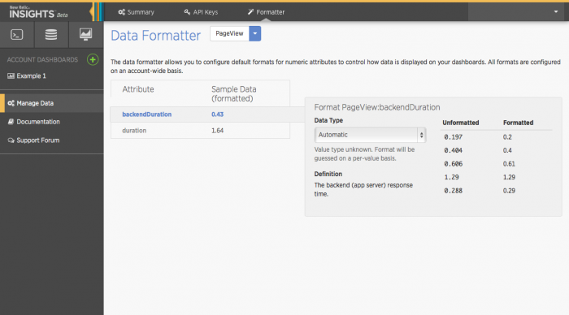

Use New Relic's data formatter to configure default formats for attributes with numeric values by specifying rounding, comma usage, the number of digits past the decimal point, etc. These settings affect how data appears in your New Relic Insights dashboards on an account-wide basis.

<Callout variant="tip">
  For more information, check out New Relic University’s tutorial [Using the Insights data formatter](https://newrelic.wistia.com/medias/ecfq497axe). Or, go directly to the full online course [Custom data with Insights](https://learn.newrelic.com/custom-data-with-insights).
</Callout>

## Format your numbers [#format]

**[insights.newrelic.com](https://insights.newrelic.com) > Manage data > Formatter**: Use the data formatter to control how data is displayed on your dashboards.

To access the data formatter: Go to **[insights.newrelic.com](https://insights.newrelic.com) > Manage data > Formatter**. Then, to format your numbers:

1. Select an event type.
2. Select an attribute from the list.
3. Select a [data type](#data-types).
4. Optional: Select additional formatting information for the attribute.

<Callout variant="caution">
  A quoted numeric string is a string, not a number. The data formatter does not support formatting strings.
</Callout>

## Data types

<Table>
  <thead>
    <tr>
      <th width={150}>
        **Data type**
      </th>

      <th>
        **Description**
      </th>
    </tr>
  </thead>

  <tbody>
    <tr>
      <td>
        Automatic
      </td>

      <td>
        New Relic Insights will attempt to select the format on a per-value basis.
      </td>
    </tr>

    <tr>
      <td>
        Duration
      </td>

      <td>
        The value represent a duration in relative units of time (for example, `less than 5 seconds`)
      </td>
    </tr>

    <tr>
      <td>
        Numeric
      </td>

      <td>
        The value represents numeric data. It can be formatted with commas, precision, etc. Commas will be added automatically as thousands separators.

        Selecting this option provides an additional dropdown to specify formatting options:

        * `humanize`: The data formatter will attempt to round fractional components to the significant digits, up to five decimal places. For example, 1.20003 would be rounded to 1.2.
        * `0 - 4`: Select 0 to 4 to specify the number of significant digits after the decimal point.
      </td>
    </tr>

    <tr>
      <td>
        Timestamp
      </td>

      <td>
        The value represents a time formatted as `seconds` or `milliseconds` since UNIX epoch.
      </td>
    </tr>

    <tr>
      <td>
        Unique ID
      </td>

      <td>
        The value represents a unique numeric ID that you do not want to be formatted.

        <Callout variant="tip">
          To avoid problems identifying numeric data as unique numeric IDs (such as commas separating thousands in the ID string), always set these manually. Or, to help identify that the value is not intended for computation, store it as a string instead of a number by wrapping it in quotes.
        </Callout>
      </td>
    </tr>
  </tbody>
</Table>

## For more help [#more_help]
