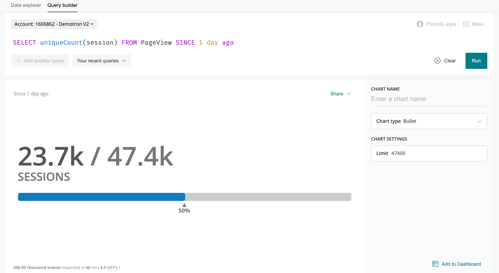
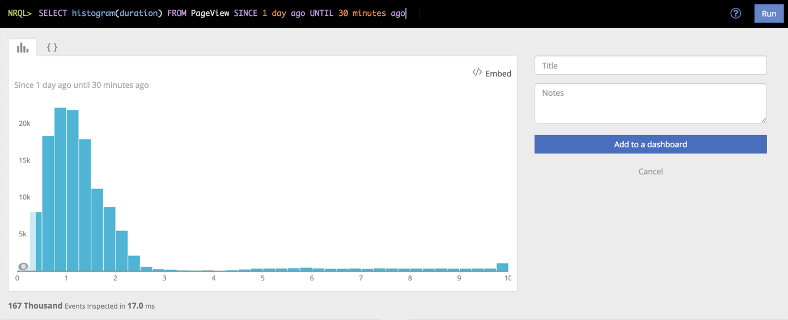
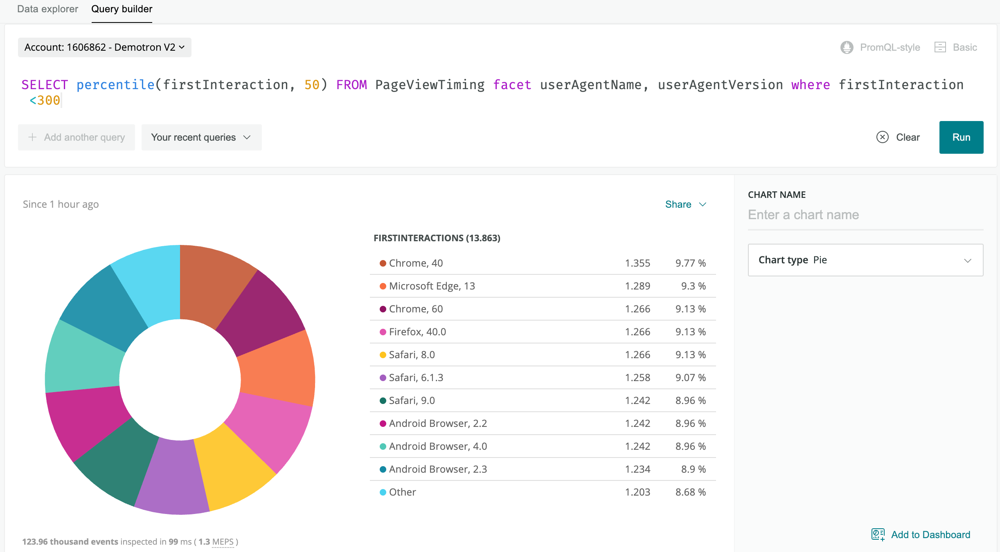
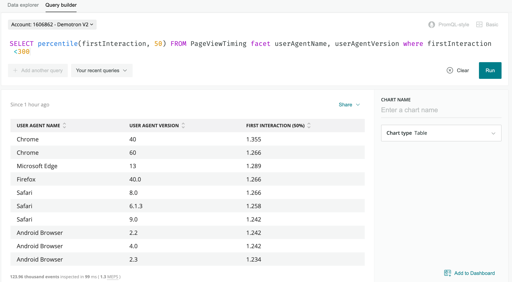

[New Relic One](/docs/new-relic-one/use-new-relic-one/get-started/introduction-new-relic-one) supports a variety of visualizations to present your data in whatever format works best for your needs. A chart's refresh rate is calculated based on the query's timeframe.

## Chart types for events [#widget-types]

When you browse your data in the [data explorer](/docs/query-your-data/explore-query-data/data-explorer/introduction-data-explorer), or use the **basic,** **advanced (NRQL)**, or **advanced PromQL-style** mode to [create a chart in the New Relic One query builder](/docs/specify-data-chart), the chart presents a selection of chart types appropriate for that query. Depending on the data specified in your query, some chart types may be grayed out and can't be chosen for a chart. A small table shows the availability status of a chart type for Insights and New Relic One.

<CollapserGroup>
  <Collapser
    className="freq-link"
    id="widget-areachart"
    title="Area chart"
  >
    <table>
      <tbody>
        <tr>
          <td
            style={{ textAlign: "right" }}
            width="5%"
          >
            <Icon
              style={{color: 'green'}}
              name="fe-check"
            />
          </td>

          <td width="20%">
            **Basic mode**
          </td>

          <td
            style={{ textAlign: "right" }}
            width="5%"
          >
            <Icon
              style={{color: 'green'}}
              name="fe-check"
            />
          </td>

          <td width="35%">
            **Advanced (NRQL) mode**
          </td>

          <td
            style={{ textAlign: "right" }}
            width="5%"
          >
            <Icon
              style={{color: 'green'}}
              name="fe-check"
            />
          </td>

          <td width="20%">
            **Insights**
          </td>
        </tr>
      </tbody>
    </table>

    An **area chart** shows a time series for a single attribute.

    

    The **area** chart type shows a time series for a single attribute.

    To enable an area chart, add a [`FACET`](/docs/insights/nrql-new-relic-query-language/nrql-reference/nrql-syntax-components-functions#sel-facet) to your query.

    <Callout variant="important">
      You can add only one facet in **basic** mode.
    </Callout>

    If you're using **advanced (NRQL)** mode you can use facet to add up to five attributes, separated by commas. Use the [`TIMESERIES`](/docs/insights/nrql-new-relic-query-language/nrql-reference/nrql-syntax-components-functions#sel-timeseries) function when you use a `FACET` in an NRQL query.

    <table>
      <tbody>
        <tr>
          <td>
            Use **Area chart** when you want to
          </td>

          <td>
            View the measurement of a single attribute over a period of time that you specify.
          </td>
        </tr>

        <tr>
          <td>
            Avoid **Area chart** when you want to
          </td>

          <td>
            View a chart that contains more than a single attribute. The [**line** chart type](#widget-linechart) is a good option; you can view multiple attributes over a time range that you specify. The [**bar** chart type](#widget-barchart) gives you a comparison view between the attributes; it uses a total of each attribute for the time range you choose.
          </td>
        </tr>
      </tbody>
    </table>
  </Collapser>

  <Collapser
    className="freq-link"
    id="widget-attr-sheet"
    title="Attribute sheet"
  >
    <table>
      <tbody>
        <tr>
          <td
            style={{ textAlign: "right" }}
            width="5%"
          >
            <Icon
              style={{color: 'red'}}
              name="fe-x"
            />
          </td>

          <td width="20%">
            **Basic mode**
          </td>

          <td
            style={{ textAlign: "right" }}
            width="5%"
          >
            <Icon
              style={{color: 'red'}}
              name="fe-x"
            />
          </td>

          <td width="35%">
            **Advanced (NRQL) mode**
          </td>

          <td
            style={{ textAlign: "right" }}
            width="5%"
          >
            <Icon
              style={{color: 'green'}}
              name="fe-check"
            />
          </td>

          <td width="20%">
            **Insights**
          </td>
        </tr>
      </tbody>
    </table>

    An **attribute sheet** is a list of values for a single set of selected attributes. It is similar to the [**table** chart type](#widget-table) but is an option only when you are not using a [`FACET`](/docs/insights/nrql-new-relic-query-language/nrql-reference/nrql-syntax-components-functions#sel-facet) clause.

    

    The **attribute sheet** shows the single value from the query results.

    <table>
      <tbody>
        <tr>
          <td>
            Use **attribute street** when you want to
          </td>

          <td>
            View a list of attributes for a set of single-value attributes.
          </td>
        </tr>

        <tr>
          <td>
            Avoid **attribute street** when you want to
          </td>

          <td>
            View data when you have used `FACET` function in your query. The **table** chart type is an option when your query uses `FACET` or when you have multiple values for each attribute.
          </td>
        </tr>
      </tbody>
    </table>
  </Collapser>

  <Collapser
    className="freq-link"
    id="widget-barchart"
    title="Bar chart"
  >
    <table>
      <tbody>
        <tr>
          <td
            style={{ textAlign: "right" }}
            width="5%"
          >
            <Icon
              style={{color: 'green'}}
              name="fe-check"
            />
          </td>

          <td width="20%">
            **Basic mode**
          </td>

          <td
            style={{ textAlign: "right" }}
            width="5%"
          >
            <Icon
              style={{color: 'green'}}
              name="fe-check"
            />
          </td>

          <td width="35%">
            **Advanced (NRQL) mode**
          </td>

          <td
            style={{ textAlign: "right" }}
            width="5%"
          >
            <Icon
              style={{color: 'green'}}
              name="fe-check"
            />
          </td>

          <td width="20%">
            **Insights**
          </td>
        </tr>
      </tbody>
    </table>

    The **bar chart** shows comparisons among the categories returned in the query results.

    

    The **bar chart** compares a related set of values.

    To enable a bar chart, add a [`FACET`](/docs/insights/nrql-new-relic-query-language/nrql-reference/nrql-syntax-components-functions#sel-facet) clause to the query.

    <Callout variant="important">
      You can add only one facet in **basic** mode.
    </Callout>

    You can use `FACET` with up to 5 different attributes, separated by commas.

    <table>
      <tbody>
        <tr>
          <td>
            Use **bar chart** when you want to
          </td>

          <td>
            Create a chart that reports the total count of the data for a category over the specified time range. With the bar chart format, you can easily see the differences between each category.
          </td>
        </tr>

        <tr>
          <td>
            Avoid **bar chart** when you want to
          </td>

          <td>
            Include measurements over a period of time. This chart type is not available when using a [TIMESERIES](https://docs.newrelic.com/docs/query-data/nrql-new-relic-query-language/getting-started/nrql-syntax-clauses-functions#sel-timeseries) clause. The [**line** chart type](#widget-linechart) is a good option for this visualization.
          </td>
        </tr>
      </tbody>
    </table>
  </Collapser>

  <Collapser
    className="freq-link"
    id="widget-billboard"
    title="Billboard"
  >
    <table>
      <tbody>
        <tr>
          <td
            style={{ textAlign: "right" }}
            width="5%"
          >
            <Icon
              style={{color: 'green'}}
              name="fe-check"
            />
          </td>

          <td width="20%">
            **Basic mode**
          </td>

          <td
            style={{ textAlign: "right" }}
            width="5%"
          >
            <Icon
              style={{color: 'green'}}
              name="fe-check"
            />
          </td>

          <td width="35%">
            **Advanced (NRQL) mode**
          </td>

          <td
            style={{ textAlign: "right" }}
            width="5%"
          >
            <Icon
              style={{color: 'green'}}
              name="fe-check"
            />
          </td>

          <td width="20%">
            **Insights**
          </td>
        </tr>
      </tbody>
    </table>

    The **billboard** chart type presents results as a single, highly-visible value. It's an option when your query returns a single number, such as from this query:

    ```
    SELECT uniqueCount(session) FROM PageView since 1 day ago
    ```

    A billboard chart is useful for single-stat queries like the [Apdex](/docs/apm/new-relic-apm/apdex/apdex-measure-user-satisfaction) function. Use **billboards** to monitor values at a glance.

    Billboards can also be used to compare a single value across states. For instance, use the [`COMPARE WITH`](/docs/insights/nrql-new-relic-query-language/nrql-reference/nrql-syntax-components-functions#sel-compare) clause to compare the same attribute across two different time frames.

    

    The **billboard** chart displays a single value in a large, easy to read font.

    To enable the data for a billboard chart, search for a single value. You can view multiple values by adding a facet from the dropdown.

    You can set **Warning** and **Critical** thresholds on billboards, which will highlight a chart in yellow or red. The threshold fields are on the right side of the chart edit pane, highlighted in yellow and red respectively.

    If you want to highlight a chart when a value falls below a given value rather than above it, set the **Warning** threshold higher than the **Critical** threshold.

    <Callout variant="tip">
      Threshold fields will only be available for dashboards that present a single value. For instance, the use of a `COMPARE WITH` clause will disable the threshold settings in the edit pane.
    </Callout>

    <table>
      <tbody>
        <tr>
          <td>
            Use **billboard** when you want to
          </td>

          <td>
            Monitor values, including thresholds for **Critical** and **Warning** states, in a large, easy-to-read font.
          </td>
        </tr>

        <tr>
          <td>
            Avoid **billboard** chart type when
          </td>

          <td>
            You want to view data over a period of time. The [**line** chart type](#widget-linechart) is a better option for viewing data by time.
          </td>
        </tr>
      </tbody>
    </table>

    <Callout variant="tip">
      For more information, check out New Relic University's tutorial: [Editing billboard and gauge charts on Insights dashboards](https://newrelic.wistia.com/medias/9r5yabsoh9). Or, go directly to the full online course: [Dashboards and data apps](https://learn.newrelic.com/dashboards-and-data-apps).
    </Callout>
  </Collapser>

  <Collapser
    className="freq-link"
    id="bullet-chart"
    title="Bullet chart"
  >
    <table>
      <tbody>
        <tr>
          <td
            style={{ textAlign: "right" }}
            width="5%"
          >
            <Icon
              style={{color: 'green'}}
              name="fe-check"
            />
          </td>

          <td width="20%">
            **Basic mode**
          </td>

          <td
            style={{ textAlign: "right" }}
            width="5%"
          >
            <Icon
              style={{color: 'green'}}
              name="fe-check"
            />
          </td>

          <td width="35%">
            **Advanced (NRQL) mode**
          </td>

          <td
            style={{ textAlign: "right" }}
            width="5%"
          >
            <Icon
              style={{color: 'red'}}
              name="fe-x"
            />
          </td>

          <td width="20%">
            **Insights**
          </td>
        </tr>
      </tbody>
    </table>

    Use the **bullet** chart type to represent progress to a target or goal, called the limit. To use this chart type, run a query that returns a single number, such as:

    ```
    SELECT uniqueCount(session) FROM PageView SINCE 1 day ago
    ```

    

    The **bullet chart** displays a value compared against a limit.

    **Bullet** defaults to a limit that is twice the resulting query value. To adjust the limit, use the **Limit** field to enter another number. The bullet will adjust accordingly.

    <Callout variant="tip">
      The **bullet** chart type can only be used for charts that present a single value. For example, a query using [`COMPARE WITH`](/docs/insights/nrql-new-relic-query-language/nrql-reference/nrql-syntax-components-functions#sel-compare) will not list bullet as an option.
    </Callout>

    <table>
      <tbody>
        <tr>
          <td>
            Use **bullet** when you want to
          </td>

          <td>
            View a chart uses a large, easy-to-read font that helps you view the value quickly.
          </td>
        </tr>

        <tr>
          <td>
            Avoid **bullet** when you want to
          </td>

          <td>
            View data that has more than a single value. Bar and line chart types may be better choices in this instance.  
            The bullet chart type is not supported in Insights; use the [**gauge** chart type](#widget-gauge) instead.
          </td>
        </tr>
      </tbody>
    </table>
  </Collapser>

  <Collapser
    className="freq-link"
    id="chart-type-event"
    title="Event"
  >
    <table>
      <tbody>
        <tr>
          <td
            style={{ textAlign: "right" }}
            width="5%"
          >
            **`[check icon]`**
          </td>

          <td width="20%">
            **Basic mode**
          </td>

          <td
            style={{ textAlign: "right" }}
            width="5%"
          >
            **`[check icon]`**
          </td>

          <td width="35%">
            **Advanced (NRQL) mode**
          </td>

          <td
            style={{ textAlign: "right" }}
            width="5%"
          >
            **<Icon style={{color: 'green'}} name="fe-check"/>**
          </td>

          <td width="20%">
            **Insights**
          </td>
        </tr>
      </tbody>
    </table>

    \*\*

    

    \*\*

    The **event** chart type lists the data in a text format.

    <table>
      <tbody>
        <tr>
          <td>
            Use **event** when you want to
          </td>

          <td>
            Create a text file that contains the attribute name and its value. The file can be shared and the content easily embedded into a report or spreadsheet, for example.
          </td>
        </tr>

        <tr>
          <td>
            Avoid **event** when you want to
          </td>

          <td>
            Present the data in a graphic, which can be helpful when monitoring the event on a dashboard. The **[billboard](#widget-billboard)** chart type is a good option for single-value data visualization.
          </td>
        </tr>
      </tbody>
    </table>
  </Collapser>

  <Collapser
    className="freq-link"
    id="funnel"
    title="Funnel"
  >
    <table>
      <tbody>
        <tr>
          <td
            style={{ textAlign: "right" }}
            width="5%"
          >
            \*\*\*\*<Icon style={{color: 'red'}} name="fe-x"/>

            * * *
          </td>

          <td width="20%">
            **Basic mode**
          </td>

          <td
            style={{ textAlign: "right" }}
            width="5%"
          >
            \*\*\*\*<Icon style={{color: 'green'}} name="fe-check"/>

            * * *
          </td>

          <td width="35%">
            **Advanced (NRQL) mode**
          </td>

          <td
            style={{ textAlign: "right" }}
            width="5%"
          >
            \*\*\*\*<Icon style={{color: 'green'}} name="fe-check"/>

            * * *
          </td>

          <td width="20%">
            **Insights**
          </td>
        </tr>
      </tbody>
    </table>

    Use [funnels](/docs/insights/nrql-new-relic-query-language/nrql-query-examples/funnels-evaluate-data-series-events) to evaluate a series of related events that are the steps toward a specified goal. A funnel allows you to ask, “Of the people that did (A), how many also did (B), and of the people that did (A) and (B), how many also completed (C)?”

    

    Sample **funnel** chart for a shopping site.

    In this example, you want to determine that of all the visitors that viewed the landing page, how many of them:

    * Browsed the products.
    * Then added one or more products to a shopping cart.
    * And finally, purchased the item(s) in the shopping cart.

    Unlike other queries, you must use a [`SELECT`](https://docs.newrelic.com/docs/insights/nrql-new-relic-query-language/nrql-reference/nrql-syntax-components-functions#state-select) [`funnel()`](/docs/insights/nrql-new-relic-query-language/nrql-reference/nrql-syntax-components-functions#func-funnel) statement in your query; the funnel chart type is not selectable from any other type of query.

    Additionally, the funnel chart type is only available for queries with eight steps or fewer. A funnel query that includes more than eight steps will only return the results as JSON.

    ```
    SELECT funnel(session,
        WHERE pageUrl like '%/index.html' AS 'Landing',
        WHERE pageUrl LIKE '%/browse/phones' AS 'Browse ',
        WHERE pageUrl LIKE '%/shoppingcart' AS 'Cart',
        WHERE pageUrl LIKE '%/checkout' AS 'Purchased')
        FROM PageView where appName = 'WebPortal' AND duration < 1
        SINCE 1 week ago
    ```

    <table>
      <tbody>
        <tr>
          <td>
            Use **funnel** when you want to
          </td>

          <td>
            You want to visually evaluate the paths that visitors take after they hit a page that you designate as a landing page.
          </td>
        </tr>

        <tr>
          <td>
            Avoid **funnel** when you want to
          </td>

          <td>
            You only want counts for the attributes in the [`WHERE`](/docs/insights/nrql-new-relic-query-language/nrql-reference/nrql-syntax-components-functions#where-operator) clause. You will not be able to choose funnel unless you use `SELECT funnel` in your query.
          </td>
        </tr>
      </tbody>
    </table>
  </Collapser>

  <Collapser
    className="freq-link"
    id="widget-gauge"
    title="Gauge"
  >
    <table>
      <tbody>
        <tr>
          <td
            style={{ textAlign: "right" }}
            width="5%"
          >
            <Icon
              style={{color: 'red'}}
              name="fe-x"
            />
          </td>

          <td width="20%">
            **Basic mode**
          </td>

          <td
            style={{ textAlign: "right" }}
            width="5%"
          >
            <Icon
              style={{color: 'red'}}
              name="fe-x"
            />
          </td>

          <td width="35%">
            **Advanced (NRQL) mode**
          </td>

          <td
            style={{ textAlign: "right" }}
            width="5%"
          >
            <Icon
              style={{color: 'green'}}
              name="fe-check"
            />
          </td>

          <td width="20%">
            **Insights**
          </td>
        </tr>
      </tbody>
    </table>

    Use the gauge chart type to represent progress to a target or goal, called the **limit**. To use this chart type, run a query that returns a single number, such as

    ```
    SELECT count(*) FROM PageView SINCE 1 hour ago
    ```

    

    The **gauge** chart type displays a single value compared against a limit.

    The gauge defaults to a limit that is twice the resulting query value. To adjust the limit, select in the Limit field and enter another number; the gauge will adjust accordingly.

    When the value returned by the query exceeds the limit value, the gauge shows the limit value in blue, and the overage in purple.

    <table>
      <tbody>
        <tr>
          <td>
            Use **gauge** when you want to
          </td>

          <td>
            View a large and easy-to-read comparison a value compared against a limit that you set.
          </td>
        </tr>

        <tr>
          <td>
            Avoid **gauge** when you want to
          </td>

          <td>
            Create a query that uses [`COMPARE WITH`](http://docs.newrelic.com/docs/insights/nrql-new-relic-query-language/nrql-reference/nrql-syntax-components-functions#sel-compare), as gauge will not be listed as an option.  
            Gauge is not supported in New Relic One; use the bullet chart type instead.
          </td>
        </tr>
      </tbody>
    </table>

    <Callout variant="tip">
      For more information, check out New Relic University's tutorial: [Editing billboard and gauge charts on Insights dashboards](https://newrelic.wistia.com/medias/9r5yabsoh9). Or, go directly to the full online course: [Dashboards and data apps](https://learn.newrelic.com/dashboards-and-data-apps).
    </Callout>
  </Collapser>

  <Collapser
    className="freq-link"
    id="widget-heatmap"
    title="Heat map"
  >
    <table>
      <tbody>
        <tr>
          <td
            style={{ textAlign: "right" }}
            width="5%"
          >
            <Icon
              style={{color: 'red'}}
              name="fe-x"
            />
          </td>

          <td width="20%">
            **Basic mode**
          </td>

          <td
            style={{ textAlign: "right" }}
            width="5%"
          >
            <Icon
              style={{color: 'green'}}
              name="fe-check"
            />
          </td>

          <td width="35%">
            **Advanced (NRQL) mode>**
          </td>

          <td
            style={{ textAlign: "right" }}
            width="5%"
          >
            <Icon
              style={{color: 'green'}}
              name="fe-check"
            />
          </td>

          <td width="20%">
            ****\*\*****Insights****\*\*****
          </td>
        </tr>
      </tbody>
    </table>

    The heat map displays data in a tabular format using color gradations to show frequency in specific time buckets.

    

    The **heat map** is a faceted distribution of values where color density represents the values displayed.

    To enable a heat map, use the [`Histogram()`](/docs/insights/nrql-new-relic-query-language/nrql-reference/nrql-syntax-components-functions#func-histogram) function with a numeric attribute and use [`FACET`](/docs/insights/nrql-new-relic-query-language/nrql-reference/nrql-syntax-components-functions#sel-facet) to add up to five attributes, separated by commas.

    See [Histograms: View data distribution](/docs/using-new-relic/user-interface-functions/view-your-data/histograms-view-data-distribution) for more detailed information about histogram-based charts.

    <table style={{ fontSize: "12pt" }}>
      <tbody>
        <tr>
          <td>
            Use **heat map** when you want to
          </td>

          <td>
            View tabular data for multiple attributes over a period of time, with gradated colors instead of numerals.
          </td>
        </tr>

        <tr>
          <td>
            Avoid **heat map** when you want to
          </td>

          <td>
            View the exact data for multiple attributes over a period of time. A line or bar chart may be an option.
          </td>
        </tr>
      </tbody>
    </table>
  </Collapser>

  <Collapser
    className="freq-link"
    id="widget-histogram"
    title="Histogram"
  >
    <table>
      <tbody>
        <tr>
          <td
            style={{ textAlign: "right" }}
            width="5%"
          >
            **<Icon style={{color: 'red'}} name="fe-x"/>**
          </td>

          <td width="20%">
            **Basic mode**
          </td>

          <td
            style={{ textAlign: "right" }}
            width="5%"
          >
            **<Icon style={{color: 'green'}} name="fe-check"/>**
          </td>

          <td width="35%">
            \***\*Advanced (NRQL) mode\*\***
          </td>

          <td
            style={{ textAlign: "right" }}
            width="5%"
          >
            **<Icon style={{color: 'green'}} name="fe-check"/>**
          </td>

          <td width="20%">
            \***\*Insights\*\***
          </td>
        </tr>
      </tbody>
    </table>

    \*\*

    

    \*\*

    A **histogram** charts frequency across a series of value ranges.

    Use **histograms** to show the distribution of data across time buckets. See [Histograms: View data distribution](/docs/using-new-relic/user-interface-functions/view-your-data/histograms-view-data-distribution) for more detailed information about histogram-based charts.

    <table>
      <tbody>
        <tr>
          <td>
            Use **histogram** when you want to
          </td>

          <td>
            Chart frequency of data over a series of values.
          </td>
        </tr>

        <tr>
          <td>
            Avoid **histogram** when you want to
          </td>

          <td>
            View the same data as [heat](#widget-heatmap) [map](#widget-heatmap) or to view the data without the time buckets.
          </td>
        </tr>
      </tbody>
    </table>
  </Collapser>

  <Collapser
    className="freq-link"
    id="widget-json"
    title="JSON"
  >
    <table>
      <tbody>
        <tr>
          <td
            style={{ textAlign: "right" }}
            width="5%"
          >
            **<Icon style={{color: 'green'}} name="fe-check"/>**
          </td>

          <td width="20%">
            \***\*Basic mode\*\***
          </td>

          <td
            style={{ textAlign: "right" }}
            width="5%"
          >
            **<Icon style={{color: 'green'}} name="fe-check"/>**
          </td>

          <td width="35%">
            **Advanced (NRQL) mode**
          </td>

          <td
            style={{ textAlign: "right" }}
            width="5%"
          >
            **<Icon style={{color: 'green'}} name="fe-check"/>**
          </td>

          <td width="20%">
            **Insights**
          </td>
        </tr>
      </tbody>
    </table>

    Use the returned **JSON** to review the raw data returned and to help develop integrations with New Relic. To implement integrations, use [remote queries](/docs/insights/new-relic-insights/adding-querying-data/querying-your-data-remotely) to return raw JSON as a service.

    <Callout variant="tip">
      If you are using Insights, copy the JSON using the **Copy JSON** button. If you are using New Relic One query builder, use the Share menu to select **Copy JSON**.
    </Callout>

    Example NRQL query:

    ```
    SELECT uniqueCount(name) FROM Transaction
       WHERE httpResponseCode = '200'
       TIMESERIES
       FACET appName
       LIMIT 10
       SINCE 24 hours ago
    ```

    Example JSOON response:

    ```
    {
      "metadata": {
        "contents": {
          "messages": [],
          "timeSeries": {
            "messages": [],
            "contents": [
              {
                "function": "uniquecount",
                "attribute": "name",
                "simple": true
              }
            ]
          },
          "bucketSizeMillis": 1800000
        },
        "eventTypes": [
          "Transaction"
        ],
        "eventType": "Transaction",
        "openEnded": true,
        "messages": [],
        "beginTimeMillis": 1556226069396,
        "endTimeMillis": 1556312469396,
        "beginTime": "2019-04-25T21:01:09Z",
        "endTime": "2019-04-26T21:01:09Z",
        "guid": "5238a2c6-328d-a5ff-9185-7f3f04c42d1e",
        "routerGuid": "1aea2ec5-0be8-3a60-7554-851e1b016eb0",
        "rawSince": "24 HOURS AGO",
        "rawUntil": "NOW",
        "rawCompareWith": "",
        "facet": "appName",
        "offset": 0,
        "limit": 10
      },
      "facets": [
        {
          "name": "RPM Combined Production",
          "beginTimeSeconds": 0,
          "endTimeSeconds": 0,
          "timeSeries": [
            {
              "results": [
                {
                  "uniqueCount": 415
                }
              ],
              "beginTimeSeconds": 1556226069,
              "endTimeSeconds": 1556227869,
              "inspectedCount": 4589471
            },
            [
              {
                "uniqueCount": 1714
              }
            ],
            "beginTimeSeconds": 1556310669,
            "endTimeSeconds": 1556312469,
            "inspectedCount": 53341469
          }
        ],
        "total": {
          "results": [
            {
              "uniqueCount": 2651
            }
          ],
          "beginTimeSeconds": 0,
          "endTimeSeconds": 0,
          "inspectedCount": 5053841114
        }
      },
      "performanceStats": {
        "inspectedCount": 6088068932,
        "responseTime": 8077
      }
    }

    ...
    ```
  </Collapser>

  <Collapser
    className="freq-link"
    id="widget-linechart"
    title="Line"
  >
    <table>
      <tbody>
        <tr>
          <td
            style={{ textAlign: "right" }}
            width="5%"
          >
            **<Icon style={{color: 'green'}} name="fe-check"/>**
          </td>

          <td width="20%">
            **Basic mode**
          </td>

          <td
            style={{ textAlign: "right" }}
            width="5%"
          >
            **<Icon style={{color: 'green'}} name="fe-check"/>**
          </td>

          <td width="35%">
            **Advanced (NRQL) mode**
          </td>

          <td
            style={{ textAlign: "right" }}
            width="5%"
          >
            **><Icon style={{color: 'green'}} name="fe-check"/>**
          </td>

          <td width="20%">
            **Insights**
          </td>
        </tr>
      </tbody>
    </table>

    A line chart is useful for spotting trends over time.

    

    The **line chart** chart type plots a timeseries for an attribute.

    When working in **basic mode** in New Relic One, select a single attribute you can plot over time.

    When working with an NRQL query, either in **Insights** or **advanced (NRQL) mode** in New Relic One, [`SELECT`](http://docs.newrelic.com/docs/insights/nrql-new-relic-query-language/nrql-reference/nrql-syntax-components-functions#state-select) one or more attributes you can plot over time and then use the [`TIMESERIES`](/docs/insights/nrql-new-relic-query-language/nrql-reference/nrql-syntax-components-functions#sel-timeseries) function.

    <table>
      <tbody>
        <tr>
          <td>
            Use **line** chart when you want to
          </td>

          <td>
            Create a chart that lets you easily view trends over a specified time frame.
          </td>
        </tr>

        <tr>
          <td>
            Avoid **line** chart when you want to
          </td>

          <td>
            View your data using one or more attributes and see the values associated with each attribute. A bar or table chart is an option.
          </td>
        </tr>
      </tbody>
    </table>
  </Collapser>

  <Collapser
    className="freq-link"
    id="widget-uniques"
    title="List"
  >
    <table>
      <tbody>
        <tr>
          <td
            style={{ textAlign: "right" }}
            width="5%"
          >
            **<Icon style={{color: 'red'}} name="fe-x"/>**
          </td>

          <td width="20%">
            **Basic mode**
          </td>

          <td
            style={{ textAlign: "right" }}
            width="5%"
          >
            **<Icon style={{color: 'red'}} name="fe-x"/>**
          </td>

          <td width="35%">
            **Advanced (NRQL) mode**&lt;
          </td>

          <td
            style={{ textAlign: "right" }}
            width="5%"
          >
            **<Icon style={{color: 'green'}} name="fe-check"/>**
          </td>

          <td width="20%">
            **Insights**
          </td>
        </tr>
      </tbody>
    </table>

    The list chart type lists unique values for a given attribute. It is an option when the [`uniques( )`](/docs/insights/nrql-new-relic-query-language/nrql-reference/nrql-syntax-components-functions#func-uniques) function is used in the select method.

    ****

    The **list chart** type shows the set of unique values for a given attribute.

    <table>
      <tbody>
        <tr>
          <td>
            Use **list** when you want to
          </td>

          <td>
            Create a list of the value associated with each attribute. This list can be shared and easily added to reports and spreadsheets, for example.
          </td>
        </tr>

        <tr>
          <td>
            Avoid **list** when you want to
          </td>

          <td>
            When the data you want to view has multiple values for each attribute. The [**event** chart type](#chart-type-event) may be an option for New Relic One users.
          </td>
        </tr>
      </tbody>
    </table>
  </Collapser>

  <Collapser
    className="freq-link"
    id="widget-piechart"
    title="Pie chart"
  >
    <table>
      <tbody>
        <tr>
          <td
            style={{ textAlign: "right" }}
            width="5%"
          >
            **<Icon style={{color: 'green'}} name="fe-check"/>**
          </td>

          <td width="20%">
            **Basic mode**
          </td>

          <td
            style={{ textAlign: "right" }}
            width="5%"
          >
            **<Icon style={{color: 'green'}} name="fe-check"/>**
          </td>

          <td width="35%">
            **Advanced (NRQL) mode**
          </td>

          <td
            style={{ textAlign: "right" }}
            width="5%"
          >
            **<Icon style={{color: 'green'}} name="fe-check"/>**
          </td>

          <td width="20%">
            **Insights**
          </td>
        </tr>
      </tbody>
    </table>

    A **pie chart** is the graphic representation of the table. It appears as an option for some functions when the [`FACET`](/docs/insights/nrql-new-relic-query-language/nrql-reference/nrql-syntax-components-functions#sel-facets) clause is used. To use this chart type, run a query that returns one value for each of a set of attributes.

    

    The **pie chart** chart type maps a set of values as a portion of a whole.

    To enable pie chart, add a [`FACET`](http://docs.newrelic.com/docs/insights/nrql-new-relic-query-language/nrql-reference/nrql-syntax-components-functions#sel-facet) from the dropdown.

    <Callout variant="important">
      You can add only one `FACET` in basic mode.
    </Callout>

    If you're using **Insights** or **advanced (NRQL)** mode you can use `FACET` to add up to 5 attributes, separated by commas, and also the [`TIMESERIES`](/docs/insights/nrql-new-relic-query-language/nrql-reference/nrql-syntax-components-functions#sel-timeseries) function.

    <Callout variant="tip">
      **Pie charts** are unavailable for the following [aggregator functions](/docs/insights/new-relic-insights/using-new-relic-query-language/nrql-reference#functions): `average`, `apdex`, `min`, `max`, `percentage`, and `percentile`. For `uniqueCount`, percentages [may add up to more than 100%.](/docs/insights/nrql-new-relic-query-language/troubleshooting/pie-chart-uniquecount-adds-more-100)
    </Callout>

    <table>
      <tbody>
        <tr>
          <td>
            Use **pie chart** when you want to
          </td>

          <td>
            Create a chart that that graphically presents a set of values as they relate to a whole. A pie chart is effective for displaying values for a time period, for example.
          </td>
        </tr>

        <tr>
          <td>
            Avoid **pie chart** when you want to
          </td>

          <td>
            Present data that does not use values as they related to a whole, such as with line **charts.**
          </td>
        </tr>
      </tbody>
    </table>
  </Collapser>

  <Collapser
    className="freq-link"
    id="widget-table"
    title="Table"
  >
    <table>
      <tbody>
        <tr>
          <td
            style={{ textAlign: "right" }}
            width="5%"
          >
            **<Icon style={{color: 'green'}} name="fe-check"/>**
          </td>

          <td width="20%">
            **Basic mode**&lt;
          </td>

          <td
            style={{ textAlign: "right" }}
            width="5%"
          >
            **<Icon style={{color: 'green'}} name="fe-check"/>**
          </td>

          <td width="35%">
            **Advanced (NRQL) mode**
          </td>

          <td
            style={{ textAlign: "right" }}
            width="5%"
          >
            **<Icon style={{color: 'green'}} name="fe-check"/>**
          </td>

          <td width="20%">
            **Insights**
          </td>
        </tr>
      </tbody>
    </table>

    A **table** is the standard view for a set of values related to a specific attribute (for example, the count of all page views by user agent name). By default, all tables are sortable by any one column.

    If you are using the [`FACET`](/docs/insights/nrql-new-relic-query-language/nrql-reference/nrql-syntax-components-functions#sel-facet) clause, the results will normally be returned as a table.

    You can use a table as a shortcut to other dashboards. If a table is faceted by attribute, selecting an entry will take you to an existing dashboard that is [filtered by that attribute](/docs/insights/new-relic-insights/managing-dashboards-data/filtering-dashboards#filter-add). If you have multiple dashboards filtered by that attribute, Insights selects the first one created.

    

    The **table** chart type, with its tabular format, works well for dashboards, as well as sharing the data for use in reports, for example

    <table>
      <tbody>
        <tr>
          <td>
            Use **table** when you want to
          </td>

          <td>
            Create a text-compatible table consisting of your data. This table can be shared and used in reports or imported into spreadsheets, for example.
          </td>
        </tr>

        <tr>
          <td>
            Avoid **table** when you want to
          </td>

          <td>
            View your data in a graphical format.
          </td>
        </tr>
      </tbody>
    </table>
  </Collapser>
</CollapserGroup>

## Chart types for metric data [#metric-widget-types]

Metric chart are unique from other event-based charts. You can view aggregated metric data reported to New Relic from your agent. To [add and customize metric charts](/docs/insights/new-relic-insights/managing-dashboards-data/add-customize-metric-widgets) on your Insights dashboard, use the [Metric Explorer](/docs/insights/new-relic-insights/explore/metric-data-explorer-search-chart-metrics-sent-new-relic-agents).

The metric explorer is not yet supported in New Relic One. However, once you have added a metric chart to dashboard, you can use the query builder in **advanced (NRQL) mode** to edit the query.

Follow these steps to use advanced (NRQL) mode in New Relic One:

1. Go to [one.newrelic.com](http://one.newrelic.com) in your browser's address bar.
2. Click the query data icon.
3. If the query builder opens in **basic** mode, click **Advanced (NRQL)** in the top right corner of the basic mode container.
4. Use the **My recent queries** dropdown in advanced (NRQL) mode to select the query associated with the metric chart on the Insights dashboard.

<Callout variant="tip">
  When you open the query builder, you will see the last query mode you used, either basic mode or advanced (NRQL) mode.
</Callout>

<Callout variant="important">
  The **My recent queries** dropdown in advanced (NRQL) mode will display all of your New Relic queries, for both Insights and New Relic One, for both basic and advanced (NRQL) modes.
</Callout>
