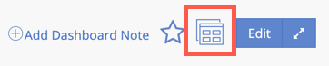

Copy any viewable or editable dashboards in your account to quickly set up a similar dashboard without copying charts individually.

## Copy dashboard

To copy a dashboard:

1. From the selected dashboard, select the copy dashboard  icon:

   
2. Optional: Give the dashboard a title.
3. Select **Copy**.
4. Edit the dashboard as needed.

## Copy chart to another dashboard [#copy-chart]

To copy a chart to another dashboard:

1. From the chart's menu <Icon name="fe-more-horizontal"/>
   , select **Copy chart**.
2. Search and select the target dashboard.
3. Select **Copy**.

## Copy chart to another account's dashboard

If your company uses multiple New Relic accounts, you can also [copy charts to another account's dashboard](/docs/insights/use-insights-ui/manage-dashboards/copy-chart-another-insights-accounts-dashboard).
