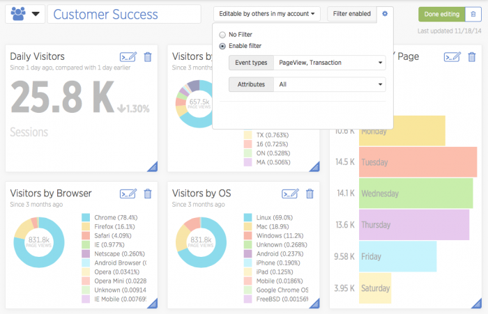
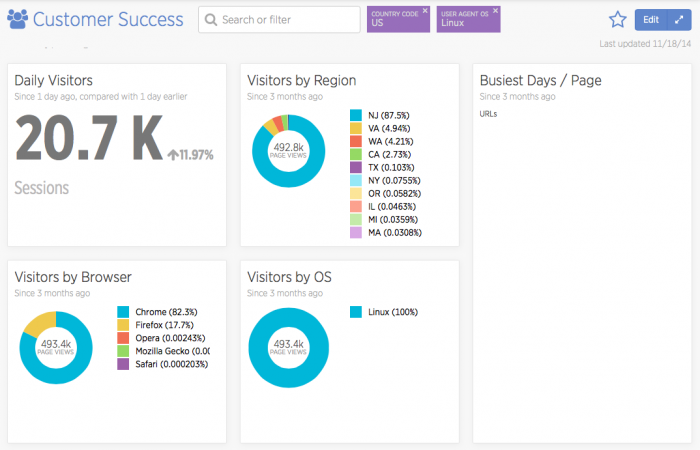

With New Relic Insights, you can filter dashboard data on one or more [attributes](/docs/insights/new-relic-insights/decorating-events/insights-attributes) to drill down into and to gain multiple perspectives on your data.

## Add a filter [#filter-add]

You can add a filter when creating a new dashboard or editing an existing dashboard:

1. On the dashboard, select **Edit**.
2. Select **Filter disabled** or the blue gear icon.
3. Select **Enable filter**.
4. Select one or more [Event types](/docs/insights/new-relic-insights/understanding-insights/new-relic-insights#database) from the **Event type** dropdown.
5. To restrict filtering to specific attributes, select one or more [attributes](/docs/insights/new-relic-insights/decorating-events/insights-attributes) from the **Select attribute** dropdown.
6. Select **Filter enabled** or blue gear icon again to close the filter menu.
7. To save your changes to the dashboard, select **Done editing**.

****

**[insights.newrelic.com](https://insights.newrelic.com) > (selected dashboard) > Edit:** Enable filtering on a dashboard to make it easier to drill down to important facets of the data.

## Apply a filter [#filter-use]

<Callout variant="tip">
  Filtering does not apply to any [agent metric widgets](/docs/insights/use-insights-ui/manage-dashboards/add-customize-metric-widgets) on the dashboard.
</Callout>

Insights groups existing dashboards on the dropdown list by attribute. To apply a filter:

1. Inside the **Search or Filter** text box, begin typing, or select from a dropdown of possible values.

   OR

   Use a `LIKE` query: Select the **contains** option that is the first selectable option for each attribute in the list.
2. Repeat to add additional filters as an active filter next to the **Search or Filter** text box.
3. If the dashboard does not auto-refresh when adding a filter, press **enter** or **return**.

To remove a filter setting, select the **X** for the active filter.

## Filter on multiple event types [#multiple]

If your dashboard reports on multiple event types, some widgets may show no results when filtering. This may occur because:

* The attribute being filtered on is not part of the event type for that widget.
* The widget is for metric data. You cannot filter on [metric widgets](/docs/insights/new-relic-insights/managing-dashboards-data/add-customize-metric-widgets).

If you have more than one attribute enabled for filtering, apply multiple filters to further refine your view.

**[insights.newrelic.com](https://insights.newrelic.com) > (selected dashboard) > Edit > Filter:** Here is an example of multiple filters. Both attributes being filtered against are from **PageView**, but the **Busiest Days** widget is reporting on **Transactions**.

## Disable the filter [#filter-delete]

To disable the Insights dashboard's filter:

1. On the dashboard containing the filter you want to delete, select **Edit**.
2. Select **Filter enabled** or blue gear icon.
3. Select **No filter**.
4. Select **Filter disabled** or blue gear icon again to close the filter menu.
5. To save your changes to the dashboard, select **Done editing**.

## Filter incompatibilities [#incompatibilities]

Dashboard filters are not applied to:

* [metric charts](/docs/insights/use-insights-ui/manage-dashboards/add-customize-metric-widgets)
* [cross-account charts](/docs/insights/use-insights-ui/manage-dashboards/copy-chart-another-insights-accounts-dashboard) if the attribute that is filtered on isn't present in the chart's source data
* [data exported via CSV](/docs/insights/use-insights-ui/export-data/export-insights-data-csv-file): the raw query will need to be updated with the selected filter
