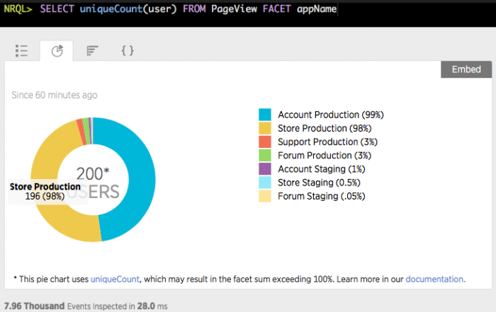

## Problem

<Callout variant="important">
  As of March 22, 2021, we are upgrading Insights to an improved web and mobile experience! All of your Insights URLs will be redirected automatically to the corresponding [dashboards](/docs/query-your-data/explore-query-data/dashboards/introduction-dashboards) in New Relic One. For more details about this migration and how you can easily plan for this transition, see our [Explorers Hub post](https://discuss.newrelic.com/t/important-insights-upgrade-to-nr1-dashboards/127823).
</Callout>

When using a [pie chart](/docs/insights/using-insights-ui/advanced-ui-tasks/widgets-present-insights-data-different-formats#widget-piechart) with the [`uniqueCount`](/docs/insights/nrql-new-relic-query-language/nrql-resources/nrql-syntax-components-functions#func-uniqueCount) aggregator function, the percentages add up to more than 100%.

## Solution

Using a [bar chart](https://docs.newrelic.com/docs/insights/using-insights-ui/advanced-ui-tasks/widgets-present-insights-data-different-formats#widget-barchart) or [table](https://docs.newrelic.com/docs/insights/using-insights-ui/advanced-ui-tasks/widgets-present-insights-data-different-formats#widget-table) may provide a more accurate visualization of `uniqueCount` data.

## Cause

The attributes being uniquely counted may be present in multiple facets. This overlap may result in the facet percentages adding up to more than 100%.

For example, in the query `SELECT uniqueCount(user) FROM PageView FACET appName`, a single unique user may use multiple applications. Each of these users will be included in the unique value for each of the appropriate facets (applications), but the total number of unique users will not change.

<figcaption>
  **[insights.newrelic.com](https://insights.newrelic.com) > Query > (query using uniqueCount)**: Pie charts using uniqueCount can produce percentages that add up to more than 100%. In this example, you have 200 unique users. Of those, 198 of those users (99% of 200 unique users) have accessed your "Account" app, and 196 users (98% of 200 unique users) have accessed your "Store" app.
</figcaption>
