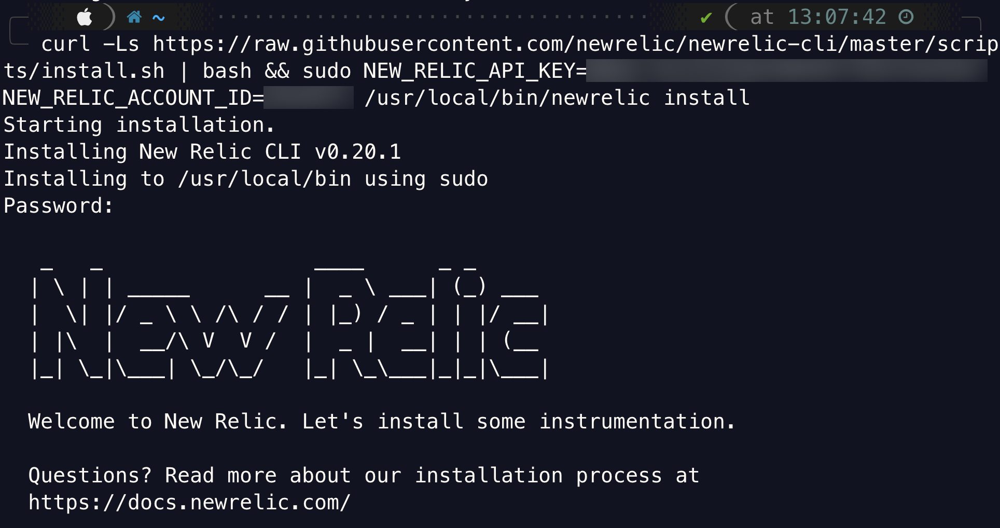

Our Microsoft SQL Server [integration](https://docs.newrelic.com/docs/integrations/host-integrations/getting-started/introduction-host-integrations) collects and sends inventory and metrics from your MS SQL Server environment to our platform, where you can see the health of your MS SQL Server environment. We collect both database and instance-level metrics so that you can pinpoint the source of any problems.

Read on to install the integration, and to see what data we collect.

## Compatibility and requirements [#about]

Our integration is compatible with Microsoft SQL Server 2008 R2 SP3 or higher.

Before installing the integration, make sure that you meet the following requirements:

* [Install the infrastructure agent](/docs/infrastructure/install-infrastructure-agent/get-started/install-infrastructure-agent-new-relic).
* Windows distribution [compatible with the infrastructure agent](/docs/infrastructure/new-relic-infrastructure/getting-started/compatibility-requirements-new-relic-infrastructure).
* Microsoft SQL Server user with [user privileges](#users-privileges) for both `CONNECT` and `VIEW SERVER STATE`, and `READ` access permissions.

## Quick start [#quick]

Instrument your MS SQL Server environment quickly and send your telemetry data with guided install. Our guided install creates a customized CLI command for your environment that downloads and installs the New Relic CLI and the infrastructure agent.



Ready to get started? Click one of these button to try it out.

<ButtonGroup>
<ButtonLink
  role="button"
  to="https://one.newrelic.com/launcher/nr1-core.home?pane=eyJuZXJkbGV0SWQiOiJucjEtY29yZS5ob21lLXNjcmVlbiJ9&cards%5B0%5D=eyJuZXJkbGV0SWQiOiJucjEtaW5zdGFsbC1uZXdyZWxpYy5ucjEtaW5zdGFsbC1uZXdyZWxpYyIsImFjdGlvbkluZGV4IjoxfQ=="
  variant="primary"
>
  Guided install
</ButtonLink>

<ButtonLink
  role="button"
  to="https://one.eu.newrelic.com/launcher/nr1-core.home?pane=eyJuZXJkbGV0SWQiOiJucjEtY29yZS5ob21lLXNjcmVlbiJ9&cards%5B0%5D=eyJuZXJkbGV0SWQiOiJucjEtaW5zdGFsbC1uZXdyZWxpYy5ucjEtaW5zdGFsbC1uZXdyZWxpYyIsImFjdGlvbkluZGV4IjoxfQ=="
  variant="primary"
>
  EU Guided install
</ButtonLink>
</ButtonGroup>

Our guided install uses the infrastructure agent to set up the Microsoft SQL Server integration. Not only that, it discovers other applications and log sources running in your environment and then recommends which ones you should instrument.

The guided install works with most setups. But if it doesn't suit your needs, you can find other methods below to get started monitoring your MS SQL Server environment.

## Microsoft SQL users and privileges [#users-privileges]

In the Microsoft SQL Server that is to be monitored, execute the following script to create a new user and grant `CONNECT`, `VIEW SERVER STATE`, and read access permissions to that user.

See the Microsoft documentation for details on [creating logins](https://docs.microsoft.com/en-us/sql/t-sql/statements/create-login-transact-sql?view=sql-server-2017) and [users](https://docs.microsoft.com/en-us/sql/t-sql/statements/create-user-transact-sql?view=sql-server-2017) in Microsoft SQL Server.

1. Use the following statements to create a new login and to grant `CONNECT` and `VIEW SERVER STATE` permissions to the login.

   ```
   USE master;
       CREATE LOGIN newrelic WITH PASSWORD = <var>'tmp_password'</var>; --insert new password here
       GRANT CONNECT SQL TO newrelic;
       GRANT VIEW SERVER STATE TO newrelic;
       GRANT VIEW ANY DEFINITION TO newrelic;
   ```
2. Use the following statements to grant read access privileges to the user.

   ```
   DECLARE @name SYSNAME
       DECLARE db_cursor CURSOR 
       READ_ONLY FORWARD_ONLY
       FOR
       SELECT NAME
       FROM master.sys.databases
       WHERE NAME NOT IN ('master','msdb','tempdb','model','rdsadmin','distribution')
       OPEN db_cursor
       FETCH NEXT FROM db_cursor INTO @name WHILE @@FETCH_STATUS = 0
       BEGIN
           EXECUTE('USE "' + @name + '"; CREATE USER newrelic FOR LOGIN newrelic;' );
           FETCH next FROM db_cursor INTO @name
       END
       CLOSE db_cursor
       DEALLOCATE db_cursor
   ```
3. Run the following command to verify that the user was successfully created.

   ```
   sqlcmd -U <var>user_name</var> -S <var>host_name</var>
   ```

## Install and activate [#install]

To install the Microsoft SQL Server integration:

1. Download the latest .MSI installer image from:

   <CollapserGroup>
     <Collapser
       id="32-bit-windows"
       title="32-bit Windows"
     >
       ```
       <a href="http://download.newrelic.com/infrastructure_agent/windows/integrations/nri-mssql/386/nri-mssql-386.msi">http://download.newrelic.com/infrastructure_agent/windows/integrations/nri-mssql/386/nri-mssql-386.msi</a>
       ```
     </Collapser>

     <Collapser
       id="64-bit-windows"
       title="64-bit Windows"
     >
       ```
       <a href="http://download.newrelic.com/infrastructure_agent/windows/integrations/nri-mssql/nri-mssql-amd64.msi">http://download.newrelic.com/infrastructure_agent/windows/integrations/nri-mssql/nri-mssql-amd64.msi</a>
       ```
     </Collapser>
   </CollapserGroup>
2. In an admin account, run the install script using an absolute path.

   <CollapserGroup>
     <Collapser
       id="32-bit-path"
       title="32-bit Windows"
     >
       ```
       msiexec.exe /qn /i <var>PATH\TO\</var>nri-mssql-amd386.msi
       ```
     </Collapser>

     <Collapser
       id="64-bit-path"
       title="64-bit Windows"
     >
       ```
       msiexec.exe /qn /i <var>PATH\TO\</var>nri-mssql-amd64.msi
       ```
     </Collapser>
   </CollapserGroup>
3. Rename `C:\Program Files\New Relic\newrelic-infra\integrations.d\mssql-config.yml.sample` to `mssql-config.yml`, and edit according to your instance.
4. [Restart the infrastructure agent](https://docs.newrelic.com/docs/infrastructure/new-relic-infrastructure/configuration/start-stop-restart-check-infrastructure-agent-status).

Additional notes:

* **On-host integrations do not automatically update.** For best results, regularly [update the integration package](/docs/integrations/host-integrations/installation/update-infrastructure-host-integration-package) and [the infrastructure agent](/docs/infrastructure/new-relic-infrastructure/installation/update-infrastructure-agent).

## Configure the integration [#config]

An integration's YAML-format configuration is where you can place required login credentials and configure how data is collected. Which options you change depend on your setup and preference.

For an example configuration, see the [example config file](#example-config).

<Callout variant="important">
  With secrets management, you can configure on-host integrations with New Relic Infrastructure's agent to use sensitive data (such as passwords) without having to write them as plain text into the integration's configuration file. For more information, see [Secrets management](https://docs.newrelic.com/docs/integrations/host-integrations/installation/secrets-management).
</Callout>

### Commands

The `mssql-config.yml` file accepts the following commands:

* `all_data`: collects both inventory and metric data from the Microsoft SQL Server environment.

### Arguments

The `all_data` command accepts the following arguments:

* `username`: username used to authenticate the MS SQL Server. To use Windows Authentication, specify this argument in the `DOMAIN\username` form. This field is required.
* `password`: password used to authenticate the MS SQL Server. This field is required.
* `hostname`: hostname or IP of the MS SQL Server installation. Default: `127.0.0.1`.
* `port`: port number on which the MS SQL Server is listening. This is only required when `instance` is not specified.
* `instance`: instance the Microsoft SQL Server is connected to. `instance` can be used in place of `port` by enabling `SQL Browser`; if enabled, do not include `port` in the argument.
* `enable_ssl`: indicates whether SSL is used to connect to the MS SQL Server. Default: `false`.
* `trust_server_certificate`: if set to `true`, server certificate is not verified for SSL. If set to `false`, certificate will be verified against supplied certificate.
* `certificate_location`: certificate file to verify SSL encryption against.
* `timeout`: timeout for queries, in seconds. Default: `30`.
* `enable_buffer_metrics`: enables the collection of buffer pool metrics. These can be resource intensive for large systems. Default: `true`.
* `enable_database_reserve_metrics`: enables the collection of database partition reserve space. These can be resource intensive for large systems. Default: `true`.
* `custom_metrics_query`: an SQL query with the required columns `metric_name`, `metric_type`, and `metric_value`. The `metric_type` can be `gauge`, `rate`, `delta`, or `attribute`. Additional columns collected with the query are added to the metric set as attributes.
* `extra_connection_url_args`: appends additional parameters to connection url. Ex. 'applicationintent=readonly&foo=bar'

<Callout variant="tip">
  If both port and instance are omitted, the default port of 1433 is used.
</Callout>

### Example configurations [#example-config]

Example `mssql-config.yml` file configuration:

<CollapserGroup>
  <Collapser
    id="example-config"
    title="Configuration for one query"
  >
    ```
    integration_name: com.newrelic.mssql

    instances:
      - name: mssql-server
        command: all_data
        arguments:
          hostname: mssql.localnet
          username: mssql_user
          password: mssql_password
          port: 1433
          custom_metrics_query: >-
            SELECT 
              'instance_buffer_pool_size' AS metric_name,
              Count_big(*) * (8*1024) AS metric_value,
              'gauge' as metric_type,
              database_id
            FROM sys.dm_os_buffer_descriptors WITH (nolock)
            GROUP BY database_id
        labels:
          env: production
          role: mssql
    ```
  </Collapser>

  <Collapser
    id="example-config-multiple"
    title="Configuration for multiple queries"
  >
    If you need multiple SQL queries, add them to `mssql-custom-query.yml`, and then reference that file.

    ```
    integration_name: com.newrelic.mssql

    instances:
      - name: mssql-server
        command: all_data
        arguments:
          hostname: mssql.localnet
          username: mssql_user
          password: mssql_password
          port: 1433
          custom_metrics_config: full_path_to_file
        labels:
          env: production
          role: mssql
    ```

    Here's an example `mssql-custom-query.yml`.

    ```
    queries: 
        # Example for metric_name / metric_type specified in this config
    - query: SELECT count(*) AS 'metric_value' FROM sys.databases
      metric_name: dbCount
      metric_type: gauge
        # Example for metric_name from query, metric_type auto-detected, additional attribute 'category_type'
    - query: SELECT CONCAT('category_', category_id) AS metric_name, name AS metric_value, category_type FROM syscategories
      database: msdb
        # Example for stored procedure 'exec dbo.sp_server_info @attribute_id = 2'
    - query: dbo.sp_server_info @attribute_id = 2
    ```
  </Collapser>
</CollapserGroup>

For more about the general structure of on-host integration configuration, see [Configuration](/docs/integrations/integrations-sdk/file-specifications/host-integration-configuration-overview).

## Find and use data [#find-and-use]

To find your integration data go to [**one.newrelic.com**](http://one.newrelic.com) **> Infrastructure > Third-party services** and select one of the Microsoft SQL Server integration links.

Microsoft SQL Server data is attached to the following [event types](/docs/using-new-relic/welcome-new-relic/getting-started/glossary#event):

* `MssqlDatabaseSample`
* `MssqlInstanceSample`
* `MssqlWaitSample`

For more on how to find and use your data, see [Understand integration data](/docs/infrastructure/integrations/find-use-infrastructure-integration-data).

## Metric data [#metrics]

The Microsoft SQL Server integration collects the following metric data attributes. Some metric name are prefixed with a category indicator and a period, such as `asserts.` or `flush.`.

### Database metrics [#database-metric]

These attributes can be found by querying the `MssqlDatabaseSample` event.

<table>
  <thead>
    <tr>
      <th style={{ width: "350px" }}>
        Metric
      </th>

      <th>
        Description
      </th>
    </tr>
  </thead>

  <tbody>
    <tr>
      <td>
        `bufferpool.sizePerDatabaseInBytes`
      </td>

      <td>
        The size of the buffer pool per database.
      </td>
    </tr>

    <tr>
      <td>
        `io.stallInMilliseconds`
      </td>

      <td>
        Wait time of stall since last restart, in milliseconds.
      </td>
    </tr>

    <tr>
      <td>
        `log.transactionGrowth`
      </td>

      <td>
        Total number of times the transaction log for the database has been expanded since the last restart.
      </td>
    </tr>

    <tr>
      <td>
        `pageFileAvailable`
      </td>

      <td>
        Available page file size, in bytes.
      </td>
    </tr>

    <tr>
      <td>
        `pageFileTotal`
      </td>

      <td>
        Total page file size, in bytes.
      </td>
    </tr>
  </tbody>
</table>

### Instance metrics [#instance-metric]

The Microsoft SQL Server integration collects the following instance metrics. These attributes can be found by querying the `MssqlInstanceSample` event.

<table>
  <thead>
    <tr>
      <th style={{ width: "350px" }}>
        Metric
      </th>

      <th>
        Description
      </th>
    </tr>
  </thead>

  <tbody>
    <tr>
      <td>
        `access.pageSplitsPerSecond`
      </td>

      <td>
        The number of page splits per second.
      </td>
    </tr>

    <tr>
      <td>
        `activeConnections`
      </td>

      <td>
        The number of active connections.
      </td>
    </tr>

    <tr>
      <td>
        `buffer.cacheHitRatio`
      </td>

      <td>
        The ratio of data pages found and read from the buffer cache over all data page requests.
      </td>
    </tr>

    <tr>
      <td>
        `buffer.checkpointPagesPerSecond`
      </td>

      <td>
        The number of pages flushed to disk per second by a checkpoint or other operation that require all dirty pages to be flushed.
      </td>
    </tr>

    <tr>
      <td>
        `bufferpool.batchRequestsPerSecond`
      </td>

      <td>
        The number of batch requests per second on the buffer pool.
      </td>
    </tr>

    <tr>
      <td>
        `bufferpool.pageLifeExptancyInMilliseconds`
      </td>

      <td>
        The life expectancy of a page in the buffer pool, in milliseconds.
      </td>
    </tr>

    <tr>
      <td>
        `bufferpool.sizeInBytes`
      </td>

      <td>
        The size of the buffer pool, in bytes.
      </td>
    </tr>

    <tr>
      <td>
        `instance.backgroundProcessesCount`
      </td>

      <td>
        The number of background processes on the instance.
      </td>
    </tr>

    <tr>
      <td>
        `instance.blockedProcessesCount`
      </td>

      <td>
        The number of blocked processes on the instance.
      </td>
    </tr>

    <tr>
      <td>
        `instance.diskInBytes`
      </td>

      <td>
        The amount of disk space on the instance, in bytes.
      </td>
    </tr>

    <tr>
      <td>
        `instance.dormantProcessesCount`
      </td>

      <td>
        The number of dormant processes on the instance.
      </td>
    </tr>

    <tr>
      <td>
        `instance.forcedParameterizationsPerSecond`
      </td>

      <td>
        The number of forced parameterizations per second on the instance.
      </td>
    </tr>

    <tr>
      <td>
        `instance.preconnectProcessesCount`
      </td>

      <td>
        The number of preconnect processes on the instance.
      </td>
    </tr>

    <tr>
      <td>
        `instance.runnableProcessesCount`
      </td>

      <td>
        The number of runnable processes on the instance.
      </td>
    </tr>

    <tr>
      <td>
        `instance.runnableTasks`
      </td>

      <td>
        The number of runnable tasks on the instance.
      </td>
    </tr>

    <tr>
      <td>
        `instance.runningProcessesCount`
      </td>

      <td>
        The number of running processes on the instance.
      </td>
    </tr>

    <tr>
      <td>
        `instance.sleepingProcessesCount`
      </td>

      <td>
        The number of sleeping processes on the instance.
      </td>
    </tr>

    <tr>
      <td>
        `instance.suspendedProcessesCount`
      </td>

      <td>
        The number of suspended processes on the instance.
      </td>
    </tr>

    <tr>
      <td>
        `instance.transactionsPerSecond`
      </td>

      <td>
        The number of transactions per second on the instance.
      </td>
    </tr>

    <tr>
      <td>
        `memoryAvailable`
      </td>

      <td>
        The available physical memory, in bytes.
      </td>
    </tr>

    <tr>
      <td>
        `memoryTotal`
      </td>

      <td>
        The total physical memory, in bytes.
      </td>
    </tr>

    <tr>
      <td>
        `memoryUtilization`
      </td>

      <td>
        The percentage of memory utilization.
      </td>
    </tr>

    <tr>
      <td>
        `stats.connections`
      </td>

      <td>
        The number of user connections.
      </td>
    </tr>

    <tr>
      <td>
        `stats.deadlocksPerSecond`
      </td>

      <td>
        The number of lock requests per second that resulted in a deadlock since the last restart.
      </td>
    </tr>

    <tr>
      <td>
        `stats.killConnectionErrorsPerSecond`
      </td>

      <td>
        The number of kill connection errors per second since the last restart.
      </td>
    </tr>

    <tr>
      <td>
        `stats.lockWaitsPerSecond`
      </td>

      <td>
        The number of times per second that MS SQL Server is unable to retain a lock right away for a resource.
      </td>
    </tr>

    <tr>
      <td>
        `stats.sqlCompilations`
      </td>

      <td>
        The number of MS SQL compilations per second.
      </td>
    </tr>

    <tr>
      <td>
        `stats.sqlRecompilationsPerSecond`
      </td>

      <td>
        The number of MS SQL re-compilations per second.
      </td>
    </tr>

    <tr>
      <td>
        `stats.userErrorsPerSecond`
      </td>

      <td>
        The number of user errors per second since the last restart.
      </td>
    </tr>

    <tr>
      <td>
        `system.bufferPoolHit`
      </td>

      <td>
        The percentage of buffer pools hits on the instance.
      </td>
    </tr>

    <tr>
      <td>
        `system.waitTimeInMillisecondsPerSecond`
      </td>

      <td>
        The number of milliseconds per second spent waiting across the instance.
      </td>
    </tr>
  </tbody>
</table>

### Wait metrics [#wait-metric]

These attributes can be found by querying the `MssqlWaitSample` event.

<table>
  <thead>
    <tr>
      <th style={{ width: "350px" }}>
        Metric
      </th>

      <th>
        Description
      </th>
    </tr>
  </thead>

  <tbody>
    <tr>
      <td>
        `system.waitTimeCount`
      </td>

      <td>
        Total wait time for this wait type, in milliseconds. This time is inclusive of `signal_wait_time_ms`.
      </td>
    </tr>

    <tr>
      <td>
        `system.waitTimeInMillisecondsPerSecond`
      </td>

      <td>
        The number of waits on this wait type, in milliseconds. This counter is incremented at the start of each wait.
      </td>
    </tr>
  </tbody>
</table>

## Inventory data [#inventory]

The Microsoft SQL Server integration captures the configuration parameters and current settings of the Microsoft SQL Server environment. It collects the results of the `sp_configure` stored procedure, as well as current running configuration settings from the `sys.configurations` table.

The data is available on the [Inventory page](/docs/infrastructure/new-relic-infrastructure/infrastructure-ui-pages/infrastructure-inventory-page-search-your-entire-infrastructure), under the **config/mssql** source. For more about inventory data, see [Understand integration data](/docs/infrastructure/integrations-getting-started/getting-started/understand-integration-data-data-types#inventory-data).

## Check the source code [#source-code]

This integration is open source software. That means you can [browse its source code](https://github.com/newrelic/nri-mssql "Link opens in a new window.") and send improvements, or create your own fork and build it.
