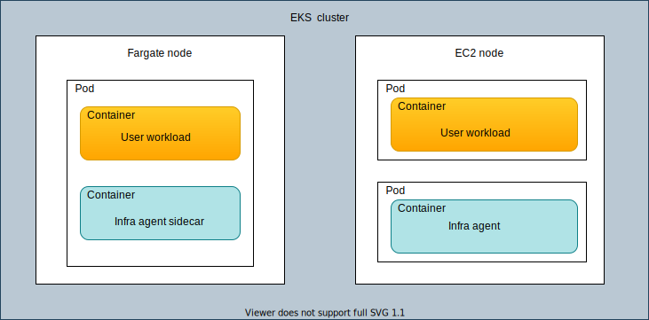

In order to monitor Kubernetes workloads scheduled on Fargate, our solution automatically injects a sidecar containing the infrastructure agent and the nri-kubernetes integration in each pod that needs to be monitored.

If the same Kubernetes cluster also contains EC2 nodes, our solution is deployed as a DaemonSet in all of them. No sidecar will be injected into pods scheduled in EC2 nodes, and no DaemonSet will be deployed to Fargate nodes. Here's an example of a hybrid instance with both Fargate and EC2 nodes:


<figcaption>
In this mixed environment, the integration only uses a sidecar for Fargate nodes.
</figcaption>

New Relic collects all the supported metrics for all Kubernetes objects regardless of where they are scheduled, be it Fargate or EC2 nodes. Please note that, due to Fargate limitations, the New Relic integration is limited to running in [unprivileged](/docs/integrations/kubernetes-integration/installation/kubernetes-integration-install-configure/#unprivileged) mode in Fargate nodes. This means that metrics that are usually fetched from the host directly, like running processes, will not be available for Fargate nodes.

The agent in both scenarios will scrape data from Kube State Metrics (KSM), Kubelet and cAdvisor and send data in the same format.

Notice that is still required to deploy and monitor a Kube State Metrics instance, which the Helm Chart can do automatically if instructed to. KSM will be monitored as any other workload: By injecting a sidecar if it gets scheduled in a Fargate node, or with the local instance of the DaemonSet if it gets scheduled on an EC2 node.

Other components such as `nri-prometheus`, `nri-metadata-injection`, and `nri-kube-events` do not need any extra steps to be deployed on Fargate.

<Callout variant="tip">
New Relic Logging is not yet supported on Fargate nodes.
</Callout>

## Installation [#installation]

You can choose between two alternatives for installing New Relic full observability in your EKS Fargate cluster: 

* [Automatic (recommended)](#automatic)
* [Manual injection](#manual)

Regardless of the approach you choose, the experience is exactly the same after it is installed. The only difference is how the container is injected.

### Automatic injection (recommended) [#automatic]

By default, when Fargate support is enabled, New Relic will deploy an operator to the cluster. (newrelic-infra-operator). Once deployed, this operator will automatically inject the monitoring sidecar to pods that are scheduled into Fargate nodes, while also managing the creation and the update of Secrets, ClusterRoleBindings, and any other related resource.

This operator accepts a variety of advanced configuration options that can be used to narrow or widen the scope of the injection, through the use of label selectors for both pods and namespaces.

#### What the operator does

Behind the scenes, the `newrelic-infra-operator` sets up a `mutatingWebhookConfiguration`, which allows it to modify the pod objects that are about to be created in the cluster. On this event, and when the pod being created matches the user’s configuration the operator will:

1. Add a sidecar container to the pod, containing the New Relic Kubernetes Integration.
2. If a secret doesn't exist, create one in the same Namespace as the Pod containing the New Relic license key, which is needed for the integration to report data.
3. Add the pod’s service account to a `ClusterRoleBinding` previously created by the operator chart, which will grant this sidecar the required permissions to hit the Kubernetes metrics endpoints.

The `ClusterRoleBinding` grants the following permissions to the pod being injected:

```
- apiGroups: [""]
  resources:
	- "nodes"
	- "nodes/metrics"
	- "nodes/stats"
	- "nodes/proxy"
	- "pods"
	- "services"
  verbs: ["get", "list"]
- nonResourceURLs: ["/metrics"]
  verbs: ["get"]
```

<Callout variant="tip">
Please note that only pods created after the deployment of the monitoring solution will be injected with the configuration and agent. 
</Callout>

In order to get the sidecar injected on pods deployed before the operator has been installed, the user needs to manually perform a rollout (restart). New Relic has chosen not to do this automatically in order to prevent unexpected service disruptions and resource usage spikes.

Here is the workflow:

INSERT DIAGRAM HERE

#### Automatic injection installation

<Callout variant="tip">
These setup steps are for a generic installation. Before completing these, take a look at the Configuration [#config] section below to see if you want to modify any aspects of the automatic injection.
</Callout>

In order to install the `newrelic-infra-operator` in charge of injecting the infrastructure sidecar, all you have to do is add the following flags to the the [install bundle command](https://docs.newrelic.com/docs/integrations/kubernetes-integration/installation/install-kubernetes-integration-using-helm/#install-k8-helm):

```
helm upgrade --install newrelic newrelic/nri-bundle \
--set global.licenseKey=YOUR_NEW_RELIC_LICENSE_KEY \
--set global.cluster=K8S_CLUSTER_NAME \
--set infrastructure.enabled=true \
--set prometheus.enabled=true \
--set webhook.enabled=true \
--set ksm.enabled=false \
--set kubeEvents.enabled=true \
<var>--set global.fargate=true</var>
<var>--set infra-operator.enabled=true</var>
```

#### Configuration [#config]

It is possible to configure different aspects of the automatic injection. By default, the operator will inject the monitoring sidecar to all pods deployed in Fargate nodes which are not part of a Job or a BatchJob.

Using configurations, you can change this behavior. For example, you can define selectors to narrow or widen the selection of pods that are injected, assign resources to the operator, and tune the sidecar. Also, you can add other attributes, labels, and environment variables. Please refer to the chart `README.md` and `values.yaml` for the complete description of each option.

<Callout variant="tip">
Injecting the sidecar into deployments scheduled into EC2 nodes may lead into incorrect or duplicate data, especially if those nodes are already being monitored with the DaemonSet. Take this into account when designing custom selectors for the automatic injection.
</Callout>

#### Update to the latest version or to a new configuration

To update to the latest version of the EKS Fargate integration, upgrade the chart and reinstall the bundle by simply running again the command above.

To update the configuration of the infrastructure agent injected or the `newrelic-infra-operator` itself, modify the `values.yaml` and upgrade the Helm release with the new configuration. The `newrelic-infra-operator` is immediately updated; however, another rollout of the workloads is needed in order to inject the infrastructure agent sidecar with the new configuration.

```
     $ kubectl rollout restart deployment <var>YOUR_DEPLOY</var>
```

#### Uninstall the Fargate integration

We recommend that you uninstall the infrastructure operator that performs the automatic injection but keep the rest of the New Relic solution. Using Helm, disable the infra-operator by setting `infra-operator.enabled` to `false`, either in the `values.yaml` file or in the command line `--set`, and re-run the upgrade `--install` command above.

To uninstall the whole solution:

1. Completely uninstall the Helm release.
2. Rollout the pods in order to remove the sidecar:
```
     $ kubectl rollout restart deployment <var>YOUR_APP</var>
```
3. Garbage collect the secrets:
```
     $ kubectl delete secrets -n <var>YOUR_NAMESPACE</var> -l newrelic/infra-operator-created=true
```

#### Known limitations: automatic injection

Here are some issues to be aware of when using automatic injection:

1. Currently there is no controller that watches the whole cluster to make sure that secrets that are no longer needed are garbage collected. However, all objects share the same label that can be used in order to remove all resources if needed `newrelic/infra-operator-created: true`.

2. At the moment, it is not possible to use the injected sidecar to monitor services running in the pod. The sidecar will only monitor Kubernetes itself. However, if you are an advanced user, you may want to exclude these pods from automatic injection. You would then manually inject a customized version of the sidecar with on-host integrations enabled by configuring them and mounting their configurations in the proper place. [MISSING LINK].

### Manual injection [#manual]
If you have  any concern with the automatic injection, you can inject the sidecar manually directly by modifying the manifests of the workloads scheduled that are going to be scheduled on Fargate nodes Please note that adding the sidecar into deployments scheduled into EC2 nodes may lead into incorrect or duplicate data, especially if those nodes are already being monitored with the DaemonSet.

The following objects are required for the sidecar to successfully report data:

* The `ClusterRole` providing the permission needed by the `nri-kubernetes integration`
* A `ClusterRoleBinding` linking the `ClusterRole` and the service account of the pod
* The secret storing the New Relic `licenseKey` in each Fargate namespace 
* The sidecar container in the spec template of the monitored workload

You can see example manifests for these objects in this [gist](https://gist.github.com/paologallinaharbur/754c13d0541f89d60ae74fdf877e3ce5J).

#### Manual injection installation 

Complete the following for manual injection:

1. If it does not exist, create a `ClusterRole` granting the permissions required to hit the metrics endpoints. This only needs to be done once, even for monitoring multiple applications in the same cluster.
2. For each workload you want to monitor, add an additional sidecar container for the `newrelic/infrastructure-k8s` image, as shown in the example above.
3. Create a `ClusterRoleBinding`, or add to a previously created one the `ServiceAccount` of the application that is going to be monitored. All the workloads may share the same `ClusterRoleBinding`, but the `ServiceAccount` of each one must be added to it.
4. Create a secret containing the New Relic license key. Each namespace needs its own secret.


#### Configuration

When adding the manifest of the sidecar agent manually, you can use any agent configuration option to configure the agent behavior.
[NEED A LINK]

#### Update to the latest version

To update any of the components, you just need to modify the deployed yaml. 

Updating any of the fields of the injected container will cause the pod to be re-created.

<Callout variant="tip">
The agent cannot hot load the New Relic license key. After updating the secret, you need to rollout the deployments again.
</Callout>

#### Uninstall the Fargate integration

To remove the injected container and the related resources, you just have  to remove the following:
* The sidecar from the workloads that should be no longer monitored 
* All the secrets containing the newrelic license 
* `ClusterRole` and `ClusterRoleBinding` objects.

Notice that removing the sidecar container will cause the pod to be re-created.

## Troubleshooting

Here are some tips if you have problems:

### DaemonSet replicas are being deployed into Fargate nodes

If you notice that any Infra DaemonSet replicas are being scheduled on Fargate nodes, it might be because the nodeAffinity rules are not configured properly.

Double-check that the solution was installed with the global.fargate option to true, either through the command line (--set global.fargate=true) or in the values.yaml file. If the installation method was not Helm, you’ll need to manually add nodeAffinity rules to exclude fargate nodes.

### Garbage collection

Currently even if the `ClusterRoleBinding` gets updated automatically, there is no controller that watches the whole cluster making sure that the `ClusterRoleBinding` is in sync with the current status. Therefore, if a subject is no longer needed, no automation garbage collects it. If the object is deleted, no automation is in place to recreate it with the needed subjects. [I MOVED THIS OUT OF THE LIMITATIONS SECTION BECAUSE OF A REVIEW COMMENT. IS THIS APPROPRIATE HERE?]

## View your EKS data

Here's an example of what a Fargate node looks like in the New Relic UI:


To view your AWS data:

1. Go to **[one.newrelic.com](https://one.newrelic.com) > Infrastructure > kubernetes** and do one of the following:
  * Select an integration name to view data.
  * Select the Explore data  icon to view AWS data.
2. Filter your data using two Fargate tags:
  * `computeType=serverless`
  * `fargateProfile=[name of the Fargate profile to which the workload belongs]`
