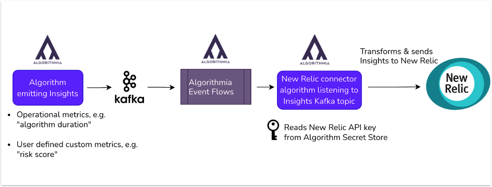

## What is MLOps? [#mlops]

MLOps stands for machine-learning operations. As more companies invest in artificial intelligence and machine learning, there's a gap in understanding between the data science teams developing machine-learning models and the DevOps teams operating the applications that power those models.

MLOps provides a tool for monitoring and observing the performance and effectiveness of machine-learning models in a production environment. This increases the possibilities for collaboration between data science and DevOps teams, feeding into a continuous process of development, testing, and operational monitoring.

## The Algorithmia integration [#algorithmia]

Algorithmia Insights provides tools for deploying your machine-learning models into production. By integrating, Algorithmia's integration with New Relic, you'll be able to instrument, analyze, troubleshoot, and optimize your machine-learning performance across your entire system. By rigorously observing your capabilities, you'll be able to react quickly to changes in the model's input or output and the relationship between the two.

Send your model performance metrics from Algorithmia Insights to New Relic and you'll have real-time monitoring for your algorithms. You'll explore your metrics data with user-friendly charts and learn the state of your algorithms at a glance for faster and more efficient troubleshooting. 

## Integrate Algorithmia with New Relic [#integrate-algorithmia] 

First, Algorithmia uses a Kafka topic to stream Insights. Your machine-learning algorithm's performance metrics. Then, the New Relic connector (another algorithm) transforms the Kafka topic into a metrics data payload for a specific New Relic account.



<figcaption>Algorithmia uses Kafka and Event Flows to send data to New Relic.</figcaption>

With [Algorithmia’s Event Flows](https://algorithmia.com/developers/integrations/message-broker), when a new message is set to your Kafka topic, your configured New Relic connector algorithm gets called. The connector  transforms your metrics and sends them to your New Relic account.

## Connect your Algorithmia data to New Relic [#connect]

    By integrating Incident Intelligence with your Algorithmia machine-learning models, you can monitor your machine learning model performance.

  Start monitoring your Algorithmia event flows with New Relic.

1. **Get your API key:** From [one.newrelic.com](https://one.newrelic.com) the account menu, click **API keys** and then create a user key for your account with a meaningful name. Make note of this name for later. For more on API keys, [see our docs](/docs/apis/get-started/intro-apis/new-relic-api-keys/).

2. **Create a dashboard:** From [one.newrelic.com](https://one.newrelic.com) go to **Dashboards**, then click the **Import dashboards** button. Copy and paste the JSON code into the **Paste your JSON field code**.

Update the YOUR_ACCOUNT_ID values with your account ID.

        ```json
        {
  "name": "Algorithmia Dashboard for Default Metrics",
  "description": null,
  "permissions": "PUBLIC_READ_WRITE",
  "pages": [
    {
      "name": "Algorithmia Dashboard for Default Metrics",
      "description": null,
      "widgets": [
        {
          "visualization": {
            "id": "viz.line"
          },
          "layout": {
            "column": 1,
            "row": 1,
            "height": 3,
            "width": 4
          },
          "title": "Runtime Duration by Algorithm",
          "rawConfiguration": {
            "legend": {
              "enabled": true
            },
            "nrqlQueries": [
              {
                "accountId": <var>YOUR_ACCOUNT_ID</var>,
                "query": "SELECT average(algorithmia.duration_milliseconds) FROM Metric TIMESERIES FACET `algorithm_name` LIMIT 10 SINCE 1800 seconds ago"
              }
            ],
            "yAxisLeft": {
              "zero": true
            }
          },
          "linkedEntityGuids": null
        },
        {
          "visualization": {
            "id": "viz.line"
          },
          "layout": {
            "column": 5,
            "row": 1,
            "height": 3,
            "width": 4
          },
          "title": "Throughput by Algorithm",
          "rawConfiguration": {
            "legend": {
              "enabled": true
            },
            "nrqlQueries": [
              {
                "accountId": <var>YOUR_ACCOUNT_ID</var>,
                "query": "SELECT count(algorithmia.duration_milliseconds) FROM Metric TIMESERIES FACET `algorithm_name` LIMIT 10 SINCE 1800 seconds ago"
              }
            ],
            "yAxisLeft": {
              "zero": true
            }
          },
          "linkedEntityGuids": null
        }
      ]
    }
  ]
}
        ```

3. **Configure Algorithmia Insights for New Relic:** Use [Algorithmia's docs](https://algorithmia.com/developers/algorithmia-enterprise/algorithmia-insights) for how to configure Algorithmia Insights for New Relic.

4. **Create the New Relic connector algorithm:** Use Python 3.8 to create a connector algorithm. If you're new to writing code to generate algorithms, see [Algorithmia's getting started guide](https://algorithmia.com/developers/algorithm-development/your-first-algo).

        ```python
        import Algorithmia
import json
from datetime import datetime
from newrelic_telemetry_sdk import GaugeMetric, MetricClient

client = Algorithmia.client()
metric_client = MetricClient(os.environ["newrelic_api_key"])


def convert_str_timestamp_to_epoch(str_time):
    obj_time = datetime.strptime(str_time, "%Y-%m-%dT%H:%M:%S.%f")
    return int(obj_time.timestamp() * 1000)

def get_operational_metrics(payload):
    ALGORITHM_TAGS = {
    "algorithm_version",
    "request_id",
    "time",
    "algorithm_name",
    "session_id",
    "algorithm_owner"
    }
    inference_metrics = {
        key: payload[key] for key in payload.keys() ^ ALGORITHM_TAGS
    }
    return inference_metrics

def send_to_newrelic(inference_metrics, insights_payload):
    newrelic_metrics = []
    for key, value in inference_metrics.items():
        name = "algorithmia." + key
        epoch_time = convert_str_timestamp_to_epoch(insights_payload["time"])
        tags = {
            "algorithm_name": insights_payload["algorithm_name"],
            "algorithm_version": insights_payload["algorithm_version"],
            "algorithm_owner": insights_payload["algorithm_owner"],
            "request_id": insights_payload["request_id"],
            "session_id": insights_payload["session_id"],
        }

        newrelic_metrics.append(GaugeMetric(
            name=name, value=value, tags=tags, end_time_ms=epoch_time
        ))

    response = metric_client.send_batch(newrelic_metrics)
    response.raise_for_status()


def apply(input):
    insights_payload = input
    inference_metrics = get_operational_metrics(insights_payload)
    send_to_newrelic(inference_metrics, insights_payload)
    return None
        ```

      Include these dependencies:

      ```python
      algorithmia>=1.0.0,<2.0
      newrelic_telemetry_sdk==0.4.2
      ```

Once your algorithm build finishes, you can test it with this sample payload to make sure it runs successfully. Your output should look something like this.

      ```
      {
        "risk_score": 0.2,
        "duration_milliseconds": 8,
        "algorithm_version": "1.0.6",
        "session_id": "rses-f28bb94a-5556-4aeb-a6d2-89493626bf4f",
        "time": "2021-02-20T00:21:54.867231",
        "algorithm_name": "credit_card_approval",
        "request_id": "req-9f5345b4-a1cd-431c-a43a-bd2a06f4a6f4",
        "algorithm_owner": "asli"
      }
      ```

5. **Configure with your API key:** Add your New Relic API key to the [Algorithmia secret store](https://algorithmia.com/developers/platform/algorithm-secrets).

6. **Set up Algorithmia Event Flows with New Relic:** See [Algorithmia's documentation](https://algorithmia.com/developers/integrations/message-broker) on setting up your connector algorithm to send event-based machine learning flows to New Relic. 

## Monitor your machine learning models [#monitor]

Follow these steps to get the most of observing your machine-learning data in New Relic.  

1. **Get your API key:** From [one.newrelic.com](https://one.newrelic.com) the account menu, click **API keys** and then create a user key for your account with a meaningful name. Make note of this name for later. For more on API keys, [see our docs](/docs/apis/get-started/intro-apis/new-relic-api-keys/).

  2. **Create a dashboard:** From [one.newrelic.com](https://one.newrelic.com) go to **Dashboards**, then click the **Import dashboards** button. Copy and paste the JSON code into the **Paste your JSON field code**.

        Update the YOUR_ACCOUNT_ID values with your account ID.

        ```json
        {
  "name": "Algorithmia Dashboard for Default Metrics",
  "description": null,
  "permissions": "PUBLIC_READ_WRITE",
  "pages": [
    {
      "name": "Algorithmia Dashboard for Default Metrics",
      "description": null,
      "widgets": [
        {
          "visualization": {
            "id": "viz.line"
          },
          "layout": {
            "column": 1,
            "row": 1,
            "height": 3,
            "width": 4
          },
          "title": "Runtime Duration by Algorithm",
          "rawConfiguration": {
            "legend": {
              "enabled": true
            },
            "nrqlQueries": [
              {
                "accountId": <var>YOUR_ACCOUNT_ID</var>,
                "query": "SELECT average(algorithmia.duration_milliseconds) FROM Metric TIMESERIES FACET `algorithm_name` LIMIT 10 SINCE 1800 seconds ago"
              }
            ],
            "yAxisLeft": {
              "zero": true
            }
          },
          "linkedEntityGuids": null
        },
        {
          "visualization": {
            "id": "viz.line"
          },
          "layout": {
            "column": 5,
            "row": 1,
            "height": 3,
            "width": 4
          },
          "title": "Throughput by Algorithm",
          "rawConfiguration": {
            "legend": {
              "enabled": true
            },
            "nrqlQueries": [
              {
                "accountId": <var>YOUR_ACCOUNT_ID</var>,
                "query": "SELECT count(algorithmia.duration_milliseconds) FROM Metric TIMESERIES FACET `algorithm_name` LIMIT 10 SINCE 1800 seconds ago"
              }
            ],
            "yAxisLeft": {
              "zero": true
            }
          },
          "linkedEntityGuids": null
        }
      ]
    }
  ]
}
        ``` 

3. **Set up alerts notifications:** Once you've created some dashboards, you can get alerted on your data.  To create a NRQL alerts condition from a chart, click the chart menu <Icon name="fe-more-horizontal"/>, then click **Create alert condition**. Once you've named and customized your condition, you can add it to an existing policy or create a new one.

4. **Get notified:** Once you've created an alerts condition, you can choose how you want to be notified. See our docs on [how to set up notification channels](/docs/alerts-applied-intelligence/new-relic-alerts/alert-notifications/notification-channels-control-where-send-alerts/).

5. **Correlate your incidents:** In addition to notifications, you can use Incident Intelligence to correlate your incidents. See our docs on how to [correlate incidents using decisions](/docs/alerts-applied-intelligence/applied-intelligence/incident-intelligence/change-applied-intelligence-correlation-logic-decisions/).


## OLD CONTENT Set up the Algorithmia integration [#set-up]

Use the following instructions to set up the Algorithmia integration:

### Step 1: Get your API key

After logging in to your [New Relic account](https://one.newrelic.com/), go to your profile from the account drop down menu on the right hand corner and select API keys. Create a key with “User” as the “key type” and note it down for later reference for your Algorithmia side configuration.

### Step 2: Create a dashboard

From your New Relic One main page, go to your main Dashboards page. From here you can either create a dashboard from scratch or start with Algorithmia’s default metrics dashboard. To get started with the Algorithmia template, click on the “Import dashboard” button from the menu icons on the right. On the pop up page, paste the following JSON Text:
```
{
  "name": "Algorithmia Dashboard for Default Metrics",
  "description": null,
  "permissions": "PUBLIC_READ_WRITE",
  "pages": [
    {
      "name": "Algorithmia Dashboard for Default Metrics",
      "description": null,
      "widgets": [
        {
          "visualization": {
            "id": "viz.line"
          },
          "layout": {
            "column": 1,
            "row": 1,
            "height": 3,
            "width": 4
          },
          "title": "Runtime Duration by Algorithm",
          "rawConfiguration": {
            "legend": {
              "enabled": true
            },
            "nrqlQueries": [
              {
                "accountId": YOUR_ACCOUNT_ID,
                "query": "SELECT average(algorithmia.duration_milliseconds) FROM Metric TIMESERIES FACET `algorithm_name` LIMIT 10 SINCE 1800 seconds ago"
              }
            ],
            "yAxisLeft": {
              "zero": true
            }
          },
          "linkedEntityGuids": null
        },
        {
          "visualization": {
            "id": "viz.line"
          },
          "layout": {
            "column": 5,
            "row": 1,
            "height": 3,
            "width": 4
          },
          "title": "Throughput by Algorithm",
          "rawConfiguration": {
            "legend": {
              "enabled": true
            },
            "nrqlQueries": [
              {
                "accountId": YOUR_ACCOUNT_ID,
                "query": "SELECT count(algorithmia.duration_milliseconds) FROM Metric TIMESERIES FACET `algorithm_name` LIMIT 10 SINCE 1800 seconds ago"
              }
            ],
            "yAxisLeft": {
              "zero": true
            }
          },
          "linkedEntityGuids": null
        }
      ]
    }
  ]
}
```
Remember to update the fields that say "accountId: YOUR_ACCOUNT_ID" with your own New Relic Account ID. Click on “Import dashboard” and get ready to observe your Algorithmia Insights metrics on these widgets.

### Step 3: Configure Algorithmia Insights
To start using Insights, your Algorithmia Platform Administrator connects your cluster to a Kafka broker / cluster to which metrics will be sent. Once this one time administrator setup is done, you can start using Algorithmia Insights in an algorithm. Detailed instructions on how to configure these are in [Algorithmia’s Insights documentation page](https://algorithmia.com/developers/algorithmia-enterprise/algorithmia-insights).

### Step 4: Create the New Relic connector algorithm
Create a new algorithm on Python 3.8 environment with the following source code and dependencies:

```python
import Algorithmia
import json
from datetime import datetime
from newrelic_telemetry_sdk import GaugeMetric, MetricClient

client = Algorithmia.client()
metric_client = MetricClient(os.environ["newrelic_api_key"])


def convert_str_timestamp_to_epoch(str_time):
    obj_time = datetime.strptime(str_time, "%Y-%m-%dT%H:%M:%S.%f")
    return int(obj_time.timestamp() * 1000)

def get_operational_metrics(payload):
    ALGORITHM_TAGS = {
    "algorithm_version",
    "request_id",
    "time",
    "algorithm_name",
    "session_id",
    "algorithm_owner"
    }
    inference_metrics = {
        key: payload[key] for key in payload.keys() ^ ALGORITHM_TAGS
    }
    return inference_metrics

def send_to_newrelic(inference_metrics, insights_payload):
    newrelic_metrics = []
    for key, value in inference_metrics.items():
        name = "algorithmia." + key
        epoch_time = convert_str_timestamp_to_epoch(insights_payload["time"])
        tags = {
            "algorithm_name": insights_payload["algorithm_name"],
            "algorithm_version": insights_payload["algorithm_version"],
            "algorithm_owner": insights_payload["algorithm_owner"],
            "request_id": insights_payload["request_id"],
            "session_id": insights_payload["session_id"],
        }

        newrelic_metrics.append(GaugeMetric(
            name=name, value=value, tags=tags, end_time_ms=epoch_time
        ))

    response = metric_client.send_batch(newrelic_metrics)
    response.raise_for_status()


def apply(input):
    insights_payload = input
    inference_metrics = get_operational_metrics(insights_payload)
    send_to_newrelic(inference_metrics, insights_payload)
    return None
```

**Algorithm dependencies**

```
algorithmia>=1.0.0,<2.0
newrelic_telemetry_sdk==0.4.2
```
If you’re using the Web IDE to create these, click on Save and Build and compile your algorithm. If you’re developing your algorithm locally, push your algorithm repository as you’d normally do to build an algorithm version. Once your build finishes, you can test it with this sample payload and make sure it runs successfully. This test input is how your Insights payload will look like. 

```
{
  "risk_score": 0.2,
  "duration_milliseconds": 8,
  "algorithm_version": "1.0.6",
  "session_id": "rses-f28bb94a-5556-4aeb-a6d2-89493626bf4f",
  "time": "2021-02-20T00:21:54.867231",
  "algorithm_name": "credit_card_approval",
  "request_id": "req-9f5345b4-a1cd-431c-a43a-bd2a06f4a6f4",
  "algorithm_owner": "asli"
}
```
If you’re new to creating algorithms, you can check out the [Getting Started guide](https://algorithmia.com/developers/algorithm-development/your-first-algo) from Algorithmia

### Step 5: Configure with API key

Use the New Relic API Key from [Algorithmia Secret Store](https://algorithmia.com/developers/platform/algorithm-secrets).

### Step 6: Setup Algorithmia Event Flows with New Relic

Once your New Relic connector algorithm is published, configure it to get triggered whenever a Kafka topic receives a message. This Kafka topic will be the same as your Algorithmia Insights Kafka topic. This way, when an algorithm that has Insights enabled gets called and emits its metrics, the metrics payload will be used to call your New Relic connector algorithm. Detailed instructions on how to configure this event based flow are in the [Algorithmia Event Flows](https://algorithmia.com/developers/integrations/message-broker) documentation. 

For any published algorithm on your cluster that has Insights enabled, once the algorithm's API endpoint is called, your New Relic connector algorithm will in turn be called through the Algorithmia Event Flows trigger. The connector algorithm will then push your Insights metrics to your New Relic Account.

As you call your Insights enabled algorithms, you can then verify that your metrics appear in New Relic as ```algorithmia.<METRIC-NAME>```, and your data points are plotted on your New Relic dashboard’s charts.

## Observe your machine learning data [#get-started]

Complete these steps to create alerts for your machine learning model and correlate your machine learning incidents.

### Step 1: Create an API key

After logging in to your [New Relic account](https://one.newrelic.com/), go to your profile from the account drop down menu on the right hand corner and select API keys. Create a key with “User” as the “key type” and note it down for later reference for your Algorithmia side configuration.

### Step 2: Create a dashboard

From your New Relic One main page, go to your main Dashboards page. From here you can either create a dashboard from scratch or start with Algorithmia’s default metrics dashboard. To get started with the Algorithmia template, click on the “Import dashboard” button from the menu icons on the right. On the pop up page, paste the following JSON Text:

```
{
  "name": "Algorithmia Dashboard for Default Metrics",
  "description": null,
  "permissions": "PUBLIC_READ_WRITE",
  "pages": [
    {
      "name": "Algorithmia Dashboard for Default Metrics",
      "description": null,
      "widgets": [
        {
          "visualization": {
            "id": "viz.line"
          },
          "layout": {
            "column": 1,
            "row": 1,
            "height": 3,
            "width": 4
          },
          "title": "Runtime Duration by Algorithm",
          "rawConfiguration": {
            "legend": {
              "enabled": true
            },
            "nrqlQueries": [
              {
                "accountId": YOUR_ACCOUNT_ID,
                "query": "SELECT average(algorithmia.duration_milliseconds) FROM Metric TIMESERIES FACET `algorithm_name` LIMIT 10 SINCE 1800 seconds ago"
              }
            ],
            "yAxisLeft": {
              "zero": true
            }
          },
          "linkedEntityGuids": null
        },
        {
          "visualization": {
            "id": "viz.line"
          },
          "layout": {
            "column": 5,
            "row": 1,
            "height": 3,
            "width": 4
          },
          "title": "Throughput by Algorithm",
          "rawConfiguration": {
            "legend": {
              "enabled": true
            },
            "nrqlQueries": [
              {
                "accountId": YOUR_ACCOUNT_ID,
                "query": "SELECT count(algorithmia.duration_milliseconds) FROM Metric TIMESERIES FACET `algorithm_name` LIMIT 10 SINCE 1800 seconds ago"
              }
            ],
            "yAxisLeft": {
              "zero": true
            }
          },
          "linkedEntityGuids": null
        }
      ]
    }
  ]
}
```

Remember to update the fields that say "accountId: YOUR_ACCOUNT_ID" with your own New Relic Account ID. Click on “Import dashboard” and get ready to observe your Algorithmia Insights metrics on these widgets.

### Step 3: Setup your policies and conditions

The various metrics being tracked are a great way to use New Relic Applied Intelligence to create policies. A [policy](https://docs.newrelic.com/docs/alerts/new-relic-alerts/getting-started/new-relic-alerts-concepts-workflow/#terminology) is a group of one or more conditions. To add an Alert, simply click on the 3 dots next to the metric you want to turn into an Alert and select “create alert condition”. Next, enter the condition name and double-check the populated signal. Finish creating your condition by adding the threshold and selecting the threshold type. For further information on adding a policy, view this [document](https://docs.newrelic.com/docs/alerts-applied-intelligence/new-relic-alerts/alert-policies/create-edit-or-find-alert-policy/). For more information on setting the condition, view this [document](https://docs.newrelic.com/docs/alerts-applied-intelligence/new-relic-alerts/alert-conditions/create-alert-conditions/).

### Step 4: Get notified through your preferred platform(s)

After creating your policy, you can set up a notification channel to receive alerts when the threshold is exceeded. To do so, simply click Notification Channel on the right hand tab above the policy or on the left side navigation menu. Detailed instructions on setting up your notification channel can be found [here](https://docs.newrelic.com/docs/alerts-applied-intelligence/new-relic-alerts/alert-notifications/notification-channels-control-where-send-alerts/).

### Step 5: Correlate your incidents

Finally, you can use Incident Intelligence to correlate your incidents and reduce noise in your environment. Correlation occurs between two events whenever the criteria in any decision is met. New Relic also gives you the opportunity to train the module and create a custom decision yourself. To dig into the details, view individual incidents under the Incidents tab in New Relic Applied Intelligence and click on any incidents you believe should be correlated. Once finding the incidents you’d like to correlate, use the correlation assistant to create decisions by using your expertise in your data and systems. Further instructions on correlating incidents can be found [here](https://docs.newrelic.com/docs/alerts-applied-intelligence/applied-intelligence/incident-intelligence/change-applied-intelligence-correlation-logic-decisions/).


