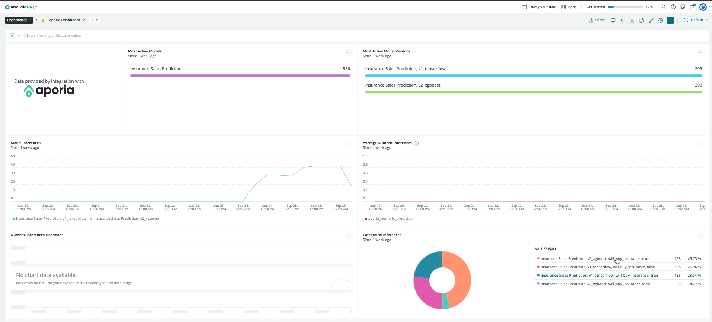
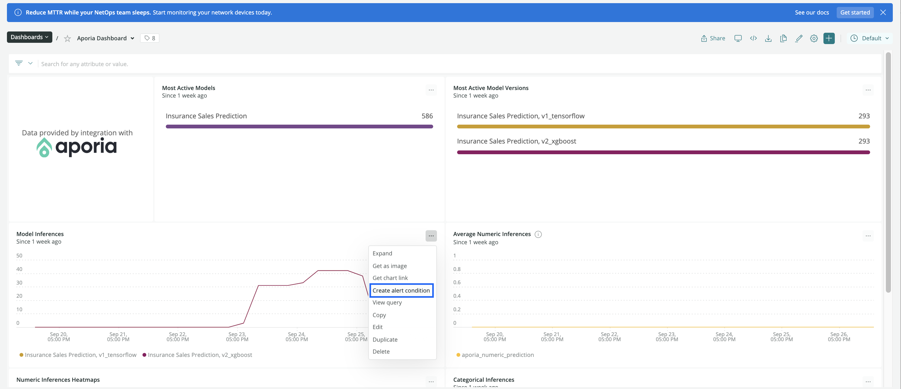
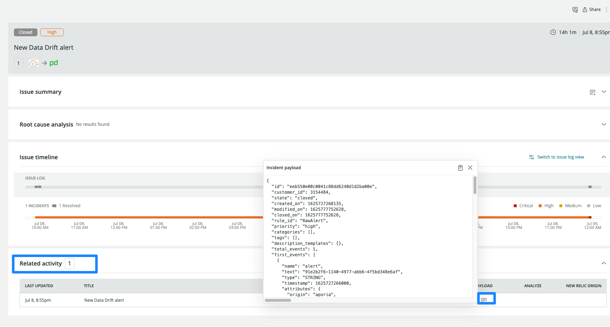

## What is MLOps? [#mlops]

MLOps stands for machine-learning operations. As more companies invest in artificial intelligence and machine learning, there's a gap in understanding between the data science teams developing machine-learning models and the DevOps teams operating the applications that power those models.

MLOps provides a tool for monitoring and observing the performance and effectiveness of machine-learning models in a production environment. This increases the possibilities for collaboration between data science and DevOps teams, feeding into a continuous process of development, testing, and operational monitoring.

## The Aporia integration [#aporia]

Aporia is a fast, easy, and secure way for data science teams to monitor their machine learning models in production. With Aporia, teams can build their own customizable monitors in minutes to receive live alerts for early detection of issues like data drift, unexpected bias, data integrity issues, and performance degradation. Aporia also has an investigation toolbox to enable further investigation and root cause analysis. [Learn more about Aporia](https://www.aporia.com). 

Aporia now offers an integration with New Relic to provide full model management of the MLOps infrastructure, with customized dashboards within New Relic that show inferences investigation.

## Integrate Aporia with New Relic [#integrate-aporia] 

Aporia allows you to connect alerts generated by Aporia’s monitors to New Relic’s Incident Intelligence engine and the predictions data in order to create a comprehensive monitoring dashboard in New Relic for your models.

1. **Login into Aporia’s console**: On the navbar on the left, click on **Integrations** and choose **New Relic**.

2. **Login into your New Relic account:** Log into **[one.newrelic.com](https://one.newrelic.com)** and click on **Explorer**. On the upper hand corner, on the main navigation menu, click on **+Add more data**.     
    
3. **Click on Aporia:** In the search bar, type **Aporia** or scroll down to the MLOps Integration section and click on the **Aporia icon**.  
      
4. **Get an API key:** Once you click on the Aporia icon, follow step one by clicking **Select** or **Create API key**, under **Prediction data**. You need to create a new API key or use an existing one. 
 
5. **Copy and paste the token in Aporia:** Copy the token by clicking on the **Copy icon** next to the API Key. On Aporia’s dashboard, under the New Relic Integration screen, paste the token under **New Relic insert token** and click **Save**.

6. **Verify the tokens:** In the Aporia dashboard, click on the **Verify tokens** button to verify both tokens are working properly. **Green** check marks or **Red** error marks should appear to indicate the status. 
            
## Monitor your machine learning models with Aporia

Now that you’ve integrated New Relic and Aporia, you can monitor your data using [dashboards](/docs/query-your-data/explore-query-data/dashboards/introduction-dashboards/) with automated charts created by Aporia. 
    
1. **Go to the integration dashboard:** Once you’ve verified your tokens and confirmed the integration is set up correctly, return to the New Relic integration dashboard and click on **See your data**. This will redirect you to an automatically generated dashboard displaying data reported to Aporia in New Relic. 

2. **Analyze Aporia's dashboard:** Aporia’s dashboard contains 6 charts. The **Most active models** chart and the **Most active model versions** chart display the different models and versions which reported predictions in the selected timeframe. The **Model inferences** graph displays the number of unique predictions reported for each model and version. The **Average numeric inferences** chart displays the average value numeric predictions reported for each model and version. The **Numeric inferences heatmaps** chart displays a histogram of the numeric predictions reported for each model and version. And finally the **Categorical inferences** charts display the different unique values and their frequencies of categorical predictions reported for each model and version. 

    
3. **Filter data:** Click on the **…** button and click on **Edit**. On the right navbar, under **User as filter**, enable **Filter the current dashboard** and click **Save**.
        
4. **Setup alert notifications:** Once you've created some dashboards, you can get alerted on your data. To create a NRQL alerts condition from a chart, click the chart widget, then click **Create alert condition**. Once you've named and customized your condition, you can add it to an existing policy or create a new one.

5. **Get notified:** Once you've created an alerts condition, you can choose how you want to be notified. See our docs on [how to set up notification channels](/docs/alerts-applied-intelligence/new-relic-alerts/alert-notifications/notification-channels-control-where-send-alerts/).
        
6. **Correlate your incidents:** In addition to notifications, you can use Incident Intelligence to correlate your incidents. See our docs on [how to correlate incidents using decisions](/docs/alerts-applied-intelligence/applied-intelligence/incident-intelligence/change-applied-intelligence-correlation-logic-decisions/).

