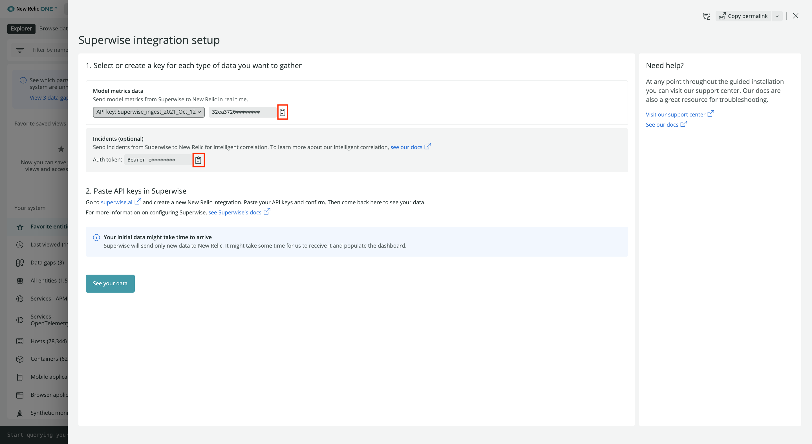
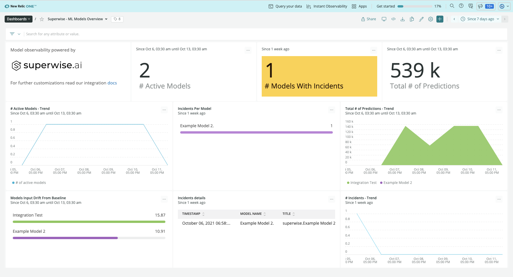

## What is MLOps? [#mlops]

MLOps stands for machine-learning operations. As more companies invest in artificial intelligence and machine learning, there's a gap in understanding between the data science teams developing machine-learning models and the DevOps teams operating the applications that power those models.

MLOps provides a tool for monitoring and observing the performance and effectiveness of machine-learning models in a production environment. This increases the possibilities for collaboration between data science and DevOps teams, feeding into a continuous process of development, testing, and operational monitoring.

## What is Superwise? [#superwise]

Superwise now offers an integration with New Relic to help users add the state of their AI as monitored by Superwise to their centralized operational view on New Relic.

## Migrate Data from Superwise with New Relic [#integrate-superwise] 

Superwise’s KPI and incidents integration streamlines results of our out-of-the-box model KPIs, including drift, activity, incidents, and any custom KPI you configure, directly into New Relic One. You’ll get an immediate overview of which models are misbehaving that can be tailored to any use case, logic, segmentation, threshold, and sensitivity. 

In order to receive data from Superwise into New Relic, you’ll need to do the following:
1. **Login into your New Relic account:** Log into **[one.newrelic.com](https://one.newrelic.com)** and click on **Explorer**. On the upper hand corner, on the main navigation menu, click on **+ Add more data**.

2. **Click on Superwise:** In the search bar, type **Superwise** or scroll down to the MLOps Integration section, then click on the **Superwise icon**.  

3. **Select an account ID:** Select the account ID you want Superwise to integrate with.

4. **Create two access tokens:** 
* Once you select an Account ID, under **Prediction data + Generate Dashboard**, click **Create a key**. This is your new **telemetry API key**. 
* In addition, under **Model quality metric**, click **Create a Key**. This is your **Incident Insights key**. Keep the New Relic page open for future steps.  

5. **Log into the Superwise portal:** Log into the Superwise portal and go to **Notification channel settings**. Select **New Relic** and create a channel name.

6. **Copy and paste the token in Superwise:** Go back to the New Relic integration dashboard and copy the two tokens you created by clicking on the **copy** icon next to the **API key** and **Insight key**. On Superwise’s portal, on the **New Relic** channel, paste the **API key** under **Incident Intelligence API**, and the **Insight key** under **Telemetry Key**. Finish by clicking **Save**.

7. **Verify the Token:** Click on the **Test** button in the Superwise channel portal, to verify both tokens are working properly. A **green** or **red** status box should appear to indicate the verification.

## View and explore your Superwise models in New Relic dashboards

Once a user configures the New Relic integration in Superwise, standard model metrics are sent to New Relic and users get model [observability dashboards](/docs/query-your-data/explore-query-data/dashboards/introduction-dashboards/) within New Relic. Users can also configure any specific model metric and incident policy and send them to  New Relic for model observability tailored to their business context. 

1. **Go to the integration dashboard:** Once you’ve tested your tokens and confirmed the integration is set up correctly, return to the New Relic integration dashboard and click on **See your data**. This will redirect you to an automatically generated dashboard powered by Superwise.

2. **Analyze Superwise’s dashboard.** Superwise’s dashboard contains 3 charts: 
* The **Model activity** chart displays the number of active models, their activity, and the total number of predictions during a filtered timeframe. 
* The **Model input drift** detection chart displays which models are drifting and may require retraining using a model drift leveler, scaled between 0 and 100. 
* The **Incident Insights** chart displays how many models have open incidents, how incidents are being distributed, and deeper details on the model incident itself. 

3. **Customize metrics and incidents in Superwise:** Teams can easily customize any model metric and incident type in the Superwise platform. They can then search for these metrics in the New Relic **Browser** tab under **Metrics**. To do this, follow [the instructions in step 4 in the Superwise docs](https://docs.superwise.ai/docs/new-relic#4-customize-metrics-and-incidents-you-would-like-to-send).

4. **Setup alert notifications:** Once you've created some dashboards, you can get alerted on your data. To create a NRQL alerts condition from a chart, click the chart widget, then click **Create alert condition**. Once you've named and customized your condition, you can add it to an existing policy or create a new one.

5. **Get notified:** Once you've created an alerts condition, you can choose how you want to be notified. See our docs on [how to set up notification channels](/docs/alerts-applied-intelligence/new-relic-alerts/alert-notifications/notification-channels-control-where-send-alerts/).

6. **Correlate your incidents:** In addition to notifications, you can use Incident Intelligence to correlate your incidents. See our docs on [how to correlate incidents using decisions](/docs/alerts-applied-intelligence/applied-intelligence/incident-intelligence/change-applied-intelligence-correlation-logic-decisions/).

You’ve now successfully integrated New Relic with Superwise. Newly created alerts will now be correlated with your New Relic alerts and you should be able to see data about newly reported predictions. 
