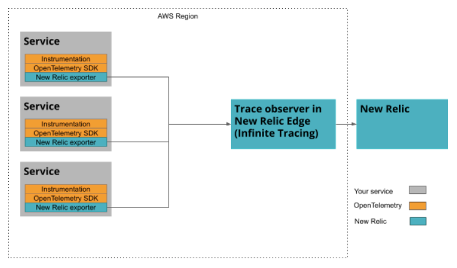

OpenTelemetry is powerful because of its flexibility, but this flexibility can be overwhelming as you consider ways to implement it. Here are some architectural recipes to give you you some context as you explore OpenTelemetry.

## Vendor-neutral option [#neutral]

Use this recipe if you don’t want to add any vendor-specific code to your applications. As a best practice to maximize value and interoperability, we recommend the OpenTelemetry collector as the main ingredient of this recipe. The OpenTelemetry collector proxies data between instrumented code and backend services.

<Callout variant="tip">
We have a pre-release program that allows you to use the OTLP exporter in the collector. If you are interested, let us know by completing this [form](https://docs.google.com/forms/d/e/1FAIpQLSdIJVEAYaP7TXe9LmQA64yIObGvt-nOiz5kXYsjxLBbvut_1A/viewform).  
</Callout>

The OpenTelemetry collector has one or more pipelines. Each pipeline includes:

* A [receiver](https://opentelemetry.io/docs/collector/configuration/#receivers) that accepts telemetry data coming from instrumentation.
* Zero or more [processors](https://opentelemetry.io/docs/collector/configuration/#processors) that perform computations or mutations on the telemetry data.
* One or more [exporters](https://opentelemetry.io/docs/collector/configuration/#exporters) that send telemetry data downstream.

New Relic (along with many other community members) contributes its exporter to the opentelemetry-collector-contrib project. You can enable and configure the exporters in this project without changing instrumented code.

Some example exporters are:

* The New Relic exporter that sends metric and trace data to New Relic.
* A logging exporter that logs every data point to STDOUT.
* A Prometheus exporter that exposes a Prometheus endpoint to be scraped by a downstream Prometheus system.

The OpenTelemetry Collector (with exporters) is available as a [pre-built docker image](https://hub.docker.com/r/otel/opentelemetry-collector-contrib).

Two common collector deployments are the standalone service and sidecar. We cover them briefly here, but if you need more detail, see the [OpenTelemetry documentation](https://opentelemetry.io/docs/collector/getting-started/).

### Standalone Service [#standalone]

When you set up the collector as a standalone service, OpenTelemetry calls this a gateway:

### Sidecar/Daemon/Agent [#sidecar]

If you set up the collector as a sidecar, OpenTelemetry calls this an agent:

## Tail-based sampling [#tail-based]

By default, OpenTelemetry uses head-based sampling, which means traces are randomly sampled up front before details about the completed traces are known. As an alternative, you can configure OpenTelemetry to use our tail-based sampling, which analyzes all your traces after they're completed. If you want to use tail-based sampling, set up the collector to send every span to a trace observer in New Relic Edge where they're analyzed.

<Callout variant="tip">
  For more information about tail-based sampling, see [Introduction to Infinite Tracing](/docs/understand-dependencies/distributed-tracing/infinite-tracing/introduction-infinite-tracing).
</Callout>

### Infinite Tracing with the OpenTelemetry collector (recommended) [#infinite-tracing-collector]

In this approach, the collector and the trace observer handle the data before it's sent to New Relic:

### Infinite Tracing with exporters [#infinite-tracing-exporters]

If a New Relic exporter or bundle is available for your language, you can skip the collector and send data directly to our trace observer:

