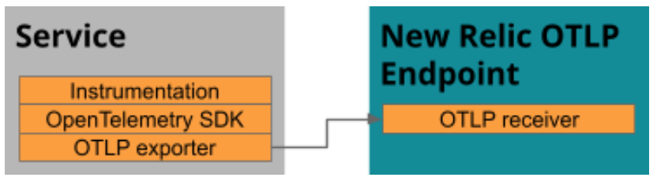

OpenTelemetry is a flexible toolkit that you can implement in a variety of ways. We recommend a basic four-step approach for setting up OpenTelemetry with New Relic. Here's an overview of the process, followed by details for each step.

1. [Prerequisites](#prereqs)
2. [Instrument your service with OpenTelemetry](#instrument)
3. [Send your telemetry data to New Relic](#send)
4. [View your data in the New Relic UI](#view-data)

## Step 1. Prerequisites [#prereqs]

First things first:

* If we don’t already know you, sign up for a free [New Relic account](/docs/accounts/accounts-billing/account-setup/create-your-new-relic-account).
* Make sure you have an [Insights insert key](/docs/telemetry-data-platform/ingest-manage-data/ingest-apis/use-event-api-report-custom-events#) to send spans and metrics to New Relic.

## Step 2. Instrument your service with OpenTelemetry [#instrument]

To get started, you instrument your service with OpenTelemetry. OpenTelemetry has language-specific products and SDKs to help you. Many languages offer out-the-box instrumentation for common libraries and frameworks. Each language also provides an API for further instrumenting your service manually.

<Callout variant="tip">
  We recommend that you instrument as many services as possible to get the most benefit from distributed tracing.
</Callout>

Go to the repository for your language and follow the instructions to instrument your service. When you're done, return here to complete the next step of [sending your telemetry data to New Relic](#send).

* [C++](https://github.com/open-telemetry/opentelemetry-cpp)
* [Erlang](https://github.com/open-telemetry/opentelemetry-erlang)
* [Go](https://github.com/open-telemetry/opentelemetry-go)
* [Java](https://github.com/open-telemetry/opentelemetry-java)
* [Javascript/Node.js](https://github.com/open-telemetry/opentelemetry-js)
* [.NET](https://github.com/open-telemetry/opentelemetry-dotnet)
* [PHP](https://github.com/open-telemetry/opentelemetry-php)
* [Python](https://github.com/open-telemetry/opentelemetry-python)
* [Ruby](https://github.com/open-telemetry/opentelemetry-ruby)
* [Rust](https://github.com/open-telemetry/opentelemetry-rust)
* [Swift](https://github.com/open-telemetry/opentelemetry-swift)
* [...See a complete list of languages in GitHub](https://github.com/open-telemetry)

## Step 3. Send your telemetry data to New Relic [#send]

Choose how you want to export your telemetry data to New Relic:

* [Use the OpenTelemetry collector (recommended)](#collector)
* [Use the native OTLP endpoint (pre-release)](#otlp)

Both approaches involve configuring your service with an OTLP exporter to send data over the OpenTelemetry Protocol (OTLP).

To do so, follow the documentation of the OTLP exporter for your service's language:
   * [C++](https://github.com/open-telemetry/opentelemetry-cpp/tree/master/exporters/otlp)
   * [Erlang](https://github.com/open-telemetry/opentelemetry-erlang/tree/master/apps/opentelemetry_exporter)
   * [Go](https://pkg.go.dev/go.opentelemetry.io/otel/exporters/otlp)
   * [Java](http://github.com/open-telemetry/opentelemetry-java-instrumentation#getting-started)
   * [Javascript/Node.js](https://www.npmjs.com/package/@opentelemetry/exporter-collector)
   * [.NET](https://github.com/open-telemetry/opentelemetry-dotnet/tree/master/src/OpenTelemetry.Exporter.OpenTelemetryProtocol)
   * [PHP](https://github.com/open-telemetry/opentelemetry-php/blob/master/examples/AlwaysOnOTLPExample.php)
   * [Python](https://opentelemetry-python.readthedocs.io/en/stable/exporter/otlp/otlp.html)
   * [Ruby](https://github.com/open-telemetry/opentelemetry-ruby/tree/master/exporter/otlp)
   * [Rust](https://crates.io/crates/opentelemetry-otlp)
   * [Swift](https://github.com/open-telemetry/opentelemetry-swift/tree/master/Sources/Exporters/OpenTelemetryProtocol)
   * [...Find additional OTLP language support in GitHub](https://github.com/open-telemetry)

<Callout variant="important">
New Relic's language-specific exporters for OpenTelemetry are now deprecated in favor of the OpenTelemetry collector
and native OTLP endpoint options described here. If you were previously using a New Relic language-specific exporter
consider signing up for the pre-release of New Relic's [native OTLP endpoint](#otlp).
</Callout>

If you are interested in tracing, there are two main options for trace sampling:

* Configure the head-based, native sampling in OpenTelemetry, which means OpenTelemetry samples traces before they are sent to New Relic. Head-based sampling doesn’t analyze all traces, but instead randomly samples traces up front before details about the completed traces are known. Both the OpenTelemetry collector and the native OTLP endpoint support this option.
* If you want New Relic to analyze all your traces, configure tail-based sampling with New Relic Infinite Tracing, which reroutes traces to our cloud-based trace observer. The trace observer accepts all your traces and sorts through them to find useful ones. If you want to know more about this option, especially if you want to use it in the EU, see [Introduction to Infinite Tracing](/docs/understand-dependencies/distributed-tracing/infinite-tracing/introduction-infinite-tracing). While Infinite Tracing is not yet compatible with the native OTLP endpoint, it is still possible to configure tail-based sampling via the collector, for more information see [Tail Sampling Processor](https://github.com/open-telemetry/opentelemetry-collector-contrib/tree/main/processor/tailsamplingprocessor).

### Use the OpenTelemetry collector (recommended) [#collector]

The OpenTelemetry project provides a tool called the [OpenTelemetry Collector](https://github.com/open-telemetry/opentelemetry-collector) that you can deploy and use as an intermediate data aggregator. In your service, you use the OpenTelemetry exporter to send telemetry data first to the OpenTelemetry collector. Then, in the OpenTelemetry collector, you enable the New Relic exporter to send data to New Relic.

The diagram below shows the flow of data with the collector.

To use the collector:

1. Configure your OpenTelemetry collector to export data to New Relic, using our [example](https://github.com/open-telemetry/opentelemetry-collector-contrib/tree/main/exporter/newrelicexporter) as a guide.

<Callout variant="important">
The New Relic exporter for the collector will be deprecated in the future. If you are running your own collector, you will instead be able to use the [OpenTelemetry Collector's OTLP exporter](https://github.com/open-telemetry/opentelemetry-collector/tree/main/exporter/otlpexporter) When we release our [native OTLP endpoint (pre-release)](#otlp), th If you were previously using a New Relic language-specific exporter consider using the OTLP exporter for your language and send data directly to New Relic's [native OTLP endpoint (pre-release)](#otlp).
</Callout>

### Use the native OTLP endpoint (pre-release) [#otlp]

The example above uses a New Relic exporter, but we have a pre-release program if you want to try out the native OTLP endpoint for sending your data to New Relic. You can either use the OTLP exporter in the OpenTelemetry collector or send us data directly from your service. If you are interested, let us know by completing this [form](https://docs.google.com/forms/d/e/1FAIpQLSdIJVEAYaP7TXe9LmQA64yIObGvt-nOiz5kXYsjxLBbvut_1A/viewform).

You can configure your service's OTLP exporter to send data directly to New Relic.

If you're running your own OpenTelemetry collector, you can use the
[OTLP exporter for the collector](https://github.com/open-telemetry/opentelemetry-collector/tree/main/exporter/otlpexporter)
to send data to New Relic.

## Step 4. View your data in the New Relic UI [#view-data]

Once you’ve instrumented your service and configured it to export its data to New Relic, you can go to New Relic and view your data.

The UI for OpenTelemetry has some similarities to the APM agent UI, so if you are familiar with that, you can go right to the UI. If you need help understanding your OpenTelemetry UI options, see [View your OpenTelemetry data in New Relic](/docs/integrations/open-source-telemetry-integrations/opentelemetry/view-your-opentelemetry-data-new-relic).
