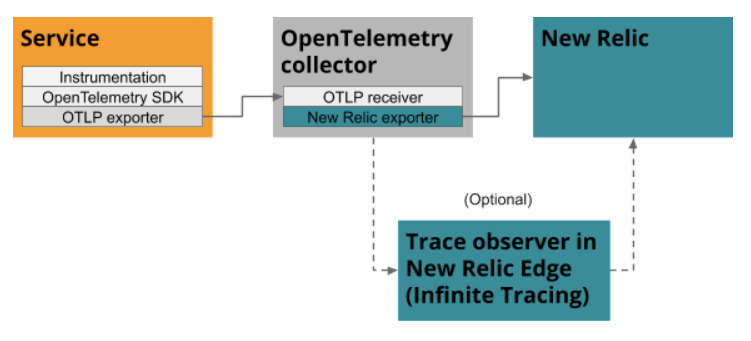

OpenTelemetry is a flexible toolkit that you can implement in a variety of ways. We recommend a basic four-step approach for setting up OpenTelemetry with New Relic. Here's an overview of the process, followed by details for each step.

1. [Prerequisites](#prereqs)
2. [Instrument your service with OpenTelemetry](#instrument)
3. [Send your telemetry data to New Relic](#send)
4. [View your data in the New Relic UI](#view-data)

In the following sections, we explain some basic architectural approaches, but if you want to explore other implementation options, check out [OpenTelemetry architecture recipes](/docs/integrations/open-source-telemetry-integrations/opentelemetry/opentelemetry-architecture-recipes).

## Step 1. Prerequisites [#prereqs]

First things first:

* If we don’t already know you, sign up for a free [New Relic account](/docs/accounts/accounts-billing/account-setup/create-your-new-relic-account).
* Make sure you have an [Insights insert key](/docs/telemetry-data-platform/ingest-manage-data/ingest-apis/use-event-api-report-custom-events#) to send spans and metrics to New Relic.

## Step 2. Instrument your service with OpenTelemetry [#instrument]

To get started, you instrument your service with OpenTelemetry. OpenTelemetry has language-specific products and SDKs to help you. Many languages offer out-the-box instrumentation for common libraries and frameworks. Each language also provides an API for further instrumenting your service manually.

Go to the repository for your language and follow the instructions to instrument your service. When you're done, return here to complete the next step of [sending your telemetry data to New Relic](#send).

* [C++](https://github.com/open-telemetry/opentelemetry-cpp)
* [Erlang](https://github.com/open-telemetry/opentelemetry-erlang)
* [Go](https://github.com/open-telemetry/opentelemetry-go)
* [Java](https://github.com/open-telemetry/opentelemetry-java)
* [Javascript/Node.js](https://github.com/open-telemetry/opentelemetry-js)
* [.NET](https://github.com/open-telemetry/opentelemetry-dotnet)
* [PHP](https://github.com/open-telemetry/opentelemetry-php)
* [Python](https://github.com/open-telemetry/opentelemetry-python)
* [Ruby](https://github.com/open-telemetry/opentelemetry-ruby)
* [Rust](https://github.com/open-telemetry/opentelemetry-rust)
* [Swift](https://github.com/open-telemetry/opentelemetry-swift)
* [...See a complete list of languages in GitHub](https://github.com/open-telemetry)

<Callout variant="tip">
  For Java, you have the alternative of using our OpenTelemetry integration bundle that automatically instruments your service and exports data to New Relic. If you complete the [setup for the the integration bundle](https://github.com/newrelic/newrelic-opentelemetry-integration-java), you can skip the next step and go right to [Step 4: View your data in the New Relic UI](#view-data).
</Callout>

## Step 3. Send your telemetry data to New Relic [#send]

Choose how you want to export your telemetry data to New Relic:

* [Use the OpenTelemetry collector (recommended)](#collector)
* [Use a New Relic language-specific exporter (if available)](#skip-collector)

You can use one or both of these approaches in your environment. We'll discuss some highlights of each approach here, but if you need more background, see [Introduction to OpenTelemetry](/docs/integrations/open-source-telemetry-integrations/opentelemetry/opentelemetry-exporter).

<Callout variant="tip">
  Both approaches require a New Relic Insights insert key, so keep it handy.
</Callout>

### Use the OpenTelemetry collector (recommended) [#collector]

The OpenTelemetry project provides a tool called the [OpenTelemetry Collector](https://github.com/open-telemetry/opentelemetry-collector) that you can deploy and use as an intermediate data aggregator. In your service, you use the OpenTelemetry exporter to send telemetry data first to the OpenTelemetry collector. Then, in the OpenTelemetry collector, you enable the New Relic exporter to send data to New Relic.

The diagram below shows the flow of data with the collector. If you want New Relic to analyze all your traces, you can also set up [Infinite Tracing](/docs/understand-dependencies/distributed-tracing/infinite-tracing/introduction-infinite-tracing).

To use the collector:

1. Configure your OpenTelemetry collector to export data to New Relic, using our [example](https://github.com/open-telemetry/opentelemetry-collector-contrib/tree/master/exporter/newrelicexporter) as a guide.
2. Configure your service’s OTLP exporter to send data to your collector, following the documentation for your language's OTLP exporter:
   * [C++](https://github.com/open-telemetry/opentelemetry-cpp/tree/master/exporters/otlp)
   * [Erlang](https://github.com/open-telemetry/opentelemetry-erlang/tree/master/apps/opentelemetry_exporter)
   * [Go](https://pkg.go.dev/go.opentelemetry.io/otel/exporters/otlp)
   * [Java](http://github.com/open-telemetry/opentelemetry-java-instrumentation#getting-started)
   * [Javascript/Node.js](https://www.npmjs.com/package/@opentelemetry/exporter-collector)
   * [.NET](https://github.com/open-telemetry/opentelemetry-dotnet/tree/master/src/OpenTelemetry.Exporter.OpenTelemetryProtocol)
   * [PHP](https://github.com/open-telemetry/opentelemetry-php/blob/master/examples/AlwaysOnOTLPExample.php)
   * [Python](https://opentelemetry-python.readthedocs.io/en/stable/exporter/otlp/otlp.html)
   * [Ruby](https://github.com/open-telemetry/opentelemetry-ruby/tree/master/exporter/otlp)
   * [Rust](https://crates.io/crates/opentelemetry-otlp)
   * [Swift](https://github.com/open-telemetry/opentelemetry-swift/tree/master/Sources/Exporters/OpenTelemetryProtocol)
   * [...Find additional OTLP language support in GitHub](https://github.com/open-telemetry)

### Use a New Relic language-specific exporter [#skip-collector]

<Callout variant="tip">
  If you are using our [Java integration bundle](https://github.com/newrelic/newrelic-opentelemetry-integration-java), you can skip this step because the export is configured automatically.
</Callout>

If you prefer not to use the OpenTelemetry collector, for selected languages, we offer a New Relic exporter to send data directly from your service to New Relic.

The diagram below shows the flow of data without the collector. If you want New Relic to analyze all your traces, you can also set up [Infinite Tracing](/docs/understand-dependencies/distributed-tracing/infinite-tracing/introduction-infinite-tracing).

Go to the New Relic repository for your language and follow the instructions for setting up the exporter. When you are finished, return here for tips about [viewing your data in the New Relic UI](#view-data):

* [New Relic Go OpenTelemetry exporter](https://github.com/newrelic/opentelemetry-exporter-go)
* [New Relic Trace Exporter for OpenTelemetry .NET](https://github.com/newrelic/newrelic-telemetry-sdk-dotnet/tree/main/src/NewRelic.OpenTelemetry)

## Step 4: View your data in the New Relic UI [#view-data]

Once you’ve instrumented your service and configured it to export its data to New Relic, you can go to New Relic and view your data.

The UI for OpenTelemetry has some similarities to the APM agent UI, so if you are familiar with that, you can go right to the UI. If you need help understanding your OpenTelemetry UI options, see [View your OpenTelemetry data in New Relic](/docs/integrations/open-source-telemetry-integrations/opentelemetry/view-your-opentelemetry-data-new-relic).
