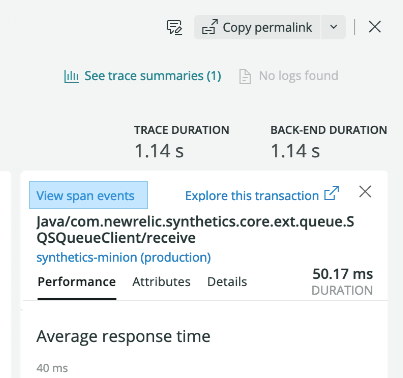
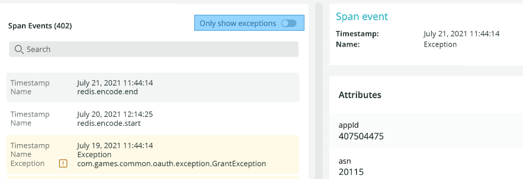

After you import OpenTelemetry data into New Relic, you can use a variety of tools to analyze it. Take a look at these UI options:

* [Explorer](#explorer)
* [Data explorer and query builder](#query-builder)

## Explorer: Get the big picture along with the details [#explorer]

The New Relic **Explorer** tab is a good place to start gathering information about your services: 

1. Go to [one.newrelic.com](https://one.newrelic.com).
2. In the left sidebar, click **Services - OpenTelemetry**:

    

3. In the center pane, click the service you want to know more about, or find your service by entering the name in the top filter bar.

If you need help understanding how we display your data, see the left-pane options below.

### Summary page [#summary]

After you click on a service in the **Explorer** tab, you see the **Summary** page listing various golden signals about your entity. Golden signals are key monitoring details such as response time, throughput, and error rate. By using this information, you can quickly decide if you need to dig deeper.

For your data to appear in this section, make sure it has the following attributes:

<table>
  <thead>
    <tr>
      <th style={{ width: "200px" }}>
        UI pane
      </th>
      <th>
        Attribute
      </th>
    </tr>
  </thead>
    <tbody>
    <tr>
      <td>
        Response time
      </td>
      <td>
        `span.kind = server` or `consumer` 
      </td>
    </tr>
    <tr>
      <td>
        Throughput
      </td>
      <td>
        `span.kind = server` or `consumer` 
      </td>
    </tr>
    <tr>
      <td>
       Error rate 
      </td>
      <td>
        * `span.kind = server` or `consumer` 
        * `otel.status_code = ERROR`
      </td>
    </tr>
      <tr>
      <td>
        Service instances pane
      </td>
      <td>
        `service.instance.id` (usually set via the OTel resource API)
      </td>
    </tr>
    </tbody>
</table>

### Distributed tracing [#tracing]

In **Distributed tracing**, you can locate traces and examine span details. For your trace data to appear in the New Relic UI, it needs to conform to the [OpenTelemetry trace semantic conventions](https://github.com/open-telemetry/opentelemetry-specification/tree/main/specification/trace/semantic_conventions#trace-semantic-conventions).

The following attributes are typically not added explicitly to spans. Rather, they are usually set when creating a span or performing operations (for example, recording an error) on a span using the OpenTelemetry SDK.

<table>
  <thead>
    <tr>
      <th style={{ width: "200px" }}>Attribute</th>
      <th>Description</th>
    </tr>
  </thead>
    <tbody>
    <tr>
      <td>
        name
      </td>
      <td>
        A span’s name is generally set when [starting a span](https://github.com/open-telemetry/opentelemetry-specification/blob/main/specification/trace/api.md#span-creation). The name can generally be anything, but the OpenTelemetry specification provides guidance for certain types of spans like [Database spans](https://github.com/open-telemetry/opentelemetry-specification/blob/main/specification/trace/semantic_conventions/database.md#semantic-conventions-for-database-client-calls) or [HTTP spans](https://github.com/open-telemetry/opentelemetry-specification/blob/main/specification/trace/semantic_conventions/http.md#name).
      </td>
    </tr>
    <tr>
      <td>
        [span.kind](https://github.com/open-telemetry/opentelemetry-specification/blob/main/specification/trace/api.md#spankind)
      </td>
      <td>
        A span’s kind is generally set when [starting a span](https://github.com/open-telemetry/opentelemetry-specification/blob/main/specification/trace/api.md#span-creation). New Relic uses span.kind to infer that a span is an entry point to a given service. When span.kind = server or consumer it is considered an entry point. When `span.kind = client` or `producer`, it is considered a call to an external service or database system.

      </td>
    </tr>
    <tr>
      <td>
        otel.status_code
      </td>
      <td>
        * A span’s [status is set](https://github.com/open-telemetry/opentelemetry-specification/blob/main/specification/trace/api.md#set-status) using the span API. The `otel.status_code` attribute is how it is manifested by New Relic.
        * The OIE experience primarily uses `otel.status_code` for the purpose of identifying errors.
      </td>
    </tr>
    </tbody>
</table>

#### Narrow your search

Here are some ways to target your searches:

1. To narrow the search for traces you want, you can run queries like these in the filter bar:
    * `service.name = YOUR_SERVICE_NAME`
    * `trace.id = YOUR_TRACE_ID`
2. When you find an interesting trace, click on it to display a waterfall diagram showing the spans of the trace. 
3. Click on specific spans within the trace to display span details in the right panel.

<Callout variant="tip">
For more ways to filter traces, see our [distributed tracing UI page](/docs/understand-dependencies/distributed-tracing/ui-data/understand-use-distributed-tracing-ui).
</Callout>

#### View spans with errors

After you click on a span in the trace waterfall view, you can see span errors in the right panel under **Error details**.

The error details are populated by spans containing `otel.status_code = ERROR` and display the content of `otel.status_description`.

To narrow your search for spans with errors, you can enter `otel.status_code = ERROR` directly in the distributed tracing filter bar.

#### View span events

If you send span events as described by the [OpenTelemetry specification](https://github.com/open-telemetry/opentelemetry-specification/blob/main/specification/trace/api.md#add-events), you can view them in the New Relic UI. Span events have two general types:
  * Exceptions 
  * Non-exceptions (for example, logs)

If you have span events, links for these appear in the right pane:

1. Click on a span in the waterfall view.
2. In the right pane, click **View span events**, or you can expand **Error details** and click the link at the bottom of the errors.

  

3. When you're in span events and only want to view exceptions, slide the toggle **Only show exceptions**.

            
<Callout variant="tip">
OpenTelemetry exceptions handled by the app/service are displayed independently of span error status and are not necessarily associated with a span error status.
</Callout>

#### View spans with errors

After you click on a span in the trace waterfall view, you can see span errors in the right panel under **Error details**.

The error details are populated by spans containing `otel.status_code = ERROR` and display the content of `otel.status_description`.

To narrow your search for spans with errors, you can enter `otel.status_code = ERROR` directly in the distributed tracing filter bar.

#### View span events

If you send span events as described by the [OpenTelemetry specification](https://github.com/open-telemetry/opentelemetry-specification/blob/main/specification/trace/api.md#add-events), you can view them in the New Relic UI. Span events have two general types:
  * Exceptions 
  * Non-exceptions (for example, logs)

If you have span events, links for these appear in the right pane:

1. Click on a span in the waterfall view.
2. In the right pane, click **View span events**, or you can expand **Error details** and click the link at the bottom of the errors.

  

3. When you're in span events and only want to view exceptions, toggle **Only show exceptions**.

            
<Callout variant="tip">
OpenTelemetry exceptions handled by the app/service are displayed independently of span error status. These exceptions are not necessarily associated with a span error status.
</Callout>

For your data to appear in this section, make sure it has the following attributes:

<table>
  <thead>
    <tr>
      <th style={{ width: "200px" }}>
        UI pane
      </th>
      <th>
        Description
      </th>
    </tr>
  </thead>
    <tbody>
    <tr>
      <td>
        Top Transactions  
      </td>
      <td>
       * `span.kind = server` or `consumer`
       * Facets by span name
      </td>
    </tr>
    <tr>
      <td>
        Throughput  
      </td>
      <td>
       * `span.kind = server` or `consumer`
       * Facets by span name
      </td>
    </tr>
    </tbody>
</table>

### Databases [#databases]

The **Databases** page shows an application's database and cache data. The page shows individual database transactions as a sortable table, and shows operations, throughput, and response time as charts.

For your data to appear in this section, make sure it has the following attributes:

<table>
  <thead>
    <tr>
      <th style={{ width: "200px" }}>
        UI pane
      </th>
      <th>
        Attribute
      </th>
    </tr>
  </thead>
    <tbody>
    <tr>
      <td>
        Top database calls
      </td>
      <td>
        * `span.kind = client` or `producer`
        * `db.system`
        * Facets by span name (should follow DB semantic conventions - [TO_DO_FIND_LINK and CLARIFY span.name!])
      </td>
    </tr>
    <tr>
      <td>
        Top databases (by query time)
      </td>
      <td>
        * `span.kind = client` or `producer`
        * `db.system`
        * Facets by `db.system`
  
      </td>
    </tr>
    <tr>
      <td>
        Top databases (by throughput)
      </td>
      <td>
        * `span.kind = client` or `producer`
        * `db.system`
        * Facets by `db.system`

      </td>
    </tr>
    </tbody>
</table>

### Externals [#externals]

Externals capture calls to out-of-process services such as web services, resources in the cloud, and other network entities.

<<<<<<< HEAD
<<<<<<< HEAD
For your data to appear in this section, make sure it has the following:
=======
For your data to appear in this section, make sure it has the following attributes:
>>>>>>> feat(OTEL): Added attributes you need to light up UI.

  * `span.kind = client` or `producer`
  * `db.system` is not present

### JVMs

[WE NEED SOME GENERAL TEXT HERE DESCRIBING THIS SECTION!]

When you drill into a specific JVM, the UI display charts driven by JVM metric data:

  * JVM metrics follow the general [semantic conventions for runtime environment metrics](https://github.com/open-telemetry/opentelemetry-specification/blob/main/specification/metrics/semantic_conventions/runtime-environment-metrics.md#runtime-environment-specific-metrics---runtimeenvironment).
  * The Java specific runtime metrics are not well documented. The [implementation](https://github.com/open-telemetry/opentelemetry-java-instrumentation/tree/main/instrumentation/runtime-metrics/library/src/main/java/io/opentelemetry/instrumentation/runtimemetrics) is effectively the documentation and may be subject to change. 

For your data to appear in this section, make sure it has the following:

  * Requires a unique `service.instance.id` attribute for rendering the list of JVMs
  * `Service.instance.id` is an OpenTelemetry resource attribute

<<<<<<< HEAD
=======
>>>>>>> feat(OTEL): Added span event information that is from another branch
=======
>>>>>>> feat(OTEL): Added attributes you need to light up UI.
### Logs [#logs]

The **Logs** page displays logs from your application. For more information about how to associate log data to your application in New Relic, see our [OpenTelemetry and logging documentation](/docs/integrations/open-source-telemetry-integrations/opentelemetry/opentelemetry-logs).

For your data to appear in this section, make sure it has the following:

  * `service.name`
  * To correlate with trace data, the logs should contain the `trace.id` and `span.id` attributes.

### Metrics explorer [#metric-explorer]

For selected OpenTelemetry languages, you can see information about your metrics in this section. Also, if you are using the Prometheus exporter with OpenTelemetry, you can view your metric data here.

### Transactions [#trx]

Use **Transactions** to identify slow or error transactions that might be causing a spike in your application's response time. To get a list of transactions: From the **Transaction Summary** page, select the transactions table.

For your data to appear in this section, make sure it has the following:

<table>
  <thead>
    <tr>
      <th style={{ width: "200px" }}>
        UI area
      </th>
      <th>
        Description
      </th>
    </tr>
  </thead>
    <tbody>
    <tr>
      <td>
        Top Transactions  
      </td>
      <td>
       * `span.kind = server` or `consumer`
       * Facets by span name
      </td>
    </tr>
    <tr>
      <td>
        Throughput  
      </td>
      <td>
       * `span.kind = server` or `consumer`
       * Facets by span name
      </td>
    </tr>
    </tbody>
</table>

## Data explorer and query builder [#query-builder]

Explore your metrics and traces using the [data explorer](/docs/query-your-data/explore-query-data/data-explorer/introduction-data-explorer), or write your own queries in query builder using NRQL. For more on how to query your data once it's in New Relic, see [Query your data](/docs/query-your-data/explore-query-data/explore-data/introduction-querying-new-relic-data) and [Introduction to NRQL](/docs/query-your-data/nrql-new-relic-query-language/get-started/introduction-nrql-new-relics-query-language).
