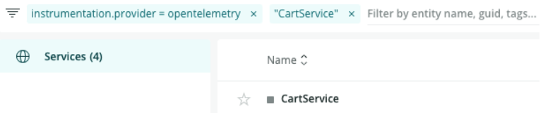

After you import OpenTelemetry data into New Relic, you can use a variety of tools to analyze it. Take a look at these UI options:

* [Explorer](#explorer)
* [Data explorer and query builder](#query-builder)

## Explorer: Get the big picture along with the details [#explorer]

The New Relic explorer is a good place to get overview information about your applications, as well as detailed information, such as distributed tracing.

To get started with the explorer:

1. Open [https://one.newrelic.com](https://one.newrelic.com), and go to **explorer**.
2. Using the filter bar at the top, narrow your searches:
   1. Limit results to OpenTelemetry entities with the following:

      
   2. After the OpenTelemetry filter, you can add another filter for your service based on the `service.name` attributes you've used. For example, to find `CartService`:

      
3. Click the service you want to know more about, and if you need help understanding the data, see the explanations below.

### Summary page [#summary]

The opening page of the explorer is the **Summary** page listing various golden signals about your entity. Golden signals are key monitoring details such as response time, throughput, and error rate. By using this information, you can quickly decide if you need to dig deeper.

### Distributed Tracing [#tracing]

When you access distributed tracing through the explorer, you are looking at traces that include that service. Once you’re in that service, you can filter spans to find the ones you want. For example, to query `service.name` or `trace.id`, you can use the following:

* `service.name = YOUR_SERVICE_NAME`
* `trace.id = YOUR_TRACE_ID`

For more ways to filter and analyze your spans, see our [distributed tracing UI](/docs/understand-dependencies/distributed-tracing/ui-data/understand-use-distributed-tracing-ui) page.

<Callout variant="tip">
  If you prefer to search traces across all New Relic accounts in your organization, you can go outside explorer: **[https://one.newrelic.com](https://one.newrelic.com) > Apps > Favorites > Distributed tracing.**
</Callout>

### Transactions [#trx]

Use Transactions to identify slow or error transactions that might be causing a spike in the response time of your application. From the transaction summary page, you can get a list of transactions by selecting See transactions table.

### Databases

The **Databases** page shows an application's database and cache data. The page shows individual database transactions as a sortable table, and shows operations, throughput, and response time as charts.

### Externals

Externals captures calls to out-of-process services such as web services, resources in the cloud, and other network entities.

### Errors

On this page, you can see total errors, as well as charts showing error count and error rate.

### Metrics Explorer [#metric-explorer]

For selected OpenTelemetry languages, you can see information about your metrics in this section. Also, if you are using the Prometheus exporter with OpenTelemetry, you can view your metric data here.

## Data explorer and query builder [#query-builder]

Explore your metrics and traces using the [data explorer](/docs/query-your-data/explore-query-data/data-explorer/introduction-data-explorer), or write your own queries in query builder using NRQL. For more on how to query your data once it's in New Relic, see [Query your data](/docs/query-your-data/explore-query-data/explore-data/introduction-querying-new-relic-data) and [Introduction to NRQL](/docs/query-your-data/nrql-new-relic-query-language/get-started/introduction-nrql-new-relics-query-language).
