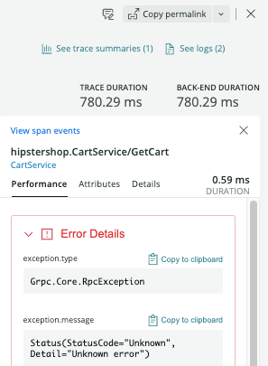

After you import OpenTelemetry data into New Relic, you can use a variety of tools to analyze it. Take a look at these UI options:

* [Explorer](#explorer)
* [Data explorer and query builder](#query-builder)

## Explorer: Get the big picture along with the details [#explorer]

The New Relic **Explorer** tab is a good place to start gathering information about your services: 

1. Go to [one.newrelic.com](https://one.newrelic.com).
2. In the left sidebar, click **Services - OpenTelemetry**:

    

3. In the center pane, click the service you want to know more about, or find your service by entering the name in the top filter bar.

If you need help understanding how we display your data, see the left-pane options below.

### Summary page [#summary]

After you click on a service in the **Explorer** tab, you see the **Summary** page listing various golden signals about your entity. Golden signals are key monitoring details such as response time, throughput, and error rate. By using this information, you can quickly decide if you need to dig deeper.

### Distributed tracing [#tracing]

In **Distributed tracing**, you can locate traces and examine span details:

1. If you don't see the traces you want, you can run queries like these in the filter bar:
    * `service.name = YOUR_SERVICE_NAME`
    * `trace.id = YOUR_TRACE_ID`

<Callout variant="tip">
For more ways to filter traces, see our [distributed tracing UI page](/docs/understand-dependencies/distributed-tracing/ui-data/understand-use-distributed-tracing-ui).
</Callout>

2. When you find an interesting trace, click on it to show a waterfall diagram showing the spans of the trace. 
3. Click on specific spans within the trace to display span details in the right panel.
4. To view error details for a span with `otel.status = ERROR`, click **Error details** in the right pane.

5. To view exception span events for a span:  
    * Click **View span events** in the right pane.
    * Filter by exceptions using the toggle **Only show exceptions**.
    

Span-level errors show you where errors originated in a process, how they bubbled up, and where they were handled. Every span that ends with an exception is shown with an error in the UI and contributes to the total error count for that trace.

Here are some general tips about understanding span errors:

* Spans with errors are highlighted red in the distributed tracing UI. You can see more information on the **Error Details** pane for each span.
* All spans that exit with errors are counted in the span error count.
* When multiple errors occur on the same span, only one is written to the span in this order of precedence:
  * A `noticeError`
  * The most recent span exception

This table describes how different span errors are handled:

  <table>
    <thead>
      <tr>
        <th style={{ width: "200px" }}>
          Error type
        </th>

        <th>
          Description
        </th>
      </tr>
    </thead>

    <tbody>
      <tr>
        <td>
          Spans ending in exceptions
        </td>

        <td>
          An exception that leaves the boundary of a span results in an error on that span and on any ancestor spans that also exit with an error, until the exception is caught or exits the transaction. You can see if an exception is caught in an ancestor span.
        </td>
      </tr>

      <tr>
        <td>
          Notice errors
        </td>

        <td>
          Errors noticed by calls to the agent `noticeError` API or by the automatic agent instrumentation are attached to the currently executing span.
        </td>
      </tr>

      <tr>
        <td>
          Response code errors
        </td>

        <td>
          Response code errors are attached to the associated span, such as:

          * Client span: External transactions prefixed with `http` or `db`.
          * Entry span: In the case of a transaction ending in a response code error.

          The response code for these spans is captured as an attribute `httpResponseCode` and attached to that span.
        </td>
      </tr>
      <tr>
        <td>
          OpenTelemetry Errors
        </td>

          <td>
            Exceptions containing the following are displayed in the **Error Details** box of the right pane: 
            * `otel.status = ERROR` displays the span as having an error.
            * `otel.status_code` displays the status code.
            * `otel.status_description` displays the error description.
            
            <Callout variant="tip">
            OpenTelemetry exceptions handled by the app/service are displayed independently of span error status and are not necessarily associated with a span error status. You can view OpenTelemetry span event exceptions by clicking **View span events** in the right pane.
            </Callout>
          </td>
      </tr>
    </tbody>
</table>

### Transactions [#trx]

Use **Transactions** to identify slow or error transactions that might be causing a spike in your application's response time. To get a list of transactions: From the **Transaction Summary** page, select the transactions table.

### Databases [#databases]

The **Databases** page shows an application's database and cache data. The page shows individual database transactions as a sortable table, and shows operations, throughput, and response time as charts.

### Externals [#externals]

Externals capture calls to out-of-process services such as web services, resources in the cloud, and other network entities.

### Logs [#logs]

The **Logs** page displays logs from your application. For more information about how to associate log data to your application in New Relic, see our [OpenTelemetry and logging documentation](/docs/integrations/open-source-telemetry-integrations/opentelemetry/opentelemetry-logs).

### Metrics explorer [#metric-explorer]

For selected OpenTelemetry languages, you can see information about your metrics in this section. Also, if you are using the Prometheus exporter with OpenTelemetry, you can view your metric data here.

## Data explorer and query builder [#query-builder]

Explore your metrics and traces using the [data explorer](/docs/query-your-data/explore-query-data/data-explorer/introduction-data-explorer), or write your own queries in query builder using NRQL. For more on how to query your data once it's in New Relic, see [Query your data](/docs/query-your-data/explore-query-data/explore-data/introduction-querying-new-relic-data) and [Introduction to NRQL](/docs/query-your-data/nrql-new-relic-query-language/get-started/introduction-nrql-new-relics-query-language).
