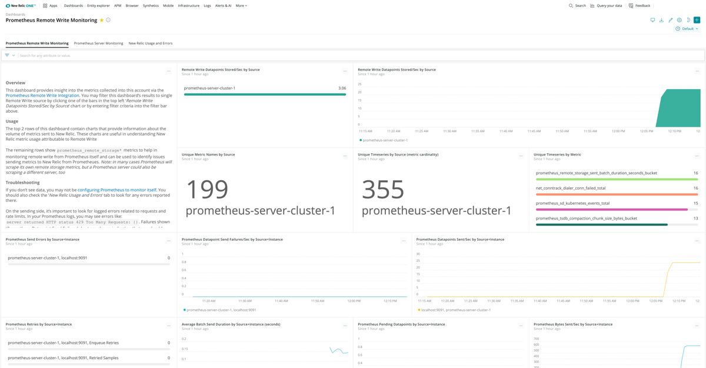

This page provides an overview of New Relic's Prometheus integration options and how they work. The information here will help you choose from among our options based on which one best fits your unique business needs.

## Prometheus OpenMetrics or remote write integration? [#pomi-remote_write]

We currently offer two integration options: [Prometheus remote write integration](#remote-write) and [Prometheus OpenMetrics integration for Kubernetes or Docker](#OpenMetrics). We recommend getting started with the remote write integration if you already have a Prometheus server install base. If you find it hard to manage your Prometheus cluster, or if you are getting started with integrating Prometheus Metrics, you should use OpenMetrics.

<table style={{ width: "800px" }}>
  <thead>
    <tr>
      <th style={{ width: "200px" }}/>

      <th style={{ width: "300px" }}>
        [Prometheus remote write integration](#remote-write)
      </th>

      <th style={{ width: "300px" }}>
        [Prometheus OpenMetrics for Kubernetes or Docker](#OpenMetrics)
      </th>
    </tr>
  </thead>

  <tbody>
    <tr>
      <td>
        **Benefits**
      </td>

      <td>
        * Use this if you currently have Prometheus servers and want an easy way to access your combined metrics from New Relic. It only takes one line of yaml in your Prometheus configuration.
        * You'll be able to access your metrics through both New Relic and Prometheus. You don't need to make any additional adjustments for data to remain available in Prometheus.
        * Federation: Allows you to combine data from multiple servers into a single source.
        * Prometheus [High Availability support](/docs/integrations/prometheus-integrations/install-configure/prometheus-high-availability-ha): We de-duplicate data from HA-pairs on ingest.
      </td>

      <td>
        * Use this if you’re looking for an alternative or replacement to a Prometheus server that stores all your metrics directly in New Relic. You won’t have to manage any Prometheus servers yourself.
        * You don't need local storage.
      </td>
    </tr>

    <tr>
      <td>
        **Keep in mind**
      </td>

      <td>
        * You will still need to manage your Prometheus servers, although you should be able to reduce your storage retention, and there’ll be fewer query loads to the server.
      </td>

      <td>
        * Slightly more complex setup.
        * No support for High Availability replicas.
        * The Kubernetes operator is not available for enhanced operations automation.
      </td>
    </tr>

    <tr>
      <td>
        **Recommendations**
      </td>

      <td>
        * Evaluate your observability needs to manage your data volumes better:
          * The [scrape interval](https://prometheus.io/docs/prometheus/latest/configuration/configuration/#scrape_config) is the biggest factor influencing data volumes: select it based on your observability needs. For example, changing from 15s (default value) to 30s can reduce data volumes by 50%.
          * Set your filters and configure data to target (see [metrics or targets](https://prometheus.io/docs/prometheus/latest/configuration/configuration/#relabel_action)).
        * Balance remote write(s) between one or more new relic accounts or sub-accounts to manage rate limits.
      </td>

      <td/>
    </tr>
  </tbody>
</table>

Regardless of the option you chose, with our Prometheus integrations:

* You can use Grafana or other query tools via New Relic's Prometheus' API.
* You benefit from more nuanced security and user management options as part of [New Relic One](/docs/new-relic-one/use-new-relic-one/get-started/introduction-new-relic-one).
* The [New Relic Telemetry Data Platform](/docs/telemetry-data-platform/ingest-manage-data/get-started/get-know-telemetry-data-platform) can be the centralized long-term data store for all your Prometheus metrics, allowing you to observe all your data in one place.
* You can execute queries to scale, supported by New Relic.

## Prometheus remote write integration [#remote-write]

The Prometheus remote write integration allows you to forward [telemetry data](/docs/telemetry-data-platform/get-started/capabilities/get-know-telemetry-data-platform) from your existing Prometheus servers to New Relic. Once integrated, you can leverage the full range of options for setup and management, from raw data to queries, dashboards, and more.

### Scale your data and get moving quickly [#remote-write-scale]

With the Prometheus remote write integration, you can:

* Store and visualize crucial metrics on a single platform
* Combine and group data across your entire software stack
* Get a fully connected view of the relationship between data about your software stack and the behaviors and outcomes you’re monitoring
* Connect your [Grafana dashboards](/docs/integrations/grafana-integrations/get-started/grafana-support-prometheus-promql) (optional).

<figcaption>
  Prometheus remote write dashboard
</figcaption>

### How it works [#remote-write-how-works]

[Signup for New Relic](https://newrelic.com/signup) is fast and free — we won't even ask for a credit card number. Once logged in, you can get data flowing with a few simple steps:

1. Generate your `remote_write` URL.
2. Add the new `remote_write` URL to the configuration file for your Prometheus server.
3. Restart your Prometheus server.
4. Check for your data.
5. Query and explore!

<ButtonLink
  role="button"
  to="/docs/integrations/prometheus-integrations/install-configure/set-your-prometheus-remote-write-integration"
  variant="link"
>
  Read the setup docs
</ButtonLink>

<ButtonLink
  role="button"
  to="https://one.newrelic.com/launcher/nr1-core.settings?pane=eyJuZXJkbGV0SWQiOiJwcm9tZXRoZXVzLXJlbW90ZS13cml0ZS1pbnRlZ3JhdGlvbi1uZXJkbGV0cy5zZXR1cC1wcm9tZXRoZXVzIn0="
  variant="primary"
>
  Add Prometheus data
</ButtonLink>

### Remote write compatibility and requirements [#remote-write-compatibility]

New Relic supports the Prometheus remote write integration for Prometheus versions 2.15.0 or newer.

## Prometheus OpenMetrics integrations [#OpenMetrics]

New Relic’s Prometheus OpenMetrics integrations for Docker and Kubernetes allow you to scrape [Prometheus](https://prometheus.io/) endpoints and send the data to New Relic, so you can store and visualize crucial metrics on one platform.

With these integrations, you can:

* Automatically identify a static list of endpoints.
* Collect metrics that are important to your business.
* Query and visualize this data in the New Relic UI.
* Connect your [Grafana dashboards](/docs/integrations/grafana-integrations/get-started/grafana-support-prometheus-promql) (optional).

<figcaption>
  Kubernetes OpenMetrics dashboard
</figcaption>

### Reduce overhead and scale your data [#OpenMetrics-reduce-overhead]

Collect, analyze, and visualize your metrics data from any source, alongside your telemetry data, so you can correlate issues all in one place. Out-of-the-box integrations for open-source tools like Prometheus make it easy to get started, and eliminate the cost and complexity of hosting, operating, and managing additional monitoring systems.

Prometheus OpenMetrics integrations gather all your data in one place, and New Relic stores the metrics from Prometheus. This integration helps remove the overhead of managing storage and availability of the Prometheus server.

To learn more about how to scale your data without the hassles of managing Prometheus and a separate dashboard tool, see New Relic's Prometheus OpenMetrics integration [blog post](https://blog.newrelic.com/product-news/how-to-monitor-prometheus-metrics/).

<CollapserGroup>
  <Collapser
    id="OpenMetrics-Kubernetes"
    title="Kubernetes"
  >
    In a Kubernetes environment, New Relic automatically discovers the endpoints in the same way that the Prometheus Kubernetes collector does it. The integration looks for the `prometheus.io/scrape` annotation or label. You can also identify additional static endpoints in the configuration.
  </Collapser>

  <Collapser
    id="OpenMetrics-Docker"
    title="Docker"
  >
    The Prometheus OpenMetrics integration gathers all your data in one place, and New Relic stores the metrics from Prometheus. This integration helps remove the overhead of managing storage and availability of the Prometheus server.
  </Collapser>
</CollapserGroup>

### OpenMetrics integrations compatibility and requirements [#OpenMetrics-Compatibility]

For Kubernetes and Docker OpenMetrics integrations, you should be aware of the following compatibility and requirements information.

<CollapserGroup>
  <Collapser
    id="OpenMetrics-Kubernetes-Compatibility"
    title="Kubernetes"
  >
    New Relic has contributed the Prometheus integration to the open source community under an Apache 2.0 license. This integration supports Prometheus protocol version 2 and Kubernetes versions 1.9 or higher. The integration was tested using Kubernetes 1.9, 1.11, and 1.13 on kops, GKE, and minikube.

    Limits apply to the metrics you send. For more details, see the [metrics API documentation](https://docs.newrelic.com/docs/data-ingest-apis/get-data-new-relic/metric-api/metric-api-limits-restricted-attributes#requirements).

    <Callout variant="important">
      Recommendation: Always run the scraper with one replica. Adding more replicas will result in duplicated data.
    </Callout>
  </Collapser>

  <Collapser
    id="OpenMetrics-Docker-Compatibility"
    title="Docker"
  >
    New Relic has contributed the Prometheus integration to the open source community under an Apache 2.0 license. This integration supports Prometheus protocol version 2. The integration was tested using Docker 1.9, 1.11, and 1.13 on kops, GKE, and minikube.

    Limits apply to the metrics you send. For details, see the [metrics API documentation](https://docs.newrelic.com/docs/data-ingest-apis/get-data-new-relic/metric-api/metric-api-limits-restricted-attributes#requirements).
  </Collapser>
</CollapserGroup>

## What's next [#next]

Ready to get moving? Here are some suggested next steps:

* Read the how-to for completing the [remote write integration](/docs/integrations/prometheus-integrations/install-configure/set-your-prometheus-remote-write-integration).
* Learn about [Grafana support options](/docs/integrations/grafana-integrations/get-started/grafana-support-prometheus-promql).
* Explore the range of other options available as part of the [Telemetry Data Platform](/docs/telemetry-data-platform/get-data-new-relic/getting-started/get-know-telemetry-data-platform).
