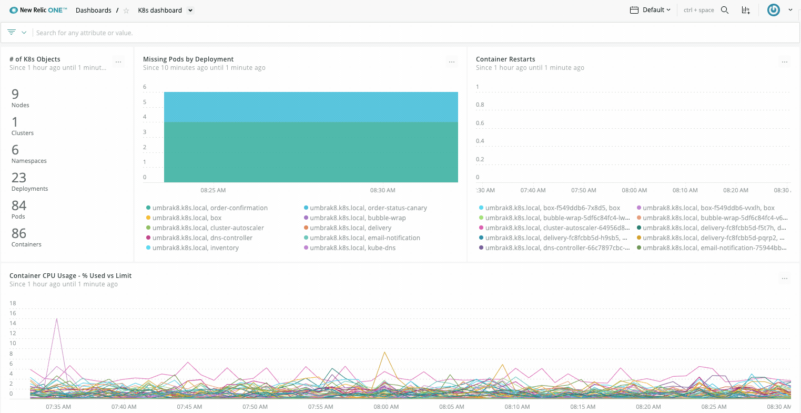

New Relic's Kubernetes integration gives you full observability into the health and performance of your environment, no matter whether you run Kubernetes on-premises or in the cloud. With our [cluster explorer](/docs/integrations/kubernetes-integration/cluster-explorer/kubernetes-cluster-explorer), you can cut through layers of complexity to see how your cluster is performing, from the heights of the control plane down to applications running on a single pod.

<figcaption>
  **[one.newrelic.com](https://one.newrelic.com) > Kubernetes cluster explorer**: The cluster explorer is our powerful, fully visual answer to the challenges associated with running Kubernetes at a large scale.
</figcaption>

You can see the power of the Kubernetes integration in the [cluster explorer](/docs/integrations/kubernetes-integration/cluster-explorer/kubernetes-cluster-explorer), where the full picture of a cluster is made available on a single screen: nodes and pods are visualized according to their health and performance, with pending and alerting nodes in the innermost circles. [Predefined alert conditions](/docs/integrations/kubernetes-integration/kubernetes-events/kubernetes-integration-predefined-alert-policy) help you troubleshoot issues right from the start. Clicking each node reveals its status and how each app is performing.

You'll be able to configure Kubernetes to suit your environnment after you [create a New Relic account](https://newrelic.com/signup) (it's free, forever!) and [install our Kubernetes integration](/docs/kubernetes-pixie/kubernetes-integration/installation/kubernetes-integration-install-configure/).

## Get started: Install the Kubernetes integration [#install]

We have an automated installer to help you with many types of installations: servers, virtual machines, and unprivileged environments. It can also help you with installations in managed services or platforms, but you'll need to review a few [preliminary notes](/docs/integrations/kubernetes-integration/installation/kubernetes-installation-configuration#cloud-platforms) before getting started.

Our automated installer will generate either a helm command or a set of plain manifests for you to install. Our automated installer:

1. Allows users to select the cluster name and namespace for the installation.
2. Allows users to selectively enable or disable bundling of Kube-state-metrics, a dependency of the Kubernetes integration.
3. Allows users to seamlessly install our other products related to Kubernetes such as:
  - Kubernetes events monitoring
  - In-cluster prometheus services monitoring
  - Service instrumentation without code changes using Pixie
4. Automatically fills the required properties with the license keys the integration needs to work.

<ButtonGroup>
<ButtonLink
  role="button"
  to="/docs/integrations/kubernetes-integration/installation/kubernetes-integration-install-configure"
  variant="link"
>
  Read the install docs
</ButtonLink>

<ButtonLink
  data-tessen="stitchedPathLinkClick"
  role="button"
  to="https://one.newrelic.com/launcher/k8s-cluster-explorer-nerdlet.cluster-explorer-launcher?pane=eyJuZXJkbGV0SWQiOiJucjEtaW5zdGFsbC1uZXdyZWxpYy5ucjEtaW5zdGFsbC1uZXdyZWxpYyIsInBhdGgiOiJndWlkZWQiLCJlbnYiOiJrdWJlcm5ldGVzIiwiaW5pdGlhbEFjdGlvbkluZGV4IjpudWxsLCJhY3Rpb25JbmRleCI6MX0="
  variant="primary"
>
  Start the installer
</ButtonLink>
</ButtonGroup>

<Callout variant="tip">
  If your New Relic account [is in the EU region](/docs/using-new-relic/welcome-new-relic/get-started/our-eu-us-region-data-centers), access the automated installer from [one.eu.newrelic.com](http://one.eu.newrelic.com/launcher/k8s-cluster-explorer-nerdlet.cluster-explorer-launcher?pane=eyJuZXJkbGV0SWQiOiJucjEtaW5zdGFsbC1uZXdyZWxpYy5ucjEtaW5zdGFsbC1uZXdyZWxpYyIsInBhdGgiOiJndWlkZWQiLCJlbnYiOiJrdWJlcm5ldGVzIiwiaW5pdGlhbEFjdGlvbkluZGV4IjpudWxsLCJhY3Rpb25JbmRleCI6MX0=).
</Callout>

## Why it matters [#features]

Governing the complexity of Kubernetes can be challenging; there's so much going on at any given moment, with containers being created and deleted in a matter of minutes, applications crashing, and resources being consumed unexpectedly. Our integration helps you navigate Kubernetes abstractions across on-premises, cloud, and hybrid deployments.

In New Relic, you can build your own charts and [query](/docs/using-new-relic/data/understand-data/query-new-relic-data) all your [Kubernetes data](/docs/integrations/kubernetes-integration/understand-use-data/find-use-your-kubernetes-data), which our integration collects by instrumenting the container orchestration layer. This gives you additional insight into nodes, namespaces, deployments, replica sets, pods, and containers.

<figcaption>
  **[one.newrelic.com](https://one.newrelic.com) > Dashboards**: Using the [query builder](/docs/chart-builder/use-chart-builder/get-started/introduction-chart-builder) you can turn any query on Kubernetes data to clear visuals.
</figcaption>

With the Kubernetes integration you can also:

* [Link your APM data to Kubernetes](/docs/integrations/kubernetes-integration/link-your-applications/link-your-applications-kubernetes) to measure the performance of your web and mobile applications, with metrics such as request rate, throughput, error rate, and availability.
* [Monitor services running on Kubernetes](/docs/integrations/kubernetes-integration/link-apps-services/monitor-services-running-kubernetes), such as Apache, NGINX, Cassandra, and many more (see our [tutorial for monitoring Redis on Kubernetes](/docs/integrations/kubernetes-integration/link-apps-services/tutorial-monitor-redis-running-kubernetes)).
* Create new alert policies and alert conditions based on your Kubernetes data, or extend the [predefined alert conditions](/docs/integrations/kubernetes-integration/kubernetes-events/kubernetes-integration-predefined-alert-policy).

These features are in addition to the data New Relic already reports for [containerized processes running on instrumented hosts](/docs/infrastructure/new-relic-infrastructure/data-instrumentation/docker-instrumentation-infrastructure).

## Navigate all your Kubernetes events [#navigate-events]

The [Kubernetes events integration](/docs/integrations/kubernetes-integration/kubernetes-events/install-kubernetes-events-integration), which is installed separately, watches for events happening in your Kubernetes clusters and sends those events to New Relic. Events data is then visualized in the cluster explorer. To set it up, check the **Kubernetes events** box in step 3 of [our install wizard](/docs/integrations/kubernetes-integration/installation/kubernetes-installation-configuration#install-wizard), or follow the [instructions](/docs/integrations/kubernetes-integration/kubernetes-events/install-kubernetes-events-integration#install).

<figcaption>
  **[one.newrelic.com](https://one.newrelic.com) > Kubernetes cluster explorer > Events**: Browse and filter all your Kubernetes events, and dig into application logs and infrastructure data.
</figcaption>

## Bring your cluster logs to New Relic [#k8s-logs]

Our Kubernetes plugin for log monitoring can collect all your cluster's logs and send them to our platform, so that you can set up new alerts and charts. To set it up, check the **Log data** box in step 3 of [our install wizard](/docs/integrations/kubernetes-integration/installation/kubernetes-installation-configuration#install-wizard). For detailed information, see our [log forwarding documentation](/docs/logs/forward-logs/kubernetes-plugin-log-forwarding/) for Kubernetes.

## Check the source code [#source-code]

This integration is open source software. That means you can [browse its source code](https://github.com/newrelic/nri-kubernetes "Link opens in a new window.") and send improvements, or you can create your own fork and build it. For more information, see the [README](https://github.com/newrelic/nri-kubernetes/blob/main/README.md "Link opens in a new window.").
