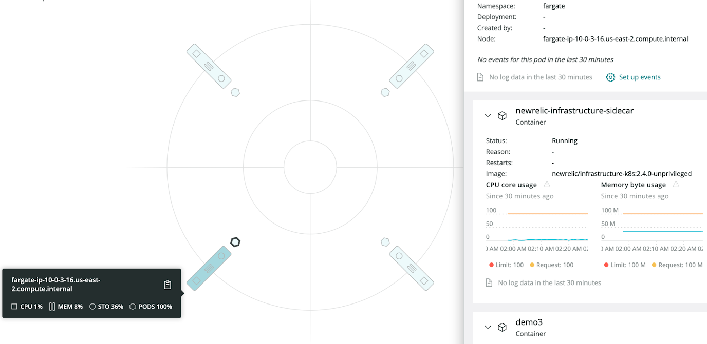

<Callout title="Beta Feature">
This feature is still in development, but we encourage you to try it out!
</Callout>

New Relic supports monitoring Kubernetes workloads on EKS Fargate by automatically injecting a sidecar containing the infrastructure agent and the `nri-kubernetes` integration in each pod that needs to be monitored.

If the same Kubernetes cluster also contains EC2 nodes, our solution will also be deployed as a `DaemonSet` in all of them. No sidecar will be injected into pods scheduled in EC2 nodes, and no `DaemonSet` will be deployed to Fargate nodes. Here's an example of a hybrid instance with both Fargate and EC2 nodes:


<figcaption>
In a mixed environment, the integration only uses a sidecar for Fargate nodes.
</figcaption>

New Relic collects all the supported metrics for all Kubernetes objects regardless of where they are scheduled, whether it's Fargate or EC2 nodes. Please note that, due to the limitations imposed by Fargate, the New Relic integration is limited to running in [unprivileged](/docs/integrations/kubernetes-integration/installation/kubernetes-integration-install-configure/#unprivileged) mode on Fargate nodes. This means that metrics that are usually fetched from the host directly, like running processes, will not be available for Fargate nodes.

The agent in both scenarios will scrape data from Kube State Metrics (KSM), Kubelet, and cAdvisor and send data in the same format.

<Callout variant="important">
Just like for any other Kubernetes cluster, our solution still requires you to deploy and monitor a Kube State Metrics (KSM) instance. Our Helm Chart and/or installer will do so automatically by default, although this behavior can be disabled if your cluster already has a working instance of KSM. This KSM instance will be monitored as any other workload: By injecting a sidecar if it gets scheduled in a Fargate node or with the local instance of the `DaemonSet` if it gets scheduled on an EC2 node.
</Callout>

Other components of the New Relic solution for Kubernetes, such as `nri-prometheus`, `nri-metadata-injection`, and `nri-kube-events`, do not have any particularities and will be deployed by our Helm Chart normally as they would in non-Fargate environments.

<Callout variant="important">
New Relic Logging is not yet supported on Fargate nodes.
</Callout>

## Installation [#installation]

You can choose between two alternatives for installing New Relic full observability in your EKS Fargate cluster: 

* [Automatic injection (recommended)](#automatic)
* [Manual injection](#manual)

Regardless of the approach you choose, the experience is exactly the same after it's installed. The only difference is how the container is injected. We do recommend setting up automatic injection with the New Relic Infrastructure Operator since it will eliminate the need to manually edit each deployment you want to monitor.

### Automatic injection (recommended) [#automatic]

By default, when Fargate support is enabled, New Relic will deploy an operator to the cluster (`newrelic-infra-operator`). Once deployed, this operator will automatically inject the monitoring sidecar to pods that are scheduled into Fargate nodes, while also managing the creation and the update of `Secrets`, `ClusterRoleBindings`, and any other related resources.

This operator accepts a variety of advanced configuration options that can be used to narrow or widen the scope of the injection, through the use of label selectors for both pods and namespaces.

#### What the operator does [#what-operator-does]

Behind the scenes, the operator sets up a `MutatingWebhookConfiguration`, which allows it to modify the pod objects that are about to be created in the cluster. On this event, and when the pod being created matches the user’s configuration, the operator will:

1. Add a sidecar container to the pod containing the New Relic Kubernetes integration.
2. If a secret doesn't exist, create one in the same namespace as the pod containing the New Relic license key, which is needed for the sidecar to report data.
3. Add the pod’s service account to a `ClusterRoleBinding` previously created by the operator chart, which will grant this sidecar the required permissions to hit the Kubernetes metrics endpoints.

The `ClusterRoleBinding` grants the following permissions to the pod being injected:

```
- apiGroups: [""]
  resources:
	- "nodes"
	- "nodes/metrics"
	- "nodes/stats"
	- "nodes/proxy"
	- "pods"
	- "services"
  verbs: ["get", "list"]
- nonResourceURLs: ["/metrics"]
  verbs: ["get"]
```

<Callout variant="tip">
In order for the sidecar to be injected, and therefore to get metrics from pods deployed before the operator has been installed, you need to manually perform a rollout (restart) of the affected deployments. This way, when the pods are created, the operator will be able to inject the monitoring sidecar. New Relic has chosen not to do this automatically in order to prevent unexpected service disruptions and resource usage spikes. 
</Callout>

Here's the injection workflow:


#### Automatic injection installation [#auto-injection-install]

<Callout variant="tip">
The following steps are for a default setup. Before completing these, we suggest you take a look at the [Configuration](#config-auto) section below to see if you want to modify any aspects of the automatic injection.
</Callout>

In order to install the operator in charge of injecting the infrastructure sidecar, it is enough to run the following command. Please note that this command is the same one that is used for the general [installation command for `nri-kubernetes`](/docs/integrations/kubernetes-integration/installation/install-kubernetes-integration-using-helm/#install-k8-helm), with two extra fargate-specific flags (highlighted):

```
helm upgrade --install newrelic newrelic/nri-bundle \
--namespace newrelic --create-namespace \
--set global.licenseKey=<var>YOUR_NEW_RELIC_LICENSE_KEY</var> \
--set global.cluster=K8S_CLUSTER_NAME \
--set infrastructure.enabled=true \
--set prometheus.enabled=true \
--set webhook.enabled=true \
--set ksm.enabled=true \
--set kubeEvents.enabled=true \
<var>--set global.fargate=true</var> \
<var>--set newrelic-infra-operator.enabled=true</var>
```

<Callout variant="important">
When deploying the solution on a hybrid cluster (with both EC2 and Fargate nodes), please make sure that the solution is not selected by any Fargate profiles; otherwise, the `DaemonSet` instances will be stuck in a pending state. For fargate-only environments this is not a concern because no `DaemonSet` instances are created.

</Callout>

#### Configuration [#config-auto]

You can configure different aspects of the automatic injection. By default, the operator will inject the monitoring sidecar to all pods deployed in Fargate nodes which are not part of a `Job` or a `BatchJob`.

This behavior can be changed through configuration options. For example, you can define selectors to narrow or widen the selection of pods that are injected, assign resources to the operator, and tune the sidecar. Also, you can add other attributes, labels, and environment variables. Please refer to the chart [README.md](https://github.com/newrelic/helm-charts/blob/master/charts/newrelic-infra-operator/README.md) and [values.yaml](https://github.com/newrelic/helm-charts/blob/master/charts/newrelic-infra-operator/values.yaml).

<Callout variant="important">
Specifying your own custom injection rules will discard the default ruleset that prevents sidecar injection on pods that are not scheduled in Fargate. Please ensure that your custom rules have the same effect; otherwise, on hybrid clusters which also have the `DaemonSet` deployed, pods scheduled in EC2 will be monitored twice, leading to incorrect or duplicate data.
</Callout>

#### Update to the latest version or to a new configuration [#update-auto-install-version]

To update to the latest version of the EKS Fargate integration, upgrade the chart and reinstall the bundle by simply running again the command above.

To update the configuration of the infrastructure agent injected or the operator itself, modify the `values.yaml` and upgrade the Helm release with the new configuration. The operator is updated immediately. However, another rollout of the workloads is needed in order to inject the infrastructure agent sidecar with the new configuration.

```
  $ kubectl rollout restart deployment <var>YOUR_DEPLOY</var>
```

#### Uninstall the Fargate integration [#uninstall-auto-injection]

In order to uninstall the sidecar performing the automatic injection but keep the rest of the New Relic solution, using Helm, disable the infra-operator by setting `infra-operator.enabled` to `false`, either in the `values.yaml` file or in the command line (`--set`), and re-run the installation command above.

We strongly recommend keeping the `--set global.fargate=true` flag, since it does not enable automatic injection but makes other components of the installation Fargate-aware, preventing unwanted behavior.

To uninstall the whole solution:

1. Completely uninstall the Helm release.
2. Rollout the pods in order to remove the sidecar:
    ```
    $ kubectl rollout restart deployment <var>YOUR_APP</var>
    ```
3. Garbage collect the secrets:
    ```
    $ kubectl delete secrets -n <var>YOUR_NAMESPACE</var> -l newrelic/infra-operator-created=true
    ```
#### Known limitations: automatic injection [#known-limitations]

Here are some issues to be aware of when using automatic injection:

1. Currently there is no controller that watches the whole cluster to make sure that secrets that are no longer needed are garbage collected. However, all objects share the same label that you can use to remove all resources, if needed. We inject the label `newrelic/infra-operator-created: true`, which you can use to delete resources with a single command.

2. At the moment, it's not possible to use the injected sidecar to monitor services running in the pod. The sidecar will only monitor Kubernetes itself. However, advanced users might want to exclude these pods from automatic injection and manually inject a customized version of the sidecar with on-host integrations enabled by configuring them and mounting their configurations in the proper place. For help, see this [tutorial](/docs/integrations/kubernetes-integration/link-apps-services/tutorial-monitor-redis-running-kubernetes/).

### Manual injection [#manual]
If you have  any concerns about the automatic injection, you can inject the sidecar manually directly by modifying the manifests of the workloads scheduled that are going to be scheduled on Fargate nodes. Please note that adding the sidecar into deployments scheduled into EC2 nodes may lead into incorrect or duplicate data, especially if those nodes are already being monitored with the `DaemonSet`.

The following objects are required for the sidecar to successfully report data:

* The `ClusterRole` providing the permission needed by the `nri-kubernetes` integration
* A `ClusterRoleBinding` linking the `ClusterRole` and the service account of the pod
* The secret storing the New Relic `licenseKey` in each Fargate namespace 
* The sidecar container in the spec template of the monitored workload

#### Manual injection installation [#manual-injection-install]

<Callout variant="tip">
These manual setup steps are for a generic installation. Before completing these, take a look at the [Configuration](#config-manual) section below to see if you want to modify any aspects of the automatic injection.
</Callout>

Complete the following for manual injection:

1. If `ClusterRole` doesn't exist, create it and grant the permissions required to hit the metrics endpoints. This only needs to be done once, even for monitoring multiple applications in the same cluster.

    <CollapserGroup>
      <Collapser
        id="cluster-role"
        title="ClusterRole"
      >
      You can use this snippet as it appears below, without any changes:

      ```      
      apiVersion: rbac.authorization.k8s.io/v1
      kind: ClusterRole
      metadata:
        labels:
          app: newrelic-infrastructure
        name: newrelic-newrelic-infrastructure-infra-agent
      rules:
      - apiGroups:
        - ""
        resources:
        - nodes
        - nodes/metrics
        - nodes/stats
        - nodes/proxy
        - pods
        - services
        verbs:
        - get
        - list
      - nonResourceURLs:
        - /metrics
        verbs:
        - get
      ```
      </Collapser>
    </CollapserGroup>

2. For each workload you want to monitor, add an additional sidecar container for the `newrelic/infrastructure-k8s` image. Here is an example of an injected sidecar. 

    <CollapserGroup>
      <Collapser
        id="container-to-inject"
        title="ContainerToInject"
      >

      Take the container of the following snippet and inject it in the workload you want to monitor, specifying the name of your `FargateProfile` in the `customAttributes` variable. Note that the volumes can be defined as `emptyDir: {}`.

      <Callout variant="tip">
      In the special case of a KSM deployment, you also need to remove the `DISABLE_KUBE_STATE_METRICS` environment variable and increase the resources requests and limits.
      </Callout>

        ```
        apiVersion: apps/v1
        kind: Deployment
        spec:
          template:
            spec:
              containers:
              - name: newrelic-infrastructure
                env:
                - name: NRIA_LICENSE_KEY
                  valueFrom:
                    secretKeyRef:
                      key: license
                      name: newrelic-newrelic-infrastructure-config
                - name: NRIA_VERBOSE
                  value: "1"
                - name: DISABLE_KUBE_STATE_METRICS
                  value: "true"
                - name: CLUSTER_NAME
                  value: testing-injection
                - name: COMPUTE_TYPE
                  value: serverless
                - name: NRK8S_NODE_NAME
                  valueFrom:
                    fieldRef:
                      apiVersion: v1
                      fieldPath: spec.nodeName
                - name: NRIA_DISPLAY_NAME
                  valueFrom:
                    fieldRef:
                      apiVersion: v1
                      fieldPath: spec.nodeName
                - name: NRIA_CUSTOM_ATTRIBUTES
                  value: '{"clusterName":"$(CLUSTER_NAME)", "computeType":"$(COMPUTE_TYPE)", "fargateProfile":"[YOUR FARGATE PROFILE]"}'
                - name: NRIA_PASSTHROUGH_ENVIRONMENT
                  value: KUBERNETES_SERVICE_HOST,KUBERNETES_SERVICE_PORT,CLUSTER_NAME,CADVISOR_PORT,NRK8S_NODE_NAME,KUBE_STATE_METRICS_URL,KUBE_STATE_METRICS_POD_LABEL,TIMEOUT,ETCD_TLS_SECRET_NAME,ETCD_TLS_SECRET_NAMESPACE,API_SERVER_SECURE_PORT,KUBE_STATE_METRICS_SCHEME,KUBE_STATE_METRICS_PORT,SCHEDULER_ENDPOINT_URL,ETCD_ENDPOINT_URL,CONTROLLER_MANAGER_ENDPOINT_URL,API_SERVER_ENDPOINT_URL,DISABLE_KUBE_STATE_METRICS,DISCOVERY_CACHE_TTL
                image: newrelic/infrastructure-k8s:2.4.0-unprivileged
                imagePullPolicy: IfNotPresent
                resources:
                  limits:
                    memory: 100M
                    cpu: 200m
                  requests:
                    cpu: 100m
                    memory: 50M
                securityContext:
                  allowPrivilegeEscalation: false
                  readOnlyRootFilesystem: true
                  runAsUser: 1000
                terminationMessagePath: /dev/termination-log
                terminationMessagePolicy: File
                volumeMounts:
                - mountPath: /var/db/newrelic-infra/data
                  name: tmpfs-data
                - mountPath: /var/db/newrelic-infra/user_data
                  name: tmpfs-user-data
                - mountPath: /tmp
                  name: tmpfs-tmp
                - mountPath: /var/cache/nr-kubernetes
                  name: tmpfs-cache
        [...]
        ```
      </Collapser>
    </CollapserGroup>

3. Create a `ClusterRoleBinding`, or add to a previously created one the `ServiceAccount` of the application that is going to be monitored. All the workloads may share the same `ClusterRoleBinding`, but the `ServiceAccount` of each one must be added to it.

    <CollapserGroup>
      <Collapser
        id="cluster-role-binding"
        title="ClusterRoleBinding"
      >
      Create the following `ClusterRoleBinding` that has as subjects the service account of the pods you want to monitor. 
      
      <Callout variant="tip">
      You do not need to repeat the same service account twice. Each time you want to monitor a pod with a service account that isn't included yet, just add it to the list.
      </Callout>

      ``` 
      apiVersion: rbac.authorization.k8s.io/v1
      kind: ClusterRoleBinding
      metadata:
        name: newrelic-newrelic-infrastructure-infra-agent
      roleRef:
        apiGroup: rbac.authorization.k8s.io
        kind: ClusterRole
        name: newrelic-newrelic-infrastructure-infra-agent
      subjects:
      - kind: ServiceAccount
        name: [<var>INSERT_SERVICE_ACCOUNT_NAME_OF_WORKLOAD</var>]
        namespace: [<var>INSERT_SERVICE_ACCOUNT_NAMESPACE_OF_WORKLOAD</var>]
      ```
      </Collapser>
    </CollapserGroup>


4. Create a secret containing the New Relic license key. Each namespace needs its own secret.

    <CollapserGroup>
      <Collapser
        id="secret"
        title="Secret"
      >

      Create the following `Secret` that has a license with the Base64 encoded value of your NewRelic license key. One secret is needed in each namespace where a pod you want to monitor is running.

      ```      
      apiVersion: v1
      data:
        license: <var>INSERT_YOUR_NEW_RELIC_LICENSE_ENCODED_IN_BASE64</var>
      kind: Secret
      metadata:
        name: newrelic-newrelic-infrastructure-config
        namespace: [<var>INSERT_NAMESPACE_OF_WORKLOAD</var>]
      type: Opaque
      ```

      </Collapser>
    </CollapserGroup>

#### Configuration [#config-manual]

When adding the manifest of the sidecar agent manually, you can use any agent configuration option to configure the agent behavior. For help, see [Infrastructure agent configuration settings](/docs/infrastructure/install-infrastructure-agent/configuration/infrastructure-agent-configuration-settings/).

#### Update to the latest version [#manual-update-version]

To update any of the components, you just need to modify the deployed yaml. 

Updating any of the fields of the injected container will cause the pod to be re-created.

<Callout variant="important">
The agent cannot hot load the New Relic license key. After updating the secret, you need to rollout the deployments again.
</Callout>

#### Uninstall the Fargate integration [#manual-uninstall]

To remove the injected container and the related resources, you just have to remove the following:
* The sidecar from the workloads that should be no longer monitored. 
* All the secrets containing the newrelic license. 
* `ClusterRole` and `ClusterRoleBinding` objects.

Notice that removing the sidecar container will cause the pod to be re-created.

## Troubleshooting: DaemonSet replicas are being deployed into Fargate nodes [#troubleshooting]

If you notice that any Infra `DaemonSet` replicas are being scheduled on Fargate nodes, it might be because the `nodeAffinity` rules are not configured properly.

Double-check that the solution was installed with the `global.fargate` option to `true`, either through the command line (`--set global.fargate=true`) or in the `values.yaml` file. If the installation method was not Helm, you’ll need to manually add `nodeAffinity` rules to exclude Fargate nodes.

## View your EKS data [#view-data]

Here's an example of what a Fargate node looks like in the New Relic UI:



To view your AWS data:

1. Go to **[one.newrelic.com](https://one.newrelic.com) > Infrastructure > Kubernetes** and do one of the following:
    * Select an integration name to view data.
    * Select the Explore data icon to view AWS data.
2. Filter your data using two Fargate tags:
    * `computeType=serverless`
    * `fargateProfile=[name of the Fargate profile to which the workload belongs]`
