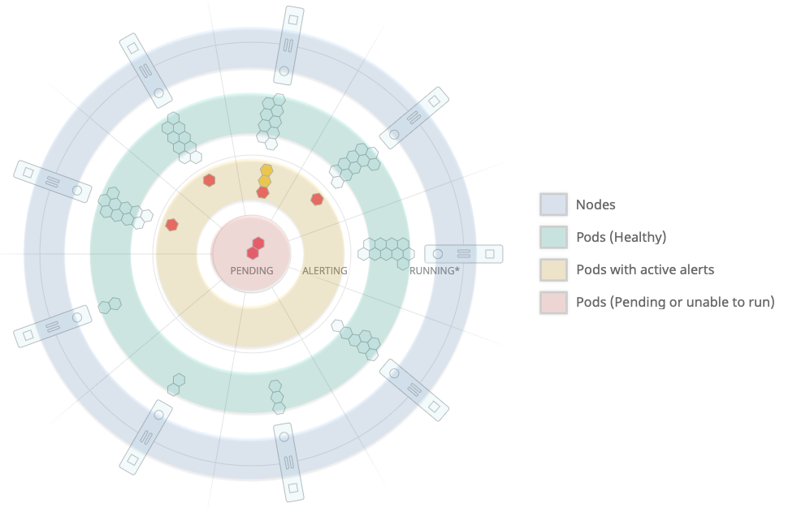
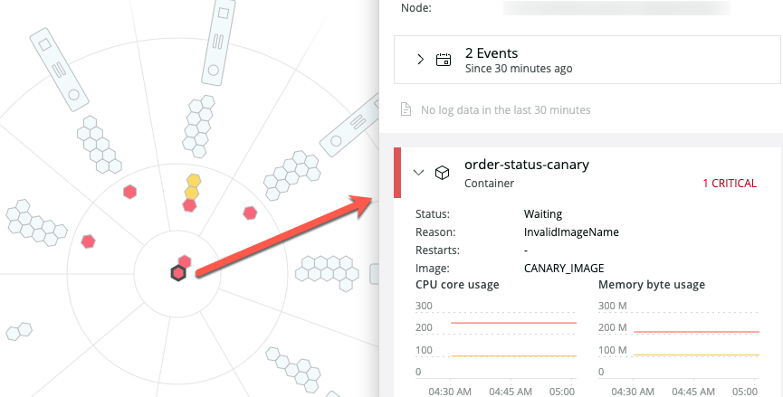
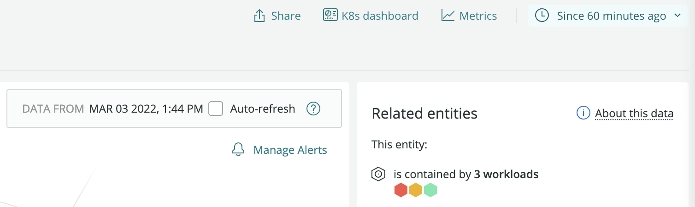

New Relic's Kubernetes cluster explorer uses the data collected by the [Kubernetes integration](/docs/integrations/kubernetes-integration/get-started/introduction-kubernetes-integration) to show the status of your cluster, from the control plane to nodes and pods. You can find out about the health of each entity, explore logs, and see how your apps are performing. With the [Events integration](/docs/integrations/kubernetes-integration/kubernetes-events/install-kubernetes-events-integration), everything that happens in your cluster becomes visible, and logs brought in using the [logs plugin](/docs/logs/enable-logs/enable-logs/kubernetes-plugin-logs) are also available.

<Video
  type="wistia"
  id="d6odj1911i"
/>

## Meet the cluster explorer [#cluster-explorer-use]

The cluster explorer represents your most relevant cluster data on a chart with the shape of a ship's wheel — which is also Kubernetes' logo.

* Outer ring: Contains up to 24 nodes of your cluster, the most relevant based on the amount of alerts. Hover over each node to check resource consumption and the percentage of allocable pods used.

* Inner rings: Contain the pods (  ) of each node. Pods with active alerts are shown in the third innermost ring, and pods that are pending or unable to run are in the center.

Hover the mouse over each node or pod to get a quick overview of its resource usage. You can click each node and pod to view its resource usage over time or to get more information about its health and active alerts. [Colors](/docs/alerts/new-relic-alerts/configuring-alert-policies/identify-entities-without-alert-policies) are based on [predefined alert conditions](/docs/integrations/kubernetes-integration/kubernetes-events/kubernetes-integration-predefined-alert-policy): Yellow pods have active warning alerts, while red pods have active critical alerts.

<figcaption>
  **[one.newrelic.com](https://one.newrelic.com) > Kubernetes cluster explorer**: Click any pod to get more information about its status and health, and to dig deeper into application data and traces, logs, and events.
</figcaption>

Click a node to see the following data:

* Pod statistics
* CPU, memory, and storage consumption against allocatable amounts
* Amount of pods used by the node against the allocatable amount of pods

For each pod, depending on the [integrations and features you've enabled](/docs/integrations/kubernetes-integration/get-started/introduction-kubernetes-integration), you can see:

* Pod status and metadata, including namespace and deployment
* Container status and statistics
* Active alerts (both warning and critical)
* [Kubernetes events that happened in that pod](/docs/integrations/kubernetes-integration/kubernetes-events/install-kubernetes-events-integration)
* APM data and traces (if you've [linked your APM data](/docs/integrations/kubernetes-integration/link-your-applications/link-your-applications-kubernetes))
* A link to the pods' and containers' logs, collected using the [Kubernetes plugin for New Relic Logs](/docs/logs/enable-logs/enable-logs/kubernetes-plugin-logs)

Cluster and [control plane](/docs/integrations/kubernetes-integration/installation/configure-control-plane-monitoring) statistics are always visible on the left side.

### Cluster dashboard

The cluster dashboard can be accessed at any time from the cluster explorer by clicking **Kubernetes dashboard**. It provides a curated dashboard experience for your Kubernetes cluster.

<figcaption>
  **[one.newrelic.com](https://one.newrelic.com) > Kubernetes cluster explorer > Kubernetes dashboard**: The Kubernetes dashboard can be accessed from the Kubernetes cluster explorer. It shows useful Kubernetes metric data.
</figcaption>

### Cluster explorer node table [#cluster-explorer-table]

Below the cluster explorer is the node table**,** which shows all the nodes of the cluster, namespace, or deployment. Like all other usage indicators, the table shows consumption against [allocatable resources](https://kubernetes.io/docs/tasks/administer-cluster/reserve-compute-resources/#node-allocatable).

## Search and filter your cluster data [#search-filter]

The main way to modify the data view in the cluster explorer is by using the top bar to search for specific attributes or values. All the [attributes and values collected by the Kubernetes integration](/docs/integrations/kubernetes-integration/understand-use-data/understand-use-data) can be combined to narrow down the cluster view.

<figcaption>
  **[one.newrelic.com](https://one.newrelic.com) > Kubernetes cluster explorer**: All your Kubernetes cluster's attributes and data points can be used to filter the cluster explorer view.
</figcaption>

You can also change the time frame using the time picker in the upper right corner. The **Auto-refresh** box turns the cluster explorer into a real-time dashboard that refreshes every 60 seconds.

<figcaption>
  **[one.newrelic.com](https://one.newrelic.com) > Kubernetes cluster explorer**: The time picker lets you select several predefined time spans. To reload the data every minute, check the auto-refresh box.
</figcaption>

## Browse your Kubernetes events

If you’ve enabled the [Kubernetes events integration](/docs/integrations/kubernetes-integration/kubernetes-events/install-kubernetes-events-integration), you can click the **Events** tab to browse everything that happened in your cluster, from warnings to normal events. To set it up, select the **Kubernetes events** box in step 3 of [our install wizard](/docs/integrations/kubernetes-integration/installation/kubernetes-installation-configuration#install-wizard), or follow the [instructions](/docs/integrations/kubernetes-integration/kubernetes-events/install-kubernetes-events-integration#install).

<figcaption>
  **[one.newrelic.com](https://one.newrelic.com) > Kubernetes cluster explorer > Events**: Browse and filter all your Kubernetes events, and dig into logs and infrastructure data.
</figcaption>
