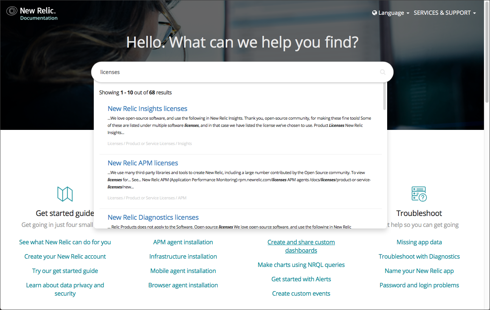

import { Link } from 'gatsby'

**Welcome to New Relic!** We want to ensure that you can successfully use our products and services. And, at the same time, we want to protect both your rights as a customer and our legal requirements.

When you sign up for your New Relic account, you agree to our standard [Terms and Conditions](https://newrelic.com/termsandconditions/terms). If you have entered into a separate paid agreement with us for specific services, then the terms of that agreement control.

Here is a reference library of our licenses and other legal documentation. If you have additional questions, please contact your New Relic account representative.

<LandingPageTileGrid>
  <LandingPageTile title="General usage licenses.">
    <i
      aria-hidden="true"
      className="fa fa-balance-scale fa-2x"
    >
      \[scale icon]
    </i>

     These relate to any New Relic product or service that you use. [Learn more.](/docs/licenses/license-information/general-usage-licenses)
  </LandingPageTile>

  <LandingPageTile
    title="Special services licenses."
    icon="user-plus"
  >
     These licenses and terms relate to services that supplement the use of other New Relic products and services; for example, Expert Services and New Relic Diagnostics. [Learn more.](/docs/licenses/license-information/special-services-licenses)
  </LandingPageTile>
</LandingPageTileGrid>

**[docs.newrelic.com](https://docs.newrelic.com):** You can find documentation for licenses, attributions, and other legal notices on New Relic's Docs site.

<LandingPageTileGrid>
  <LandingPageTile
    title="Distributed licenses."
    icon="file-text"
  >
     These are the license files that are distributed with our software when you install them in your environment or receive custom software from Expert Services (whose services are under [separate terms](https://newrelic.com/termsandconditions/expert-services-terms)). [Learn more.](/docs/licenses/license-information/distributed-licenses)
  </LandingPageTile>

  <LandingPageTile
    title="Referenced policies."
    icon="external-link"
  >
     These are policies referenced in your agreement with New Relic and relate to the New Relic products or services that you use. [Learn more.](/docs/licenses/license-information/referenced-policies)
  </LandingPageTile>

  <LandingPageTile
    title="Third party attributions."
    icon="folder"
  >
     These are the licenses and attributions for third party and open source components that are distributed with specific New Relic products and services. [Learn more.](/docs/licenses/product-or-service-licenses)
  </LandingPageTile>
</LandingPageTileGrid>

<Button
  as={Link}
  to="/docs/licenses?toc=true"
  variant="primary"
>
  View all Licenses docs
</Button>
