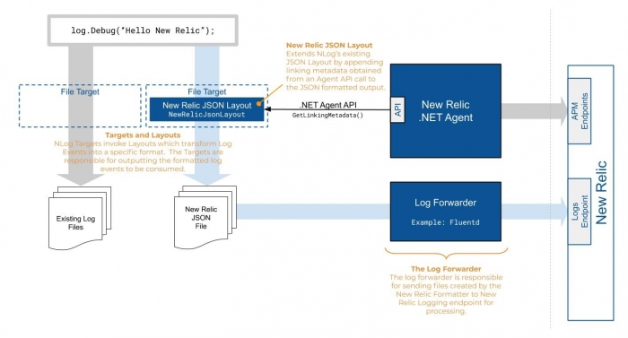
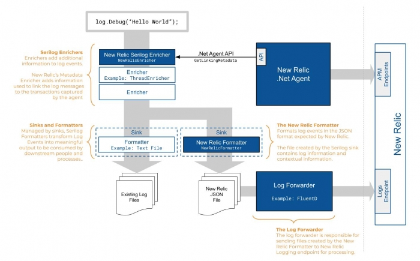

Logs in context for the .NET agent connects your logs and APM data in New Relic. Bringing all of this data together in a single tool helps you quickly get to the root cause of an issue and find the log lines that you need to identify and resolve a problem.

## Set up your .NET app [#enable-logs-net]

To enable logs in context for APM apps monitored by .NET:

1. Make sure you have already [set up logging in New Relic](/docs/logs/enable-log-management-new-relic/enable-log-monitoring-new-relic/enable-log-management-new-relic/). This includes configuring a supported log forwarder that collects your application logs and extends the metadata that is forwarded to New Relic.
2. [Install](/docs/agents/net-agent/installation/introduction-net-agent-install) or [update](//docs/agents/net-agent/installation/update-net-agent) to the latest .NET agent version, and [enable distributed tracing](/docs/distributed-tracing/enable-configure/quick-start/). Use [.NET agent version 8.21 or higher](/docs/release-notes/agent-release-notes/net-release-notes/) and the [New Relic .NET agent API version 8.21 or higher](/docs/agents/net-agent/net-agent-api) for logs in context.
3. Install or update to Microsoft [.NET Framework 4.5 or higher](https://dotnet.microsoft.com/download/dotnet-framework) or [.NET Core 2.0 or higher](https://dotnet.microsoft.com/download/dotnet-core).
4. Install and configure any of the following logging extensions to enrich your log data.

### Configure log4net extension [#log4net]

You can use the [Apache log4net version 2.0.8 or higher](https://logging.apache.org/log4net/) extension to link your log data with related data across the rest of the New Relic platform.

<CollapserGroup>

  <Collapser
    id="example-log4net"
    title="log4net workflow diagram"
  >

  The following diagram illustrates the flow of log messages through Apache log4net, highlighting specific components of the New Relic log4net extension. Many log forwarders are available. This example uses [Fluentd](https://www.fluentd.org/).

  

  **Appender:** The `NewRelicAppender` adds contextual information from the .NET agent (using the API) to the log events generated by the application. This contextual information, known as linking metadata, is used by New Relic to link log messages to the transactions and spans from which they were created. This appender will pass the enriched log events to downstream appenders for further processing.

  Since the `NewRelicAppender` is `ForwardingAppender` type, it needs to be the first appender in the chain. It also requires another appender that can write to an actual output destination as its child in order to work.

  **Layout:** The `NewRelicLayout` formats the enriched log events into the JSON format expected by New Relic. The appender, which this layout is assigned to, instructs log4net to output the JSON to a file in the location that the log forwarder expects.

  **Log Forwarder**: The log forwarder monitors an output folder and incrementally sends New Relic formatted log information to the New Relic logging endpoint.

  </Collapser>

  <Collapser
    id="log4net"
    title="log4net 2.0.8 or higher configuration"
  >

  Log4net uses `appender` and `layout` to store and format log messages. [`NewRelicAppender`](https://github.com/newrelic/newrelic-logenricher-dotnet/tree/master/src/Log4Net) enriches log messages with contextual information from the New Relic .NET agent if it is attached to your application. The appender passes enriched log messages to downstream appenders to handle specific use cases for log messages.
  
  For more information about logging with log4net, see the Apache log4net [Getting started](https://logging.apache.org/log4net/) documentation.

  To configure logs in context with the log4net extension:

  1. Using the Visual Studio [NuGet Package Manager](https://docs.microsoft.com/en-us/nuget/consume-packages/install-use-packages-visual-studio), locate and install the [`NewRelic.LogEnrichers.Log4Net`](https://www.nuget.org/packages/NewRelic.LogEnrichers.Log4Net/) package.

  2. In your log4net configuration file, update your logging configuration to use the `NewRelicAppender` as the first level appender, and reference your existing appenders as its children. Also replace the layout of the appender that writes log messages to an output destination with the `NewRelicLayout`.

  The following log4net configuration example enriches log events with New Relic linking metadata. In addition to the existing log files, it outputs new log files in a specific JSON format at `C:\logs\log4netExample.log.json` for consumption by the log forwarder:

  ```
  <log4net>
    <root>
      <level value="ALL" />
      <appender-ref ref="NewRelicAppender" />
    </root>

    <appender name="NewRelicAppender" type="NewRelic.LogEnrichers.Log4Net.NewRelicAppender, NewRelic.LogEnrichers.Log4Net" >
      <threshold value="ALL"/>
      <appender-ref ref="FileAppender" />
    </appender>

    <appender name="FileAppender" type="log4net.Appender.FileAppender">
      <file value="C:\logs\log4netExample.log.json" />
      <param name="AppendToFile" value="true" />
      <layout type="NewRelic.LogEnrichers.Log4Net.NewRelicLayout, NewRelic.LogEnrichers.Log4Net">
      </layout>
    </appender>
  </log4net>
  ```

  After you configure the log4net extension and update your logging file, you can configure your extension to send data to New Relic. Here is an example configuration using the Fluentd plugin for New Relic Logs:

  ```
  <!--NewRelicLoggingExample.conf-->
  <source>
      @type tail 
      path C:\logs\log4netExample.log.json
      pos_file C:\logs\log4netExample.log.json.pos
      tag logfile.*
    <parse> 
      @type json
    </parse>
  </source>
    <match **> 
      @type newrelic
      license_key <YOUR NEW_RELIC_LICENSE_KEY>
      base_uri https://log-api.newrelic.com/log/v1
    </match>
  ```

  </Collapser>

</CollapserGroup>

### Configure NLog extension [#nlog]

You can use our [NLog 4.5 or higher](https://nlog-project.org/) extension to link to your log data with related data across the rest of the New Relic platform.

<CollapserGroup>

  <Collapser
    id="example-nlog"
    title="Nlog workflow diagram"
  >

  The [New Relic NLog extension](https://github.com/newrelic/newrelic-logenricher-dotnet) provides a `NewRelicJsonLayout` that formats a log event in the way required by the New Relic logging endpoint. Next, it adds contextual information from the .NET agent when attached to your application. Then, a target can be configured to write logging data to an output folder. The log forwarder can monitor this folder and incrementally send log information to New Relic.

  The following diagram illustrates the flow of log messages through NLog, highlighting specific components of the New Relic NLog extension.
  
  

  **New Relic JSON Layout**: The `NewRelicJsonLayout` adds contextual information from the .NET agent (using the API) to the log events generated by the application, and outputs log messages in the JSON format expected by New Relic. This contextual information, known as linking metadata, is used by New Relic to link log messages to the transactions and spans where they were created.

  Since the `NewRelicAppender` is `ForwardingAppender` type, it needs to be the first appender in the chain. It also requires another appender that can write to an actual output destination as its child in order to work.

  **File Target**: A `FileTarget` defines a file on disk where log messages are written. Adding the `NewRelicJsonLayout` to that target allows the output to be formatted correctly for forwarding to New Relic.

  **Log Forwarder**: The log forwarder is configured to send the log data from the `FileTarget` output to New Relic. The example below uses the [New Relic Fluentd log forwarder](https://github.com/newrelic/newrelic-fluentd-output), however there are many other log forwarders that can be used.

  For more information about logging with NLog, see the [nlog-project.org documentation](https://nlog-project.org/download/).

  </Collapser>

  <Collapser
    id="Nlog"
    title="Nlog 4.5 or higher configuration"
  >

  Use our [NLog 4.5 or higher](https://nlog-project.org/) extension to link to your log data with related data across the rest of the New Relic platform.

  1. Using the Visual Studio [NuGet Package Manager](https://docs.microsoft.com/en-us/nuget/consume-packages/install-use-packages-visual-studio), locate and install the [`NewRelic.LogEnrichers.NLog`](https://www.nuget.org/packages/NewRelic.LogEnrichers.NLog/) package.
  2. In your application code, update your logging configuration to add the `NewRelicJsonLayout` and decide if you want to collect MappedDiagnosticsContext (**MDC**) or the MappedDiagnosticsLogicalContext (**MDLC**) data.
  
  The following configuration examples result in new JSON files that are written to disk. Some of these [configuration options](https://github.com/nlog/NLog/wiki/File-target) may be useful for managing the amount of disk space used and/or the performance of the target.

    * `archiveAboveSize`
    * `maxArchiveFiles`
    * `bufferSize`
    * `enableArchiveFileCompression`
    * `autoFlush`
    * `concurrentWrites`

  Although the [NLog AsyncWrapper Target](https://github.com/nlog/NLog/wiki/AsyncWrapper-target) is not required, it may help improve performance by performing formatting and output of log files on a different thread.

  **Don't collect MDC or the MDLC data (default):**

  The following code example enriches log events with New Relic linking metadata, but not with MDC or the MDLC data. In addition to the existing log files, it outputs new log files in a specific JSON format at `C:\logs\NLogExample.log.json` for consumption by the log forwarder:

  ```
  var loggerConfig = new LoggingConfiguration();
  var newRelicFileTarget = new FileTarget("NewRelicFileTarget");
  newRelicFileTarget.Layout = new NewRelicJsonLayout();
  newRelicFileTarget.FileName = "C:\logs\NLogExample.json";
  loggerConfig.AddTarget(newRelicFileTarget);
  loggerConfig.AddRuleForAllLevels("NewRelicFileTarget");
  LogManager.Configuration = loggerConfig;
  var logger = LogManager.GetLogger("Example");
  ```

  **Collect MDC or the MDLC data:**

  If your application uses the MDC or the MDLC, you can configure the `NewRelicJsonLayout` to include items in those collections. The following code example adds the additional configuration to enable collecting MDC and MDLC data.  As in the previous example, it outputs new log files in a specific JSON format at `C:\logs\NLogExample.log.json` for consumption by the log forwarder:

  ```
  var loggerConfig = new LoggingConfiguration();
  var newRelicFileTarget = new FileTarget("NewRelicFileTarget");
  var newRelicLayout = new NewRelicJsonLayout
  {
    IncludeMdc = `true,`
    IncludeMdlc = `true`
  };

  newRelicFileTarget.Layout = newRelicLayout;
  newRelicFileTarget.FileName = "C:\logs\NLogExample.json";
  loggerConfig.AddTarget(newRelicFileTarget);
  loggerConfig.AddRuleForAllLevels("NewRelicFileTarget");
  LogManager.Configuration = loggerConfig;
  var logger = LogManager.GetLogger("Example");
  ```
  Once you have configured the NLog extension and updated your logging file, you can configure your extension to send data to New Relic. Here is an example configuration using the Fluentd plugin to forward logs to New Relic:

  ```
  <!--NewRelicLoggingExample.conf-->
  <source>
    @type tail
    path C:\logs\NLogExample.log.json
    pos_file C:\logs\NLogExample.log.json.pos 
    tag logfile.*
    <parse>
      @type json
    </parse>
  </source>
  <match **>
    @type newrelic
    license_key <YOUR NEW_RELIC_LICENSE_KEY>
    base_uri https://log-api.newrelic.com/log/v1
  </match>
  ```

  </Collapser>

  <Collapser
    id="Nlog-file"
    title="Nlog file-based configuration"
  >

  You can also configure the New Relic NLog extension with file-based configuration providers. The folowing example code creates a logger based on settings contained in an `App.config` file.

    **Instantiating Logger using `.config` file**

    ```
    var logger = LogManager.GetLogger("NewRelicLog");
    logger.Info("Hello, New Relic!");
    ```

    **Sample `App.config` file**

    ```
    <?xml version="1.0" encoding="utf-8" ?>
    <configuration>
      <configSections>
        <section name="nlog" type="NLog.Config.ConfigSectionHandler, NLog"/>
      </configSections>
      <startup>
        <supportedRuntime version="v4.0" sku=".NETFramework,Version=v4.5" />
      </startup>
      <nlog xmlns="http://www.nlog-project.org/schemas/NLog.xsd"
          xmlns:xsi="http://www.w3.org/2001/XMLSchema-instance">
        <extensions>
          <add assembly="NewRelic.LogEnrichers.NLog" />
        </extensions>
        <targets>
          <target name="NewRelicLogFile" xsi:type="File" fileName="C:/path/to/NewRelicLog.json">
            <layout xsi:type="newrelic-jsonlayout">
            </layout>
          </target>
        </targets>
        <rules>
          <logger name="NewRelicLog" minlevel="Info" writeTo="newRelicLogFile" />
        </rules>
      </nlog>
    </configuration>
    ```
  
  </Collapser>

</CollapserGroup>

### Configure Serilog 2.5 or higher extension [#serilog]

You can use our [Serilog](https://serilog.net/) extension to link to your log data with related data across the rest of the New Relic platform. This requires:

* [Serilog 2.5 or higher](https://serilog.net/)
* [Serilog File Sinks v4.0 or higher](https://www.nuget.org/packages/Serilog.Sinks.File/)

<CollapserGroup>

  <Collapser
    id="example-serilog"
    title="Serilog workflow diagram"
  >

  Serilog is a structured logging framework that records log messages from your application and creates a `LogEvent` to store the message data. Using [Enrichers](https://github.com/serilog/serilog/wiki/Enrichment), you can add additional information to the log events. [Sinks](https://github.com/serilog/serilog/wiki/Provided-Sinks) and [Formatters](https://github.com/serilog/serilog/wiki/Formatting-Output) allow you to format and output those log events for downstream consumption and viewing.

  The following diagram illustrates the flow of log messages through Serilog, highlighting specific components of the New Relic Serilog extension. Many log forwarders are available. This example uses [Fluentd](https://www.fluentd.org/).

  

  **New Relic Enricher**: The `NewRelicEnricher` adds contextual information from the .NET agent (using the API) to the log events generated by the application. This contextual information, called linking metadata, is used by New Relic to link log messages to the transactions and spans where they were created.

  **New Relic Formatter**: The `NewRelicFormatter`translates enriched log events into the JSON format expected by New Relic. A sink instructs Serilog to output the JSON to a file in the location that the log forwarder expects.

  **New Relic Log Forwarder**: The `NewRelicFormatter` translates enriched log events into the JSON format expected by New Relic. A sink instructs Serilog to output the JSON to a file in the location that the log forwarder expects.

  For more information about Serilog log events, see the [Serilog documentation on GitHub](https://github.com/serilog/serilog/wiki/Getting-Started).

  </Collapser>

  <Collapser
    id="serilog"
    title="Serilog 2.5 or higher configuration"
  >

  text

  </Collapser>

</CollapserGroup>

## View logs in the UI [#view-test]

To verify that you have configured the log appender correctly, run your application, then check your [logs data in New Relic One](/docs/logs/log-management/ui-data/use-logs-ui/) using the query operator `has:span.id has:trace.id`.

If everything is configured correctly and your data is being forwarded to New Relic with the enriched metadata, your logs should now be emitted as JSON and contain `trace.id` and `span.id` fields. If you don't see log data in the UI, follow the [troubleshooting procedures](/docs/logs/log-management/troubleshooting/no-log-data-appears-ui/).

## What's next? [#what-next]

After you set up APM logs in context, make the most of your logging data:

* Explore the logging data across your platform with our [Logs UI](/docs/logs/log-management/ui-data/use-logs-ui/).
* See your logs in context of your app's performance in the [APM UI](/docs/logs/log-management/ui-data/use-logs-ui/#links). Troubleshoot [errors](/docs/apm/apm-ui-pages/error-analytics/errors-page-find-fix-verify-problems/) with [distributed tracing](/docs/apm/distributed-tracing/ui-data/understand-use-distributed-tracing-data), stack traces, application logs, and more.
* Get deeper visibility into both your application and your platform performance data by forwarding your logs with our [infrastructure monitoring agent](/docs/logs/enable-log-management-new-relic/enable-log-monitoring-new-relic/forward-your-logs-using-infrastructure-agent/). Review your [infrastructure logs](/docs/logs/log-management/ui-data/use-logs-ui/#links) in the UI.
* Set up [alerts](/docs/alerts-applied-intelligence/new-relic-alerts/alert-conditions/create-alert-conditions/).
* [Query your data](/docs/query-your-data/explore-query-data/get-started/introduction-querying-new-relic-data/) and [create dashboards](/docs/query-your-data/explore-query-data/dashboards/introduction-dashboards/).
