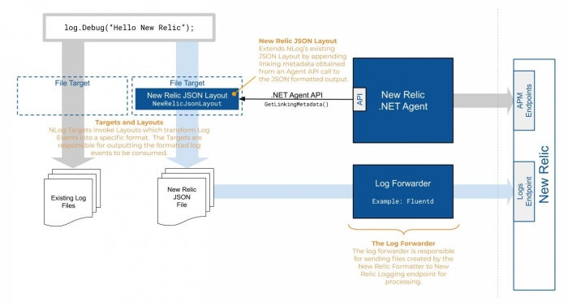

Use our [NLog](https://nlog-project.org/ "Link opens in a new window.") extension to link to your log data with related data across the rest of the New Relic platform. Read on to learn how to configure logs in context and enrich your log data.

## Compatibility and requirements [#compatibility-dotnet-serilog]

To use New Relic logs in context with NLog, ensure your configuration meets the following requirements:

* Microsoft [.NET Framework 4.5+](https://dotnet.microsoft.com/download/dotnet-framework) or [.NET Core 2.0+](https://dotnet.microsoft.com/download/dotnet-core)
* [New Relic .NET agent 8.21+](https://docs.newrelic.com/docs/release-notes/agent-release-notes/net-release-notes)
* [New Relic .NET agent API 8.21](https://docs.newrelic.com/docs/agents/net-agent/net-agent-api)[+](https://docs.newrelic.com/docs/agents/net-agent/net-agent-api)
* [NLog 4.5+](https://nlog-project.org/)

## Overview

NLog works by having [Layouts](https://github.com/NLog/NLog/wiki/Tutorial#Layouts-and-LayoutRenderers) (which guide what data is added to log events and in what format) and [Targets](https://github.com/NLog/NLog/wiki/Tutorial#target-wrappers) (which control where logging data is sent.)

The [New Relic NLog extension](https://github.com/newrelic/newrelic-logenricher-dotnet/tree/master/src/NLog) provides a `NewRelicJsonLayout` which formats a log event in the way required by the New Relic logging endpoint, and adds contextual information from the .NET agent when attached to your application. A target can then be configured to write logging data to an output folder, which can be monitored by a log forwarder to incrementally send log information to New Relic.

This diagram illustrates the flow of log messages through NLog:



This diagram illustrates the flow of log messages through NLog, highlighting specific components of the New Relic NLog extension.

The above diagram highlights the main components of the NLog Logs-in-Context solution:

* **New Relic JSON Layout**: The `NewRelicJsonLayout` adds contextual information from the .NET agent (using the API) to the log events generated by the application, and outputs log messages in the JSON format expected by New Relic. This contextual information, known as linking metadata, is used by New Relic to link log messages to the transactions and spans from which they were created.
* **File Target**: A `FileTarget` defines a file on disk where log messages will be written. Adding the `NewRelicJsonLayout` to that target will cause the output to be formatted correctly for forwarding to New Relic.
* **New Relic Log Forwarder**: The log forwarder is configured to send the log data from the `FileTarget`'s output to New Relic. The example below uses the [New Relic Fluentd log forwarder](https://github.com/newrelic/newrelic-fluentd-output), however there are many other log forwarders that can be used. For more information, see [Introduction to log management](/docs/introduction-new-relic-logs).

For more information about logging with NLog, see the NLog [Getting started](https://nlog-project.org/download/) documentation.

## Configure logs in context with log management [#configure-logs]

To configure logs in context with NLog:

1. [Enable log management](/docs/introduction-new-relic-logs) with a compatible [log forwarding plugin](/docs/logs/enable-logs/enable-logs/enable-new-relic-logs#enable-logs).
2. [Install or update the .NET agent](#dotnet-extension).
3. [Configure the NLog extension](#enable-logs-nlog).
4. [Check for logging data.](#test-extension-dotnet)

## Enable log management [#enable-logs]

Confirm that you have [log management](/docs/introduction-new-relic-logs) enabled, with a compatible [log forwarding plugin](/docs/logs/enable-logs/enable-logs/enable-new-relic-logs#enable-logs) installed to send your application logs to New Relic.

## Install or update the .NET agent [#dotnet-extension]

[Install](/docs/agents/net-agent/installation/introduction-net-agent-install) or [update](/docs/agents/net-agent/installation/update-net-agent) to the most recent .NET agent version, and [enable Distributed tracing](/docs/understand-dependencies/distributed-tracing/enable-configure/enable-distributed-tracing).

## Configure the NLog extension [#enable-logs-nlog]

To configure logs in context with the NLog extension, complete the following steps:

1. Using the Visual Studio [NuGet Package Manager](https://docs.microsoft.com/en-us/nuget/consume-packages/install-use-packages-visual-studio), locate and install the [`NewRelic.LogEnrichers.NLog`](https://www.nuget.org/packages/NewRelic.LogEnrichers.NLog/) package.
2. In your application code, update your logging configuration to add the `NewRelicJsonLayout`.

   The following code example enriches log events with New Relic linking metadata. In addition to the existing log files, it outputs new log files in a specific JSON format at `C:\logs\NLogExample.log.json` for consumption by the Log Forwarder:

   ```
   var loggerConfig = new LoggingConfiguration();
     
     var newRelicFileTarget = new FileTarget("NewRelicFileTarget");
     newRelicFileTarget.Layout = new NewRelicJsonLayout();
     newRelicFileTarget.FileName = "C:\logs\NLogExample.json";
     loggerConfig.AddTarget(newRelicFileTarget);
     loggerConfig.AddRuleForAllLevels("NewRelicFileTarget");
     LogManager.Configuration = loggerConfig;
     var logger = LogManager.GetLogger("Example");
   ```

   <Callout variant="caution">
     The above configuration results in new JSON files that are written to disk. Some of these [configuration options](https://github.com/nlog/NLog/wiki/File-target) may be useful in managing the amount of disk space used and/or the performance of the target.

     * `archiveAboveSize`
     * `maxArchiveFiles`
     * `bufferSize`
     * `enableArchiveFileCompression`
     * `autoFlush`
     * `concurrentWrites`
   </Callout>

   <Callout variant="important">
     Though not required, using the [NLog AsyncWrapper Target](https://github.com/nlog/NLog/wiki/AsyncWrapper-target) may help improve the performance by performing formatting and output of log files on a different thread.
   </Callout>
3. Once you have configured the NLog extension and updated your logging file, you can configure your extension to send data to New Relic. See below for an example of this configuration using the Fluentd plugin for New Relic's log management:

   ```
   <!--NewRelicLoggingExample.conf-->
   <source> 
       @type tail 
       path C:\logs\NLogExample.log.json
       pos_file C:\logs\NLogExample.log.json.pos 
       tag logfile.*
    <parse> 
       @type json 
   </parse>
   </source>
   <match **> 
       @type newrelic 
       license_key <YOUR NEW_RELIC_LICENSE_KEY>
       base_uri https://log-api.newrelic.com/log/v1
   </match>
   ```

## File-based configuration

Configuration of the New Relic NLog extension may also be accomplished with file based configuration providers.

<CollapserGroup>
  <Collapser
    id=""
    title={<><InlineCode>.Config</InlineCode> based configuration</>}
  >
    The example code below creates a logger based on settings contained in an App.config file.

    **Instantiating Logger using `.config` file**

    ```
    var logger = LogManager.GetLogger("NewRelicLog");
    logger.Info("Hello, New Relic!");
    ```

    **Sample `App.config` file**

    ```
    <?xml version="1.0" encoding="utf-8" ?>
    <configuration>
      <configSections>
        <section name="nlog" type="NLog.Config.ConfigSectionHandler, NLog"/>
      </configSections>
      <startup>
        <supportedRuntime version="v4.0" sku=".NETFramework,Version=v4.5" />
      </startup>
      <nlog xmlns="http://www.nlog-project.org/schemas/NLog.xsd"
          xmlns:xsi="http://www.w3.org/2001/XMLSchema-instance">
        <extensions>
          <add assembly="NewRelic.LogEnrichers.NLog" />
        </extensions>
        <targets>
          <target name="NewRelicLogFile" xsi:type="File" fileName="C:/path/to/NewRelicLog.json">
            <layout xsi:type="newrelic-jsonlayout">
            </layout>
          </target>
        </targets>
        <rules>
          <logger name="NewRelicLog" minlevel="Info" writeTo="newRelicLogFile" />
        </rules>
      </nlog>
    </configuration>
    ```
  </Collapser>
</CollapserGroup>

## What's next? [#what-next]

Now that you've set up APM logs in context, here are some potential next steps:

* Explore your data using the [Logs UI](/docs/explore-your-data-new-relic-logs-ui).
* Troubleshoot errors with [distributed tracing](/docs/understand-dependencies/distributed-tracing/get-started/introduction-distributed-tracing), stack traces, application logs, and more.
* [Query your data](/docs/using-new-relic/data/understand-data/query-new-relic-data) and [create custom dashboards](/docs/dashboards/new-relic-one-dashboards/get-started/introduction-new-relic-one-dashboards) or [alerts](/docs/alerts/new-relic-alerts/configuring-alert-policies/create-edit-or-find-alert-policy).
