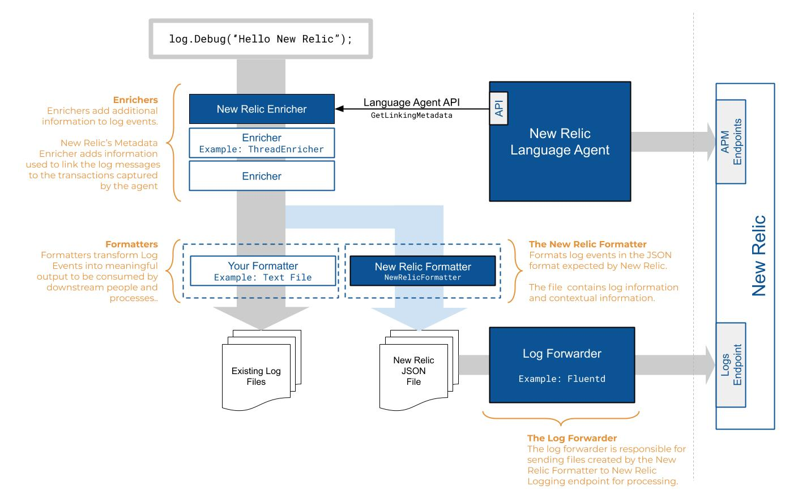

Our log management capabilities help you to collect, process, explore, query, and alert on your log data. To get your logs into New Relic, you can:

* Use your existing [log forwarding solution](#log-forwarding) to collect your logs and extend the metadata that is forwarded to New Relic.
* Use our [infrastructure agent](/docs/logs/enable-new-relic-logs/1-enable-logs/forward-your-logs-using-new-relic-infrastructure-agent) as a lightweight data collector, without having to use additional software.
* Use our [Log API](/docs/logs/log-management/log-api/introduction-log-api/) to forward your logs via HTTP.
* Use syslog protocols to forward your logs via a [TCP endpoint](/docs/logs/log-management/log-api/use-tcp-endpoint-forward-logs-new-relic/).

## How it works [#enable]

The following diagram shows the lifecycle of a log message for an app, from enrichment with APM agent metadata (contextual logging), to formatting and forwarding the log data to New Relic.

<figcaption>
  This diagram illustrates the flow of log messages through New Relic.
</figcaption>

Standard log formatters transform log events into meaningful output (such as text files) that can be used by downstream people and processes. The `NewRelicFormatter` transforms log events into the JSON format expected by New Relic. These files contain log information and extended metadata.

When you configure your log forwarder (our infrastructure monitoring agent, Fluentd, Logstash, etc.), you can also extend and enrich your log data. By configuring [logs in context](/docs/logs/enable-log-management-new-relic/configure-logs-context/configure-logs-context-apm-agents/), the log enricher links the formatted log data with additional transaction information from your application or host.   

Now your log files are enriched with enhanced metadata and contextual logging data. Your log forwarder sends the files to our logging endpoint for processing. From there you can use our log management capabilities to view, query, set up alerts, and more in New Relic.

Here is an example of logs for your host's UI. You can see logs in context of events for the selected time period, and drill down into detailed data for any of the highlighted attributes. To take advantage of even more capabilities, click **Query logs** from here to go directly to the **Logs** UI.

<figcaption>
  Here is an example of a host's logs in context related to an event.
</figcaption>

## Get started with log forwarders [#compatibility-requirements]

To forward your logs to New Relic with enriched metadata:

1. If you don't have one already, [create a New Relic account](https://newrelic.com/signup). It's free, forever.
2. Have your New Relic account's [license key](/docs/accounts/install-new-relic/account-setup/license-key).
3. Install a [compatible log forwarder](#log-forwarding).
4. Ensure that outbound connectivity on TCP port 443 is allowed to the [CIDR range](/docs/using-new-relic/cross-product-functions/install-configure/networks/#infrastructure) that matches your [region](/docs/using-new-relic/welcome-new-relic/get-started/our-eu-us-region-data-centers).
5. Use the DNS name `log-api.newrelic.com` or `log-api.eu.newrelic.com` for configuration.
6. For apps monitored by a New Relic APM agent, configure [logs in context](/docs/logs/enable-log-management-new-relic/configure-logs-context/configure-logs-context-apm-agents/).

## Log forwarding options [#log-forwarding]

Use any of these solutions to forward your logs to New Relic.

Recommended:
* [Infrastructure monitoring agent](/docs/logs/forward-logs/forward-your-logs-using-infrastructure-agent/)

Amazon:
* [AWS CloudWatch plugin](/docs/logs/forward-logs/aws-lambda-sending-cloudwatch-logs/)
* [AWS FireLens plugin](/docs/logs/forward-logs/aws-firelens-plugin-log-forwarding/)
* [AWS Kinesis Firehose](/docs/logs/forward-logs/stream-logs-using-kinesis-data-firehose/)
* [AWS Lambda for sending logs from S3](/docs/logs/forward-logs/aws-lambda-sending-logs-s3/)

Microsoft:
* [Azure ARM template](/docs/logs/forward-logs/azure-log-forwarding/)

Other log forwarding plugins:
* [Fluent Bit plugin](/docs/logs/forward-logs/fluent-bit-plugin-log-forwarding/)
* [Fluentd plugin](/docs/logs/forward-logs/fluentd-plugin-log-forwarding/)
* [Google Cloud Platform Pub/Sub](/docs/logs/forward-logs/google-cloud-platform-log-forwarding)
* [Heroku log streaming](/docs/logs/forward-logs/heroku-log-forwarding/)
* [Kubernetes plugin](/docs/logs/forward-logs/kubernetes-plugin-log-forwarding/)
* [Logstash plugin](/docs/logs/forward-logs/logstash-plugin-log-forwarding/)
* [Vector plugin](/docs/logs/forward-logs/vector-output-sink-log-forwarding/)

## TCP endpoint [#enable-endpoint]

In some situations you may not have log forwarders; for example, with CDNs, hardware devices, or managed services. You can use syslog protocols such as `rsyslog` and `syslog-ng`, and forward your logs to New Relic via a [TCP endpoint](/docs/logs/log-management/log-api/use-tcp-endpoint-forward-logs-new-relic/).

## Log API [#enable-api]

If you prefer to connect to New Relic without installing a plugin, we offer an HTTP input integration. This option sends your monitored log data directly to New Relic via the [Log API](/docs/logs/log-management/log-api/introduction-log-api/).

## What's next? [#what-next]

After you enable your log forwarder, make the most of your data in New Relic with our log management capabilities:

* Explore the logging data across your platform with our [Logs UI](/docs/logs/log-management/ui-data/use-logs-ui/).
* See your logs in context of your app's performance in the [APM UI](/docs/logs/log-management/ui-data/use-logs-ui/#links). Troubleshoot [errors](/docs/apm/apm-ui-pages/error-analytics/errors-page-find-fix-verify-problems/) with [distributed tracing](/docs/apm/distributed-tracing/ui-data/understand-use-distributed-tracing-data), stack traces, application logs, and more.
* Get deeper visibility into both your application and your platform performance data if you are forwarding your logs with our [infrastructure monitoring agent](/docs/logs/forward-logs/forward-your-logs-using-infrastructure-agent/). Review your [infrastructure logs](/docs/logs/log-management/ui-data/use-logs-ui/#links) in the UI.
* Set up [alerts](/docs/alerts-applied-intelligence/new-relic-alerts/alert-conditions/create-alert-conditions/).
* [Query your data](/docs/query-your-data/explore-query-data/get-started/introduction-querying-new-relic-data/) and [create dashboards](/docs/query-your-data/explore-query-data/dashboards/introduction-dashboards/). For example, to query and manage your data partition rules, see our [NerdGraph tutorial](/docs/apis/nerdgraph/examples/nerdgraph-data-partition-rules-tutorial/).
