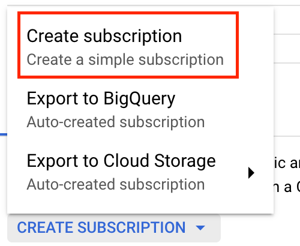

We support two different methods to forward your logs from a Google Cloud Platform Pub/Sub topic to New Relic.

## Select an option [#gcp-options]

The following may help you decide which option is best for your business needs.

<table>
  <thead>
    <tr>
      <th style={{ width: "200px" }}>
        GCP log forwarding options
      </th>
      <th>
        Considerations
      </th>
    </tr>
  </thead>
  <tbody>
    <tr>
      <td>
        Headerless API
      </td>
      <td>
        * Best suited for low log volumes, since it performs one API call for each log record it sends.
        * Does not incur any extra cost to your GCP subscription.
        * If your log volume increases, this solution might hit the quota limits of your New Relic account.
      </td>
    </tr>
    <tr>
      <td>
        Dataflow job
      </td>
      <td>
        * Best suited for larger log volumes, since it groups log records in batches before sending them to New Relic.
        * Reduces the number of API calls and allows you to reduce your quota usage.
        * May incur extra costs at your GCP subscription, due to the execution of a Dataflow job in your premises.
      </td>
    </tr>
  </tbody>
</table>

## Use headerless API [#gcp-headerless-api]

To send your GCP logs to New Relic using our headerless API:

<CollapserGroup>
  <Collapser
    id="ingest-url"
    title="1. Generate a GCP Pub/Sub ingest URL."
  >

  Start by creating an ingest URL for your GCP Pub/Sub topic.

  

  1. Navigate to [**Logs** in New Relic One](https://one.newrelic.com/launcher/logger.log-launcher), and click **Add more data sources**.
  2. Click **Google Cloud Platform**, then select your New Relic account where you want to forward logs, and click **Continue**.
  3. Optional: Configure metadata (attribute-value pairs) to be included in every log event sent to the ingest URL you will generate in the next step.
  4. Click **Generate URL**.
  5. Copy your newly generated **ingest URL** and keep it in a safe place.

  You will use your new ingest URL to configure a Pub/Sub topic that sends logs to New Relic.
  
  </Collapser>

  <Collapser
    id="create-gcp-topic"
    title="2. Create a GCP Pub/Sub Topic."
  >

  Next you will create the GCP Pub/Sub topic that your ingest URL will use.

  

  1. Navigate to the [GCP Pub/Sub Console](https://console.cloud.google.com/cloudpubsub/topic/list).
  2. Click **Create Topic**.
  3. Enter a meaningful **Topic ID**, then configure other options as needed.
  4. Click **Create Topic**.
  
  </Collapser> 

  <Collapser
    id="configure-gcp-log-forwarding"
    title="3. Prepare GCP Pub/Sub Topic to forward logs to New Relic."
  >

  Once you have created your Pub/Sub topic, create a subscription for it.

  

  1. Return to the [GCP Pub/Sub Console](https://console.cloud.google.com/cloudpubsub/topic/list).
  2. Click the [Pub/Sub topic](#create-gcp-topic) you previously created.
  3. Scroll down and select the **Subscriptions** tab, then click **Create Subscription** and select **Create a simple subscription**.

  

  4. Enter a **Subscription ID**. Then, under **Delivery Type**, select **Push**.
  5. In the **Endpoint URL** field, paste the [ingest URL](#ingest-url) you previously generated.
  6. Configure remaining settings as needed, and click **Create**.
  
  </Collapser>

  <Collapser
    id="forward-logs"
    title="4. Create routing sink to forward logs to New Relic."
  >

  To finish setup, create a routing sink for your GCP Pub/Sub topic that will forward your logs to New Relic.

  

  1. Navigate to the [GCP Logs Router Console](https://console.cloud.google.com/logs/router).
  2. Click **Create Sink**.
  3. Enter a **Sink name** and **Sink description**, then click **Next**.
  4. Under **Select sink service**, select **Cloud Pub/Sub topic**, and select the [Pub/Sub topic](#create-gcp-topic) you previously created.
  5. Configure remaining filters as needed, then click **Create sink** to complete setup.
  
  </Collapser>

</CollapserGroup>

## Use Dataflow job [#gcp-dataflow]

To send your GCP logs to New Relic using a Dataflow job, you will use our Dataflow template. Before you begin, make sure you have the following tools on your local computer:

* A Unix terminal for Linux or macOS
* [Git](https://git-scm.com/book/en/v2/Getting-Started-Installing-Git)
* [Java JDK 8](https://adoptopenjdk.net/index.html)
* [Apache Maven 3.2 or higher](https://maven.apache.org/). We've seen earlier versions fail during the compilation process.
* The [Google Cloud SDK](https://cloud.google.com/sdk/docs/install), which includes `gcloud` and `gsutil` command line tools

<CollapserGroup>
  <Collapser
    id="dataflow-login-gcp"
    title="1. Log into your Google Cloud Platform account."
  >

  Run the following command and follow the prompts to log into GCP and select your cloud project:

  ```
  gcloud init
  ```

  Using the wizard, you will select a cloud project to use, and you will be able to optionally select a default compute region and zone for the resources you create using `gcloud` or `gsutil`. We will not presume a default project, location or region for the following commands.
  
  </Collapser>

  <Collapser
    id="dataflow-repo"
    title="2. Clone the DataflowTemplates GitHub repository."
  >

  1. Clone the DataflowTemplates GitHub repository using the following command:

  ```
  git clone https://github.com/newrelic-forks/DataflowTemplates.git
  ```

  2. Enter the directory you just created:

  ```
  cd DataflowTemplates
  ```

  Then continue with the next section to execute additional commands.
  
  </Collapser>

  <Collapser
    id="dataflow-configuration"
    title="3. Compile and run the Dataflow forwarder."
  >

  To set the required configuration to compile and run the Dataflow forwarder, run the following commands in your `DataflowTemplates` directory. The only required values are:
  
  * `PROJECT_ID`
  * `BUCKET_NAME`
  * `NR_LICENSE_KEY`
  * `INPUT_SUBSCRIPTION_NAME`
  
  You can leave the other default values as is.

  ```bash
  # The Google Cloud Platform project id where your logs are and where the Dataflow log forwarder will run
  PROJECT_ID=<your_project_id>
  # Temporary bucket that will store intermediary files as a result of compiling the Dataflow template. Its name must be unique.
  BUCKET_NAME=<a_nonexisting_gcs_bucket_name>
  # New Relic license key
  NR_LICENSE_KEY=<your_newrelic_license_key>
  # Input PubSub subscription to read logs from
  INPUT_SUBSCRIPTION_NAME=<your_pubsub_input_subscription_name>

  # Region where the created resources will be placed
  REGION=us-west1
  # Service account used to execute the Dataflow template
  SERVICE_ACCOUNT_NAME=nr-dataflow-forwarder-sa
  # File name where the service account credentials will be stored
  SERVICE_ACCOUNT_KEY_FILENAME=service-account-key.json
  # The name your Dataflow log forwarder job will have
  JOB_NAME=nr-log-forwarder
  ```

  </Collapser>

  <Collapser
    id="dataflow-bucket"
    title="4. Create a GCP bucket for the Dataflow template."
  >

  Create a bucket in GCP to hold the generated Dataflow template by running the following command:

  ```bash
  gsutil mb -p ${PROJECT_ID} -l ${REGION} gs://${BUCKET_NAME}
  ```

  </Collapser>

  <Collapser
    id="dataflow-account"
    title="5. Create a service account."
  >

  Execute the following commands:

  1. Create the service account:

    ```bash
    gcloud iam service-accounts create ${SERVICE_ACCOUNT_NAME}
    ```

  2. Grant permissions to the service account:
    
    ```bash
    gcloud projects add-iam-policy-binding ${PROJECT_ID} --member="serviceAccount:${SERVICE_ACCOUNT_NAME}@${PROJECT_ID}.iam.gserviceaccount.com" --role="roles/owner"
    ```
  
  3. Generate the service account key file:

    ```bash
    gcloud iam service-accounts keys create ${SERVICE_ACCOUNT_KEY_FILENAME} --iam-account=${SERVICE_ACCOUNT_NAME}@${PROJECT_ID}.iam.gserviceaccount.com
    ```

  4. Reference your service account key file using the `GOOGLE_APPLICATION_CREDENTIALS` environment variable, as it will be used by subsequent commands:

    ```bash
    export GOOGLE_APPLICATION_CREDENTIALS=${SERVICE_ACCOUNT_KEY_FILENAME}
    ```
  
  </Collapser>

  <Collapser
    id="dataflow-compile"
    title="6. Compile and publish the PubsubToNewRelic template."
  >

  Execute the following command:

  ```bash
  mvn compile exec:java \
      -Dexec.mainClass=com.google.cloud.teleport.templates.PubsubToNewRelic \
      -Dexec.cleanupDaemonThreads=false \
      -Dexec.args=" \
          --project=${PROJECT_ID} \
          --region=${REGION} \
          --enableStreamingEngine \
          --stagingLocation=gs://${BUCKET_NAME}/staging/ \
          --gcpTempLocation=gs://${BUCKET_NAME}/temp/ \
          --templateLocation=gs://${BUCKET_NAME}/template/PubsubToNewRelic \
          --runner=DataflowRunner \
      "
  ```

  </Collapser>

  <Collapser
    id="dataflow-job"
    title="7. Run the template as a Dataflow job."
  >

  Execute the following command to start shipping logs using a Dataflow job that reads from your Pub/Sub topic:


  ```bash
  gcloud dataflow jobs run ${JOB_NAME} \
      --gcs-location=gs://${BUCKET_NAME}/template/PubsubToNewRelic \
      --region=${REGION} \
      --parameters "inputSubscription=projects/${PROJECT_ID}/subscriptions/${INPUT_SUBSCRIPTION_NAME},licenseKey=${NR_LICENSE_KEY}"
  ```

  This command only requires these two values:
  
  * The input PubSub subscription used to read log messages
  * The New Relic license key used to send your logs
  
  For other values, the command uses default configuration settings that you can further [customize as needed](#dataflow-config).

  </Collapser>

  <Collapser
    id="dataflow-config"
    title="8. Optional: Tune up your Dataflow log forwarder job."
  >

  Here is a reference of available options you can use to further tune up the execution of your Dataflow log forwarder job.

  <table>
    <thead>
      <tr>
        <th style={{ width: "250px" }}>
          Configuration parameter
        </th>

        <th>
          Description
        </th>
      </tr>
    </thead>

    <tbody>
      <tr>
        <td>
          `licenseKey`
          **Required.**
        </td>

        <td>
          New Relic license key.
        </td>
      </tr>

      <tr>
        <td>
          `inputSubscription`
          **Required.**
        </td>

        <td>
          The Cloud Pub/Sub subscription used to consume logs. Use this format:

          ```
          projects/<project-id>/subscriptions/<subscription-name>
          ```
        </td>
      </tr>

      <tr>
        <td>
          `logsApiUrl`
        </td>

        <td>
          New Relic's URL for the Log API. This routes from the VPC where the Dataflow pipeline runs.

          Default:

          ```
          https://log-api.newrelic.com/log/v1
          ```
        </td>
      </tr>

      <tr>
        <td>
          `batchCount`
        </td>

        <td>
          Maximum number of log records to aggregate into a batch before sending them to New Relic in a single HTTP POST request.

          Default: `100`
        </td>
      </tr>

      <tr>
        <td>
          `flushDelay`
        </td>

        <td>
          Number of seconds to wait for additional logs (up to `batchCount`) since the reception of the last log record in non-full batch, before flushing them to New Relic.

          Default: `2`
        </td>
      </tr>

      <tr>
        <td>
          `parallelism`
        </td>

        <td>
          Maximum number of parallel requests.

          Default: `1`
        </td>
      </tr>

      <tr>
        <td>
          `disableCertificateValidation`
        </td>

        <td>
          Disable SSL certificate validation.

          Default: `false`
        </td>
      </tr>

      <tr>
        <td>
          `useCompression`
        </td>

        <td>
          Compress (in GZIP) the payloads sent to the New Relic Logs API.

          Default: `true`
        </td>
      </tr>

      <tr>
        <td>
          `tokenKMSEncryptionKey`
        </td>

        <td>
          KMS Encryption Key for the token. Use this format:

          ```
          projects/{gcp_project}/locations/{key_region}/keyRings/{key_ring}/cryptoKeys/{kms_key_name}
          ```

          Default: `null`
        </td>
      </tr>
    </tbody>
  </table>
  
  </Collapser>

</CollapserGroup>

## What's next? [#what-next]

Explore logging data across your platform with the [New Relic One UI](/docs/logs/log-management/ui-data/use-logs-ui/).

* Get deeper visibility into both your application and your platform performance data by forwarding your logs with our [logs in context](/docs/logs/enable-log-management-new-relic/configure-logs-context/configure-logs-context-apm-agents/) capabilities.
* Set up [alerts](/docs/alerts-applied-intelligence/new-relic-alerts/alert-conditions/create-alert-conditions/).
* [Query your data](/docs/query-your-data/explore-query-data/get-started/introduction-querying-new-relic-data/) and [create dashboards](/docs/query-your-data/explore-query-data/dashboards/introduction-dashboards/).
