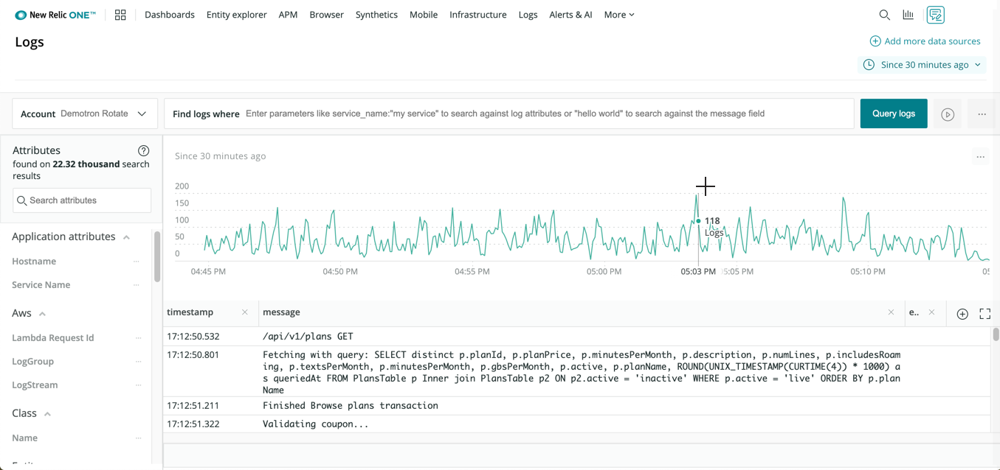

<LandingPageHero>
  <HeroContent>
    Designed for engineers, IT staff, and developers, New Relic's log management capabilities provide an open, cloud-driven logging platform. You get high volumes of data without disruption, as well as fast response time on searches across your entire log ecosystem. Pre-built plugins with some of the most common open-source logging tools also make it simple to send your data from anywhere to New Relic.

    <Callout variant="tip">
      How much data, and how fast? Here at New Relic, our own service generates over 19TB of volume per day, and we need to provide immediate visibility for your data at scale. We rely on our own log capabilities for troubleshooting, improving mean time to resolution (MTTR), app development, and more.
    </Callout>

    When you use our combined telemetry data platform of metrics, events, logs, and traces, you can also examine [logs in context](/docs/logs/enable-logs/configure-logs-context/configure-logs-context-apm-agents). For example, if you are troubleshooting an incident, you can immediately click into the specific application and infrastructure logs for that incident. This ensures you have powerfully integrated observability across your entire infrastructure stack.
  </HeroContent>

  

  <figcaption>
    Use New Relic One's Logs UI, API, and query tools to explore, troubleshoot, and visualize your logging data.
  </figcaption>
</LandingPageHero>

<LandingPageTileGrid>
  <LandingPageTile
    title="Get started."
    icon="fe-check-square"
  >

    * [Learn](/docs/logs/new-relic-logs/get-started/introduction-new-relic-logs) about our log aggregation and management capabilities.
    * [Enable logging](/docs/logs/enable-new-relic-logs/1-enable-logs) using our infrastructure agent, various AWS services, Fluentd, Fluent Bit, Kubernetes, etc.
  </LandingPageTile>

  <LandingPageTile
    title="Troubleshoot and resolve problems."
    icon="fe-alert-triangle"
  >

    * Query, filter, alert, and use log details to uncover root causes with the [New Relic One UI](/docs/logs/new-relic-logs/ui-data).
    * Send log data directly via HTTP endpoint with our [Log API](/docs/logs/new-relic-logs/log-api/introduction-log-api).
  </LandingPageTile>

  <LandingPageTile
    title="Optimize performance."
    icon="fe-tool"
  >

    * [Query](/docs/using-new-relic/data/understand-data/query-new-relic-data) your data, and share [charts and dashboards](/docs/dashboards/new-relic-one-dashboards/get-started/introduction-new-relic-one-dashboards) showing patterns for improving site performance.
    * Analyze [contextual logging data](/docs/logs/enable-logs/configure-logs-context/configure-logs-context-apm-agents) from other components in your ecosystem to improve app development, performance, and uptime.
  </LandingPageTile>
</LandingPageTileGrid>

<ButtonLink
  role="button"
  to="/docs/logs/table-of-contents"
  variant="primary"
>
  View all log management docs
</ButtonLink>
