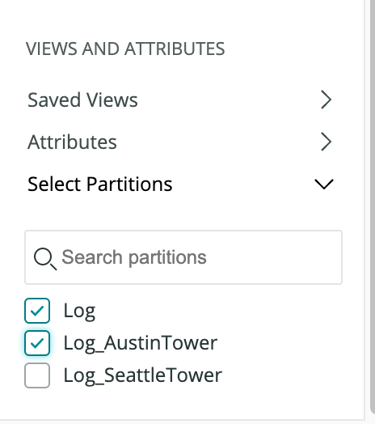

Data partitions are a way of grouping or organizing log data for faster and more efficient querying. When a query targets a single partition, less unrelated data is scanned and results are returned faster. Accounts can have multiple partitions, and multiple partitions can be queried at the same time.

Data partitions also allow data to be mapped to an alternative, or “secondary” namespace with a fixed 30-day retention. This is useful for maintining compliance with privacy-centric regulations and standards like General Data Protection Regulation (GDPR).

## Creating a partition

Before you start creating partitions, make sure you have the right permissions and a partition plan.

<Callout variant="important">
Logs are routed to partitions during the ingestion process, before data is written to NRDB. Partition rules will not affect logs that were ingested prior to the rule's creation.
</Callout>

### Required roles and permissions

Users require an [Admin role](/docs/accounts/accounts-billing/new-relic-one-user-management/new-relic-one-user-model-understand-user-structure/) to create and modify partition rules. 

### Sizing and organizing a partition

You can gain significant performance improvements with proper use of data partitions. Organizing your data into discrete partitions enables you to query them separately or all together. The goals of partitioning your data should be:
* Create data partitions that align with concepts in your environment or organization that are static or change infrequently (e.g. by business unit, team, environment, service, etc.).
* Ensure each partition remains below 1 TB of daily ingest for optimal performance.

Having more partitions allows for more targeted searches, but creating too many partitions can make logs hard to find and increase administrative overhead. Finding the right balance is important. There's a maximum of 100 partitions supported; an optimal number for most accounts is 10 to 15 partitions. 

### Choosing a namespace

A partition’s namespace determines its retention period. Currently, there are two retention options:
* **Standard** - The account’s default retention determined by your New Relic subscription. This is the maximum retention period available in your account and is the namespace you'll select for most of your partitions.
* **Secondary** - 30-day retention. All logs sent to a partition that's a member of the Secondary namespace will be purged on a rolling basis 30 days after having been ingested.

<Callout variant="tip">
Secondary retention is not a cost control mechanism; data is billed on ingest.
</Callout>

### Create a partition rule

1. From **[one.newrelic.com](http://one.newrelic.com) > Logs**, under **Manage Data** on the left side of the Logs page, click  **Data partitions**.

2. Click **Create partition rule**.

3. Define a **Partition Name**. It should be an alphanumeric string that begins with `Log_`.
4. Select which retention namespace the partition will be in.
5. Add an optional description.
6. Set your rule's **Matching Criteria**: select **EQUALS** to target logs that match your criteria exactly, select **LIKE** to apply a fuzzy match. 
7. Click the **Enable Rule** slider, and click **Create**.

## Search data partitions

The default partition for all Logs accounts is “Log”. Any log that is not affected by a artition rule will be stored in the Log partition by default.

1. On the left side of the Logs page, under **Views and Attributes**, click **Select Partitions**, and choose the partitions you wish to query:

2. Click **Query logs** to search all selected partitions.

### Searching multiple partitions

You can query multiple partitions simultaneously by checking off the desired partitions before querying. For best performance, select the smallest number of partitions possible.

