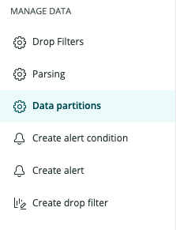

## What are Data Partitions?

Data Partitions are a way of grouping or organizing log data for faster and more efficient querying. When a single partition is targeted by a query, less unrelated data is scanned and results are returned faster. Accounts may have multiple partitions, and multiple partitions may be queried at the same time.

Data partitions also allow data to be mapped to an alternative, or “secondary” namespace with a fixed 30-day retention. This is useful for maintining compliance with privacy-centric regulations and standards like GDPR.

## Create a Partition

### Required Roles & Permissions

Users require an Admin base role to create and modify partition rules.

### Sizing and Organizing a Partition

Proper use of Data Partitions can yield significant performance improvements. Users can organize their data into discrete partitions, which can be queried separately or altogether. The goals of partitioning your data should be:
* Create data partitions that align with concepts in your environment or organization that are static or change infrequently (business unit, team, environment, service, etc.).
* Ensure each partition remains below 1 TB of daily ingest for optimal performance.

More partitions allows for more targeted searches, but creating too many partitions may make logs hard to find and increase administrative overhead. Finding the right balance is important. There is a maximum of 100 partitions supported; an optimal number for most accounts is 10 to 15 partitions. 

### Choosing a Namespace

A partition’s namespace determines its retention period. Currently, there are two retention options:
* **Standard** - The account’s default retention determined by your New Relic subscription. This is the maximum retention period available in your account and is the namespace you will select for most of your partitions.
* **Secondary** - 30-day retention. All logs sent to a partition that is a member of the Secondary namespace will be purged on a rolling basis 30 days after having been ingested.

Note: Secondary retention is not a cost control mechanism; data is billed for on ingest.

### Creating a Partition Rule

1. Click  **Data partitions** under **Manage Data** on the left side of the Logs UI.

2. Click **Create partition rule**

3. Define a **Partition Name**. Alphanumeric string. Must begin with <code>“Log_”</code>.
4. Select **Retention/Namespace**
5. Populate **description** (optional)
6. Set your rule's Matching Criteria - Select **EQUALS** to target logs that match your criteria exactly, select **LIKE** to apply a fuzzy match. 
7. Click the **Enable Rule** slider and click **Create**.

## Searching Data Partitions

### Default Partition

The default partition for all Logs accounts is “Log”. Any log that is not affected by a Partition Rule will be stored in the Log partition by default.

### How to Search

1. Click Select Partitions and choose the partitions you wish to query:

2. Click **Query logs** to search all selected partitions

### Searching Multiple Partitions

Multiple partitions can be queried simultaneously by checking off the desired partitions before querying. For best performance, select the smallest number of partitions possible.