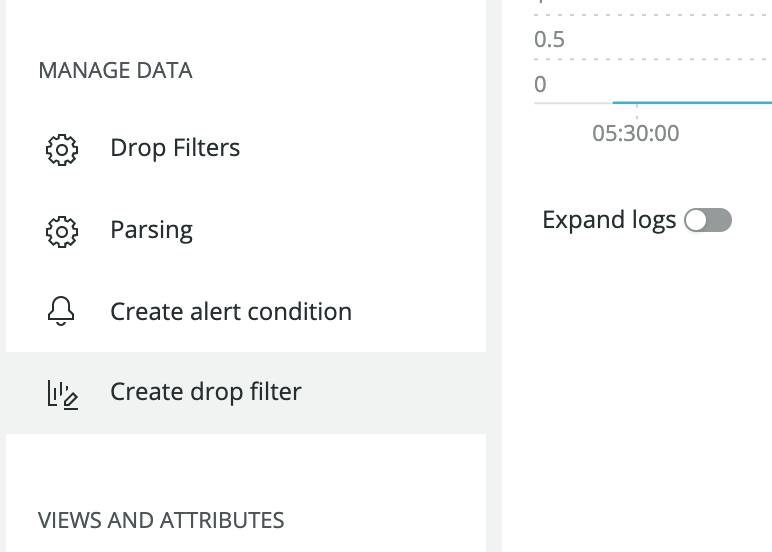

After log event data has been shipped to New Relic, it can either be stored in our database ([NRDB](https://newrelic.com/resources/ebooks/inside-nrdb-flexible-unified-database)) or dropped (discarded). New Relic can drop both log events and event attributes via drop filter rules. You can manage drop filter rules using [New Relic's log management](/docs/logs/new-relic-logs/get-started/introduction-new-relic-logs) or [NerdGraph](/docs/accounts/accounts/data-management/drop-data-using-nerdgraph).

<Callout variant="caution">
  Use caution when deciding to drop data. The data you drop is not recoverable. Before using this feature, review [Responsibilities and considerations.](https://docs.newrelic.com/docs/accounts/accounts/data-management/drop-data-using-nerdgraph#caution)
</Callout>

## Why it matters

Drop filter rules help you accomplish some very important goals:

* You lower costs by storing only logs relevant to your account.
* You protect privacy and security by removing personal identifiable information (PII).
* You reduce noise by removing irrelevant events and attributes.

## How drop filter rules work

A drop filter rule matches data based on a query. When triggered, the drop filter rule removes the matching data from the ingestion pipeline before it is written to in NRDB. Since the data does not reach the backend, it cannot be queried: the data is gone and cannot be restored.

During the ingestion process, log data can be parsed, transformed, or dropped before being stored.

## Create drop filter rules [#logs-in-context-retention]

<Callout variant="caution">
  You must have [admin permissions](/docs/accounts/accounts-billing/new-relic-one-pricing-users/users-roles#user-group) in New Relic to create and edit drop filters, or be a member of a role with create and edit permissions for **Logging Parsing Rules**.
</Callout>

Drop filter rules can be created from **[one.newrelic.com](http://one.newrelic.com) > Logs** using new or existing [log queries](/docs/logs/new-relic-logs/ui-data/query-syntax-logs).

To create a new drop filter rule:

1. Filter or [query](/docs/logs/new-relic-logs/ui-data/query-syntax-logs) to the specific set of logs which contain the data to be dropped.
2. Once the query is active, click on the **+** button to show the query options and select **Create a new drop filter**.

   
3. You can choose to either [drop the entire log event](#drop-event) that matches the query or just a [specific subset of attributes](#drop-attributes) in the matching events.
4. Save the drop filter rule. Before saving the rule, consider changing its name.

<Callout variant="important">
  Once a drop filter rule is active, it's applied to all log events ingested from that point onwards. Rules are not applied retroactively: logs collected prior to the creation of a rule are not filtered by that rule.
</Callout>

## Types of drop filter rules

### Drop log events [#drop-events]

The default type of drop filter rule is to drop logs. This option drops the entire log events that match the filter query. When creating a rule try to provide a specific query that only matches log data which should be dropped.

New Relic won't let you create drop filter rules without values in the matching query: this prevents badly formed rules from dropping all log data.

### Drop attributes

You can specify attributes to be dropped in a log event that matches your query. At least one or more attributes must be selected. Any attribute which is selected will be dropped; all remaining attributes will be kept and stored in NRDB.

<Callout variant="tip">
  We recommend this method for removing fields which could contain personal identifiable information (PII) or other sensitive attributes without losing valuable monitoring data.
</Callout>

## Cautions when dropping data [#caution]

When creating drop rules, you are responsible for ensuring that the rules accurately identify and discard the data that meets the conditions that you have established. You are also responsible for monitoring the rule, as well as the data you disclose to New Relic.

New Relic cannot guarantee that this functionality will completely resolve data disclosure concerns you may have. New Relic does not review or monitor how effective the rules you develop are.

Creating rules about sensitive data can leak information about what kinds of data you maintain, including the format of your data or systems (for example, through referencing email addresses or specific credit card numbers). Rules you create, including all information in those rules, can be viewed and edited by any user with the relevant role-based access control permissions.

## Delete drop filter rules [#drop-rules-delete]

Drop filter rules can be deleted from **[one.newrelic.com](http://one.newrelic.com) > Logs**. To delete a drop filter rule:

1. Click on the **+** button to show the query options and select **View all drop filters**.
2. Click the **delete** <Icon name="fe-trash-2"/>
   icon next to the drop filter rule you want to remove.

Once deleted, rules no longer filter ingested log events.
