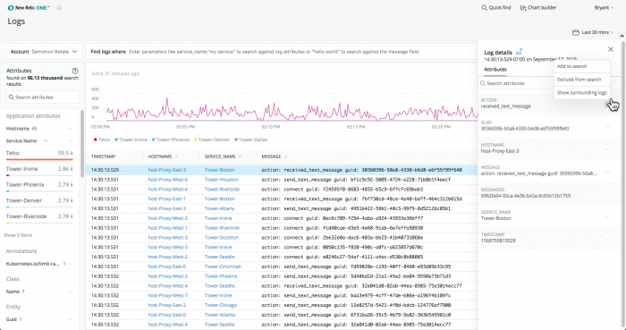

Use the Logs UI to:

* Spot interesting patterns in your logs.
* Explore and manipulate your logging data.
* Examine more context around a particular log line.
* Share the data with charts, add to dashboards, etc.
* Set up alert conditions for problems you want to prevent.

## Explore your log data [#ui-workflow]



**[one.newrelic.com](https://one.newrelic.com) > Logs**: This example shows the attributes included in the selected log. You can include or exclude them in your search, and view surrounding logs. Also notice that the attributes dropdown on the left side of the Logs UI indicates a significant number of errors have come from a specific service.

To explore your logging data, follow this basic workflow.

1. Go to **[one.newrelic.com](https://one.newrelic.com) > Logs**.
2. **Search:**

   Search with keywords or phrases to find the results you want; for example, `process failed`.

   OR

   From the search field, use the type-ahead dropdowns to select an attribute, operator, and value; for example:

   ```
   service_name equals <var>my service</var>
   ```

   For more information, see the [Logs query syntax documentation](https://docs.newrelic.com/docs/new-relic-logs-query-syntax).
3. **Look for patterns:**

   To spot suspicious spikes or drops in log messages, skim the **Volume** chart. Then, to zoom in to a specific area, click and drag. Or, to jump directly to logs for a specific point in time, click that point on the chart.
4. **Narrow your focus:**

   To narrow the focus of your initial search results or quickly find outliers, expand any of the attributes to view the ten most common values within the results. For example, if a host listed under the `hostname` attribute is generating significantly more error messages than the others, select that value to apply it to your search.
5. **Examine log details:**

   To see which attributes are included in a log message, select the log line. Add or remove columns as needed to help you focus on the details you need. Then, to control which attributes appear in the results, select a value or highlight text to include or exclude it from your search.
6. **Get related logs:**

   To view all the logs for a specific value: From the selected log's **Log details** attributes list, select `Show surrounding logs`.

You can also use any of the [core New Relic One functions](/docs/new-relic-one/use-new-relic-one/get-started/new-relic-one-core-ui-components) (specific account, time range, data explorer, query builder, etc.).

## Save your views

You can save your logs query, table configuration, time range, and attribute grouping in a saved view, so that you can quickly return to it later. To save a log analytics view after you've configured the view:

1. Click the **Saved Views** tab in the Logs UI on the top of the left side panel.

   
2. Click "Save current view".
3. Write a name for the saved view. The name will appear in the **Saved Views** tab.
4. Select which aspects from the current view you would like to save.

   
5. Select the permission level: **Private**, **Public** **(Read-only)**, and **Public (Read and write)**. Public means that any user with access to the account is able to see the saved view.
6. Click **Save view**.

## Examples

Here are a few examples of how you can use the Logs UI to get detailed information. To use some of these examples, you must be able to see [logs in context](https://docs.newrelic.com/docs/enable-logs-context-logs).

<CollapserGroup>
  <Collapser
    id="alert"
    title="Create an alert from log data"
  >
    You can create alert conditions directly in the Logs UI:

    1. Go to **[one.newrelic.com](https://one.newrelic.com) > Logs**.
    2. Search for results that you want to alert on; for example, `service_name:"your service" "fatal error"`.
    3. In the search bar, click the plus icon, then select **Create an alert from this**.
    4. Complete the **Create alert condition** that slides out, then review the NRQL query that will power the alert condition.

    After you save the Logs alert condition, you can view it in the Alerts UI, where you can make additional changes as needed.
  </Collapser>

  <Collapser
    id="dashboard"
    title="Add log volume chart to a dashboard"
  >
    You can add log charts to a dashboard directly from the Logs UI.

    1. Go to **[one.newrelic.com](https://one.newrelic.com) > Logs**.
    2. Search for results you want to plot; for example, `service_name:"checkout service" "process failed"`.
    3. From the attribute list, select an attribute to facet the chart; for example, `hostname`.
    4. At the top right of the chart, select the chart options **...** button, click **Add to dashboard**, and complete the form.

    You can also create charts with the data explorer or the query builder in New Relic One.
  </Collapser>

  <Collapser
    id="troubleshoot-error"
    title="Troubleshoot an error (logs in context)"
  >
    To troubleshoot errors this way, you must be able to see [logs in context](https://docs.newrelic.com/docs/enable-logs-context-logs). Then, to have a better understanding of what was happening on the host at the time an error occurred in your app:

    1. Go to **APM > (select an app) > Events > Error analytics** and select an error trace.
    2. From the error trace **Details**, click **See logs**.
    3. From the Logs UI, browse the related log details.
    4. To identify the host generating the error, click **Show surrounding logs**.
  </Collapser>

  <Collapser
    id="troubleshoot-latency"
    title="Troubleshoot latency (logs in context)"
  >
    To troubleshoot latency this way, you must be able to see [logs in context](https://docs.newrelic.com/docs/enable-logs-context-logs). Then, to have a better understanding of how your systems were operating when performance noticeably slowed:

    1. Go to **[one.newrelic.com](https://one.newrelic.com) > Distributed tracing**.
    2. Select a particularly slow trace.
    3. From the trace **Details**, click **See logs for this trace**.
    4. Browse related logs in the Logs UI.
  </Collapser>
</CollapserGroup>

## Links to logs in New Relic [#links]

Depending on your New Relic subscription, you can access your logs from several places in the New Relic UI. For some of these options, you must be able to see [logs in context](https://docs.newrelic.com/docs/enable-logs-context-logs).

<table>
  <thead>
    <tr>
      <th style={{ width: "275px" }}>
        To view logs...
      </th>

      <th>
        Do this...
      </th>
    </tr>
  </thead>

  <tbody>
    <tr>
      <td>
        Directly from the Logs UI
      </td>

      <td>
        Go to **[one.newrelic.com](https://one.newrelic.com) > Logs**.
      </td>
    </tr>

    <tr>
      <td>
        From an entity
      </td>

      <td>
        Go to **[one.newrelic.com](https://one.newrelic.com) > Entity explorer > (select an entity) > Logs** (if available).
      </td>
    </tr>

    <tr>
      <td>
        From distributed tracing
      </td>

      <td>
        Go to **[one.newrelic.com](https://one.newrelic.com) > Distributed tracing > (select a trace > Logs** (if available).
      </td>
    </tr>

    <tr>
      <td>
        From Kubernetes
      </td>

      <td>
        Go to **[one.newrelic.com](https://one.newrelic.com) > Kubernetes cluster explorer > (select a cluster) > (select a pod or container) > See logs** (if available).
      </td>
    </tr>

    <tr>
      <td>
        From your app in New Relic APM [(logs in context)](https://docs.newrelic.com/docs/enable-logs-context-logs)
      </td>

      <td>
        Go to **[one.newrelic.com](https://one.newrelic.com) > APM > (select an app) > Events > Logs** (if available).
      </td>
    </tr>

    <tr>
      <td>
        From an error trace in New Relic APM [(logs in context)](https://docs.newrelic.com/docs/enable-logs-context-logs)
      </td>

      <td>
        Go to **[one.newrelic.com](https://one.newrelic.com) > APM > (select an app) > Error analytics > (select an error trace) > See logs** (if available).
      </td>
    </tr>
  </tbody>
</table>
