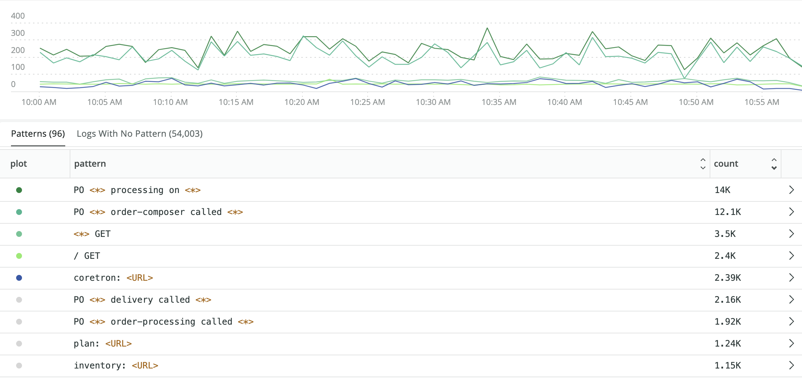
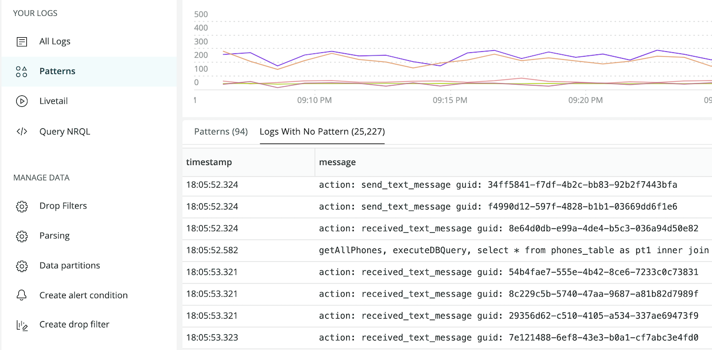

Log Patterns is the fastest way to discover value in log data without searching. 

Log data is high volume telemetry with a low value per individual record. Searching can quickly lead to logs which provide a root cause explanation but most data is repetitive and hard to contextualize when browsing. Patterns can make log data discoverable without spending a lot of time reading through low value data, iteratively writing queries and experimenting with custom charting. Automatically grouping log messages quickly and clearly reveals trends.

Log patterns applies machine learning to normalize and group log messages that are consistent in format but variable in content. These grouped messages can be sorted, making it easy to find the most frequent or rarest sets of logs in your environment. Use Log patterns as the basis for alerts when the frequency of important data changes, or to configure drop rules to get rid of unnecessary repetitive data.

## Log patterns technical overview [#overview]

Log patterns employs advanced clustering algorithms to group together similar log messages automatically. With patterns, you can:

* Orient more quickly through millions of logs.
* Reduce the time it takes to identify unusual behavior in your log estate.
* Monitor the frequency of known patterns over time to focus your energy on what matters, and exclude what's irrelevant.

Currently the patterns feature is opt-in; if you can't find the **Log patterns** button in your New Relic account's **Log management** UI, contact your account representative and ask to have it enabled. There will be up to a 24 hour lead time before the machine learning system generates a customized model for your account. Patterns will be enaabled by default for all customers at the end of May, 2021.

<table>
  <thead>
    <tr>
      <th style={{ width: "150px" }}>
        Log patterns
      </th>

      <th>
        Limitations and Considerations
      </th>
    </tr>
  </thead>

  <tbody>
    <tr>
      <td>
        Pricing
      </td>

      <td>
        There is no separate pricing for Log Patterns. The only cost is for additional data generated and added to the log records. A pattern attribute will be added to all log that match a pattern. Attributes may also be added when common values such as GUIDs, IP Addresses, URL or email addresses are discovered and automatically extraced from the log message as prt of the pattern process. 
      </td>
    </tr>

    <tr>
      <td>
        Hi-Trust
      </td>

      <td>
        Log patterns is not FedRAMP compliant. FedRAMP or other hi-trust accounts are not eligible to use Patterns.
      </td>
    </tr>

    <tr>
      <td>
        Regional Availability
      </td>

      <td>
        Our log patterns feature is currently availability to customers in the US region only. EU customers cannot enable Patterns at this time. 
      </td>
    </tr>
  </tbody>
</table>

## Get started

To start examining logs and identifying patterns:

1. Go to **[one.newrelic.com](https://one.newrelic.com) > Log management**, and use the account picker dropdown to select the target account where you want to explore patterns.
2. In the left-hand navigation of the Log management UI, click **Log Patterns**. <ImageSizing width="121px" height="103px"></ImageSizing>

The log patterns panel shows information relevant for your selected account.

<figcaption>
  **[one.newrelic.com](https://one.newrelic.com) > Log management > Log patterns:** The line chart shows patterns over time. Use the time picker and query bar to adjust the results. Then select messages in the log tables to drill down into automatically grouped or uncategorized patterns.
</figcaption>

## See patterns and recent unclustered logs [#recents]

The log patterns UI is a different view of the log table. It displays the same logs in another way.

While the log table is ordered by timestamp by default, the log patterns are ordered by the number of their appearances, so that the most repetitive patterns are displayed at the top by default.

<table>
  <thead>
    <tr>
      <th style={{ width: "200px" }}>
        If you want to...
      </th>

      <th>
        Do this...
      </th>
    </tr>
  </thead>

  <tbody>
    <tr>
      <td>
        Identify unusual or different types of patterns over time
      </td>

      <td>
        Look at the line chart. The color-coded patterns correspond to the **Plot** column in the table.
      </td>
    </tr>

    <tr>
      <td>
        See the number of log messages that match each pattern
      </td>

      <td>
        Click a pattern, then use the expandable table. With each pattern, the varying parts of the log messages are highlighted, so you can easily identify differences across log lines.

        The number of underlying log messages displayed is limited to 200 per pattern. To review a specific subset of logs, refine the query.
      </td>
    </tr>

    <tr>
      <td>
        Group and filter patterns by their attributes
      </td>

      <td>
        Use the query bar and time picker. As you apply different filters and time windows, the log patterns adjust to your new target data.

        After clicking on a pattern, an expanded table view appears. On the left side you can see a sample of underlying logs, and on the right you can see a `FACET` of the pattern by its extracted masked attributes.

        Clicking each attribute will filter the query and render the line chart accordingly. We filter out some masks such as date, time, and UUID, since those usually don’t characterize the behavior of the pattern.
      </td>
    </tr>

    <tr>
      <td>
        Immediately create an alert from a pattern query
      </td>

      <td>
        Click the alert button.
      </td>
    </tr>

    <tr>
      <td>
        Troubleshoot log messages that haven't been clustered into a pattern
      </td>

      <td>
        Use the [**Uncategorized logs** tab](#uncategorized-tab) in the **Log patterns** UI.
      </td>
    </tr>
  </tbody>
</table>

Clicking on a specific log message will open the log message details panel you're familiar with from the **Logs management** page.

: example pattern details")

<figcaption>
  **[one.newrelic.com](https://one.newrelic.com) > Log management > Log patterns > (selected pattern):** Use the log details to filter attributes and adjust patterns on the chart.
</figcaption>

## Troubleshoot uncategorized patterns [#uncategorized-tab]

To review new log messages that have not yet been clustered into a known pattern, use the **Uncategorized logs** tab. These messages can also be valuable to detect new problems and troubleshoot incidents.

The table shows the unclustered log message timestamp and its content. To see more details, click the message.

: example uncategorized sort")

<figcaption>
  **[one.newrelic.com](https://one.newrelic.com) > Log management > Log patterns:** If you sort the **Uncategorized logs** by message or by timestamp, you may notice additional patterns that may be useful to group for resolving incidents or troubleshooting other problems.
</figcaption>

## Masked attributes and wildcards [#masked]

With patterns, parts of the log messages are classified as variables and are substituted by masked attributes. The masking process supports and improves the clustering phase by allowing the algorithm to ignore changing details and focus on the repetitive structure.

Masked attributes include:

* `date_time`
* `ip`
* `url`
* `uuid`

Masked attributes are highlighted and are easy to identify, as shown in the following example.

: example log pattern")

<figcaption>
  **[one.newrelic.com](https://one.newrelic.com) > Log management > Log patterns:** Here is an example of a pattern that has masked attributes, including timestamp, instance, and UUID.
</figcaption>

Log patterns extract other less trivial variables that don't belong to any masked attribute. These variables are indicated as wildcards `*`. To reveal additional details, click the `*`.

: wildcard example")

<figcaption>
  **[one.newrelic.com](https://one.newrelic.com) > Log management > Log patterns:** Here is an example of how wildcards (\*) group other variables.
</figcaption>

## Focus on what's unusual [#description]

Log patterns groups all the recent log messages in your account that were not clustered into a known pattern yet under the Logs With No Pattern tab. These log messages don't represent any problem or flaw in the system; they have no pattern because they are too new to have been processed by the machine learning system. This makes them valuable to explore when you want to understand what has recently changed in your environment.

If the logs that appear here are tied to a recent problem, this is a quick way of discovering unique log data that is appearing for the first time in your environment. Sometimes the logs don't represent a problem, but a new format of log data that might deviant from the data model you expect your applications to follow. Catching these logs early using Patterns gives you the opportunity to ask developers to correct any deviations in their log output. The more consistent people are in the way log data is generated, the easier it becomes to use across a diverse set of teams. 

<figcaption>
  **[one.newrelic.com](https://one.newrelic.com) > Log management > Log patterns:** New Relic's log patterns feature automatically groups logs without a matching pattern.
</figcaption>

## Put the platform to work with patterns [#platform]

Patterns are reported to New Relic as a new event named `LogPatterns`. You can use them across the platform like any other event you're familiar with, such as `Log`. For example, you can:

* Build your own dashboards with patterns, to monitor a specific pattern or group of patterns you care about.
* Create alerts for patterns by adding [NRQL alerts](/docs/alerts-applied-intelligence/new-relic-alerts/alert-conditions/create-nrql-alert-conditions).
* Use [baseline alert conditions](https://docs.newrelic.com/docs/alerts-applied-intelligence/new-relic-alerts/alert-conditions/create-baseline-alert-conditions) to detect anomalies in known log patterns.

## For more help [#more_help]
