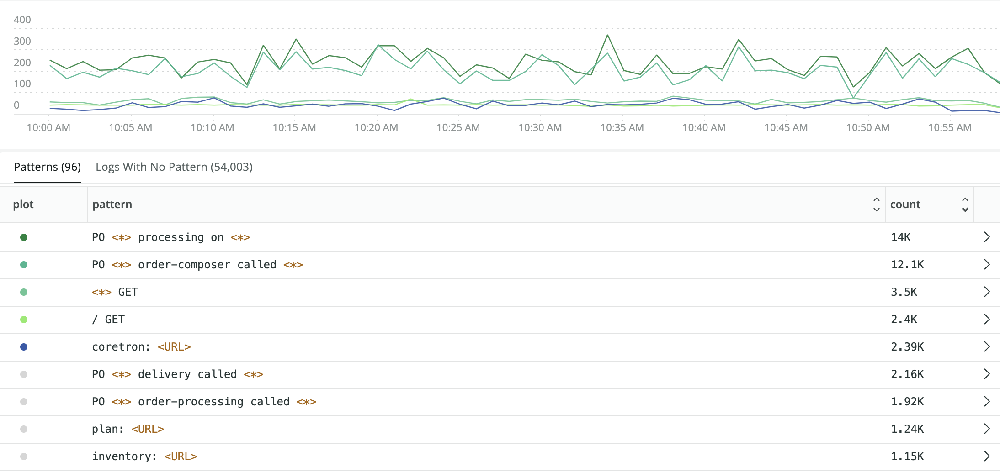
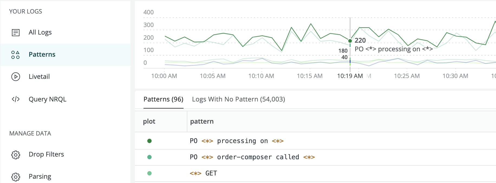
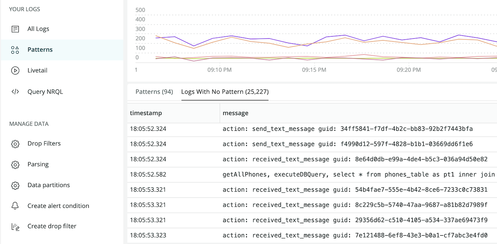
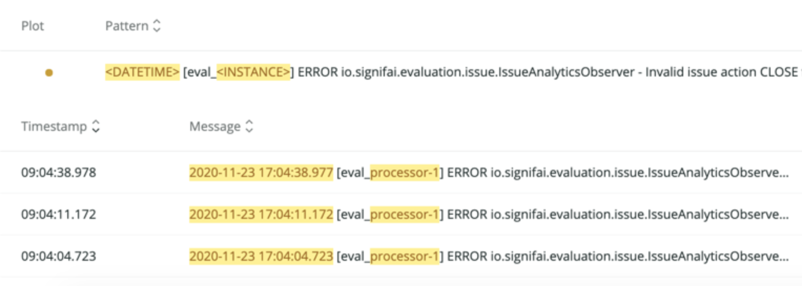
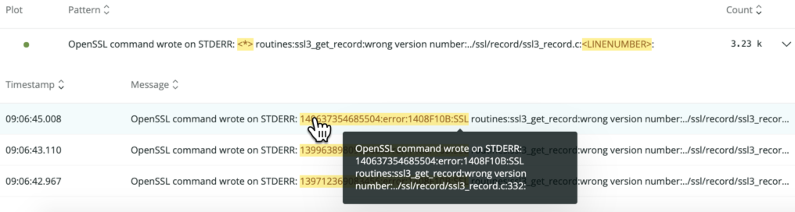

Log patterns are the fastest way to discover value in log data without searching. 

Log data is high volume telemetry with a low value per individual record. Searching can quickly lead to logs that provide a root cause explanation, but most data is repetitive and hard to contextualize when browsing. Patterns can make log data discoverable without spending a lot of time reading through low value data.

<figcaption>
  **[one.newrelic.com](https://one.newrelic.com) > Logs > Patterns**: Use patterns as the basis for alerts when the frequency of important data changes, or for configuring drop rules to get rid of unnecessary repetitive data.
</figcaption>

## Technical overview [#overview]

Log patterns functionality applies machine learning to normalize and group log messages that are consistent in format but variable in content. These grouped messages can be sorted, making it easy to find the most frequent or rarest sets of logs in your environment.

Use patterns as the basis for alerts when the frequency of important data changes, or to configure drop rules to get rid of unnecessary repetitive data.

Log patterns use advanced clustering algorithms to group together similar log messages automatically. With patterns, you can:

* Orient more quickly through millions of logs.
* Reduce the time it takes to identify unusual behavior in your log estate.
* Monitor the frequency of known patterns over time to focus your energy on what matters, and exclude what's irrelevant.

## Availability [#availability]

Currently the patterns feature is opt-in; if you see **Patterns are turned off** in your **Log management Patterns UI**, contact your account representative and ask to have it enabled. There will be up to a 24 hour lead time before the machine learning system generates a customized model for your account. Patterns will be available for all customers to enable or disable on demand at the end of April 2021.

<table>
  <thead>
    <tr>
      <th style={{ width: "200px" }}>
        Log patterns
      </th>

      <th>
        Limitations and considerations
      </th>
    </tr>
  </thead>

  <tbody>
    <tr>
      <td>
        Pricing
      </td>

      <td>
        There is no separate pricing for log patterns. The only cost is for additional data generated and added to your log records.

        A pattern attribute will be added to all logs that match a pattern. Attributes also may be added when common values are discovered, such as GUIDs, IP addresses, URL, or email addresses. These attributes are automatically extracted from the log message as part of the pattern process. 
      </td>
    </tr>

    <tr>
      <td>
        HITRUST accounts
      </td>

      <td>
        The log patterns feature is not FedRAMP compliant. FedRAMP or other HITRUST accounts are not eligible to use patterns.
      </td>
    </tr>

    <tr>
      <td>
        Regional availability
      </td>

      <td>
        Availability for this feature depends on whether you have a US or EU region account:

        * US region accounts can use log patterns.
        * EU region accounts cannot enable log patterns at this time. 
      </td>
    </tr>
  </tbody>
</table>

## Get started [#get-started]

To start examining patterns:

1. Go to **[one.newrelic.com](https://one.newrelic.com) > Log management**, and use the account picker dropdown to select the target account where you want to explore patterns.
2. In the left navigation of the Log management UI, click **Patterns**.

The main log UI changes to show patterns that match the query in the query bar. 

<figcaption>
  **[one.newrelic.com](https://one.newrelic.com) > Log management > Log patterns:** The line chart shows the top 5 patterns over time. Use the time picker and query bar to adjust the results.</figcaption>

## Explore patterns and logs with no pattern[#recents]

By default the log patterns UI first shows the most frequent occurrence of patterns. To sort to show the rarest patterns first, click the **Count** column. You can also use the query bar or attributes bar to filter your log patterns.

<table>
  <thead>
    <tr>
      <th style={{ width: "200px" }}>
        If you want to...
      </th>

      <th>
        Do this...
      </th>
    </tr>
  </thead>

  <tbody>
    <tr>
      <td>
        Understand the rate of change in patterns
      </td>

      <td>
        Look at the line chart. The color-coded patterns correspond to the **plot** column in the table.
      </td>
    </tr>

    <tr>
      <td>
        See the individual log messages that match each pattern
      </td>

      <td>
        Click **pattern** to expand the row and see a table of individual log records.
        * To see additional records, scroll up or down.
        * To explore an individual log in more detail, click it to open the details panel.
      </td>
    </tr>

    <tr>
      <td>
        Group and filter patterns by their attributes
      </td>

      <td>
        Use the query bar and time picker. As you apply different filters and time windows, the log patterns adjust to your new target data.
      </td>
    </tr>

    <tr>
      <td>
        Create an alert from a pattern
      </td>

      <td>
        Add the pattern to the query bar and run the query. Then click **Create alert condition** in the left nav.
      </td>
    </tr>

    <tr>
      <td>
        Troubleshoot log messages that haven't been clustered into a pattern
      </td>

      <td>
        Use the [**Logs With No Pattern** tab](#logswithnopattern) in the **Log patterns** UI.
      </td>
    </tr>
  </tbody>
</table>

Clicking a specific log message will open the log message details panel you're familiar with from the **Logs management** page.

## Explore logs with no pattern [#logswithnopattern]

The **Logs With No Pattern** tab groups all recent log messages in your account that were not clustered into a known pattern yet. These log messages don't represent any problem or flaw in the system; they have no pattern because they are too new to have been processed by the machine learning system. This makes them valuable to explore when you want to understand what has recently changed in your environment.

<figcaption>
  **[one.newrelic.com](https://one.newrelic.com) > Log management > Log patterns:** New Relic's log patterns feature automatically groups logs without a matching pattern.
</figcaption>

For example:

* Are any of these logs tied to a recent problem? This is a quick way to discover unique log data that is appearing for the first time in your environment.
* Does your log data have a new format? Sometimes the logs don't represent a problem, but a new format of log data that deviates from the data model you expect your applications to follow.

Catching these logs early gives you the opportunity to ask developers to correct any deviations in their log output. The more consistent people are in the way log data is generated, the easier it becomes to use logs across a diverse set of teams. 

## Masked attributes and wildcards [#masked]

Parts of the log messages in patterns are classified as variables and are substituted by masked attributes. The masking process supports and improves the clustering phase by allowing the algorithm to ignore changing details and focus on the repetitive structure.

Masked attributes include:

* `date_time`
* `ip`
* `url`
* `uuid`

Masked attributes are highlighted and are easy to identify, as shown in the following example.

<figcaption>
  **[one.newrelic.com](https://one.newrelic.com) > Log management > Log patterns:** Here is an example of a pattern that has masked attributes.
</figcaption>

Log patterns extract other less trivial variables that don't belong to any masked attribute. These variables are indicated as wildcards `*`.

<figcaption>
  **[one.newrelic.com](https://one.newrelic.com) > Log management > Log patterns:** Here is an example of how wildcards `*` group variables.
</figcaption>

## Why is there no Pattern data? [#nodata]

There are a few reasons why you might have Patterns enabled but not have any pattern data. If you are fairly sure none of the items below are true, please contact support.

* No data has arrived in the timeframe you are observing. Try expanding the time range you are viewing with the time picker.
* It has been less than 24 hours since patterns was enabled in the account. This means the ML model may not be generated yet for the account.
* None of the data coming in has a "message" field. Patterns will only be generated for values in the "message" field of a log record. If your logs do not contain "message" there will be no data.

## Put the platform to work with patterns [#platform]

Patterns are a value that is enriched onto the existing log message as a new attribute named **newrelic.logPattern**. Anything you can do with logs generally can be done with, log patterns such as:

* Build your own dashboards with patterns, to monitor a specific pattern or group of patterns you care about.
* Create alerts for patterns by adding [NRQL alerts](/docs/alerts-applied-intelligence/new-relic-alerts/alert-conditions/create-nrql-alert-conditions).
* Use [baseline alert conditions](https://docs.newrelic.com/docs/alerts-applied-intelligence/new-relic-alerts/alert-conditions/create-baseline-alert-conditions) to detect anomalies in known log patterns.
