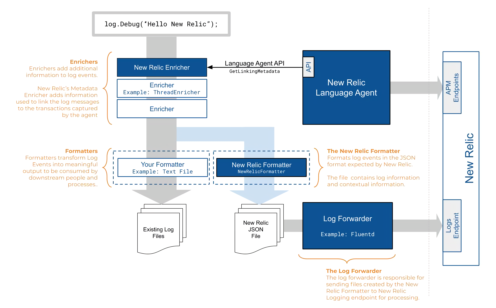

When you need to correlate log data with other telemetry data, enable logs in context in New Relic. Logs in context functionality adds metadata that links your logs with related APM data, like [errors](/docs/apm/apm-ui-pages/error-analytics/errors-page-find-fix-verify-problems/) or [distributed traces](/docs/apm/distributed-tracing/ui-data/understand-use-distributed-tracing-data), or your platform performance data from [infrastructure monitoring logs](/docs/logs/forward-logs/forward-your-logs-using-infrastructure-agent/) in New Relic One.

To see how logs in context and [log patterns](/docs/logs/ui-data/find-unusual-logs-log-patterns) can help you find the root cause of an issue, watch this short video (approx. 5 minutes):

<Video id="awCeXQZs2YE" type="youtube" />

## See the root cause of issues across your platform [#compatibility-requirements]

By bringing all of your application and infrastructure data together in a single solution, you can get to the root cause of issues faster. Logs in context help you quickly see meaningful patterns and trends.

The following diagram shows the lifecycle of a log message, from enrichment with agent metadata (contextual logging), to formatting and forwarding the log data to New Relic:

<figcaption>
  This diagram illustrates the flow of log messages through New Relic.
</figcaption>

Do not spend extra time trying to narrow down all your logs from different parts of your platform. Instead, enable logs in context to see the exact log lines you need to identify and resolve a problem.

## Basic process to enable logs in context [#enable-logs]

Here is an example of logs for your app's UI. You can see logs in context of events for the selected time period, and drill down into detailed data for any of the highlighted attributes. To take advantage of even more capabilities, click **Query logs** from here to go directly to the **Logs** UI.

The process to enable logs in context is basically the same, regardless of which APM agent you use to monitor your application:

1. Make sure you have already [set up logging in New Relic](/docs/logs/enable-log-management-new-relic/enable-log-monitoring-new-relic/enable-log-management-new-relic/). This includes configuring a supported log forwarder that collects your application logs and extends the metadata that is forwarded to New Relic.
2. Update to a supported APM agent version for your app, and enable [distributed tracing](/docs/distributed-tracing/concepts/introduction-distributed-tracing/).
3. Configure logs in context for your APM agent or for your infrastructure monitoring agent.
4. View your logs within the context of your apps or infrastructure in [New Relic One](/docs/logs/log-management/ui-data/use-logs-ui/#links).

The main differences in this procedure are which log appenders you can use to extend and enrich your log data, and how to configure the log appender you select for your APM agent.

For detailed information, see the logs-in-context procedures for:

* [C SDK](/docs/logs/enable-log-management-new-relic/configure-logs-context/c-sdk-configure-logs-context)
* [Go](/docs/logs/enable-log-management-new-relic/configure-logs-context/configure-logs-context-go/)
* [Java](/docs/logs/enable-log-management-new-relic/configure-logs-context/java-configure-logs-context-all/)
* [.NET](/docs/logs/enable-log-management-new-relic/configure-logs-context/net-configure-logs-context-all/)
* [Node.js](/docs/logs/enable-log-management-new-relic/configure-logs-context/configure-logs-context-nodejs/)
* [PHP](/docs/logs/enable-log-management-new-relic/configure-logs-context/configure-logs-context-php/)
* [Python](/docs/logs/enable-log-management-new-relic/configure-logs-context/configure-logs-context-python/)
* [Ruby](/docs/logs/enable-log-management-new-relic/configure-logs-context/configure-logs-context-ruby/)
* [Infrastructure monitoring agent](/docs/logs/enable-log-management-new-relic/enable-log-monitoring-new-relic/forward-your-logs-using-infrastructure-agent/)

## API and other options [#API]

If our logging solutions do not meet your needs, you can use other options to send your log data to New Relic:

* Logging extensions via [agent API calls](/docs/logs/new-relic-logs/apm-integration/apm-agent-apis-manual-logs-context-instrumentation)
* HTTP endpoint via our [Log API](/docs/logs/log-management/log-api/introduction-log-api/)
* Syslog protocols via [TCP endpoint](/docs/logs/log-management/log-api/use-tcp-endpoint-forward-logs-new-relic/) (useful for CDNs, hardware devices, or managed services)

## What's next? [#what-next]

After you set up logs in context for APM or infrastructuring monitoring, make the most of your logging data in the New Relic One UI:

* Explore the logging data across your platform with our [Logs UI](/docs/logs/log-management/ui-data/use-logs-ui/).
* See your logs in context of your app's performance in the [APM UI](/docs/logs/log-management/ui-data/use-logs-ui/#links). Troubleshoot [errors](/docs/apm/apm-ui-pages/error-analytics/errors-page-find-fix-verify-problems/) with [distributed tracing](/docs/apm/distributed-tracing/ui-data/understand-use-distributed-tracing-data), stack traces, application logs, and more.
* Get deeper visibility into both your application and your platform performance data by forwarding your logs with our [infrastructure monitoring agent](/docs/logs/enable-log-management-new-relic/enable-log-monitoring-new-relic/forward-your-logs-using-infrastructure-agent/). Review your [infrastructure logs](/docs/logs/log-management/ui-data/use-logs-ui/#links) in the UI.
* Set up [alerts](/docs/alerts-applied-intelligence/new-relic-alerts/alert-conditions/create-alert-conditions/).
* [Query your data](/docs/query-your-data/explore-query-data/get-started/introduction-querying-new-relic-data/) and [create dashboards](/docs/query-your-data/explore-query-data/dashboards/introduction-dashboards/).

Here is an example of logs in context for app trace details, visible from the APM UI.

