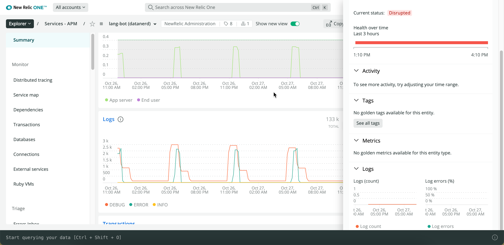
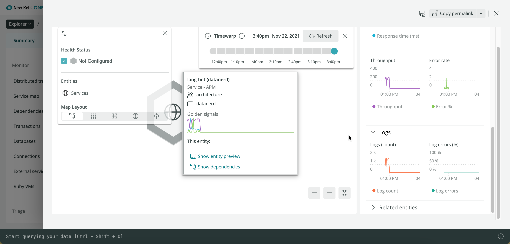

If you're familiar with [logs in context](/docs/logs/logs-context/configure-logs-context-apm-agents/), you know that you can:

* Link the logs related to traces and errors for your apps and hosts.
* View the logs directly within the context of those issues.

"Logs everywhere" in New Relic goes beyond the logs in context functionality. If an attribute exists in both a log event and another event, you can connect the two so that you can see logs for **any** metadata you choose.

## Example: See related logs for app [#example-app]

**Reviewer:** I'm not convinced I really understand what is going on here and how to take advantage of the chart data that's easily available from Explorer. Please edit ruthlessly!

To see the related logs, use the Explorer in New Relic One. Here is an example:

With logs in context, your app's **Summary** page shows a chart with related logs. The UI shows the number of logs faceted by the level of severity for the app. These log trends and totals are the golden metrics that can quickly expose if a problem is potentially detected in logs or solvable by viewing detailed log entries.

The right sidebar of your app's **Summary** page lists related entities. In this example, the app has a related entity set up as a workload to monitor error tracking. When you click the workload, you can see the total number of logs and what percentage are errors.

From here you can view related logs in context of your traces and errors by selecting any of the following links on the left sidebar of your app's **Summary** page:

* **Monitor > Distributed tracing**
* **Triage > Logs**
* **Events > Errors** 

## Example: See related logs for host [#example-host]

**Reviewer:** Can you please provide a permalink to a host (Demotron?) that shows "logs everywhere" or "logs in Explorer" in action? Not sure what this is currently called (as of 11-22-2021). Thanks!

## Link your log data to an entity [#link-data]

New Relic automatically links log data to your [entity](/docs/new-relic-one/use-new-relic-one/core-concepts/what-entity-new-relic/) as a `Log` event with a timestamp and at least one attribute, such as `message`. (You can link any attribute, not just `message`.) You can also define other log event types by creating data partitions in the UI. For more information, see our documentation about [log events](/docs/logs/log-api/log-event-data/).

If you want to get telemetry data from a source that's not automatically supported by New Relic, you can propose a mapping definition file for it. When the telemetry received by New Relic matches your definition file, it will be synthesized into the entity. (We refer to this as [entity synthesis](/docs/new-relic-one/use-new-relic-one/core-concepts/what-entity-new-relic/#entity-synthesis).)

Entity synthesis is useful, for example, when you have unique telemetry that you want to surface in your logs. For detailed information, follow our [entity definition procedures in GitHub]https://github.com/newrelic/entity-definitions#entity-definitions).

**Example: Get unique metadata for your infrastructure logs**

Our infrastructure agent automatically inserts a `hostname` and `entity.guid` for host data. When you use the infrastructure agent to forward your logs to New Relic, you can add other metadata.

For example, you can add host metadata to your APM log. **(REVIEWER: Is this right, or do I have it backward, that you want to add APM metadata to your host log?)**

1. Follow standard procedures to [forward your logs with our infrastructure agent](/docs/logs/forward-logs/forward-your-logs-using-infrastructure-agent/).
2. In your `logging.d/` configuration file for log forwarding, **DO WHAT?**

**Example: Use Fluent Bit to link log metadata**

To use our Fluent Bit plugin to link your log metadata:

1. Follow standard procedures to [forward your logs with our Fluent Bit plugin](/docs/logs/forward-logs/fluent-bit-plugin-log-forwarding).
2. In your `plugins.conf` configuration file for log forwarding, **DO WHAT? Or should this be the `fluent-bit.conf` file?

**Reviewer:** The Fluent Bit doc already has a section about [associating logs with a specific entity](/docs/logs/forward-logs/fluent-bit-plugin-log-forwarding/#associate-logs-entities) by adding a `FILTER` block. What would they do differently for logs everywhere?

For detailed information about managing your config file for log forwarding, see our documentation for using our [Fluent Bit plugin on GitHub](https://github.com/newrelic/newrelic-fluent-bit-output).

## Get started with logs everywhere [#get-started]

**Reviewer:** What's next? Is there special setup required, or will it automatically be presented in the UI?
