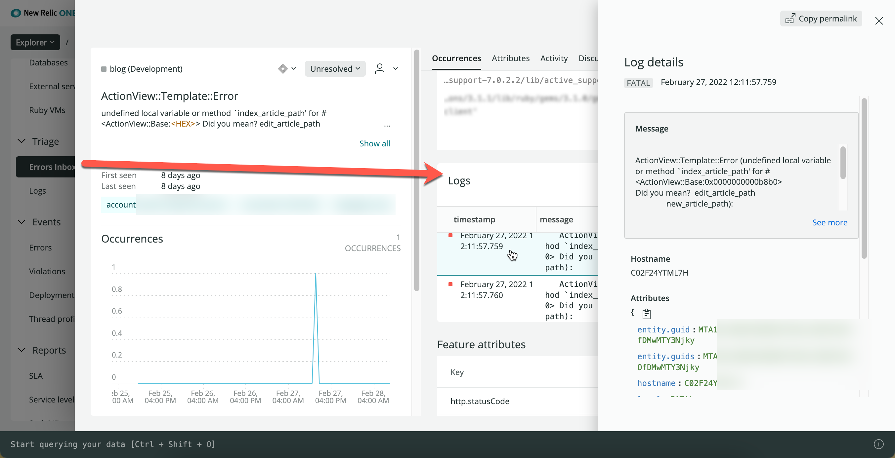
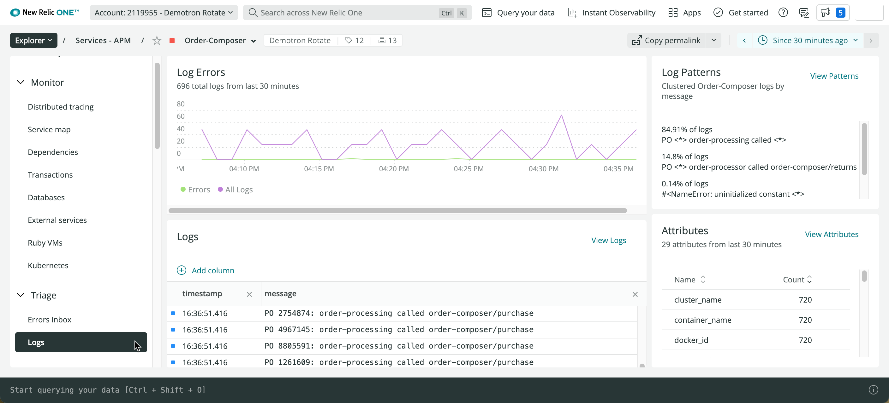

[Telemetry in Context](https://docswebsitedevelop-doc7761logsintro.gtsb.io/docs/logs/logs-everywhere/telemetry-in-context/) for the Java agent connects your logs with all of your telemetry data for your apps, hosts, and other entities. Bringing all of this data together in a single tool helps you quickly:

* Cut through the noise of thousands of logs when troubleshooting time-critical issues, so you automatically see only the most relevant logs.
* Navigate within multiple types of telemetry data and have the data correlate back to the original issue.
* Easily drill down into more detailed information from the same place in the UI.
* Find the log lines that you need to identify and resolve a problem.



<figcaption>
  **Telemetry in Context:** From the left nav in the APM UI, you can select an error and immediately see related logs, log details, host name, important attributes, and more.
</figcaption>

## Enable and configure [#enable]

If you are using a [supported framework](#frameworks), you have two options to configure Telemetry in Context for your application.

<CollapserGroup>

  <Collapser
    id="1-agent"
    title="Option 1 (recommended): Let the agent forward your logs."
  >

  This is the simplest approach and it's a great choice for developers who may not have the access or interest in setting up a log forwarder, or for accounts that want to see the power of logs and other Telemetry in Context features quickly. 

  <Callout variant="important">
  Using the log forwarding feature will increase your data ingest, which may affect your billing. For more information, see our documentation about [tracking your data ingest](https://docswebsitedevelop-doc7761logsintro.gtsb.io/docs/logs/logs-everywhere/telemetry-in-context/#ingest).

  This feature may be enabled by default in a future agent version.
  </Callout>
  
  Install an agent version with log forwarding capabilities ([Java agent 7.6.0 or higher](https://docs.newrelic.com/docs/release-notes/agent-release-notes/java-release-notes/)), and update your configuration to enable forwarding.


  Configuration file (newrelic.yml) (indented 2 spaces under the common stanza):
  ```
  application_logging:
    enabled: true
    forwarding:
      enabled: true
  ```

  Environment variable:
  ```
  NEW_RELIC_APPLICATION_LOGGING_ENABLED=true
  NEW_RELIC_APPLICATION_LOGGING_FORWARDING_ENABLED=true
  ```

  System Property:
  ```
  -Dnewrelic.config.application_logging.enabled=true
  -Dnewrelic.config.application_logging.forwarding.enabled=true
  ```


  **Optional adjustments:**

  Once this feature is enabled, you also have control over the maximum number of log lines sent to New Relic every minute. The default value is 10,000. If more than 10,000 log lines are seen by the agent in a 60-second window, your logs will begin to be sampled.
  
  Set it to a higher number to receive more logs. Set it to a lower number to receive fewer logs. Any non-negative integer is valid.


  Configuration file (newrelic.yml):
  ```
  application_logging:
    forwarding:
      max_samples_stored: 10000
  ```

  Environment variable:
  ```
  NEW_RELIC_APPLICATION_LOGGING_FORWARDING_MAX_SAMPLES_STORED=10000
  ```
 
 System Property:
  ```
  -Dnewrelic.config.application_logging.forwarding.max_samples_stored=10000
  ```


  <Callout variant="important">
  When using the agent forwarding feature, be sure to **disable** any existing log forwarder. Otherwise, you will be unnecessarily sending duplicated log lines.
  </Callout>
  </Collapser>

  <Collapser
    id="2-decorate"
    title="Option 2: Use your own log forwarder."
  >

  Already have a log forwarder you like? We've got you covered! The Java agent can decorate your logs with the linking metadata needed to provide access to Telemetry-in-Context features and you can send them to New Relic using your existing log fowarder.

  <Callout variant="tip">
    This option *replaces* our legacy [Logs In Context](https://docswebsitedevelop-doc7761logsintro.gtsb.io/docs/logs/logs-context/java-configure-logs-context-all/) decorator.
  </Callout>

  1. Be sure to **disable** agent log forwarding, otherwise you will be unnecessarily sending double log lines.

  Configuration file (newrelic.yml) (indented 2 spaces under the common stanza):
  ```
  application_logging:
    enabled: true
    forwarding:
      enabled: false
  ```

  Environment variable:
  ```
  NEW_RELIC_APPLICATION_LOGGING_ENABLED=true
  NEW_RELIC_APPLICATION_LOGGING_FORWARDING_ENABLED=false
  ```

  System Property:
  ```
  -Dnewrelic.config.application_logging.enabled=true
  -Dnewrelic.config.application_logging.forwarding.enabled=false
  ```

  2. Enable log decorating in your configuration, then restart the agent to start decorating your logs.

  Configuration file (newrelic.yml):
  ```
  application_logging:
    local_decorating: true
  ```

  Environment variable:
  ```
  NEW_RELIC_APPLICATION_LOGGING_LOCAL_DECORATING_ENABLED=true
  ```
  
  System Property:
  ```
  -Dnewrelic.config.application_logging.local_decorating.enabled=true
  ```


  Our decorator adds five attributes to every log message in your application log file: `entity.guid`, `hostname`, `trace.id`, `span.id` and `entity.name`. For example:

  ```
  This is my log message. NR-LINKING|{entity.guid}|{hostname}|{trace.id}|{span.id}|{entity.name}|
  ```

  </Collapser>
</CollapserGroup>

## Supported frameworks [#frameworks]

The Telemetry in Context feature supports the following logging frameworks:

* Log4j 1.x
* Log4j 2.x
* Logback 1.x

If you are using a different logging framework, our legacy [Logs in Context](https://docswebsitedevelop-doc7761logsintro.gtsb.io/docs/logs/logs-context/java-configure-logs-context-all/) solution might be right for you.

## Secure your data [#obfuscation]

Your logs may include sensitive information protected by HIPAA or other compliance protocols. By default we obfuscate number patterns that appear to be for items such as credit cards or Social Security numbers, but you may need to hash or mask additional information.

For more information, see our documentation about [obfuscation expressions and rules](https://docs.newrelic.com/docs/logs/ui-data/obfuscation-ui/). You can hash or mask your log data by using the New Relic UI or by using NerdGraph, our GraphQL API.

## Explore your data [#view-ui]

To make the most of your logging data:

* On the [APM **Summary** page](https://docs.newrelic.com/docs/apm/apm-ui-pages/monitoring/apm-summary-page-view-transaction-apdex-usage-data), click your **Web transaction time** chart to view logs associated with a specific point in time.
* Check your app's [**Errors inbox**](https://docs.newrelic.com/docs/errors-inbox/errors-inbox) to view the logs associated with your errors.
* Use [distributed tracing](https://docs.newrelic.com/docs/distributed-tracing/ui-data/understand-use-distributed-tracing-ui) to see the logs associated with individual traces.
* Explore more logging data across your platform with our [Logs UI](/docs/logs/log-management/ui-data/use-logs-ui/).
* Set up [alerts](/docs/alerts-applied-intelligence/new-relic-alerts/alert-conditions/create-alert-conditions/) based on log output and severity.
* [Query your data](/docs/logs/ui-data/query-syntax-logs/) using our specialized UI for logs data, and [create dashboards](/docs/query-your-data/explore-query-data/dashboards/introduction-dashboards/) with the results.

## Troubleshooting tips [#troubleshooting]

Typically your logs will start to appear less than a minute after you enable Telemetry in Context. Check your app's **Triage > Logs** section. You will also start seeing [log patterns](/docs/logs/ui-data/find-unusual-logs-log-patterns) related to the error there.



If you don't see any logs for errors or traces, there may not be any for your app. Try refreshing the UI page, or change the [selected time period](https://docs.newrelic.com/docs/new-relic-one/ui-data/basic-ui-features/#data-analysis).
