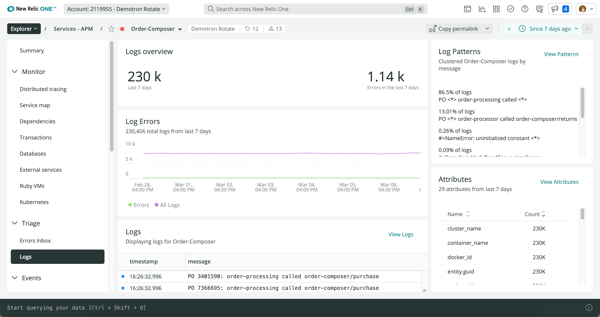
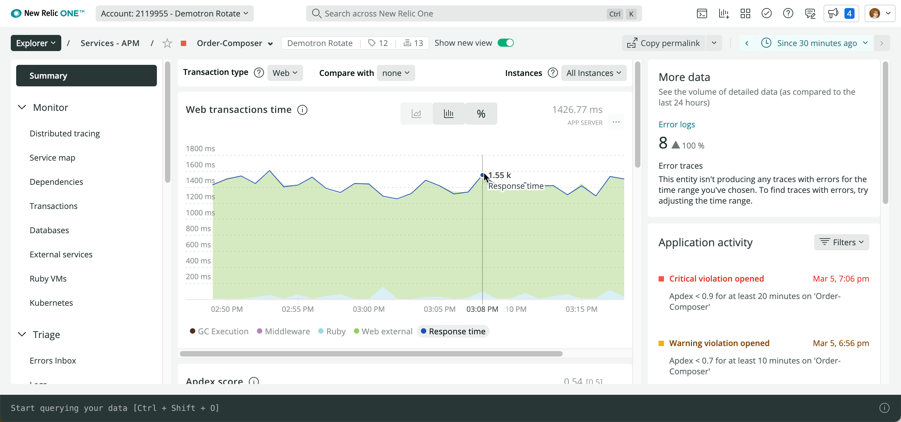
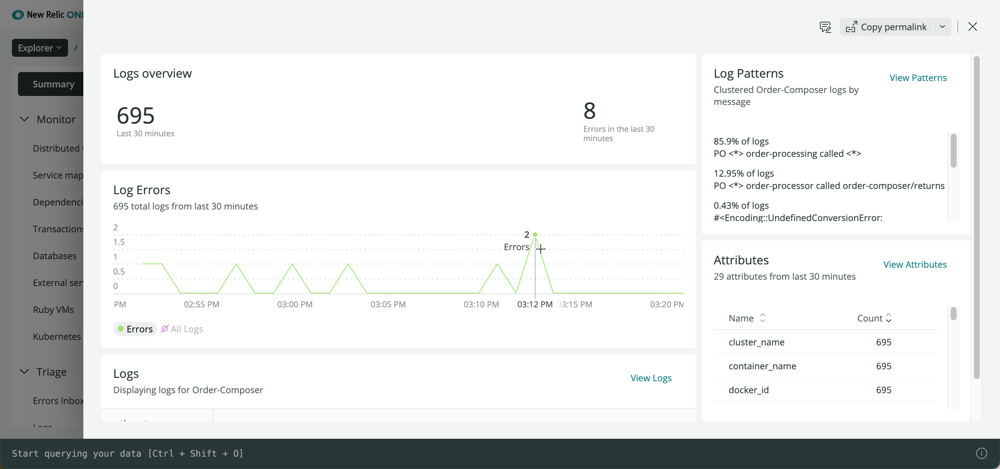
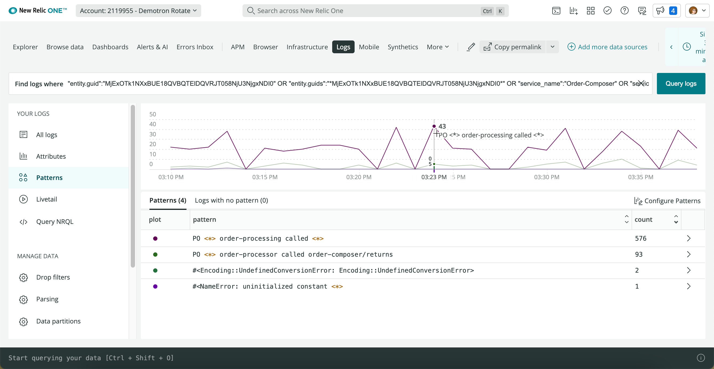
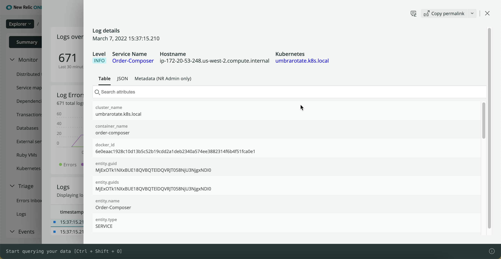
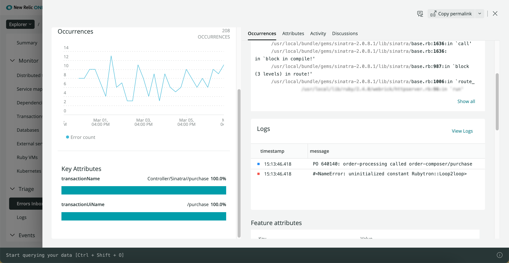
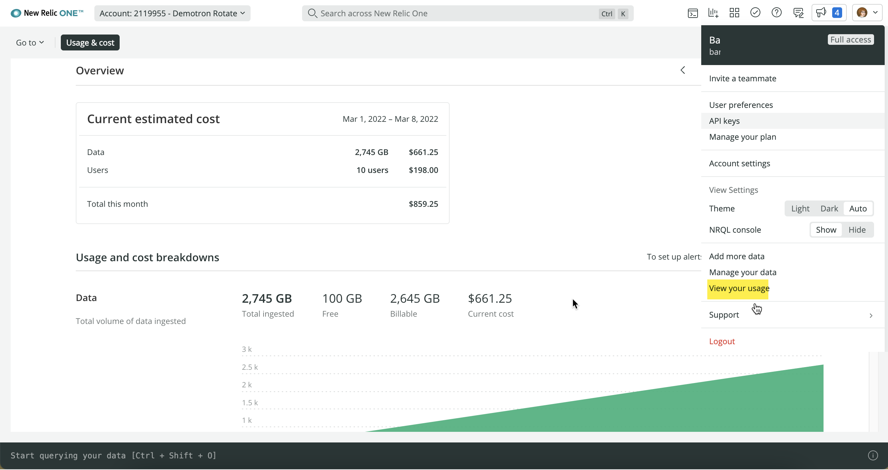

**REVIEWER: This is a work in progress [PR 6246 on docs-website](https://github.com/newrelic/docs-website/pull/6246). Feel free to edit ruthlessly at any time. Thanks!**

When you're troubleshooting an issue in your app or host, you need all the New Relic One tools at your fingertips. But you don't want to do a lot of context switching across the UI or be overwhelmed by the wealth of information available.

Our telemetry in context functionality gives you an easy way to troubleshoot problems across your apps, services, other entities, and data types, without having to leave the current UI page you're viewing. We curate the data automatically, including entity GUIDs for related APM service entities, so that highly correlated logs are already visible.



<figcaption>
  Drill down into your logs, errors, traces, and spans, all from the APM **Summary** page in New Relic One.
</figcaption>

More importantly, when a problem arises, you immediately have an overall view of the health of **all** your systems, regardless of the type of data in those individual systems and components. This also makes it easier to link your log telemetry data across accounts.

Best of all, there's no additional configuration required.

## Example: Troubleshooting poor response time and rising error rates [#response-time-example]

Here is a detailed use case of using telemetry data in context to get to the root cause of a problem:

The on-call engineer receives New Relic alert notification about poor response time and rising error rates for their "Order Composer" app. They need to discover the root cause behind the increase in errors and latency, so they can decide whether to rotate a problematic host out of load balancing or to roll back the most recent release.

To start troubleshooting, they go to New Relic One:

<CollapserGroup>
  <Collapser
    id="when"
    title="When and where did the errors begin?"
  >

  **TO DO: Update screenshots in this example throughout the journey.**

  When the engineer looks at the app's **Summary** page, they see many more error logs leading up to the increase in response time. They want to see if the logs can expose the root cause of the problem.

  

  **How can they quickly decide what's related to the problem?**
  
  They have not set up log collection. But the Ruby agent for their app has been recently updated to include telemetry in context, so the app now automatically receives metrics about its logs. The metrics are faceting the count by a severity field commonly included in their Rails framework.

  

  **What entities are related?**
  
  On the same UI page, they click the **Logs** chart, so they can review the **Log Summary** view for entities in the New Relic One Explorer. This view shows them when instrumented logs have been collected and when those logs had an `Error` severity level or worse. It also shows them a list of log patterns and what percentage of all logs fit each pattern.

    </Collapser>

    <Collapser
    id="patterns"
    title="What patterns emerge in the logs?"
    >

    In the **Log Patterns** UI, rare error messages have begun to occur frequently, and they now appear in the list. This helps the engineer to focus on problematic logs instead of all the noisy status updates.

    

    **What patterns should they focus on?**
    
    The engineer notices an interesting log pattern and wants to view only the logs that fit this pattern. By clicking on it, this adds the pattern's value as a filter to the logs being displayed. This narrows the focus.

    </Collapser>

    <Collapser
    id="log-details"
    title="What can more log details reveal?"
    >

    The engineer wants to see all the values contained in the log record, so they click the **Log Detail** view. This helps them validate that the log itself is meaningful. It also lets them drill down further into either the Kubernetes environment where the app runs, or directly to any distributed traces or APM errors related to the log record.

    
    
    The engineer decides to look at the APM error where they can see a full stack trace. They can also see logs from their **Errors in-box** UI.
    
    

    </Collapser>

    <Collapser
    id="log-sampling"
    title="What additional test data will help troubleshoot?"
    >

    The troubleshooting team has been running tests to isolate the cause, but not all logs have been collected for the test transactions. The `AlwaysOn` default log collection has been useful to validate that the services have an issue and to examine it initially. But now they need to turn up the sampling to continue troubleshooting.

    </Collapser>

    <Collapser
    id="next-steps"
    title="Problem solved. Now what?"
    >
    
    The troubleshooting team determines the problem stems from a recently introduced change, so they roll back that code. To save resources and ingest expenses, they turn down log collection, but they keep log sampling running in case the issue repeats itself.
    
    They also update their runbooks to point to the log patterns page filtered to this app, and [add the runbook to their alert condition](/docs/alerts-applied-intelligence/new-relic-alerts/advanced-alerts/understand-technical-concepts/provide-runbook-instructions-alert-activity/). Next time they get an alert similar to this situation, they can use these lessons learned for faster troubleshooting.

    </Collapser>

</CollapserGroup>

## Supported agent versions [#agents]

Applications don't exist in isolation, and the resources you use to monitor, troubleshoot, and improve their performance are both time-critical and complex. You need a simple yet holistic solution to quickly see and act on all your telemetry in context.

When you update to the supported agent version, no additional installation or configuration is required! Your logs will flow into New Relic with related telemetry data for your apps and hosts.

**REVIEWER: If I didn't know what to look for, how would I know that I'd got telemetry in context in New Relic One?**

Supported agents include:

* Infrastructure monitoring agent [v. CONFIRM or higher](/docs/release-notes/infrastructure-release-notes/infrastructure-agent-release-notes)
* Java agent [v. CONFIRM or higher](/docs/release-notes/agent-release-notes/java-release-notes) for Logback
* .NET agent [v. CONFIRM or higher](/docs/release-notes/agent-release-notes/net-release-notes) for Log4Net
* Ruby agent [v. CONFIRM or higher](/docs/release-notes/agent-release-notes/ruby-release-notes) (default logger)

If your APM agent does not support our telemetry in context solution, you can continue to use our [standard logs in context solutions](/docs/logs/logs-context/logs-in-context).

## Get started [#get-started]

Ready to get started?

1. If you don't have one already, [create a New Relic account](https://newrelic.com/signup). It's free, forever.
2. Update to the [supported agent version](#agents) for your apps and hosts.
3. **REVIEWER: Use the guided install for infrastructure in the UI?**
4. That's it! Now, to start troubleshooting with relevant telemetry data in your logs, go to New Relic One:

* Explorer UI at [one.newrelic.com](https://one.newrelic.com)
* Explorer UI for EU region data center if applicable: [one.eu.newrelic.com](https://one.eu.newrelic.com)


Your logs automatically include attributes such as `span.id`, `trace.id`, `hostname`, `entity_guid`, and more. These make it easier to query and facet on related telemetry data.

You can also add more attributes to make your troubleshooting focus even more precise. For example, you may want to add more attributes to get other key telemetry data specific to your ecosystem. 

**REVIEWER: Can you give a few examples of the types of attributes I might want to add? Is this referring to [infrastructure log's optional configuration documentation](https://docs.newrelic.com/docs/logs/forward-logs/forward-your-logs-using-infrastructure-agent#optional-config), or are there other things they might want to add?**

## Avoid ingest limits and extra billing [#ingest]

Using telemetry in context functionality will increase your data ingest, and this may have an impact on your ingest limits and billing. For example, when your engineering team is troubleshooting a problem with your app, it may be helpful to temporarily set the limits to maximum data collection. (By default, the maximum number of logs sampled is 10,000. **REVIEWER: Is 10,000 max correct?**) But if you leave this running for several days, this could result in a lot of unnecessary data and wasted money.

**REVIEWER: Is it still going to be on by default? Are they going to be able to turn this off? If yes, how?**

To avoid any surprises, we recommend that you use [NRQL queries](/docs/accounts/accounts-billing/new-relic-one-pricing-billing/usage-queries-alerts/#data-queries) to create [alert conditions](/docs/accounts/accounts-billing/new-relic-one-pricing-billing/usage-queries-alerts/#alerts) to keep track of your ingest limits. For example:

<CollapserGroup>
  
  <Collapser
    id="limits-ui"
    title="View data limits and usage in UI"
  >

  To [review your data limits in the UI](/docs/data-apis/manage-data/view-system-limits): From the [account dropdown](/docs/glossary/glossary/#account-dropdown) in the New Relic One UI, click **Manage your data > Limits**. Or, to view your usage and estimated cost to date, click **View your usage**.

  
  
  </Collapser>

  <Collapser
    id="query-estimate"
    title="NRQL query: estimated cost example"
  >

  To query your [month-to-date estimated cost of your ingested data](/docs/accounts/accounts-billing/new-relic-one-pricing-billing/usage-queries-alerts/#month-cost), run this NRQL query:

  ```
  FROM NrMTDConsumption SELECT latest(estimatedCost) WHERE productLine = 'DataPlatform' SINCE this month
  ```

  </Collapser>

  <Collapser
    id="nrql-alert"
    title="NRQL alert: usage threshold example"
  >

  To create an alert when your usage exceeds a fixed monthly threshold for gigabytes of data, add this [NRQL query](/docs/alerts-applied-intelligence/new-relic-alerts/alert-conditions/create-nrql-alert-conditions/) to your alert condition:

  ```
  FROM NrMTDConsumption SELECT latest(GigabytesIngested) WHERE productLine = 'DataPlatform'
  ```

  </Collapser>

</CollapserGroup>

## Ensure data privacy [#data-privacy]

Our log management service automatically masks number patterns that appear to be for items such as credit cards or Social Security numbers. For more information, see our [security documentation](/docs/logs/get-started/new-relics-log-management-security-privacy) for log management.

You can also use our obfuscation options to hash or mask sensitive data in your logs. This is critical, for example:

* If it is impractical or impossible to split sensitive data into separate accounts
* If you want data to be searchable and coherent without sensitive information exposed
* If you want to restrict query capabilities for sensitive data for users without those access rights

For more information, see our [obfuscation documentation](https://docswebsitedevelop-jsubiratdocswebsitedoc7721obfa.gtsb.io/docs/logs/ui-data/obfuscation-ui/). **REVIEWER: The obfuscation documentation is in a separate PR but you can see it from this link.** You can create, read, update, and delete obfuscation expressions and rules via the New Relic One UI or NerdGraph, our New Relic GraphQL explorer.

## What's next? [#what-next]

**REVIEWER: These bullets came from several different project docs. Not sure if they are all saying the same thing, just in different ways. :-) Are all these bullets needed to get customers excited to take action? Is this section even needed?**

If you're troubleshooting an error with your app, you can easily see related network activity, Kubernetes pod health, cloud provider information, database storage, load balancer resources, logs, transaction data, spans and traces, and more, all in the context of the APM error.

With telemetry in context, now your logs are:

* **Time-sensitive.** See the counts and percentages of logs associated with your apps, hosts, and other related entities for a specific timeframe. Quickly gain context at that point in time.
* **Precise.** Cut through the noise of thousands of logs when troubleshooting time-critical issues, so you automatically see only the most relevant logs. Navigate within multiple types of telemetry data and have them correlate back to the original issue.
* **Security minded.** Understand context for security information and event management (SIEM) data across your infrastructure, network performance management, cloud platforms, and more.
* **Proactive.** See highly correlated log data related to your errors, traces, and infrastructure, so that you can understand if there's a signal outside of telemetry data that's relevant to the problem.
* **Flexible.** Diagnose problems more quickly by sending additional data to New Relic. And if there is any missing related key telemetry, you can add more attributes so you can avoid this gap in the future.
* **Relevant.** Share relevant data with other teams or tools, without losing context, by setting up [alerts](/docs/alerts-applied-intelligence/new-relic-alerts/alert-conditions/create-alert-conditions/).
* **Actionable.** [Query your data](/docs/query-your-data/explore-query-data/get-started/introduction-querying-new-relic-data/) and [create dashboards](/docs/query-your-data/explore-query-data/dashboards/introduction-dashboards/).

**REVIEWER: Anything else?**
